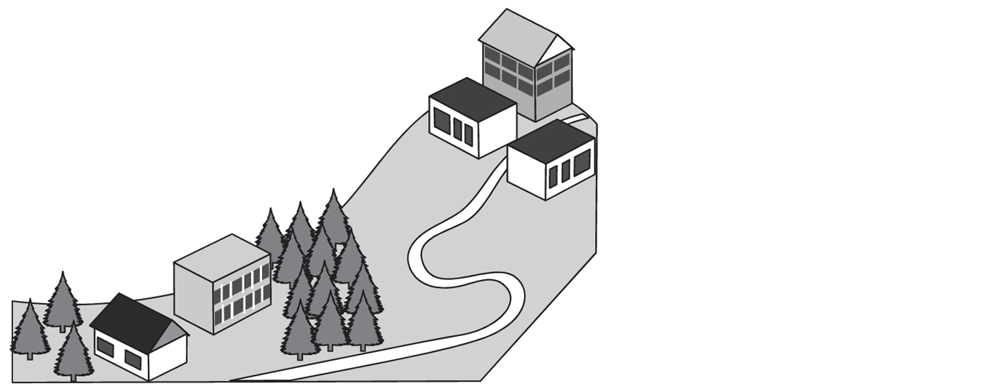
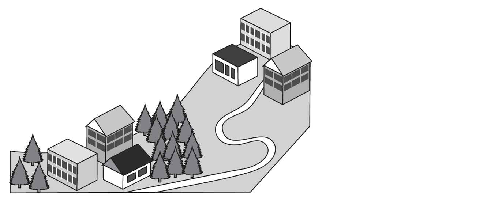
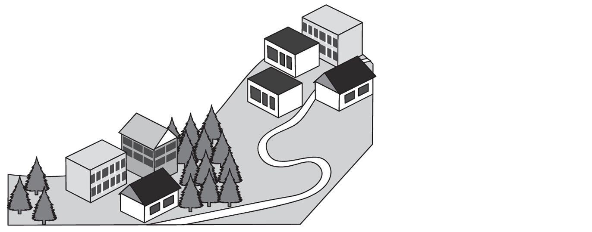
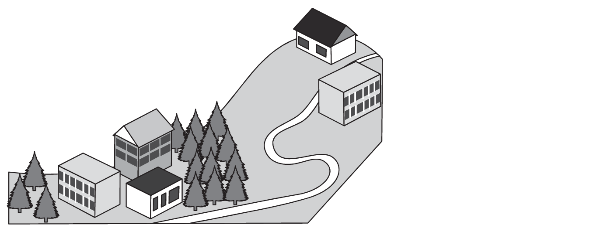

VÝCHOZÍ TEXTY K ÚLOHÁM 1–3
====

**TEXT 1**
> Jel stařec na oslu a blízko cesty hned \
> zřel svěží louku, samý květ.\
> Své zvíře pouští tam a šedivec náš hravý\
> s nadšením skáče do té trávy, \
> dovádí, zpívá, tiší hlad\
> a válí se v ní a je rád,\
> že spást zde může místo celé.\
> Tu stařec spatří nepřítele.\
> \
> __„Teď musíš se mnou uprchnout!“__\
> „Pročpak?“ odpoví trávožrout.\
> „Budu snad na hřbetě mít proto dvojí tíž?“\
> „To ne,“ děl starý pán a chystal se jít pryč.\
> „Co na tom,“ osel řek, „změní-li se můj pán?\
> Já se chci pást. Vy zmizte v stráni.\
> Nepřítelem jsou všichni páni.\
> Dost jasně to snad povídám.“\
> \
>(*J. de La Fontaine, Stařec a osel, upraveno*)

**TEXT 2**
> **Knižní slova** (např. *sivý*) se uplatňují zejména v uměleckých textech, v běžně mluvené 
> řeči se téměř nepoužívají. Synonymem knižního slova *sivý* je běžně užívané slovo *šedivý*.

# 1 
**Tvrzení č. 1:** Osel se obával, že na hřbetě neunese dvojnásobnou váhu, a proto 
odmítl starce následovat.
 
**Tvrzení č. 2:** Osel dal najevo, že všechny pány včetně starce považuje za nepřátele.
 
**Odpovídá alespoň některé z výše uvedených tvrzení TEXTU 1?**
- [A] ne, žádné z těchto tvrzení
- [B] ano, ale pouze tvrzení č. 1
- [C] ano, ale pouze tvrzení č. 2
- [D] ano, každé z těchto tvrzení

# 2 Které z následujících tvrzení odpovídá TEXTU 1?

- [A] V podtržené přímé řeči stařec promlouvá k oslovi, označenému v textu také jako 
*šedivec*.
- [B] V podtržené přímé řeči osel promlouvá ke starci, označenému v textu také jako 
*šedivec*.
- [C] V podtržené přímé řeči osel, který je v textu označen také jako *šedivec*, promlouvá 
ke starci.
- [D] V podtržené přímé řeči stařec, který je v textu označen také jako *šedivec*, 
promlouvá k oslovi.

# 3 Které z následujících tvrzení o slovese tučně vyznačeném v TEXTU 1 je pravdivé?

(Úlohu řešte na základě informací uvedených v TEXTU 2.)
- [A] Sloveso *zřít* je na rozdíl od svého synonyma *vidět* knižní. 
- [B] Synonymem běžně užívaného slovesa *zřít* je knižní slovo *vidět*.
- [C] Sloveso *zřít* je na rozdíl od svého synonyma *rozhlédnout se* knižní.
- [D] Synonymem běžně užívaného slovesa *zřít* je knižní slovo *rozhlédnout se*.

VÝCHOZÍ TEXT K ÚLOZE 4
===

> Musíš kout železo, dokud je žhavé.
# 4 Napište smysluplnou větu o __čtyřech__ slovech, v níž výraz KOUT bude jednoznačně jiným slovním druhem než ve výchozím textu.

Vzniklá věta musí obsahovat tvar *kout*,* *musí být gramaticky i pravopisně správná 
a musí obsahovat přísudek. Výraz *kout* nesmí být použit jako vlastní jméno.
# 5  Přiřaďte k jednotlivým souvětím (5.1–5.3) odpovídající tvrzení (A–E).

(Žádnou možnost z nabídky A–E nelze přiřadit víckrát než jednou.)

## 5.1 Ten maník vůbec nikam nechodí pěšky, všude se vozí nablýskaným fárem. 
## 5.2 Kdybyste pořád nevejrali do počítače, mohli jsme si teď spolu zahrát fotbal. 
## 5.3 Můj bratr odjakživa nesnášel, když pod stromečkem zase našel další fusekle. 
- [A] V souvětí je pouze jedno nespisovné slovo, a to v první větě souvětí.
- [B] V souvětí je pouze jedno nespisovné slovo, a to v druhé větě souvětí.
- [C] V souvětí jsou celkem dvě nespisovná slova: obě jsou v první větě souvětí.
- [D] V souvětí jsou celkem dvě nespisovná slova: obě jsou v druhé větě souvětí.
- [E] V souvětí jsou celkem dvě nespisovná slova: v každé větě souvětí je jedno.

# 6 Která z následujících vět __není__ zapsána pravopisně správně?
- [A] Houbaři našli na nedaleké mýtině jelení paroží.
- [B] Barvitě nám vylíčil problémy se ztracenými doklady.
- [C] V průběhu jednání se začal chovat dost nevyzpytatelně.
- [D] Rodiče si šli po náročném výšlapu odpočinout do výřivky.

# 7 
**Souvětí č. 1:** Ne abys přišel pozdě, dostal bys totiž poznámku.
 
**Souvětí č. 2:** Jestli přijdeš pozdě, dostaneš poznámku.
 
**Které z následujících tvrzení vystihuje výše uvedená souvětí?**
- [A] V každém souvětí je obsažena výčitka za předchozí jednání.
- [B] V každém souvětí je obsaženo varování před následky jednání.
- [C] V souvětí č. 1 je obsažena výčitka za předchozí jednání, v souvětí č. 2 je obsaženo 
varování před následky jednání.
- [D] V souvětí č. 1 je obsaženo varování před následky jednání, v souvětí č. 2 je 
obsažena výčitka za předchozí jednání.

VÝCHOZÍ TEXT K ÚLOHÁM 8–12
====

> Ačkoli ještě nedávno bylo tetování vnímáno většinou negativně, dnes už je poměrně 
> běžné. Málokdo ovšem ví, jak dlouhou má tradici.
> 
> ***** se lidé nechávali tetovat již v době měděné, svědčí mumie muže známého 
> pod přezdívkou Ötzi, jenž žil někdy mezi lety 3400 a 3100 př. n. l. Skvrny na jeho 
> těle, nalezeném v roce 1991, vědci zpočátku považovali za popáleniny, podrobnou 
> analýzou však bylo prokázáno, že jde o tetování. Většinu z celkem 61 vytetovaných čar 
> o maximální délce 40 mm má Ötzi na nohou a v **dolní** části zad, a to na místech, která 
> využívá i dnešní akupunktura. Někteří **uznávaní** odborníci proto soudí, že jeho tetování 
> mohlo označovat akupunkturní body.
> 
> Důležité poznatky o tetování přinesly také gebeleinské mumie. Tato šestice 
> mumifikovaných těl byla nalezena v Egyptě na sklonku 19. století. Před několika lety vědci 
> díky moderním technologiím zjistili, že dvě z mumií jsou potetované. Jejich tetování 
> patrně poukazovalo na vyšší společenské postavení. Na paži gebeleinské ženy se našly 
> čtyři symboly (mají tvar písmene S). Gebeleinský muž má na rameni dva **zvířecí** motivy: 
> jedno tetování pravděpodobně znázorňuje býka (ten byl v Egyptě symbolem moci a síly), 
> v druhém případě jde nejspíš o paovci hřivnatou (zvíře podobné koze, které žije v Egyptě). 
> Tento objev vyvrátil domněnku, že **starověcí** Egypťané tetovali pouze ženy. 
> 
> Tetování je typické i pro mnoho ostrovních kultur. __S osobitým zdobením mužských těl, sahajícím od beder až po kolena, se setkáme třeba u jednoho samojského kmene.__ 
> Nechat si udělat takové tetování je podmínkou pro to, aby byl dospívající Samojec přijat 
> mezi dospělé. Je tedy zjevné, že tetování zdaleka není jen estetickou záležitostí, jak se 
> mnozí lidé domnívají.
> 
> Vysvětlivka: *akupunktura* – léčebná metoda, při níž se do určitých míst pacientova těla vpichují speciální jehly
> 
> (*www.national-geographic.cz; www.stoplusjednicka.cz, upraveno*)

# 8 Rozhodněte o každém z následujících tvrzení, zda jednoznačně vyplývá z výchozího textu (A), nebo ne (N).
 
## 8.1 Alespoň jedna z 61 čar vytetovaných na Ötziho těle je dlouhá 40 milimetrů. 
## 8.2 Gebeleinské mumie byly nalezeny dříve než mumie muže přezdívaného Ötzi. 
## 8.3 Každý Samojec mužského pohlaví se po dosažení dospělosti musí nechat potetovat. 
## 8.4 Umístění čar vytetovaných na Ötziho těle dokazuje, že akupunktura vznikla v roce 3400 př. n. l. 

# 9 Ve které z následujících možností jsou významové vztahy mezi slovy nejpodobnější vztahům mezi slovy BEDRA – TĚLO – KOLENO?

(Slova *bedra, tělo *a *koleno* posuzujte ve významu, který mají v podtrženém úseku 
výchozího textu. Správná je pouze ta možnost, v níž pořadí slov odpovídá pořadí 
*bedra *– *tělo* – *koleno*.)

- [A] zip – bunda – rukáv
- [B] vesnice – náves – ulice
- [C] povodeň – voda – hráz
- [D] přezůvka – bota – sandál
# 10 Která z následujících informací je ve výchozím textu čtenářům předkládána jako domněnka?
- [A] informace, že v Egyptě žije paovce hřivnatá
- [B] informace, že v Egyptě býk symbolizoval moc a sílu
- [C] informace, že gebeleinský muž má na rameni dvě tetování
- [D] informace, že jedno tetování na rameni gebeleinského muže znázorňuje býka

# 11 Která z následujících možností patří na vynechané místo (*****) ve výchozím textu?

(Po doplnění možnosti musí být příslušné souvětí smysluplné a gramaticky správné.) 
- [A] S tím, že 
- [B] O tom, že
- [C] S těmi, co
- [D] O těch, co

# 12 Ve výchozím textu jsou tučně vyznačena čtyři slova. Kolik z nich je přídavných jmen měkkých?
- [A] pouze jedno
- [B] celkem dvě
- [C] celkem tři 
- [D] čtyři

# 13 Rozhodněte o každé z následujících možností, zda je zapsána pravopisně správně (A), nebo ne (N).
 
## 13.1 Během příštího víkendu společně navštívíme otcovi příbuzné z Moravy. 
## 13.2 Pro nedostatečné důkazy ho ve všech bodech obžaloby zprostili obvinění. 
## 13.3 Návštěvníci se mohou zastavit v zámecké kaply, kde jsou vystaveny cenné barokní malby. 
## 13.4 Protože se zřejmě brzy začne stmívat, musíme se co nejdřív vydat na zpáteční cestu. 

# 14 Vypište z každé z následujících vět (14.1 a 14.2) základní skladební dvojici.

(Základní skladební dvojice musí být zapsány pravopisně správně.)
## 14.1 Návštěva divadelního představení je i dnes mnohými lidmi považována za společenskou událost.
## 14.2 Její včerejší ne, pronesené s neobvyklou rozhodností, mě překvapivě zahřálo u srdce.

# 15 Seřaďte jednotlivé části textu (A–F) tak, aby byla dodržena textová návaznost.

- [A] „Kdo to sem přinesl? Ještě není půlnoc, takže od Noční pošty to být nemůže,“ 
divil se a poklepal prstem na obálku. Pak dodal: „Jsou na ní známky, ale chybí 
razítko.“
- [B] Její mamka totiž o svých příbuzných nikdy nemluvila. I když Emily podnikla 
v tomhle směru čmuchalství první kategorie, nedokázala z mamky dostat nic 
víc, než že „v rodině mají složité vztahy“.
- [C] Emilyini rodiče se chystali k odchodu. Mamka se obouvala, táta stál vedle ní. 
V jedné ruce držel dopis a v druhé obálku se staromódními známkami.
- [D] Mamka k němu vzhlédla: „A není to o to zajímavější?“ Táta pozvedl obočí 
a začal číst: „Vážená paní, sděluji vám, že váš příbuzný Patrik se potýká se 
závažnými těžkostmi a žádá o vaši okamžitou pomoc.“
- [E] „A proč zrovna ty?“ neodpustil si táta. Mamka pokrčila rameny: „Co naděláš, 
rodina je rodina. A navíc jsem asi jediná, kdo to jelito může přivést k rozumu!“ 
V Emily se rázem spustil poplach na detekci drbů.
- [F] Mamka se zatvářila, jako by snědla něco kyselého: „To určitě! S těžkostmi se 
potýká prateta Aoife kvůli tomu, že má s Patrikem samé starosti. Přesto bych za 
ním měla zajít.“

(*B. Read, L. Trinderová, Půlnoční hodina, upraveno*)

# 16
## 16.1 Učitelka informovala rodiče __o mém nevhodném chování.__

**Úsek podtržený ve výše uvedené větě jednoduché upravte tak, aby z věty 
vzniklo gramaticky správné souvětí obsahující dvě věty. Význam původní věty 
musí zůstat zachován.**

## 16.2 Parkoval na místě, které bylo určeno jen pro zákazníky.
**Úsek podtržený ve výše uvedeném souvětí upravte tak, aby ze souvětí vznikla 
gramaticky správná věta jednoduchá. Význam původního souvětí musí zůstat 
zachován.**

VÝCHOZÍ TEXTY K ÚLOZE 17
=====

**TEXT 1**
> nepokoj\
> hrbolek\
> náhrdelník\
> podpatek \
> bezdomovec\
> vodárna\
> prádelník\
> příchuť\
> pravnuk\
> drobeček\
> lepidlo\
> předsíň

**TEXT 2**
> **Odvozování typu A:** způsob tvoření slov, při němž se základové slovo (tj. slovo, od 
> něhož se přímo odvozuje) současně rozšiřuje o předponu i o příponu. Tímto způsobem 
> bylo například ze základového slova *hora* odvozeno slovo *pahorek*.
> 
> **Odvozování typu B:** způsob tvoření slov, při němž se základové slovo rozšiřuje buď 
> pouze o předponu (např. ze základového slova *průměr* bylo odvozeno slovo *nadprůměr*), 
> nebo pouze o příponu (např. ze základového slova *postel *bylo odvozeno slovo *postýlka*).

# 17 Vypište z TEXTU 1 tři slova, která byla vytvořena odvozováním typu A.

Úlohu řešte na základě definic uvedených v TEXTU 2.

Za chybu je považováno jak neuvedení hledaného slova, tak zapsání jakéhokoli slova, 
které neodpovídá zadání.

VÝCHOZÍ TEXT K ÚLOZE 18
====

> Jelikož je Martin už od dětství vášnivý hokejový fanoušek, tatínek mu k narozeninám 
> přichystal zkutečné překvapení: koupil vstupenky na mezinárodní utkání. Martin se celý 
> měsíc snažil vyzvídat, jaký dárek dostane, rodiče se ale tvářili tajemně.
> 
> Konečně nastal ten dlouho očekávaný den. Zprvu byl Martin přesvědčen, že jedou 
> na obvyklou večeři do jeho oblíbené restaurace. Podezření začal mít až ve chvíli, kdy 
> nevystoupili na známé zastávce, ale pokračovali do centra. Po příjezdu ke **stadionu** 
> Martin nevěřil svým očím. U hlavní brány se shromáždily davy lidí, čeština se tu mísila 
> s jakýmsi cizím jazykem, kterému nerozumněl. 
>
> Utkání bylo nesmírně napínavé a skončilo nečekaným vítězstvím domácích. 
> Pomyslnou třešničkou na dortu byla možnost získat autogrami od hráčů z obou týmů. 
> Byl to ten nejůžasnější narozeninový dárek.

# 18 
Najděte ve výchozím textu čtyři slova, která jsou zapsána s pravopisnou 
chybou, a napište je __pravopisně správně__. 

Podtržené slovo je zapsáno správně.

Slova zapište bezchybně ve stejném tvaru, ve kterém jsou užita v textu. Za chybu 
je považováno jak neuvedení hledaného slova, tak zapsání jakéhokoli slova, které 
neodpovídá zadání.

VÝCHOZÍ TEXTY K ÚLOHÁM 19–23
====

**TEXT 1**
>(1) Když náš host dokončil děsuplný příběh o Černé lodi, nastalo hrobové ticho.
>„Jak by někdo mohl být mrtvý a nevědět o tom? Jak víte, co se děje na palubě Černé 
>lodi?“ zeptal jsem se ve snaze utišit svůj strach. „Myslím, že odpověď na tyto otázky znáš, 
>Ethane,“ pravil Thackeray s úsměvem poněkud zabarveným smutkem. „Je čas se rozloučit. 
>Ethane a Káťo, bylo mi ctí vás poznat,“ dodal a odešel z naší krčmy.
>
>(2) Vyběhli jsme za ním a sledovali, jak zamířil k okraji skalnatého útesu. Bez váhání se 
>vydal směrem dolů a za okamžik už byl na úpatí. U břehu na něj v člunu čekali dva muži. 
>Když k nim nastoupil, vyrazili k jakési lodi kotvící opodál. Její trup byl proděravělý jako 
>kabát prožraný moly, plachty měla potrhané. Podobně **zbídačená** byla i posádka. 
>
>„To je ta Černá loď, že?“ hlesla Káťa. Přál jsem si odpovědět, že je to **holý** nesmysl, 
>v hloubi duše jsem ale věděl, že má pravdu. Thackeray i posádka tajuplné lodi byli mrtví.
>
>(3) Vrátili jsme se do krčmy a posadili se ke krbu. Vtom jsme zvenku zaslechli chrastění 
>klíčů. Rychle jsme se schovali do komory a škvírou mezi dveřmi vykukovali ven. Záhy do 
>výčepu vešli nějací zvláštně oblečení muži. Káťa z toho byla stejně zmatená jako já. Kdo 
>to je? Co tu chtějí? Snad to nejsou lupiči!
>
>„Takže tenhle hostinec je opuštěný, Hughu?“ řekl jeden z nich. 
>
>„Už dlouho, Montagueu,“ odpověděl druhý.
>
>Musel jsem zjistit, co jsou zač. Vylezl jsem tedy z úkrytu a pravil: „Co si přejete, pánové?“
>
>„Po té tragické události se mu místní __začali__ vyhýbat,“ pokračoval Hugh a mě si vůbec 
>nevšímal. „Ethane, oni nás __neslyší__ a nejspíš ani nevidí,“ špitla Káťa. **Přistoupil** jsem blíž 
>k jednomu z mužů, on se však náhle vydal k oknu. **Prošel** přitom přímo skrze mě!
>
>(*Ch. Priestley, Příšerné příběhy z Černé lodi, upraveno*)

**TEXT 2**
>**Slovesný tvar typu A**: i bez okolního textu **lze** určit, zda je sloveso užito v jednotném, či 
>množném čísle, např. *odejdi* (je to pouze tvar 2. osoby čísla jednotného).
>
>**Slovesný tvar typu B:** bez okolního textu **nelze** určit, zda je sloveso užito v jednotném, 
>či množném čísle, např. *odešla* (*dcera odešla* × *děvčata odešla*).

# 19 Rozhodněte o každém z následujících tvrzení, zda jednoznačně vyplývá z TEXTU 1 (A), nebo ne (N).
 
## 19.1 Ethan se nakonec dovtípil, že námořníci z Černé lodi zemřeli, když jejich loď najela na skalnatý útes. 
## 19.2 Ve chvíli, kdy člun vyplul směrem k lodi s potrhanými plachtami, se v něm nacházely celkem dvě osoby. 
## 19.3 Thackeraye trochu rozesmutnilo, že na rozdíl od Ethana nezná odpověď na otázky, které mu Ethan položil. 
## 19.4 Lupič Hugh se od místních lidí dozvěděl, že hostinec je opuštěný, a proto se do něj on a jeho komplic Montague vloupali. 

# 20 Které z následujících tvrzení o slovesných tvarech podtržených v TEXTU 1 je pravdivé?
(Úlohu řešte na základě definic uvedených v TEXTU 2.)
- [A] Jak *začali*, tak *neslyší* jsou slovesné tvary typu A.
- [B] Jak *začali*, tak *neslyší* jsou slovesné tvary typu B.
- [C] *Začali* je slovesný tvar typu A, *neslyší* je slovesný tvar typu B.
- [D] *Začali* je slovesný tvar typu B, *neslyší* je slovesný tvar typu A.

# 21 Která z následujících možností vystihuje TEXT 1?
- [A] Jde o lyrický text, který vypráví Ethan.
- [B] Jde o epický text, který vypráví Ethan.
- [C] Jde o lyrický text, který nevypráví Ethan.
- [D] Jde o epický text, který nevypráví Ethan.

# 22 Rozhodněte o každém z následujících tvrzení, zda je pravdivé (A), nebo ne (N).

(Posuzovaná slova jsou v TEXTU 1 vyznačena tučně.)
 

## 22.1 V daném kontextu je synonymem slova *zbídačený* slovo *zubožený*.  
## 22.2 V daném kontextu je synonymem slova *holý *slovo* naprostý*. 
## 22.3 Slovo *přistoupit* je v textu užito ve stejném významu jako ve větě *Přistoupil na jeho podmínky*. 
## 22.4 Slovo *projít* je v textu užito ve stejném významu jako ve větě *Učitel pečlivě prošel mé výpisky.* 

# 23 Vypište z __druhé části__ TEXTU 1 tři podstatná jména, která jsou v textu užita v 6. pádě.
Za chybu je považováno jak neuvedení hledaného podstatného jména, tak zapsání 
jakéhokoli slova, které neodpovídá zadání.

# 24 Která z následujících vět je zapsána pravopisně správně?
- [A] Mé rodiče trápili starosti s rodinou firmou.
- [B] Mé rodiče trápily starosti s rodinou firmou.
- [C] Mé rodiče trápili starosti s rodinnou firmou.
- [D] Mé rodiče trápily starosti s rodinnou firmou.

VÝCHOZÍ TEXT K ÚLOHÁM 25–27
====

> Začátkem roku se v Benátkách tradičně pořádá karneval. Během něj italské město ožívá 
> barvami, hudbou a maškarními průvody. Po ukončení této několikadenní slavnosti nastává 
> období půstu, který se drží 40 dní před Velikonocemi.
> 
> Benátský karneval se podle některých zdrojů poprvé konal už v roce 1162. Benátčané 
> byli z masek natolik nadšení, že je časem nosili už od října. V roce 1608 bylo proto 
> uzákoněno, že masky lze v Benátkách nosit výhradně při karnevalu, a nikoli jindy. Tomu, 
> kdo toto nařízení porušil, hrozil trest: zbičování nebo vězení.
> 
> Jednou z tradičních benátských masek je bauta, zlacená maska s otvory jen pro oči, 
> která dokonale utají totožnost maskovaného. Ženám je určena zpravidla **vkusně** zdobená 
> colombina, překrásná maska zakrývající oči a kořen nosu. Nejznámější maskou je však 
> **patrně** morový doktor. Tato bílá, hrozivě vypadající maska s dlouhým **zahnutým** zobákem 
> byla původně využívána pouze v lékařství. Během morových ran si totiž lékaři do tohoto 
> zobáku vkládali byliny, jež měly svou vůní přebít zápach nemocných.
> 
> Masky jsou typickým suvenýrem z Benátek. Kromě miniatur s ručně malovanou 
> výzdobou, vyrobené ze sádry, je zájem i o **levnější** masky z lisovaného papíru.
> 
> (*ct24.ceskatelevize.cz; www.stoplusjednicka.cz, upraveno*)

# 25 Rozhodněte o každém z následujících tvrzení, zda jednoznačně vyplývá z výchozího textu (A), nebo ne (N).
 
## 25.1 Existují zdroje, podle nichž se historicky první benátský karneval konal roku 1162. 
## 25.2 Karneval, který se koná v Benátkách, trvá několik dnů a v kalendářním roce časově předchází Velikonocům. 
## 25.3 V minulosti mohl být člověk zbičován za to, že karnevalovou masku nosil v Benátkách jindy než během karnevalu. 
## 25.4 Z původní karnevalové masky morového doktora se během morových ran stala nezbytná součást lékařského vybavení. 

# 26 Ve které z následujících možností je uvedena dvojice slov, jež __nelze__ v kontextu výchozího textu považovat za antonyma?

(První slovo z každé dvojice pochází z výchozího textu a je v něm vyznačeno tučně.)
- [A] vkusně – nevkusně
- [B] patrně – nepatrně
- [C] zahnutý – rovný
- [D] levnější – dražší

# 27 Ve kterém z následujících úseků výchozího textu se vyskytuje chybně užitý tvar slova?
- [A] měly svou vůní přebít zápach nemocných
- [B] překrásná maska zakrývající oči a kořen nosu
- [C] město ožívá barvami, hudbou a maškarními průvody
- [D] kromě miniatur s ručně malovanou výzdobou, vyrobené ze sádry

# 28 Přiřaďte k jednotlivým obrázkům (28.1–28.4) odpovídající popis (A–F).

(Žádnou možnost z nabídky A–F nelze přiřadit víckrát než jednou.)

- [A] Celkový počet domů je lichý. Patrových domů je méně než přízemních. Většina domů 
mezi stromy má sedlovou střechu.
- [B] Celkový počet domů s plochou střechou je lichý. Přízemních domů je méně než 
patrových. Většina všech domů je na kopci.
- [C] Celkový počet přízemních domů je sudý. Většina všech domů je patrových. Mezi 
stromy se nachází více než jeden dům se sedlovou střechou.
- [D] Na kopci se nachází více než jeden dům s plochou střechou. Celkový počet patrových 
domů je sudý. Mezi stromy se nachází méně domů než na kopci.
- [E] Mezi stromy je více patrových domů než přízemních. Na kopci je lichý počet domů 
s plochou střechou. Celkový počet domů se sedlovou střechou je sudý.
- [F] Domů se sedlovou střechou je méně než domů s plochou střechou. Mezi stromy je 
více patrových domů než na kopci. Celkový počet domů na kopci je lichý.

## 28.1 
## 28.2 
## 28.3   
## 28.4 

<!-- Vysvětlivky:
Na obrázku jsou čtyři domy. 

Mezi stromy jsou dva domy 
se sedlovou střechou: ten 
blíž cestě je přízemní, ten 
druhý je patrový.

Na kopci jsou dva domy 
s plochou střechou: ten 
blíž stromům je přízemní, 
ten druhý je patrový. -->