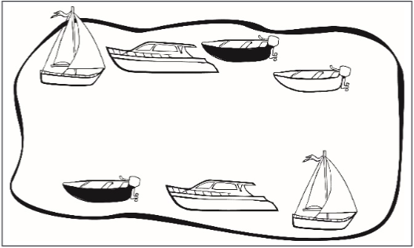
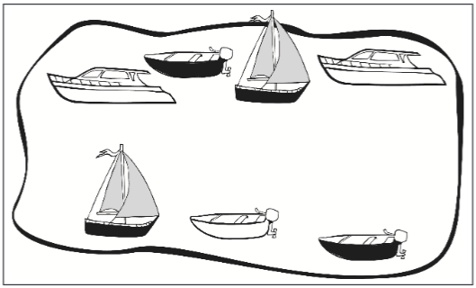
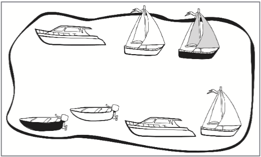
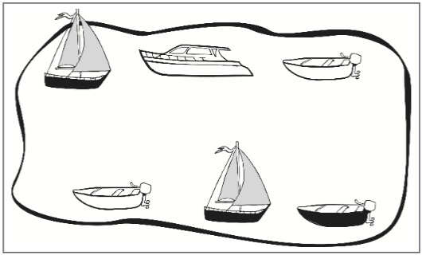
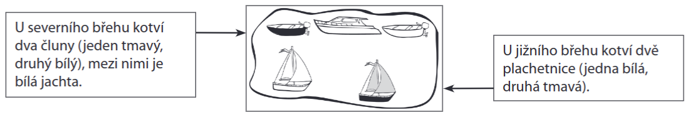

VÝCHOZÍ TEXT K ÚLOHÁM 1–3
====

> Ze všech superhrdinů\
> je nejdivnější zdaleka.\
> Nic neumí a před domem\
> ho nóbl bourák nečeká.
> 
> Na Supermana nestačí –\
> ani na Batmana, bych řek.\
> Já ho mám ale nejradši:\
> jmenuje se The Flek. 
> 
> Nesviští kolem zeměkoule,\
> neumí vyslat rázové vlny,\
> nadání totiž má jen jedno:\
> na všem udělat hnusné skvrny.
> 
> Nelítá, neplave, neskáče,\
> což ho trápí nesmírně.\
> Kvůli své jediné schopnosti\
> zaplatí majlant v čistírně.
> 
> Vysvětlivka: Superman a Batman jsou superhrdinové. 
> 
> (*T. Burton, The Flek, upraveno*)

# 1 Které z následujících tvrzení odpovídá výchozímu textu?
- [A] Ten, kdo v textu promlouvá, má nepochybně vřelejší vztah k Batmanovi než 
k The Flekovi.
- [B] Ten, kdo v textu promlouvá, uvádí, že The Flek se ve všech ohledech vyrovná 
Supermanovi.
- [C] Ten, kdo v textu promlouvá, tvrdí, že nadání The Fleka spočívá ve schopnosti 
vytvářet skvrny.
- [D] Ten, kdo v textu promlouvá, se trápí, protože kvůli The Flekovi utrácí hodně 
peněz v čistírně.
# 2 Které z následujících tvrzení o __první sloce__ výchozího textu je pravdivé?
- [A] V této sloce se spolu rýmují dva osmislabičné verše.
- [B] V této sloce se spolu rýmují dva verše, z nichž pouze ten první je osmislabičný.
- [C] V této sloce se spolu rýmují dva verše, z nichž pouze ten druhý je osmislabičný.
- [D] V této sloce se spolu rýmují dva verše, z nichž žádný není osmislabičný.
# 3 Ve které z následujících možností jsou významové vztahy mezi slovy 
nejpodobnější vztahům mezi slovy SUPERHRDINA – SUPERMAN – BATMAN, 
užitými ve výchozím textu?
- [A]  stát – Švédsko – Asie
- [B]  hvězda – Slunce – Země
- [C]  vodstvo – Dunaj – Polabí
- [D]  pohoří – Šumava – Krkonoše
# 4 Vypište z každé z následujících vět (4.1 a 4.2) základní skladební dvojici.
(Základní skladební dvojice musí být zapsány pravopisně správně.)
## 4.1 Poslední srpnová neděle bude již tradičně patřit fotbalovému utkání mezi týmy naší a sousední vesnice.
## 4.2 V nové škole ji upoutaly jak počítačové učebny, tak obě nedávno zrekonstruovaná hřiště. 
# 5 Rozhodněte o každé z následujících vět, zda je zapsána pravopisně správně (A), nebo ne (N).
 
## 5.1 Rodiče koupili do obývacího pokoje krásné bavlněné závěsy. 
## 5.2 Zrnkovou kávu je vhodné umlýt až těsně před přípravou nápoje. 
## 5.3 Poslední zbytky špinavého sněhu smyl ze silnic včerejší prudký déšť. 
## 5.4 Sýrové pohoštění pro příchozí ozdobila hostitelka hroznovým vínem. 
# 6 Přiřaďte k jednotlivým větám (6.1–6.3) odpovídající tvrzení (A–E).
(Žádnou možnost z nabídky A–E nelze přiřadit víckrát než jednou. Dvě možnosti zbudou a nebudou 
použity.)
## 6.1 Špinavé __prádlo__ jsme nejprve namočili do vlažné __vody__. 
## 6.2 Po sezoně je třeba uklidit znečištěné __ulice__ vedoucí na __pláž__. 
## 6.3 Nemohli jsme se dočkat oficiální __odpovědi__ ze sousední __země__. 
- [A] Pro větu platí: podtržená podstatná jména jsou stejného rodu a jsou užita v různém 
pádě i v různém čísle.
- [B] Pro větu platí: podtržená podstatná jména jsou stejného rodu a jsou užita ve stejném 
pádě i ve stejném čísle.
- [C] Pro větu platí: podtržená podstatná jména jsou stejného rodu a jsou užita ve stejném 
pádě, ale v různém čísle.
- [D] Pro větu platí: podtržená podstatná jména nejsou stejného rodu a jsou užita ve 
stejném pádě i ve stejném čísle.
- [E] Pro větu platí: podtržená podstatná jména nejsou stejného rodu a jsou užita 
v různém pádě, ale ve stejném čísle.
# 7 
**Sdělení č. 1:** „Myslím, že by ses měla Otovi hned omluvit, Věro, jinak bych to bohužel 
musel řešit s tvými rodiči.“
 
**Sdělení č. 2:** „Jestli se Otovi hned neomluvíš, Věro, budu to okamžitě řešit s tvými 
rodiči.“
 
**Které z následujících tvrzení nejlépe vystihuje výše uvedená sdělení?**
- [A] V obou případech jde o sdělení adresované Věře, sdělení č. 1 je ale vyjádřeno 
ostřeji než sdělení č. 2.
- [B] 
V obou případech jde o sdělení adresované Věře, sdělení č. 2 je ale vyjádřeno 
ostřeji než sdělení č. 1.
- [C] V obou případech jde o sdělení adresované Otovi, sdělení č. 1 je ale vyjádřeno 
ostřeji než sdělení č. 2.
- [D] V obou případech jde o sdělení adresované Otovi, sdělení č. 2 je ale vyjádřeno 
ostřeji než sdělení č. 1.

VÝCHOZÍ TEXT K ÚLOHÁM 8–12
====

> Už odpradávna velbloud vláčí těžký náklad pod žárem nelítostného slunce. Ne 
> nadarmo se mu říká koráb pouště. Tento mohutný býložravec dokáže zázraky: bez vody 
> vydrží prokazatelně přes dva týdny a po dlouhou dobu (údajně dokonce pět týdnů) 
> přežije i bez jídla.
> 
> Velbloud je rychlý a vytrvalý běžec: za 12 hodin uběhne až 175 km. Řadí se mezi 
> mimochodníky (stejně jako např. žirafy či sloni). To jsou čtyřnozí živočichové, kteří při 
> chůzi používají současně vždy dvě nohy na stejné straně těla (tj. buď na levém, nebo na 
> pravém boku). Když tedy například vykročí oběma levýma nohama, obě pravé spočívají 
> na zemi.
> 
> Na světě žijí velbloudi, kteří se __pyšní__ dvěma hrby, a velbloudi jednohrbí (zvaní též 
> dromedáři). Ti jsou sice o jeden výčnělek na hřbetě chudší, přesto mají v určitém směru 
> nad těmi dvouhrbými __navrch__ – tvoří totiž naprostou většinu světové velbloudí populace. 
> Říká se, že v hrbech si velbloudi nosí vodu na dlouhou cestu. To je ale jen pověra. Mají 
> v **nich** totiž uložen tuk (o hmotnosti až 35 kg), který slouží jako zásobárna energie pro 
> horší časy. Velikost hrbů se mění v závislosti na množství uloženého tuku: *****.
> 
> Pro život v drsných podmínkách jsou velbloudi skvěle vybaveni. Klidně odpočívají 
> na horkém písku, a přesto se nespálí. Ztvrdlá kůže, kterou mají na kolenou (a dromedáři 
> navíc také na hrudi), totiž funguje jako ochrana před popáleninami. Velbloudi se ani příliš 
> neboří do písku, a to díky specifickému tvaru nášlapné části nohy. __Nelehké__ putování 
> pouští **jim** usnadňují i tři víčka na každém oku a husté řasy: během písečných bouří tato 
> výbava zmírňuje negativní vliv písku a silného větru na oči. Nehostinné prostředí pouště 
> zkrátka pro tyto živočichy __nepředstavuje__ žádný problém.
> 
> (*Epocha 12/2023, upraveno*)

# 8 Která z následujících možností patří na vynechané místo (*****) ve výchozím textu? 
(Po doplnění možnosti musí být výchozí text smysluplný.)
- [A] čím jsou hrby větší, tím menší jsou zásoby uložené energie, a to kvůli průběžnému 
ubývání tuku
- [B]  čím jsou hrby menší, tím větší jsou zásoby uložené energie, a to kvůli průběžné 
spotřebě tuku
- [C]  při dostatku potravy a vody jsou hrby větší, v opačném případě se v souvislosti 
se spotřebou tuku zmenšují
- [D]  při dostatku potravy a vody jsou hrby menší, v opačném případě se důsledkem 
ubývání tuku začnou zvětšovat

# 9 Rozhodněte o každém z následujících tvrzení, zda jednoznačně vyplývá z výchozího textu (A), nebo ne (N).
## 9.1 Na světě žije méně velbloudů dvouhrbých než dromedárů. 
## 9.2 Když má velbloud při chůzi pravou přední nohu ve vzduchu, levou zadní má na zemi. 
## 9.3 Mezi živočichy označované jako mimochodníci patří kromě velbloudů třeba žirafy a sloni. 
## 9.4 Ztvrdlá kůže, kterou má dromedár například na části svého trupu, má ochrannou funkci. 
# 10 Které z následujících tvrzení o dvou zájmenech tučně vyznačených ve výchozím textu je pravdivé?
- [A] Jak zájmeno *nich*, tak zájmeno *jim* odkazuje ke slovu *velbloudi*.
- [B] Ani zájmeno *nich*, ani zájmeno *jim* neodkazuje ke slovu *velbloudi*.
- [C] Ke slovu *velbloudi* odkazuje zájmeno *nich*, nikoli však zájmeno *jim*.
- [D] Ke slovu *velbloudi* odkazuje zájmeno *jim*, nikoli však zájmeno *nich*.
# 11 
**Informace č. 1**: Velbloud vydrží více než 14 dní bez vody.
 
**Informace č. 2**: Velbloud přežije 35 dní bez jídla.
 
**Které z následujících tvrzení o výše uvedených informacích je pravdivé?**
- [A] Jako domněnka je ve výchozím textu předkládána pouze informace č. 1.
- [B] Jako domněnka je ve výchozím textu předkládána pouze informace č. 2.
- [C] Každá z těchto informací je ve výchozím textu předkládána jako domněnka.
- [D] Žádná z těchto informací není ve výchozím textu předkládána jako domněnka.
# 12 Rozhodněte o každé z následujících podúloh (12.1–12.4), zda danou dvojici slov lze v kontextu výchozího textu považovat za antonyma (A), nebo ne (N).
(První slovo z každé dvojice pochází z výchozího textu a je v něm podtrženo.)
 
Příklady: 
- *Měl vysoký hlas.* → Slova *vysoký* a *hluboký* lze v tomto kontextu považovat za antonyma, 
tzn. slovo *hluboký* by v této větě mělo opačný význam, než v ní má slovo *vysoký*.
- *Byl to vysoký strom*. → Slova *vysoký* a *hluboký* nelze v tomto kontextu považovat za antonyma.
 
## 12.1 pyšní – skromní 
## 12.2 navrch – vespod  
## 12.3 nelehké – strastiplné 
## 12.4 nepředstavuje – předvádí 

# 13 Která z následujících vět je zapsána pravopisně správně?
- [A] Prodáváme byliné čajové směsi.
- [B] Prodáváme byliné čajové směsy.
- [C] Prodáváme bylinné čajové směsi.
- [D] Prodáváme bylinné čajové směsy.
# 14 Uspořádejte jednotlivé části textu (A–F) tak, aby na sebe navazovaly.
- [A] „Ano,“ potvrdil pan Wonka. „Ale co když na nebi žádné nejsou, zrovna jako 
dneska?“ zajímala se Pepička. „Prosím? Já čím dál tím hůř slyším,“ řekl pan 
Wonka. „Karlíku,“ oznámila babička Pepička svému vnukovi, „ten pán mi připadá 
nanejvýš podezřelý.“ 
- [B] Jeho rodiče, pan a paní Bucketovi, se poprvé po mnoha letech usmívali. „Co 
nás u všech všudy drží i s touhle potřeštěnou krabicí ve vzduchu?“ zaskřehotala 
náhle babička Pepička.
- [C] „Mrakodrápy,“ odpověděl pan Wonka. „A tyhle mrakodrápy,“ pokračovala 
Pepička, „ty se asi mají zadrápnout za mraky, je to tak?“
- [D] „Vážená paní,“ promluvil pan Wonka, „to není žádná krabice. Je to velký 
skleněný výtah a vyletěl s námi až do nebe.“ „A co ho drží ve vzduchu?“ nedala 
pokoj Pepička.
- [E] Nastoupili a velký skleněný výtah se vznesl asi tisíc metrů nad zem. Všichni 
v kabině se tetelili vzrušením při představě, že budou žít ve slavné továrně 
pana Wonky. Karlík radostně poskakoval na místě.
- [F] „Mně taky,“ přidala se k ní babička Jiřinka, „vymýšlí si nesmysly.“ Karlík se 
naklonil ke stařenkám a pošeptal jim: „Hlavně nám to prosím celé nepokazte. 
Pan Wonka je báječný člověk. A je to můj kamarád.“

(*R. Dahl, Karlík a velký skleněný výtah, upraveno*)

# 15 
## 15.1 Patřil k lidem __budícím důvěru__.
 
**Podtržený úsek upravte tak, aby z věty jednoduché vzniklo spisovné 
a pravopisně i gramaticky správné souvětí obsahující celkem dvě věty. Význam 
původní věty jednoduché musí zůstat zachován.**

## 15.2 __Když se promíchají tyto barvy__, získáme požadovaný odstín.
 
**Podtržený úsek upravte tak, aby ze souvětí vznikla spisovná a pravopisně 
i gramaticky správná věta jednoduchá. Význam původního souvětí musí zůstat 
zachován.**

(Nově vzniklé větné celky musí obsahovat všechny původní informace a nesmí obsahovat žádné 
informace navíc, např. že jde o *dvě* barvy.)

VÝCHOZÍ TEXTY K ÚLOZE 16
===

**TEXT 1**
>  1. Při vyšetření si postěžoval lékaři, že od té nehody ho bolí celá ruka.
>  2. Protože jsem ve škole dával pozor, příprava na test mi zabrala jen dvacet minut.
>  3. Když ji při večeři požádal o ruku, rozplakala se, protože byla velmi šťastná.
>  4. Dala jsem si do kabelky tolik rtěnek a jiných líčidel, že vážila nejmíň dvě tuny.
>  5. Ve výloze butiku jsou vystaveny společenské šaty, které byly zlevněny na 5 000 Kč.
>  6. Při sledování filmů, v nichž vystupují duchové, se většinou trochu bojím.
>  7. Když s babičkou pečeme cukroví, zpíváme všechny koledy, které si vybavíme.
>  8. Ačkoli Štěpán chodil do hudební školy, dobře hrát na housle se nikdy nenaučil.
>  9. Kdykoli mi moje kamarádka Andrea začne vyprávět vtipy, umírám smíchy.
> 10. Protože ji hodně bolela hlava, vzala si lék, ale ten jí zabral až za hodinu.
> 11. Včera jsem si přečetl v jednom článku, že medvěd může být vysoký i 3 metry.
> 12. Napsal mi zprávu, že mé chování v divadle bylo poněkud nevhodné.
> 13. Na srazu bývalých spolužáků mi došlo, že jsem je neviděl celou věčnost.
> 14. V pokynech bylo uvedeno, že na letišti musíme být už dvě hodiny před odletem.
> 15. Petr vyhrál hodně peněz, a tak uspořádal okázalou hostinu v luxusní restauraci.

**TEXT 2**
> **Nadsázka** – přehnané, zveličené tvrzení, např. *když slyšel její milá slova, zatočil se s ním* 
> *celý svět*; *mám hlad, že bych hřebíky polykal.* 
# 16 V TEXTU 1 jsou tři souvětí, pro něž platí, že se v každém z nich uplatňuje nadsázka. Najděte tato souvětí a napište jejich ČÍSLA. Čísla od sebe zřetelně oddělte čárkou.
(Úlohu řešte na základě definice uvedené v TEXTU 2. Za chybu je považováno jak neuvedení 
hledaného čísla, tak zapsání jakéhokoli čísla, které neodpovídá zadání.)

VÝCHOZÍ TEXT K ÚLOZE 17
====

> Lídin tatínek je velký sportovec, a tak po Lídě a jejím bratrovi chtěl, aby se také 
> věnovali nějakému sportu. V sedmi letech začala Lída chodit na __gymnastiku__. Nejdřív byla 
> nadšená, protože se jí líbil sytě červený úbor, sál s obřími zrcadli i cvičení se stuhami. 
> Záhy se ale ukázalo, že to nebyla nejlepší volba. Lída totiž nebyla tak nadaná jako ostatní 
> dívky, které __navíc__ trénovaly už od nejútlejšího věku. Vyměnila tedy __gymnastiku__ za 
> plavání, ani v něm ale nevynikala. Svůj talent objevila až ve výtvarném kroušku.
> 
> Kvůli dceřiným sportovním neúspěchům se tatínek plně zamněřil na svého syna. 
> Přihlásil Tomáše na fotbal a chodil s ním na zápasy. Tomášovi sice nechyběli potřebné 
> schopnosti, ale běhání za míčem mu připadalo nudné. Dával přednost četbě. Tatínek 
> brzy pochopil, že z jeho dětí vrcholoví sportovci nebudou, a podpořil je v jiných zálibách.

# 17 Najděte ve výchozím textu čtyři slova, která jsou v něm zapsána s pravopisnou chybou, a napište je PRAVOPISNĚ SPRÁVNĚ. 
(Slova zapište bezchybně, a to ve stejném tvaru, v němž jsou užita v textu. Za chybu je považováno jak 
neuvedení hledaného slova, tak zapsání jakéhokoli slova, které neodpovídá zadání. Podtržená slova 
jsou zapsána správně.)

VÝCHOZÍ TEXTY K ÚLOHÁM 18–22
===

**TEXT 1**
> (**1**) Serafina se probudila a pořádně se rozhlédla po ztemnělém sklepení. Zkoumala, 
> zda nějaké krysy nebyly natolik HLOUPÉ, aby sem vlezly, zatímco spala. Tady, v rozlehlém 
> sídle Biltmore, byly VŠUDE. Tohle je slibná noc pro lov, pomyslela si dívka a potichu se 
> vykradla do přízemí. Ve dne bylo plné služebnictva, teď ale místnosti osiřely. Serafina 
> tu znala každou SKULINU. Občas při svých nočních výpravách proklouzla z přízemí i do 
> horních pater. V noci byl totiž celý dům její.
> 
> (**2**) Když bylo Serafině deset let, zeptala se tatínka, jestli i ona má v domě nějakou 
> práci. „Ovšem, a moc důležitou!“ odpověděl. „Jsi HCHK Biltmoru. Hlavní __chytačka__ krys!“
> Serafina si i teď, po více než dvou letech, vybavovala, jakou tehdy pocítila hrdost. 
> Skutečně měla vrozený talent na chytání těch prohnaných škůdců. Ze vzpomínek ji ale 
> najednou vytrhl zvuk ozývající se z nedaleké chodby. Někdo chodí po domě!
> 
> Serafina se přitiskla ke zdi. Vzápětí spatřila muže v černém plášti. V jedné ruce držel 
> lucernu a druhou vlekl holčičku ve žlutých šatech. Prošli jen kousek od Serafiny. Vtom 
> se dívenka vytrhla ze sevření a rozběhla se do sklepení. Muž ji začal pronásledovat. Co 
> teď? Serafina by nejradši utekla. Jenže ta holčička… Serafina usilovně přemýšlela. „**Jsem 
> jediná, kdo pro tu chudinku může něco udělat,“ řekla si nakonec.** A vydala se za nimi.
> 
> (**3**) Na kamenné podlaze nejhlubší části sklepení ležela rozbitá lucerna. V pohasínající 
> záři Serafina viděla, že holčička ve žlutých šatech bojuje o život. „Za chvíli už bude konec,“ 
> pronesl zloduch. Náhle mužův černý plášť vzlétl vzhůru a pak jeho záhyby obtočily tělo 
> vzlykající dívenky jako chapadla hladové chobotnice. Na okamžik ještě Serafina zahlédla 
> vyděšený obličej té malé __bojovnice__. Záhy však pláč utichl a po děvčátku nezůstalo nic 
> než černota pláště. Nadobro zmizelo.
> 
> (*R. Beatty, Serafina a černý plášť, upraveno*)

**TEXT 2**
> **Podstatné jméno typu A** označuje osobu rodu ženského a je příbuzné se svým 
> mužským protějškem, kterým je podstatné jméno rodu mužského životného. Příklady:  
> 
> |__podstatné jméno typu A__|__jeho mužský protějšek__|
> |:---:|:---:|
> |*svědkyně* |*svědek* |
> |*královna* |*král* |
> 
> **Podstatné jméno typu B** (např. *dcera*, *žena*) označuje osobu rodu ženského. Podstatná 
> jména tohoto typu mužský protějšek se stejným kořenem nemají.

# 18 Rozhodněte o každém z následujících tvrzení, zda jednoznačně vyplývá z TEXTU 1 (A), nebo ne (N).
 
## 18.1 Serafinu vzbudily krysy pobíhající po sklepení sídla Biltmore. 
## 18.2 V době, kdy holčička ve žlutých šatech zmizela ze sklepení, bylo Serafině  minimálně dvanáct let. 
## 18.3 Těsně předtím, než Serafina spatřila muže v černém plášti, se setkala  s otcem a hovořila s ním o své práci. 
## 18.4 Tu noc, kdy holčička ve žlutých šatech bojovala o život, šla Serafina ze  sklepení přes přízemí do horních pater domu a pak se vrátila do sklepení. 
# 19 Vypište ze __třetí části__ TEXTU 1 tři zájmena. 
(Za chybu je považováno jak neuvedení hledaného slova, tak zapsání jakéhokoli slova, které 
neodpovídá zadání.) 
# 20 Které z následujících tvrzení o třech slovech zapsaných v __první části__ TEXTU 1 velkými písmeny je pravdivé?
- [A] Všechna tato slova jsou v textu spisovná.
- [B] Spisovná jsou v textu pouze dvě z těchto slov, a to *hloupé* a *všude*.
- [C] Spisovná jsou v textu pouze dvě z těchto slov, a to *všude* a *skulinu*.
- [D] Spisovná jsou v textu pouze dvě z těchto slov, a to *hloupé* a *skulinu*.
# 21 Kterou z následujících možností lze úsek tučně vyznačený v TEXTU 1 nahradit tak, aby význam textu zůstal zachován?
- [A] Nakonec si řekla, že je jediná, kdo pro tu chudinku může něco udělat.
- [B] Je jediná, kdo pro tu chudinku může něco udělat, řekla jsem si nakonec.
- [C] Nakonec si řekla, že jsem jediná, kdo pro tu chudinku může něco udělat.
- [D] Jsem jediná, kdo pro tu chudinku může něco udělat, řekla jsem si nakonec.
# 22 Které z následujících tvrzení o dvou slovech podtržených v TEXTU 1 je pravdivé?
(Úlohu řešte na základě definic uvedených v TEXTU 2.)
- [A] Obě tato slova jsou podstatná jména typu A.
- [B] Obě tato slova jsou podstatná jména typu B.
- [C] Slovo *chytačka* je podstatné jméno typu A, slovo *bojovnice* je podstatné jméno 
typu B.
- [D] Slovo *chytačka* je podstatné jméno typu B, slovo *bojovnice* je podstatné jméno 
typu A.
# 23 Která z následujících vět NENÍ zapsána pravopisně správně?
- [A] Velice mě zaujaly její povídky.
- [B] Vyprávěla o mě samé nesmysly.
- [C] Sestřenice na mě měly dobrý vliv.
- [D] Potěšil mě svým přístupem k práci.

VÝCHOZÍ TEXT K ÚLOZE 24
===
> Čísla, která jsou uvedena v levém sloupci, děl dvěma.
# 24 Napište smysluplnou spisovnou větu o __čtyřech__ slovech, v níž výraz DĚL bude jednoznačně jiným slovním druhem než ve výchozím textu.
(Vzniklá věta musí obsahovat tvar *děl*, musí být gramaticky i pravopisně správná a musí obsahovat 
přísudek. Výraz *děl* nesmí být použit jako vlastní jméno.)

VÝCHOZÍ TEXT K ÚLOHÁM 25–27
====

> Nápad vytvořit hrající silnici se zrodil v Dánsku. Její princip je jednoduchý: povrch 
> vozovky se naruší **drážkami**, a když po takto upraveném úseku jede auto, začne hrát 
> hudba. To, které tóny zazní, závisí na několika **faktorech**, např. na hloubce drážek.
> 
> Zpříjemnit si jízdu tímto způsobem můžete už v několika zemích. Třeba známá 
> americká silnice Route 66 má úsek dlouhý několik set metrů, který vyhrává píseň *Amerika* 
> *je krásná*. Na blížící se hudební zážitek zde upozorňuje značka, která nabádá řidiče, 
> aby najeli na zdrsněný pruh. Podle místních úřadů by tato inovace mohla řidiče přimět 
> k pomalejší, a tedy i bezpečnější jízdě. Pokud totiž na tomto úseku pojedete rychleji než 
> 45 mil za hodinu (jen pro představu – vzdálenost 45 mil odpovídá asi 72 km), silnice 
> nebude hrát čistě.
> 
> Ne vždy ale tvůrcům jejich záměr VYJDE. Například v kalifornském městě Lancaster 
> měla jedna silnice hrát předehru k opeře Vilém Tell. Tóny však byly falešné, i když jste 
> dodrželi povolenou **rychlostí**. Kvůli chybě ve výpočtu byly totiž drážky špatně umístěny. 
> Hrající pruh silnice na severu Nizozemska zase musel být odstraněn záhy poté, co byl 
> vybudován. **Obyvatelům** nedaleké vsi totiž neustálé opakování stejné písně vadilo.
> 
> (*www.irozhlas.cz, upraveno*)

# 25 Rozhodněte o každém z následujících tvrzení, zda jednoznačně vyplývá z výchozího textu (A), nebo ne (N).
 
## 25.1 Úsek o délce jednoho kilometru je kratší než úsek o délce jedné míle. 
## 25.2 Silnice nazývající se Route 66, jejíž úsek hraje píseň *Amerika je krásná*, má celkovou délku několik set metrů. 
## 25.3 První silnici s hrajícím pruhem vybudovali v Dánsku a zatím poslední  taková silnice byla postavena v Nizozemsku. 
## 25.4 Falešné tóny, které vydávala jedna silnice v kalifornském městě Lancaster,  byly způsobeny nesprávným umístěním drážek. 
# 26 Ve kterém z následujících souvětí je sloveso VYJÍT použito ve stejném významu jako ve výchozím textu?
(Posuzované sloveso je ve výchozím textu zapsáno velkými písmeny.)
- [A] Není náročný, a tak vždy vyjde s málo penězi.
- [B] Včera to dost pokazil, ale zítra mu to snad vyjde.
- [C] Rozhodla se, že dnes večer si konečně někam vyjde.
- [D] Zcela přestal cvičit, takže nepochybně vyjde z formy.
# 27 Které z následujících slov se ve výchozím textu vyskytuje v chybně užitém tvaru?
(Posuzovaná slova jsou ve výchozím textu vyznačena tučně. Příklad: Podtržené slovo ve větě *Otevřeno* 
*máme do __čtyři__ hodin* je v chybně užitém tvaru.)
- [A] drážkami
- [B] faktorech
- [C] rychlostí
- [D] obyvatelům
# 28 Přiřaďte k jednotlivým obrázkům (28.1–28.4) odpovídající popis (A–F).
(Žádnou možnost z nabídky A–F nelze přiřadit víckrát než jednou. Dvě možnosti zbudou a nebudou 
použity.)
## 28.1 
## 28.2 
## 28.3 
## 28.4 
- [A] Na celém jezeře je lichý počet lodí. Většinu ze všech motorových lodí na jezeře tvoří 
čluny. U jižního břehu kotví dvě tmavé lodě.
- [B] U severního břehu kotví sudý počet bílých lodí. Ze všech lodí na jezeře jsou celkem 
čtyři motorové. U jižního břehu nekotví žádná jachta. 
- [C] Na celém jezeře je sudý počet plachetnic. U severního břehu kotví více lodí než 
u břehu jižního. Většinu ze všech lodí na jezeře tvoří bílé lodě.
- [D] U jižního břehu kotví lichý počet lodí. Na celém jezeře je počet plachetnic shodný 
s počtem jachet. U severního břehu nekotví žádný tmavý člun.
- [E] U jižního břehu kotví sudý počet motorových lodí. U severního břehu kotví tmavá 
plachetnice. Na celém jezeře jsou dvě jachty, z nichž každá kotví u jiného břehu.
- [F] Na celém jezeře je sudý počet tmavých lodí. Počet plachetnic, které kotví u severního 
břehu, je shodný s počtem člunů kotvících u jižního břehu. U severního břehu kotví 
lichý počet lodí.

Vysvětlivky: 

Na níže uvedeném obrázku je jezero, na kterém se nachází celkem pět lodí:tři jsou motorové, dvě jsou plachetnice bez motoru. 

