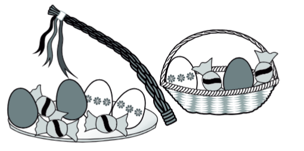
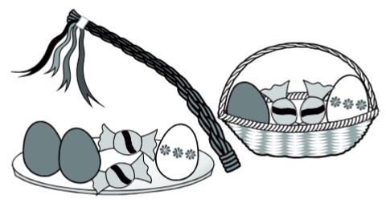
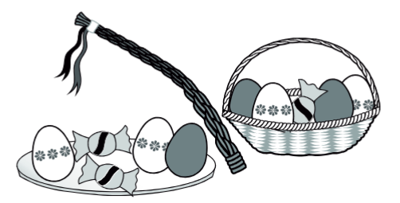
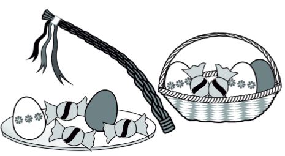

VÝCHOZÍ TEXT K ÚLOHÁM 1–3
====

> A tak ti budu vyprávět\
> o plavčíku, co málem svět\
> obeplul na své plachetnici\
> a jmenoval se plavčík Jan\
> a doma říkali mu Janek.
>
> Taková loď si žádá vánek,\
> když ten se opře do plachet,\
> nemůže plavčík zahálet.
> 
> Kormidlo třímá bez únavy\
> a ryby vystrkují hlavy\
> z moře, jež tiché je jak laňka,\
> a obdivují toho Janka.
>
> Plavčík Jan na obdiv si zvykl\
> a časem natolik už zpychl,\
> když ryby tleskaly mu zvučně,\
> že třímal už jen jednoručně.
>
> A když tu slávu takhle nesl,\
> do hlubin jeho koráb klesl,\
> protože najel na útes.
>
> Plavčík Jan taky na dno kles.\
> Nahoru vyplaval však zručně\
> a tentokráte obouručně.
>
> Rybky, co tleskaly mu právě,\
> zatímco oddával se slávě,\
> jakmile nastala ta změna,\
> vzaly hned ploutve na ramena.
>
> A kde se vzala, tu se vzala,\
> velryba k němu připlavala\
> a on ji na nos políbil.
>
> Hle, co se stalo: náhle totiž\
> velryba zívla velmi zjevně\
> a plavčík Jan už nebyl zevně.
>
> Co ti mám ještě vyprávět?\
> Plavčík Jan obeplouvá svět\
> a nic mu k štěstí nechybí\
> v břiše veliké velryby.
>
> (*J. Skácel, Uspávanka s plavčíkem a velrybou, upraveno*)

# 1 Které z následujících tvrzení odpovídá výchozímu textu?
- [A] Po celou dobu, kdy Jan plul na plachetnici, držel kormidlo jednou rukou.
- [B] Předtím, než Janova loď ztroskotala, ryby projevovaly k plavčíkovi obdiv.
- [C] Ve chvíli, kdy se zhoršily povětrnostní podmínky, Janova loď najela na útes.
- [D] Poté, co se velryba rozhodla vzít Jana na cestu kolem světa, ji plavčík políbil.

# 2 Ve kterém z následujících úseků výchozího textu se vyskytuje aktualizace ustáleného slovního spojení?
(Příklad: ustálené slovní spojení – *my o vlku a vlk za dveřmi*; aktualizace ustáleného 
slovního spojení – *my o vlku a ředitel za dveřmi*)
- [A] zívla velmi zjevně
- [B] časem natolik už zpychl
- [C] velryba k němu připlavala
- [D] vzaly hned ploutve na ramena

# 3 Ve které z následujících možností jsou významové vztahy mezi slovy nejpodobnější vztahům mezi slovy PLACHTA – KORMIDLO – LOĎ?
(Slova *plachta, kormidlo* a *loď* posuzujte ve významu, který mají ve výchozím textu. 
Správná je pouze možnost, v níž pořadí slov odpovídá pořadí *plachta* – *kormidlo* – *loď*.)
- [A] lustr – elektřina – žárovka
- [B] jahoda – ovoce – meruňka
- [C] monitor – klávesnice – myš
- [D] tkanička – podrážka – teniska

# 4 
**Situace**: Petr říká Evě: „To musíš tak křičet?“
 
**Která z následujících možností nejlépe vystihuje výše uvedenou situaci?**

- [A] Petr vytýká Evě její chování: nejspíš od ní nevyžaduje odpověď, ale patrně 
očekává, že se ztiší.
- [B] Petr vytýká Evě její chování: určitě od ní vyžaduje odpověď, ale zcela jistě 
neočekává, že se ztiší.
- [C]  Petr vyhrožuje Evě kvůli jejímu chování: nejspíš od ní nevyžaduje odpověď, ale 
patrně očekává, že se ztiší.
- [D] Petr vyhrožuje Evě kvůli jejímu chování: určitě od ní vyžaduje odpověď, ale zcela 
jistě neočekává, že se ztiší.

# 5 Rozhodněte o každé z následujících vět, zda je zapsána pravopisně správně (A), nebo ne (N). 
## 5.1 Při prohlídce známé katedrály návštěvníci obdivovali nástěnné malby. 
## 5.2 Jeho vystoupení na besídce mi připomělo mé vlastní pěvecké začátky. 
## 5.3 Poutavým vyprávěním a veselými anekdotami si nás učitel ihned získal. 
## 5.4 Drzým a povýšeným chováním vědomně ubližovala lidem ve svém okolí. 

# 6 Přiřaďte k jednotlivým souvětím (6.1–6.3) odpovídající tvrzení (A–E).
(Žádnou možnost z nabídky A–E nelze přiřadit víckrát než jednou. Dvě možnosti 
zbudou a nebudou použity.)
## 6.1 __Tělák__ mi opravdu jde, ale z __matiky__ nejspíš v pololetí __propadnu__. 
## 6.2 Hned __sem__ pojď a vysvětli mi, proč __furt__ musíš dělat nějaké __hlouposti__. 
## 6.3 Koupil si nový __auťák__, ale už __nazítří__ přišel o řidičský průkaz, protože řídil __opilý__. 
- [A] Ze všech podtržených slov je nespisovné pouze to první.
- [B] Ze všech podtržených slov je nespisovné pouze to druhé.
- [C] Ze všech podtržených slov jsou nespisovná celkem dvě, a to první a druhé.
- [D] Ze všech podtržených slov jsou nespisovná celkem dvě, a to první a třetí.
- [E] Ze všech podtržených slov jsou nespisovná celkem dvě, a to druhé a třetí.

# 7 Vypište z každé z následujících vět (7.1 a 7.2) základní skladební dvojici.
(Základní skladební dvojice musí být zapsány pravopisně správně.)

## 7.1 Nejen mí spolužáci, ale i naši učitelé se návratu distanční výuky poněkud obávali.
## 7.2 Dřívější příjezd rodičů z letní dovolené by Martinu rozhodně dost zaskočil.

VÝCHOZÍ TEXTY K ÚLOHÁM 8–12
====

**TEXT 1**
> Veverka obecná, menší hlodavec žijící v hlubokých lesích i na sídlištích __velkoměst__, 
> patří k nejoblíbenějším živočichům. Není divu, je to totiž opravdu roztomilé zvířátko.
> 
> Veverky se chlubí pestrou škálou odstínů srsti: od světle rezavé přes **sytě** hnědou až 
> po černou. Na světě zřejmě nenajdete dvě zcela stejně zbarvené veverky. Jediné, co mají 
> v tomto směru všechny veverky společné, je bílé bříško. Jejich huňatý ocas, dlouhý až 
> 20 cm, má několik funkcí. Veverky se do něj například zabalí, když se spustí **hustý** déšť 
> nebo jim je zima, a také díky NĚMU udržují rovnováhu při skákání po stromech.
> 
> Veverky nemají své příbytky v dutinách stromů, jak se mylně domnívá řada lidí, ale 
> splétají si z větévek hnízda, připomínající svým tvarem míč na ragby. Jejich vnitřek bývá 
> vycpán suchým lýkem, mechem či trávou. *****: letní jsou jednodušší a méně zateplená 
> než hnízda zimní nebo doupátka určená pro uložení __novorozeňat__.
> 
> Protože se veverka neukládá k zimnímu spánku, musí si předem sehnat dostatečné 
> zásoby potravy, KTERÉ jí umožní přečkat zimu. Hledáním potravy, kterou tvoří například 
> semena jehličnanů či oříšky, veverka stráví 15 až 19 hodin denně. Zásoby **pečlivě** 
> zahrabe do země nebo je uloží do dutin stromů. Říká se, že si veverka nepamatuje, kde 
> má své spižírny, ve skutečnosti však má o svých úkrytech dokonalý přehled. Stává se ale, 
> že si část zásob nevyzvedne, jelikož si jich schová víc, než je **nutné**.
> 
> Dříve se veverky lovily kvůli kožešině a masu. Dnes už veverka obecná patří mezi 
> chráněné živočichy, a to jak v České republice, tak ve většině dalších evropských států.
> 
> (*Epocha 14/2022; www.stoplusjednicka.cz, upraveno*)

**TEXT 2**
> **Slovo typu A** vzniká spojením dvou __celých__ slov, a proto ho **lze** rozložit na smysluplné 
> slovní spojení. Např. slovo *vlastizrada* lze rozdělit na slovní spojení *zrada vlasti*.
> 
> **Slovo typu B** vzniká buď spojením základů dvou slov (např. slovo *vodoměr* vzniklo ze 
> základů slov *voda* a *měřit*), nebo spojením základu slova a celého slova (např. *krupobití* 
> vzniklo ze základu slova *kroupa* a ze slova *bití*). Slova typu B **nelze** rozložit na smysluplné 
> slovní spojení. 

# 8 Která z následujících možností patří na vynechané místo (*****) v TEXTU 1?
- [A] Míra zateplení se liší podle typu hnízda
- [B] Míra zateplení je totožná u všech typů hnízd
- [C] S mírou zateplení je rozlišeno hlavně typem hnízda
- [D] S mírou zateplení se ztotožňuje na všech typech hnízd
# 9 Které z následujících tvrzení o slovech podtržených v TEXTU 1 je pravdivé?
(Úlohu řešte na základě definic uvedených v TEXTU 2.)
- [A] Jak *velkoměsto*, tak *novorozeně* jsou slova typu A.
- [B] Jak *velkoměsto*, tak *novorozeně* jsou slova typu B.
- [C] *Velkoměsto* je slovo typu A, *novorozeně* je slovo typu B.
- [D] *Velkoměsto* je slovo typu B, *novorozeně* je slovo typu A.

# 10 Rozhodněte o každém z následujících tvrzení, zda jednoznačně vyplývá z TEXTU 1 (A), nebo ne (N).
 
## 10.1 V průběhu roku každá veverka postupně postaví celkem tři hnízda, z nichž poslední je určeno pro mláďata. 
## 10.2 Mezi mnoha lidmi je rozšířen mylný názor, že veverčí hnízda jsou svým tvarem podobná míčům na ragby. 
## 10.3 V současnosti je veverka obecná chráněným živočichem ve většině evropských států včetně České republiky. 
## 10.4 Shromáždit dostatečné množství semen jehličnanů trvá veverce o čtyři hodiny méně než sehnat dostatečné množství oříšků. 

# 11 Které z následujících tvrzení je pravdivé?
(Posuzovaná slova jsou v TEXTU 1 vyznačena tučně.)

- [A] Slovo *hladově* by v TEXTU 1 mělo opačný význam, než má v textu slovo *sytě*.
- [B] Slovo *zředěný *by v TEXTU 1 mělo opačný význam, než má v textu slovo *hustý*.
- [C] Slovo *nedbale* by v TEXTU 1 mělo opačný význam, než má v textu slovo *pečlivě*.
- [D] Slovo *nezbytné* by v TEXTU 1 mělo opačný význam, než má v textu slovo *nutné*.
# 12 Které z následujících tvrzení o zájmenech zapsaných v TEXTU 1 velkými písmeny je pravdivé?
- [A]  Zájmenem *němu* je v textu zastupováno podstatné jméno *ocas*, zájmenem *které* 
je v textu zastupováno podstatné jméno *zásoba*.
- [B] Zájmenem *němu* je v textu zastupováno podstatné jméno *déšť*, zájmenem *které* 
je v textu zastupováno podstatné jméno *zásoba*.
- [C]  Zájmenem *němu* je v textu zastupováno podstatné jméno *ocas*, zájmenem *které* 
je v textu zastupováno podstatné jméno *potrava*.
- [D] Zájmenem *němu* je v textu zastupováno podstatné jméno *déšť*, zájmenem *které* 
je v textu zastupováno podstatné jméno *potrava*.

# 13 Která z následujících vět je zapsána pravopisně správně?
- [A] Davy zahraničních turistů zamířili k cíli své výpravy.
- [B] Davy zahraničních turistů zamířili k cíly své výpravy.
- [C] Davy zahraničních turistů zamířily k cíli své výpravy.
- [D] Davy zahraničních turistů zamířily k cíly své výpravy.

# 14 Uspořádejte jednotlivé části textu (A–F) tak, aby na sebe navazovaly.
- [A] V naší rodině se totiž vstává pozdě. Vedle stodoly nedaleko pláže stál trakař. 
Naložila jsem na něj kupu sena a vzápětí usnula. 
- [B] Mé uspokojení se ale rychle rozplynulo, když jsem zaslechla, že hodiny na věži 
právě odbíjejí devět! K našemu domu jsem doběhla celá uřícená. Vypadalo to, 
že všichni ještě spí. Vydrápala jsem se po vinné révě ke své ložnici. Zatraceně! 
Okno bylo zavřené! 
- [C] Z hlubokého spánku mě vytrhla slepice, která se uvelebila na mém břiše. Hnala 
jsem toho tupého ptáka od stodoly až k oceánu. Vlny ji zmáčely od zobáku po 
pařáty. Pomsta byla sladká! 
- [D] Nikoho jsem neviděla. S troškou štěstí bych mohla nepozorovaně proklouznout 
do svého pokoje. Opatrně jsem našlapovala po schodech. Zanedlouho už jsem 
ležela pod svou nadýchanou peřinou.
- [E] Nezbylo mi nic jiného než sešplhat dolů a projít hlavním vchodem. Tiše jsem 
pootevřela těžké dveře, pomalu vešla dovnitř a rozhlédla se. 
- [F] Po probdělé noci jsem se za svítání vracela ze svého tajného dobrodružství. 
Zmohla mě ale únava, a tak jsem se rozhodla chvilku prospat pod širým 
nebem. Když budu doma do deseti, nikdo nezjistí, že jsem noc strávila venku.

(*S. Rabinová, Betsy a císař, upraveno*)

# 15
## 15.1 S trenérem se sejdeme __před začátkem závodu__.
 
Úsek podtržený ve výše uvedené větě jednoduché upravte tak, aby z věty 
vzniklo gramaticky správné souvětí obsahující dvě věty. Význam původní věty 
musí zůstat zachován.
## 15.2 Silnice, __která vede lesem__, je neprůjezdná.
 
Úsek podtržený ve výše uvedeném souvětí upravte tak, aby ze souvětí vznikla 
gramaticky správná věta jednoduchá. Význam původního souvětí musí zůstat 
zachován.

VÝCHOZÍ TEXTY K ÚLOZE 16
====

**TEXT 1**
> Využitím sluneční energie ušetříme.\
> Zlomeninu jednoznačně potvrdil rentgen.\
> Nasedla do přistaveného taxi. \
> V předsálí koncertního sálu stálo piano.\
> Při zkoušení mě přepadla tréma.\
> Koupil jsem si nové album této kapely.\
> V psaní slohů už mám praxi.\
> K obědu máme filé s bramborem. \
> Vybral si z menu nejdražší jídlo. \
> Na ples se oblékla do róby z hedvábí.

**TEXT 2**
> Nesklonná podstatná jména mají ve všech pádech obou čísel stejný tvar. Většinou jde 
> o přejatá slova zakončená na samohlásku, např. *iglú* (*iglú bylo malé,* *psi ho vezli k jeho iglú,*
> *postavil si iglú, v iglú bylo teplo* aj.).

# 16 Vypište z TEXTU 1 tři nesklonná podstatná jména.
Úlohu řešte na základě definice uvedené v TEXTU 2.
Za chybu je považováno jak neuvedení hledaného podstatného jména, tak zapsání 
jakéhokoli slova, které neodpovídá zadání.

VÝCHOZÍ TEXT K ÚLOZE 17
====

> S posledními říjnovými dny se blížily podzimní prázdniny. Michal a jeho bratr Martin 
> se těšili nejen na to, že si odpočinou od školních poviností, ale také na pobyt na chalupě, 
> která se nachází ve vesničce poblíž __Českého Krumlova__. Ve středu vstali brzy a pak ranním 
> spojem vyrazili na cestu. Na __krumlovském__ nádraží už postávali nedočkaví prarodiče.
> 
> Kluci nejdřív ochotně pomáhali dědovy na zahradě. Společnými silami otrhali z již 
> téměř holích větví všechna jablíčka a za odmněnu dostali babiččin vynikající závin, 
> který zapíjeli čerstvě vylisovaným moštem. V neděli se pak všichni vypravili na výlet do 
> nedalekého města, kde se procházeli starobylými uličkami. Kluky upoutali především 
> medvědi, kteří obývají zámecký příkop. Prodloužený víkend s prarodiči se oběma 
> bratrům velmi líbil. 

# 17 Najděte ve výchozím textu čtyři slova, která jsou zapsána s pravopisnou chybou, a napište je PRAVOPISNĚ SPRÁVNĚ. 
Podtržené výrazy jsou zapsány správně.

Slova zapište bezchybně ve stejném tvaru, ve kterém jsou užita v textu. Za chybu 
je považováno jak neuvedení hledaného slova, tak zapsání jakéhokoli slova, které 
neodpovídá zadání.

VÝCHOZÍ TEXT K ÚLOHÁM 18–22
====

> (**1**) Adara si nikdy nebyla zcela jistá, jestli zima přináší ledového draka, nebo ledový 
> drak zimu. Vždy ale věděla, kdy zima, sníh a ledový drak mají přijít, protože v tu dobu 
> měla narozeniny.
>
> (**2**) Adara se narodila za strašného mrazu. Zima na ní tenkrát nechala své otisky. Asi 
> proto byla jiná než ostatní děti. Už si nevzpomínala, kdy ledového draka spatřila poprvé. 
> Připadalo jí, že byl součástí jejího života **odjakživa**. 
>
> Adara znala draky už předtím. Hal, mladší bratr jejího otce, totiž létal na jednom 
> z nich. Ledový drak byl ale daleko větší, byl pokrytý jinovatkou a zuby – tři řady hrozivých 
> kopí nestejné délky – měl z rampouchů. Když zamával křídly, zafoukal studený vítr, když 
> dýchal, tvořil se led. Adara se ho ale nebála. Byla přece zimní dítě.
>
> (**3**) Té zimy, kdy oslavila své páté narozeniny, na něm letěla poprvé. Ledový drak si ji 
> opět našel na poli, kde jako obvykle stavěla hrad ze sněhu. Když toho rána dosedl **vedle** 
> ní, rozhodla se na něj vylézt. Objala jeho studený krk a vzápětí se spolu vznesli do oblak. 
> **Odtud** najednou viděla svět úplně jinak. Když letěli nad otcovou farmou, zahlédla svého 
> bratra Geoffa. Vypadal docela maličký.
> 
> Adara s drakem strávili ve vzduchu dlouhé hodiny. Jejich první společný let byl 
> vzrušující, ale také dost nebezpečný. Adara totiž neměla postroj, jaký používá Hal 
> a ostatní královští drakoletci. **Občas** proto hrozilo, že ji drak máváním křídel setřese. 
> K večeru konečně začali klesat. Bylo těsně po setmění, když přistáli na zemi. Doma otec 
> Adaru nejdřív objal a pak jí vynadal. Nechápala to. Geoff jí ale pošeptal: „Proletěl tudy 
> ledový drak a všechny vyděsil. Otec se bál, že tě ta stvůra sežrala.“ Adara se jen usmála. 
>
> (*G. R. R. Martin, Ledový drak, upraveno*)

# 18 Rozhodněte o každém z následujících tvrzení, zda jednoznačně vyplývá z výchozího textu (A), nebo ne (N).
## 18.1 Ledový drak měl v tlamě kromě rampouchů také hrozivá kopí uspořádaná do tří řad. 
## 18.2 Když Adařin otec zjistil, že se jeho dcera proletěla na ledovém drakovi, vyhuboval jí. 
## 18.3 Adara pravidelně stavěla na poli hrad ze sněhu, protože díky této stavbě ji ledový drak lépe našel. 
## 18.4 Od chvíle, kdy Adara vzlétla na ledovém drakovi, do chvíle, kdy po svém prvním společném letu přistáli na zemi, uběhlo méně než 24 hodin. 

# 19 Vypište z __druhé části__ výchozího textu tři podstatná jména, která jsou v textu užita v 7. pádě.
Za chybu je považováno jak neuvedení hledaného podstatného jména, tak zapsání 
jakéhokoli slova, které neodpovídá zadání. 

# 20 Která z následujících možností vystihuje výchozí text?
- [A] Jde o umělecký text, který vypráví Adara.
- [B] Jde o umělecký text, který vypráví o Adaře.
- [C] Jde o neumělecký text, který vypráví Adara.
- [D] Jde o neumělecký text, který vypráví o Adaře.

# 21 
**Tvrzení č. 1**: Hal, jeden z královských drakoletců, je Adařin strýc.

**Tvrzení č. 2**: Geoff, Adařin bratr, je menšího vzrůstu než Adara.
 
**Vyplývá z výchozího textu alespoň některé z výše uvedených tvrzení?**
- [A] ne, žádné z těchto tvrzení 
- [B] ano, ale pouze tvrzení č. 1
- [C] ano, ale pouze tvrzení č. 2
- [D] ano, každé z těchto tvrzení

# 22 Rozhodněte o každém z následujících tvrzení, zda je pravdivé (A), nebo ne (N).
(Posuzovaná slova jsou ve výchozím textu vyznačena tučně.)
 
## 22.1 Pokud slovo *odjakživa* nahradíme slovem *donedávna*, význam daného větného celku zůstane zachován. 
## 22.2 Pokud slovo *vedle* nahradíme slovem* kromě*, význam daného větného celku zůstane zachován. 
## 22.3 Pokud slovo *odtud* nahradíme slovem* potud*, význam daného větného celku zůstane zachován. 
## 22.4 Pokud slovo *občas* nahradíme slovem* chvílemi*, význam daného větného celku zůstane zachován. 

# 23 Která z následujících vět NENÍ zapsána pravopisně správně?
- [A] Vzácné hosty přivítal veselý psí štěkot.
- [B] Na naše zdraví má příznivý vliv rybí tuk.
- [C] Kdysi písaři psali seříznutými husími brky.
- [D] Na stole ležely dvě mísy s vepřovími žebírky.

VÝCHOZÍ TEXT K ÚLOZE 24
===

> Dobře placení zaměstnanci odvádějí lepší práci.

# 24 Napište smysluplnou větu o __čtyřech__ slovech, v níž výraz PLACENÍ bude jednoznačně jiným slovním druhem než ve výchozím textu.
Vzniklá věta musí obsahovat tvar *placení*, musí být gramaticky i pravopisně správná 
a musí obsahovat přísudek. Výraz *placení* nesmí být použit jako vlastní jméno.

VÝCHOZÍ TEXT K ÚLOHÁM 25–27
====

> Už od roku 1968 se v Conghamu scházejí fanoušci nejpomalejších dostihů. Tehdy se 
> totiž v této anglické vesničce poprvé konalo mistrovství světa v hlemýždích závodech.
> 
> Jejich pravidla jsou poměrně __jednoduchá__. Závodů se mohou účastnit jen hlemýždi 
> zahradní. Ačkoliv jsou pořadatelé celkem tolerantní, s obřími africkými šneky byste 
> na dráhu vpuštěni nebyli. Závodí se na navlhčené **hladké** látce, na níž jsou vyznačeny 
> dvě čáry – startovní a cílová. Mezi nimi je vzdálenost 33 centimetrů. Hlemýždi jsou 
> rozestavěni na start a jejich úkolem je co nejrychleji a co možná nejkratší __cesta__ se 
> doplazit do cíle. Závodník, který chce vyhrát, musí nasadit opravdu **ostré** tempo. Rekord 
> zatím **drží** hlemýžď Archie, který se v roce 1995 do cíle dostal za rovné dvě minuty. Druhý 
> nejrychlejší výkon v historii závodů předvedl Sammy, jenž v roce 2019 zvítězil s časem 
> jen o 38 sekund horším.
> 
> O titul mistra světa každým rokem **usilují** až dvě stovky hlemýžďů, ne všichni ale 
> závod dokončí. Záleží i na aktuálním __počasí__ – někteří hlemýždi se před vedrem schovají 
> do ulity a nikdo je nedonutí, aby v závodu pokračovali. Hlemýždí mistrovství světa je tak 
> především kombinací trpělivosti, zábavy a __jistého__ nadhledu.
> 
> (*www.idnes.cz; www.novinky.cz, upraveno*)

# 25 Rozhodněte o každém z následujících tvrzení, zda jednoznačně vyplývá z výchozího textu (A), nebo ne (N).
 
## 25.1 Hlemýžď Sammy, vítěz hlemýždích závodů z roku 2019, se do cíle dostal za dvě minuty 38 sekund. 
## 25.2 Podle pravidel hlemýždích závodů činí jak délka startovní čáry, tak délka cílové čáry 33 centimetrů. 
## 25.3 V anglickém Conghamu se první mistrovství světa v hlemýždích závodech konalo před více než půlstoletím. 
## 25.4 Ze všech hlemýžďů, kteří se od roku 1995 do roku 2019 zúčastnili mistrovství světa v Conghamu, se mistry světa stali pouze dva. 

# 26 Které z následujících tvrzení o slovech tučně vyznačených ve výchozím textu je pravdivé?
- [A] Slovo *hladký* je v textu užito ve významu *probíhající bez průtahů.*
- [B] Slovo *ostrý* je v textu užito ve významu *rychlý, svižný*.
- [C] Slovo *držet* je v textu užito ve významu *přidržovat, podpírat*.
- [D] Slovo *usilovat* je v textu užito ve významu *snažit se někoho si naklonit*.
# 27 Ve které z následujících možností je uvedena vhodná náhrada za chybně užitý tvar slova?
(Posuzované tvary jsou ve výchozím textu podtrženy.)
- [A] místo *jednoduchá* má být *jednoduché*
- [B] místo *cesta* má být *cestou*
- [C] místo *počasí* má být *počasím*
- [D] místo *jistého* má být *jistému* 

Na obrázku jsou celkem dva bonbony (jeden na tácu a druhý v košíku) a celkem pět vajíček. Na pomlázce 
jsou celkem dvě stuhy. 

# 28 Přiřaďte k jednotlivým obrázkům (28.1–28.4) odpovídající popis (A–F).

(Žádnou možnost z nabídky A–F nelze přiřadit víckrát než jednou. Dvě možnosti 
zbudou a nebudou použity.)

## 28.1 
## 28.2 
## 28.3 
## 28.4 

- [A] Na tácu je více bonbonů než v košíku. Na pomlázce je lichý počet stuh. Čokoládových 
vajíček je méně než malovaných.
- [B] V košíku je sudý počet vajíček. Celkový počet čokoládových vajíček je větší než počet 
bonbonů na tácu. Na pomlázce je lichý počet stuh.
- [C] Více než polovina všech bonbonů je na tácu. Celkový počet malovaných vajíček je 
lichý. Čokoládových vajíček je méně v košíku než na tácu.
- [D] Celkový počet vajíček je větší než celkový počet bonbonů. Na tácu je lichý počet 
vajíček. V košíku je méně čokoládových vajíček než bonbonů.
- [E] V košíku je sudý počet bonbonů. Počet malovaných vajíček na tácu není shodný 
s počtem malovaných vajíček v košíku. Na pomlázce je sudý počet stuh.
- [F] Celkový počet vajíček je lichý. V košíku je více vajíček než bonbonů. Počet 
malovaných vajíček na tácu je shodný s počtem malovaných vajíček v košíku.