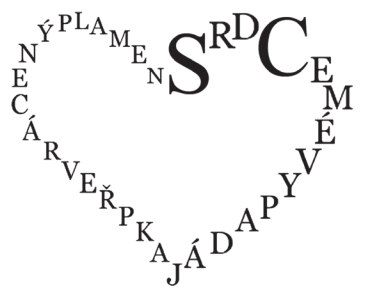

VÝCHOZÍ TEXT K ÚLOHÁM 1–5
====

Když v anketě Sportovec roku 2023 vyhrála tenistka Markéta Vondroušová, nebylo 
divu – poslední dobou jsou totiž u nás v individuálních sportech úspěšnější ženy. 
Získávají víc medailí než muži a hvězdné výkony Ester Ledecké nebo Martiny Sáblíkové 
**přitáhly** k ženskému sportu spoustu fanoušků. Jeho popularita ostatně strmě roste i ve 
světě. K tomuto vzestupu ale vedla stovky let trvající cesta. Pro ženský sport bylo nutné 
především získat veřejnost, značně ***** předsudky. Například že ženské tělo je pro sport 
křehké nebo že sportování způsobí ženám neplodnost. Ještě na počátku 20. století tvrdil 
zakladatel moderního olympismu Pierre de Coubertin, že jedinou úlohou žen ve sportu 
je zdobit vavřínovou snítkou hlavy mužských vítězů.

K vyvrácení takových mýtů přispěla i Alfonsina Strada. Letos je tomu 100 let, co se jako 
jediná žena v historii zúčastnila Giro d’Italia. Na tomto cyklistickém závodě smějí tradičně 
startovat jen muži, proto se Strada přihlásila pod mužským jménem Alfonsin. Pořadatelé 
její identitu sice odhalili, nakonec jí však **povolili** na trasu dlouhou 3 613 km **vyrazit**. 
V prvním týdnu konkurovala Strada soupeřům, a to i v etapách  horskými průsmyky. 
Pak ale **přišel** nečekaný zvrat. Osmý den se přihnala sněhová vánice, v níž cyklistka 
několikrát havarovala. Při jednom pádu dokonce zlomila řídítka. __Na jejich místo ale 
zastrčila násadu od koštěte a etapu dokončila.__ A poté i celý závod – 12. ročník Gira přitom 
zvládlo kromě ní jen 30 závodníků z původních 90. Po dojezdu do Milána oslavovaly 
„Ďábla v sukni“ (tak se Alfonsině přezdívalo) davy fanoušků.

DÍKY odvaze Alfonsiny Strady a dalších sportovkyň (například Kathrine Switzer, která 
byla napadena, když roku 1967 běžela Bostonský maraton) se přístup k ženskému sportu 
začal měnit. Do dějin se zapsala olympiáda roku 2012 v Londýně, na niž poprvé každý 
z účastnických států vyslal soutěžit alespoň jednu ženskou reprezentantku. Pokud bude 
příznivý trend pokračovat, sportovkyně se snad dočkají i lepšího ohodnocení své práce.

(*inspirováno články v časopisech Respekt a 100+1 zahraniční zajímavost*)

# 1 Rozhodněte o každém z následujících tvrzení, zda jednoznačně vyplývá z výchozího textu (A), či nikoli (N).
 

## 1.1 Z českých sportovkyň získala jen Ester Ledecká víc medailí v individuálních sportech než Martina Sáblíková. 
## 1.2 Na 12. ročníku závodu Giro d’Italia, dlouhém přes tři tisíce kilometrů, skončila Alfonsina Strada na 31. místě.  
## 1.3 Na olympiádě roku 2012 v Londýně závodily v každé soutěži ženské reprezentantky všech účastnických států. 
## 1.4 Alfonsina Strada absolvovala závod Giro d’Italia v témže století, ve kterém byla při běhu Bostonského maratonu napadena Kathrine Switzer. 
# 2
## 2.1 Napište náležitý spisovný tvar přídavného jména *ovlivněný*, který patří na první vynechané místo (*****) ve výchozím textu.
## 2.2 Napište náležitý spisovný tvar přídavného jména *vedoucí*, který patří na druhé vynechané místo () ve výchozím textu.
(Po doplnění náležitého tvaru slova musí být příslušný větný celek pravopisně 
i gramaticky správný a smysluplný.)

# 3 Které z následujících tvrzení o slovech tučně vyznačených ve výchozím textu je pravdivé?
- [A] Slova *přitáhnout* a *povolit* jsou v textu antonymy, totéž platí i pro dvojici slov 
*vyrazit* – *přijít*.
- [B] Slova *přitáhnout* a *povolit* nejsou v textu antonymy, totéž platí i pro dvojici slov 
*vyrazit* – *přijít*.
- [C] Slova *přitáhnout* a *povolit* jsou v textu antonymy, slova *vyrazit* a *přijít* však 
v tomto textu antonymy nejsou.
- [D] Slova *přitáhnout* a *povolit* nejsou v textu antonymy, slova *vyrazit* a *přijít* však 
v tomto textu antonymy jsou.
# 4 Které z následujících tvrzení o úseku podtrženém ve výchozím textu je pravdivé?
- [A] V tomto úseku jsou všechna slova spisovná.
- [B] V tomto úseku je nespisovné pouze jedno slovo, a to *koště.*
- [C] V tomto úseku je nespisovné pouze jedno slovo, a to *zastrčit.*
- [D] V tomto úseku jsou nespisovná dvě slova, a to *zastrčit* a *koště*.
# 5 Které z následujících tvrzení je pravdivé?
(Posuzovaný výraz pochází z posledního odstavce výchozího textu a je v něm zapsán 
velkými písmeny.)
- [A] Výraz *díky* je vždy ohebným slovem, je jím tedy i ve výchozím textu.
- [B] Výraz *díky* je vždy neohebným slovem, je jím tedy i ve výchozím textu.
- [C] Výraz *díky* je ve výchozím textu neohebným slovem, v jiném kontextu však může 
být slovem ohebným.
- [D] Výraz *díky* je ve výchozím textu ohebným slovem, v jiném kontextu však může 
být slovem neohebným. 
# 6 Přiřaďte k jednotlivým větným celkům (6.1−6.3) možnost (A–E), jíž lze nahradit podtržený úsek tak, aby význam příslušného větného celku zůstal zachován.
(Každou možnost z nabídky A–E lze přiřadit maximálně jednou.)
## 6.1 Vstup na lávku pro pěší je zakázán __v případě dlouhotrvajících silných dešťů__.
## 6.2 V kraji zatím nehrozí neúroda obilí __navzdory dlouhotrvajícím silným dešťům__.
## 6.3 Hladina řeky bude nadále stoupat __následkem dlouhotrvajících silných dešťů__.
- [A] , takže dlouho vydatně prší
- [B] , ledaže dlouho vydatně prší
- [C] , jestliže dlouho vydatně prší
- [D] , protože dlouho vydatně prší
- [E] , přestože dlouho vydatně prší

# 7 Rozhodněte o každém z následujících větných celků, zda je zapsán pravopisně správně (A), či nikoli (N).

## 7.1 Obě kočky, které bratři přinesli z útulku, se schovávali ve stinném koutě. 
## 7.2 Po podnikatelově smrti vytvořili pozůstalí plán, jak postupně oddlužit firmu. 
## 7.3 Občané svými protesty docílili toho, že se rodinné komunitní centrum nezruší. 
## 7.4 Překupníci, po nichž se pátrá, v tajné skrýši schraňovali obrazy a jiné cennosti. 
 
VÝCHOZÍ TEXTY K ÚLOHÁM 8–11
===

**TEXT 1**

> (**1**) Otrokem jsem zplozen, \
>  otrokyní zrozen,\
>  kolébavkou býval\
>  děcku pouta chřest,\
>  po můj život celý\
>  okov zrezavělý\
>  ve dne v noci zníval\
>  pustinou mých cest.\
> \
>  Rost jsem, otrok chabý,\
>  mezi bratry raby,\
>  za šperk okov zvonil\
>  sestrám u boků,\
>  a kam zřel jsem kolem\
>  s hanbou, hněvem, bolem,\
>  do prachu leb klonil\
>  národ otroků.\
> \
> (**2**) A přec oko časem\
>  plachým svitlo jasem,\
>  napínal jsem ucho\
>  za les, za vody;\
>  mnil jsem, že tam kdesi\
>  jásá pod nebesy,\
>  letí v naše hlucho\
>  píseň svobody.\
> \
> (**3**) Ale jak se vznesla,\
>  hlava zase klesla,\
>  znova v hanbě, hoři\
>  rok šel za rokem…\
>  V šíji dosud jarmo\
>  a zrak čeká darmo\
>  vykoupení v zoři – \
>  zemru otrokem!\
> \
> (**4**) Již se vaz můj chýlí, \
>  na skráni vlas bílý, \
>  naděje už v temnou \
>  jeseň nekynou,\
>  že mé ruce spjaté \
>  setřesou jho klaté –\
>  vím, že pouta se mnou\
>  v hrobě spočinou.\
> \
> Vysvětlivky: *rab* – otrok; *jarmo, jho* – část dobytčího postroje, přen. útlak; *mnít* – domnívat se; *jeseň* – podzim\
> (*Svatopluk Čech, úryvek ze sbírky Písně otroka, upraveno*)\

**TEXT 2**

> Rýmují-li se v básni dva verše končící různými slovy, z nichž jedno slovo je celé obsaženo 
> v tom druhém, vzniká **rýmové echo**, např. *a na topole podle __skal__* / *zelený mužík zatle__skal__*. 
> 
> (*CZVV*)

# 8 Vypište z __první části__ TEXTU 1 předložku, která v textu vyjadřuje časové rozpětí (*jak dlouho*).
# 9 Které z následujících tvrzení odpovídá TEXTU 1?
- [A] Lyrický subjekt v určité fázi svého života už nedoufal, že by se někdy mohl stát 
svobodným.
- [B] Lyrický subjekt nemohl v dětství často usnout, protože byl přikován ke kolébce 
chřestícími pouty.
- [C] Lyrický subjekt navrhuje, že obětuje svůj zrak, pokud bude výměnou za tuto 
oběť vykoupen z otroctví.
- [D] Lyrický subjekt sděluje, že jeho sestrám byly odcizeny šperky a na boky jim byly 
místo ozdob připevněny okovy.
# 10 Které z následujících tvrzení o __druhé a třetí části__ TEXTU 1 je pravdivé?
(Úlohu řešte na základě definice uvedené v TEXTU 2.)
- [A] Rýmové echo se vyskytuje jak v druhé, tak ve třetí části textu.
- [B] Rýmové echo se nevyskytuje ani v druhé, ani ve třetí části textu.
- [C] Rýmové echo se vyskytuje v druhé, nikoli však ve třetí části textu.
- [D] Rýmové echo se vyskytuje ve třetí, nikoli však v druhé části textu.
# 11 
**Medailonek:** Svatopluk Čech patřil k ruchovcům (skupině umělců, která kladla důraz 
na národní uvědomění v literatuře), tvořil převážně v 2. polovině 19. století a kromě 
poezie psal i prózy, např. *Pravý výlet pana Broučka do Měsíce*.
 
**Jsou všechny informace o Svatopluku Čechovi ve výše uvedeném medailonku 
pravdivé?**
- [A] Ano, všechny tyto informace jsou pravdivé.
- [B] Ne – aby byly pravdivé, je nutné slovo *ruchovci* nahradit slovem *májovci*.
- [C] Ne – aby byly pravdivé, je nutné časový údaj *19. století* nahradit údajem *20. století*.
- [D] Ne – aby byly pravdivé, je nutné název díla *Pravý výlet pana Broučka do Měsíce* 
nahradit názvem díla *Noc na Karlštejně*.
# 12 Seřaďte jednotlivé části textu (A–E) tak, aby byla dodržena textová návaznost.
- [A] Stačily dva nebo tři údery ostrou hranou kamene a namísto skleněné tabulky 
zel prázdný prostor, do kterého vnořil paži. Uvolnil západku a okno se otevřelo 
dokořán. Vtom uslyšel Rhiannoniny kroky – blížila se zezadu kolem kaple.
- [B] Když si okno prohlédl, zmocnila se ho rozhodnost: měl by jednat raději hned, 
aby si to zas nerozmyslel. Seskočil dolů, hledal vhodný kámen, našel ho a znovu 
se vyšplhal na úzkou římsu pod oknem.
- [C] Vteřinku počkal, aby nabral dech, ještě jednou se vzepřel, odrazil se a už ležel 
na prkenné podlaze kaple uprostřed prachu a skleněných střepů.
- [D] Rychle vstal, oprášil si dlaně – neřízl se, dokonce si nezpůsobil ani žádné 
vážnější odřeniny – a pak sebevědomě vykročil směrem k hlavním dveřím.
- [E] Nepřál si, aby ho spatřila, jak nedůstojně zápasí s nohama komíhajícíma se ve 
vzduchu, a proto bez váhání vsoukal hlavu a ramena do otevřeného prostoru. 
Protáhl se skrz a zastavil se s rukama na vnitřním parapetu okna a s koleny 
bolestně zarytými do kovového rámu.

(*J. Wain, Zima v horách, upraveno*)

# 13 Která z následujících vět __není__ zapsána pravopisně správně?
- [A] Z médií se na mě snesla vlna kritiky.
- [B] Všechny povinnosti tu teď leží na mně.
- [C] O mě se v tom shonu nikdo moc nestaral.
- [D] Oba sousedovi synové se o mně tehdy ucházeli.

VÝCHOZÍ TEXT K ÚLOHÁM 14–18
====

> (**1**) Po roce 1848 procházela francouzská literatura proměnou. Témata a výrazové 
> prostředky romantismu (**z**ejména vznícená citovost a revoluční angažovanost) se již 
> přežily a vůdčím uměleckým směrem se stal *****, typický svými romány založenými na 
> zdánlivě objektivním pozorování skutečnosti. Na jednom z nejslavnějších, *Paní Bovaryové*, 
> tehdy pracoval . Poezie stála na rozcestí – vyšla dokonce stať pojednávající o tom, 
> proč o **ni** francouzské publikum už ztratilo zájem. To podnítilo některé literáty, aby hledali 
> nové podoby básnického výrazu. **Jejich** snahy vyvrcholily v roce 1866 vydáním sborníku 
> *Současný Parnas* – tvůrcům sdruženým kolem něj se začalo říkat parnasisté. Parnasistická 
> poezie vynikala silnou smyslovostí a vybroušenou formou.
> 
> V září roku 1871, když se pracovalo na druhém svazku *Současného Parnasu*, přivedl 
> Paul Verlaine na společnou večeři parnasistů Jeana Arthura Rimbauda, s nímž se nedávno 
> seznámil. Nováček tu přečetl báseň *Opilý koráb* a další své verše. Reakce spolustolovníků 
> lze vyjádřit jen slovy obdiv a úžas. Večeře se nemohl zúčastnit spisovatel Émile Blémont, 
> a tak se nám líčení oné události dochovalo v listu, který mu napsal přítel Léon Valade:
> 
> (**2**) „To jste přišel o mnoho. Pod patronátem Verlaina byl tu předveden strašlivý básník, 
> není mu ještě osmnáct. Velké ruce, absolutně dětská tvář, jaká se hodí tak k třináctiletému 
> chlapci, povaha spíš divoká než bojácná, tak vypadá ten kluk. Z jeho životopisu Vám teď 
> mnoho nepovím. Vězte ale, že je rozhodnut nikdy se nevrátit do rodného kraje. Přijďte 
> a uvidíte sám. Je to vzcházející génius.“
> 
> (**3**) Zájem o __dílo, které rozvířilo stojaté vody poezie__, ale záhy opadl. Zanedlouho byl 
> __mladík, o němž se s nadšením psalo v dopise__, pokládán za vyšinutého __člověka, jenž zavádí 
> poezii na nebezpečné cesty__. Ti nejshovívavější v něm viděli hvězdu, jež zazáří jen krátce, 
> __talent, který vmžiku shoří a navždy zapadne do nicoty__. Rimbaudovu hodnotu musely 
> objevit až další generace – pro mnoho moderních umělců se stal nedostižným vzorem.
> 
> (*Vzhledem k povaze jedné z úloh není zdroj výchozího textu uveden.*)

# 14 Ve kterém z úseků podtržených ve výchozím textu se __neuplatňuje__ obraznost?
- [A] dílo, které rozvířilo stojaté vody poezie
- [B] mladík, o němž se s nadšením psalo v dopise
- [C] člověka, jenž zavádí poezii na nebezpečné cesty
- [D] talent, který vmžiku shoří a navždy zapadne do nicoty
# 15 Na první vynechané místo (*****) ve výchozím textu patří správný název uměleckého směru, na druhé () patří správné jméno autora románu *Paní* *Bovaryová*. Ve které z následujících možností jsou uvedeny obě tyto informace?
- [A] realismus – Gustave Flaubert
- [B] realismus – Alexandre Dumas
- [C] klasicismus – Gustave Flaubert
- [D] klasicismus – Alexandre Dumas

# 16 Rozhodněte o každém z následujících tvrzení, zda jednoznačně vyplývá z výchozího textu (A), či nikoli (N).
 
## 16.1 Úspěch *Paní Bovaryové* a dalších románů způsobil, že se roku 1848 francouzská literatura proměnila. 
## 16.2 Každý z parnasistů, kteří si na večeři v září 1871 vyslechli báseň *Opilý koráb*, řekl Jeanu Arthuru Rimbaudovi osobně, jak toto jeho dílo obdivuje. 
## 16.3 *Opilý koráb* a další básně Jeana Arthura Rimbauda se dochovaly pouze v listu, jehož součástí bylo vylíčení večeře parnasistů ze září roku 1871. 
## 16.4 Zatímco o vydání prvního svazku *Současného Parnasu* se básníci snažili od roku 1848 až do roku 1866, práce na jeho druhém svazku trvala jen pět let. 
# 17 Které z následujících tvrzení o zájmenech *ni* a *jejich*, tučně vyznačených v __první části__ výchozího textu, je pravdivé?
- [A] První zájmeno odkazuje ke slovu *stať*, druhé ke slovnímu spojení *nové podoby.*
- [B] První zájmeno odkazuje ke slovu *stať*, druhé ke slovnímu spojení *někteří literáti.*
- [C] První zájmeno odkazuje ke slovu *poezie*, druhé ke slovnímu spojení *nové podoby.*
- [D] První zájmeno odkazuje ke slovu *poezie*, druhé ke slovnímu spojení *někteří literáti.*
# 18 Které z následujících tvrzení nejlépe vystihuje __druhou část__ výchozího textu?
- [A] Jde o pasáž z textu adresovaného Léonu Valadovi, která obsahuje stručnou 
biografii Jeana Arthura Rimbauda.
- [B] Jde o pasáž z textu adresovaného Émilu Blémontovi, která obsahuje stručnou 
biografii Jeana Arthura Rimbauda.
- [C] Jde o pasáž z textu adresovaného Léonu Valadovi, která obsahuje stručnou 
charakteristiku Jeana Arthura Rimbauda.
- [D] Jde o pasáž z textu adresovaného Émilu Blémontovi, která obsahuje stručnou 
charakteristiku Jeana Arthura Rimbauda.

VÝCHOZÍ TEXTY K ÚLOZE 19
=====

**TEXT 1**
> rtěnka\
> trávník\
> sušák\
> horečka\
> vrtulník\
> palčák\
> hloubka\
> budík\
> slamák\
> škrabka\
> holubník\
> severák
**TEXT 2**
> **Názvy prostředků** (např. *rydlo*) jsou utvořeny od sloves a pojmenovávají věci, které 
> slouží jako nástroj nějaké činnosti (např. rydlo slouží jako nástroj rytí). 
>
> (*Mluvnice češtiny 1, upraveno*)

# 19 Vypište z TEXTU 1 tři názvy prostředků.
(Úlohu řešte na základě definice uvedené v TEXTU 2. Za chybu je považováno jak 
neuvedení hledaného slova, tak zapsání jakéhokoli slova, které neodpovídá zadání.)

VÝCHOZÍ TEXTY K ÚLOHÁM 20–26
====

**TEXT 1**
> (**1**) Tyler a já jsme se stali sabotéry hostin. K hostině totiž klienti dostanou i personál: 
> jídlo a služby na jednom účtu. Na takových akcích se spropitné nedává, jsi pro ně jen šváb.
> 
> Kdysi Tyler pracoval jako číšník na hostině ve vile podobné prosklenému obláčku, jenž 
> se vznáší nad městem. Právě byl naservírován rybí chod a Tyler oplachuje talíře od prvního, 
> těstovinového chodu. Do kuchyně vchází hostitelka a mává kusem papíru. Ten povlává 
> jako **vlajka**, tak moc se jí třese ruka. Madam PROCEDÍ skrz zaťaté zuby, zda číšníci neviděli 
> někoho z hostů proklouznout nenápadně __chodbou__ k ložnici. Zvlášť některou z **dam**. 
> 
> Tyler k ní vzhlédne, ostatní číšníci dál myjí nádobí. Pomocný kuchař Leslie se věnuje 
> chodu, který je podle menu na řadě: podlévá plněné artyčoky **máslem**. Když se nikdo 
> z tázaných nemá k odpovědi, řekne Tyler:
> 
> (**2**) „Do té části domu nesmíme. Přijdeme garáží a máme vidět jen kuchyň a jídelnu.“
> 
> Vtom vstoupí hostitel a vezme ženě z ruky ten **cár** papíru. „To bude v pořádku,“ říká.
> 
> „Jak můžu jít mezi ty lidi,“ vyhrkne madam, celá rozrušená, „když nevím, kdo to 
> udělal?“ Hostitel jí položí dlaň na záda bílých šatů, barevně sladěných s domem, a žena 
> se narovná – jednoduché gesto způsobí, že je najednou klidná.
> 
> (**3**) „Jsou to naši hosti,“ říká hostitel, „a tenhle večírek je důležitý.“ Pak už mu stačí 
> manželku jen trochu postrčit, načež odejdou zpátky do jídelny. Když procházejí létacími 
> dveřmi, závan vzduchu dožene Tylerovi k nohám vzkaz, odhozený na podlahu.
> 
> „Co se tam píše?“ ptá se Albert, jeden z číšníků. Tyler ani nezvedne papír a odpoví: 
> „__Vpravila jsem něco moči nejméně do jednoho z vašich četných parfémů__.“
> 
> Albert se usmívá: „Tys jí dal moč do voňavky?“
> 
> „Jen jsem nechal ten lístek mezi lahvičkami v koupelně – má jich tam asi sto,“ říká Tyler.
> 
> „Takže vlastně nedal?“
> 
> „Ne, ale to ona neví.“
> 
> (*Ch. Palahniuk, Klub rváčů, upraveno*)

**TEXT 2**
> **Podstatné jméno typu A** (např. *duše*) – ve všech tvarech tohoto podstatného jména má 
> kořen stejnou podobu.
> 
> **Podstatné jméno typu B** (např. *práce*) – v některých tvarech tohoto podstatného jména 
> obsahuje kořen dlouhou samohlásku (*práci*) a v některých krátkou (*pracemi*).
>
> (*CZVV*)

# 20 Rozhodněte o každém z následujících tvrzení, zda jednoznačně vyplývá z TEXTU 1 (A), či nikoli (N).
## 20.1 Lístek se vzkazem, jehož znění Tyler znal, odhodila na podlahu hostitelka. 
## 20.2 Při hostině vnikla jedna z dam do hostitelčiny ložnice, což vyvolalo rozruch. 
## 20.3 Rybí chod se na hostině podával později než těstovinový, ale dříve, než byly na řadě plněné artyčoky. 
## 20.4 Tyler se rozhodl neříct hostitelce pravdu o jejích parfémech, protože mu tato dáma odmítla dát očekávané spropitné. 
# 21 Vypište z __druhé části__ TEXTU 1 dvě podstatná jména, která jsou v textu užita ve stejném pádě a čísle jako slovo *talíře* v úseku *Tyler oplachuje talíře*. 
(Za chybu je považováno jak neuvedení hledaného slova, tak zapsání jakéhokoli 
slova, které neodpovídá zadání.) 

# 22 Které z následujících slov je tvarem podstatného jména typu B?
(Posuzovaná slova jsou v TEXTU 1 vyznačena tučně. Úlohu řešte na základě definic 
uvedených v TEXTU 2. Posuzujte pouze spisovné tvary podstatných jmen.) 
- [A] vlajka
- [B] dam
- [C] máslem
- [D] cár
# 23 
**Tvrzení**: Těsně předtím, než hostitel vstoupil do kuchyně, se v ní nacházel Tyler a *****.
 
**Kterou z následujících možností je nutné doplnit na vynechané místo (*****) ve výše uvedeném tvrzení, aby toto tvrzení odpovídalo TEXTU 1?**
- [A] celkem dvě další postavy, z nichž jedna pracovala na hostině jako číšník
- [B] celkem tři další postavy, z nichž nejméně dvě pracovaly na hostině jako číšníci
- [C] alespoň tři další postavy, přičemž pouze jedna postava pracovala na hostině jako číšník
- [D] alespoň čtyři další postavy, přičemž nejméně dvě postavy pracovaly na hostině jako číšníci
# 24 Které z následujících tvrzení o větném členu *chodbou*, podtrženém v __první části__ TEXTU 1, je pravdivé?
- [A] Tímto větným členem je v příslušné větě rozvit větný člen *z hostů*. 
- [B] Tímto větným členem je v příslušné větě rozvit větný člen *proklouznout*.
- [C] Tímto větným členem je v příslušné větě rozvit větný člen *nenápadně*.
- [D] Tímto větným členem je v příslušné větě rozvit větný člen *k ložnici*.
# 25 Ve které z následujících možností je význam slova *něco* nejpodobnější významu, jejž má toto slovo ve větě podtržené ve __třetí části__ TEXTU 1?
- [A] Šla si koupit něco k jídlu.
- [B] Z toho chlapce něco bude.
- [C] Zbylo mu aspoň něco peněz.
- [D] Dozvěděli se o ní něco hrozného.
# 26 Které z následujících tvrzení o slově zapsaném v TEXTU 1 velkými písmeny je pravdivé?
- [A] Toto slovo není expresivní ani v daném kontextu, ani v souvětí *Když táta vaří tuhle* 
*omáčku, procedí do ní šťávu z citrónu*.
- [B] Toto slovo je v daném kontextu expresivní, stejně jako v souvětí *Když táta vaří* 
*tuhle omáčku, procedí do ní šťávu z citrónu*.
- [C] Toto slovo není v daném kontextu expresivní, v souvětí *Když táta vaří tuhle omáčku,* 
*procedí do ní šťávu z citrónu* však expresivní je. 
- [D] Toto slovo je v daném kontextu expresivní, v souvětí *Když táta vaří tuhle omáčku,* 
*procedí do ní šťávu z citrónu* však expresivní není.

VÝCHOZÍ TEXT K ÚLOHÁM 27–30
====

> Není mnoho výrobků českého původu, které by si získaly oblibu v zahraničí. 
> Určitě k nim ale patří __samozavlažovací__ nádoby na rostliny. Toto zařízení vynalezl lékař 
> Tomáš __Syrovátka__, patentováno bylo v dubnu 1982 a první __samozavlažovací__ květináč 
> byl vyroben v roce 1984 v obci __Vyskeř__. O působivé novince z Československa pak 
> informovaly časopisy nejen v evropských zemích, ale také v USA či Indii a květináče se 
> brzy rozšířily do celého světa.
> 
> A v čem spočívá princip těchto květináčů? Jedná se o dvě vzájemě propojené 
> plastové nádoby: do té **spodní**, v níž jsou zásoby vody, je vložena druhá nádoba se 
> zeminou a rostlinami. Vláha do půdy průběžně vzlíná pomocí knotů. Zajištěno je 
> i provzdušnění, a to pomocí horizontální vzduchové mezery pod vrstvou zeminy. Vodní 
> režim __samozavlažovacích__ nádob se podobá volné přírodě tím, že půda udržuje **trvalé** 
> množství vlhkosti. 
> 
> __Samozavlažovací__ truhlíky umožnily pěstovat na terasách, okenních římsách i uvnitř 
> bytů náročnější bylinné druhy, či dokonce ovocné stromy. Střídání __přemokření__ 
> a vysichání hlíny totiž řadě rostlin nesvědčí, proto většinou v **běžných** truhlících 
> neprozpívají. Dostatečná vlhkost je i spolehlivou ochrannou proti **prudkému** slunci. Aby 
> vás ale název „__samozavlažovací__“ nespletl – vodu musíte doplnit jen jednou za několik 
> týdnů, nicméně nádoba si ji sama neobstará. Kdo však ví, kam nás jednou pokrok zavede…
> 
> Vysvětlivka: *knot* – pruh textilie, který ponořeným koncem nasaje kapalinu a umožní tak její pohyb vzhůru
> 
> (*Biblio 6/2009; www.bydleni.cz, upraveno*)

# 27 Najděte ve výchozím textu čtyři slova, která jsou v něm zapsána s pravopisnou chybou, a napište je pravopisně správně. 
(Slova zapište bezchybně; ohebná slova zapište ve stejném tvaru, v němž jsou 
užita v textu. Za chybu je považováno jak neuvedení hledaného slova, tak zapsání 
jakéhokoli slova, které neodpovídá zadání. Podtržená slova jsou zapsána správně.)
# 28 Které z následujících tvrzení jednoznačně vyplývá z výchozího textu?
- [A] Součástí vynálezu doktora Syrovátky jsou knoty, které jednou za několik týdnů 
nasají vodu do nádoby s rostlinami.
- [B] Samozavlažovací květináč je jedním z mála původních českých vynálezů 
rozšířených a oblíbených v zahraničí.
- [C] Dva roky po získání patentu se samozavlažovací květináče začaly vyvážet z obce 
Vyskeř do evropských i mimoevropských zemí.
- [D] Ve volné přírodě, podobně jako v samozavlažovacích nádobách, je vodní režim 
udržován horizontální vzduchovou mezerou pod vrstvou zeminy.
# 29 
**Tvrzení č. 1**: V druhém odstavci výchozího textu se vyskytuje mj. popis předmětu 
(tj. věci, nikoli větného členu).
 
**Tvrzení č. 2**: Ve třetím odstavci výchozího textu se vyskytují jazykové prostředky, 
jejichž účelem je navázat kontakt se čtenářem.
 
**Odpovídá alespoň některé z výše uvedených tvrzení výchozímu textu?**
- [A] Ne, žádné z těchto tvrzení.
- [B] Ano, každé z těchto tvrzení.
- [C] Ano, pouze však tvrzení č. 1.
- [D] Ano, pouze však tvrzení č. 2.

# 30 Ve které z následujících možností je uvedena dvojice slov, jež __nelze__ v kontextu výchozího textu považovat za synonyma?
(První slovo z každé dvojice pochází z výchozího textu a je v něm vyznačeno tučně.)
- [A] spodní – dolní
- [B] trvalý – stálý
- [C] běžný – obyčejný
- [D] prudký – vznětlivý
# 31 Přiřaďte ke každému z následujících textů (31.1–31.4) možnost (A–F), která daný text nejlépe vystihuje.
(Každou možnost z nabídky A–F lze přiřadit maximálně jednou.) 
## 31.1
Čechy za oknem smutných duší\
obzore můj já vidím vás\
ze svého žalu nejčistěji\
až v hloubi jezer jež se chvějí\
Čechy za oknem smutných duší\
čekání dané na pospas

## 31.2
Ó blaze mně, můj duch že toho muže,\
jenž v chrámě živé paměti\
se bude věčně třpytěti,\
i rekovné i slavné činy může\
teď věrnou písní opěti.

## 31.3

## 31.4
Tou chvalořečí zpyšněl havran ješitný\
a zakrákoral: sýr mu vyklouz ze zobce,\
a už jej lišák držel. Dodá jízlivě:\
„Ach, nejsi němý, zvučný hlas máš, havrane!\
Máš všechno možné, všechno – jenom rozum ne.“

(*Vzhledem k povaze úlohy nejsou zdroje výchozích textů uvedeny.*) 

- [A] Text je sonetem: jeho forma odpovídá tomuto typu básně.
- [B] Text je úryvkem bajky: jeho obsah vykazuje znaky tohoto žánru.
- [C] Text je epigramem: jeho forma i obsah odpovídají tomuto žánru.
- [D] Text je kaligramem: jeho forma i obsah odpovídají tomuto typu básně.
- [E] Text je úryvkem ódy: jeho obsah i užitý jazyk vykazují znaky tohoto žánru.
- [F] Text je úryvkem elegie: jeho obsah i užitý jazyk vykazují znaky tohoto žánru.

VÝCHOZÍ TEXT K ÚLOZE 32 
===

> Bouře ho zastihla těsně pod vrcholem hory, na nějž ráno vystoupal do podhorského 
> městečka chtěl proto místo přes hřeben dojít raději údolím.

# 32 Které z následujících tvrzení o výchozím textu je pravdivé?
- [A] Text bude pravopisně správný a smysluplný, doplní-li se čárka těsně za slovo *vystoupal*.
- [B] Text bude pravopisně správný a smysluplný, doplní-li se čárka těsně za slovo *městečka*.
- [C] Text bude pravopisně správný a smysluplný, doplní-li se čárka těsně za slovo *chtěl*.
- [D] Text bude pravopisně správný a smysluplný, doplní-li se čárka těsně za slovo *hřeben*.