POSLECH - 1. ČÁST - ÚLOHY 1–4 
===

> Uslyšíte **čtyři** krátké nahrávky. Nejprve uslyšíte otázku a poté vyslechnete nahrávku. Na základě vyslechnutých nahrávek **vyberte** k úlohám **1–4** vždy jeden správný obrázek **A–D**.

# 1 Was machen Magda und Jürgen heute Nachmittag?
[audio](./audio/05%20CD%20Track.mp3)
- [A] 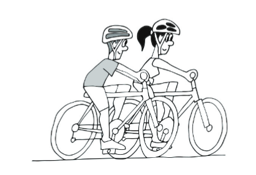
- [B] 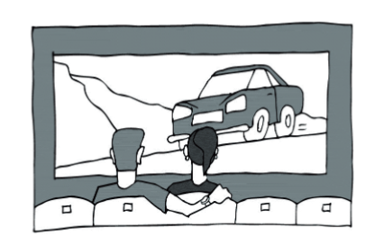
- [C] 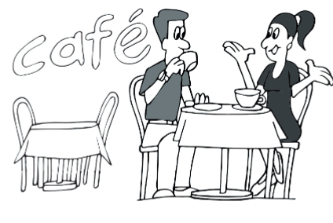
- [D] 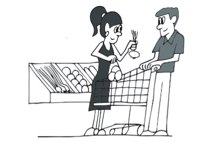
# 2 Wo hat Resi ihren Führerschein gefunden?
[audio](./audio/07%20CD%20Track.mp3)
- [A] 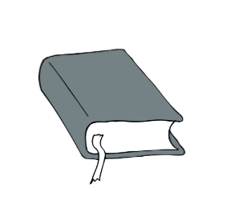
- [B] 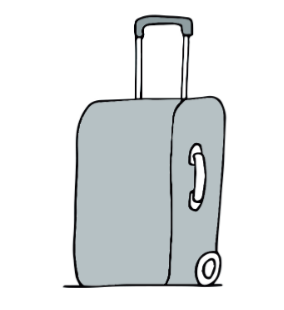
- [C] 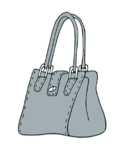
- [D] 
# 3 Welches Hotelzimmer hat der Mann gebucht?
[audio](./audio/09%20CD%20Track.mp3)
- [A] 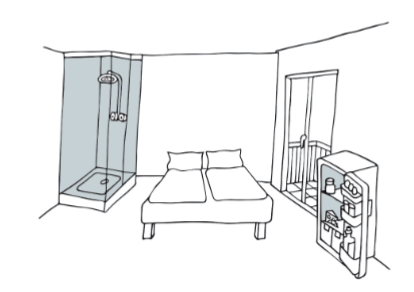
- [B] 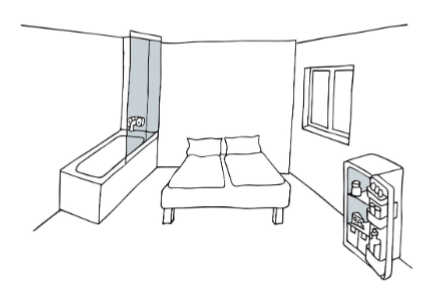
- [C] 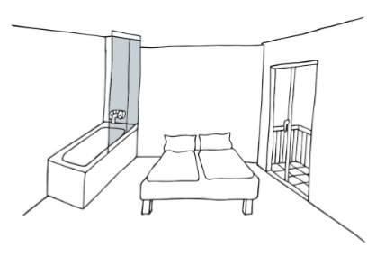
- [D] 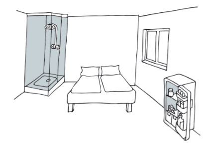
# 4 Was bereitet Dieter am Samstag zu?
[audio](./audio/11%20CD%20Track.mp3)
- [A] 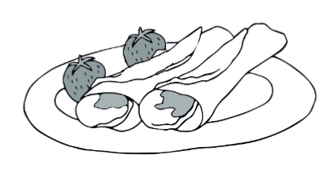
- [B] 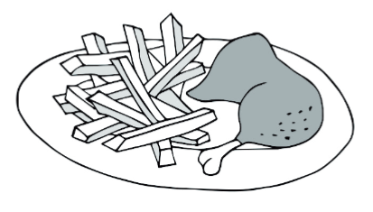
- [C] 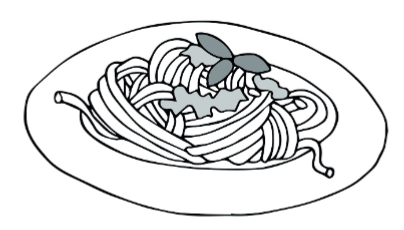
- [D] 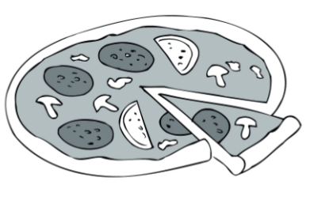

POSLECH - 2. ČÁST - ÚLOHY 5–12 
===
> Uslyšíte rozhovor mezi přáteli ve vlaku. Na základě vyslechnuté nahrávky **rozhodněte**, zda jsou tvrzení v úlohách **5–12 pravdivá (P)**, nebo **nepravdivá (N)**.
> 
> [audio](./audio/15%20CD%20Track.mp3)

# 5 Der Zug hat jetzt 15 Minuten Verspätung. 
# 6 Doris und Julian fahren in der 1. Klasse. 
# 7 Doris hat die Fahrkarte an der Kasse am Bahnhof gekauft. 
# 8 Doris stört es, wenn jemand im Zug telefoniert. 
# 9 Julian sagt, das Essen im Zug ist billig. 
# 10 Julian und auch Doris wollen Baguettes im Zug bestellen. 
# 11 Julian hat schon mal seinen Rucksack im Zug vergessen. 
# 12 Doris und Julian planen, in Dresden mit der Straßenbahn vom Bahnhof ins Konzert zu fahren. 

POSLECH - 3. ČÁST - ÚLOHY 13–20 
===
> Uslyšíte zaměstnance zoo hovořit k návštěvníkům v pavilonu žiraf. Na základě vyslechnuté nahrávky **odpovězte** v německém jazyce na otázky v úlohách **13–20**. V odpovědích použijte **nejvýše 3 slova**. Čísla můžete zapisovat číslicemi.
>
> [audio](./audio/21%20CD%20Track.mp3)

# 13 In welchem Jahr wurde das Haus der Giraffen eröffnet?
# 14 Wie viele Giraffen insgesamt gibt es zurzeit im Haus der Giraffen?
# 15 Wie heißt die jüngste Giraffe?
# 16 Um wie viel Uhr beginnt der Vortrag über Giraffen?
# 17 Was machen die Kinder im Wettbewerb?
# 18 Was ist der erste Preis im Wettbewerb für die Kinder?
# 19 Welcher ist der älteste Gegenstand in der Ausstellung *Afrika*?
# 20 Welches andere Tier lebt im Haus der Giraffen?

POSLECH - 4. ČÁST - ÚLOHY 21–24
===
> Uslyšíte **čtyři** krátké nahrávky. Nejprve uslyšíte otázku a poté vyslechnete nahrávku. Na základě vyslechnutých nahrávek **vyberte** k úlohám **21–24** vždy jednu správnou odpověď **A–D**.

# 21 An welchem Tag nächste Woche soll der Maler zu Anne und Bernd kommen?

[audio](./audio/26%20CD%20Track.mp3)-
- [A] am Montag
- [B] am Dienstag
- [C] am Mittwoch
- [D] am Donnerstag

# 22 Was schätzt Hans an seinem neuen Rucksack?

[audio](./audio/28%20CD%20Track.mp3)-
- [A] Sicherheit
- [B] Gewicht
- [C] Größe
- [D] Preis

# 23 Was sagt die Reporterin über die morgige Sonderausgabe der *Tassener Zeitung*?

[audio](./audio/30%20CD%20Track.mp3)-
- [A] Die Zeitung wird farbig sein.
- [B] Die Zeitung wird kostenlos sein.
- [C] In der Zeitung wird eine Beilage sein.
- [D] In der Zeitung wird ein Gespräch mit dem Chefredakteur sein.
# 24 Welche neue Fremdsprache lernt Filip ab dem nächsten Schuljahr?

[audio](./audio/32%20CD%20Track.mp3)-
- [A] Russisch
- [B] Spanisch
- [C] Italienisch
- [D] Französisch

ČTENÍ A JAZYKOVÁ KOMPETENCE - 5. ČÁST - ÚLOHY 25–29
===

Přečtěte si **pět** krátkých textů. Na základě informací v textech **vyberte** k úlohám **25–29** vždy 
jednu správnou odpověď **A–D**.

# 25 

> Kevin postete auf Facebook:
>
> Ich nahm an der Wissensshow *Wer wird Millionär* teil. Dabei kann man für jede richtig 
> beantwortete Frage Geld gewinnen. Je schwerer die Frage ist, desto höher ist die Summe. 
> Als die Show begann, war ich so nervös, dass ich Angst hatte, nichts zu gewinnen. Bei einer 
> falsch beantworteten Frage fällt man nämlich auf 0 Euro zurück. Da ich bei jeder Frage 
> an meinen Kenntnissen zweifelte, wollte ich schon nach der Frage für 500 Euro freiwillig 
> aufhören. Die Show verließ ich schließlich erst, nachdem ich die Frage für 8 000 Euro 
> richtig beantwortet hatte. Nach dem Ende der Show verriet mir der Moderator die Frage 
> für 16 000 Euro, die ich auch richtig beantwortet hätte und so die Summe 16 000 Euro 
> gewonnen hätte. Jedenfalls war mein Ergebnis besser, als 0 Euro zu gewinnen.
> (*CZVV*)

**Wie viel Euro gewann Kevin in der Wissensshow *Wer wird Millionär*?**
- [A] 0 Euro
- [B] 500 Euro
- [C] 8 000 Euro
- [D] 16 000 Euro

# 26 
> Emojis im *Ha-Chat* sind heutzutage sehr beliebt und im letzten Jahr gab es 
> in der Emoji-Liste viele Veränderungen. Um die Gewalt in der Gesellschaft zu 
> beschränken, wurden die Emojis mit Pistolen durch Emojis mit Wasserpistolen 
> ersetzt. Man kann aber erwarten, dass auch diese bald zu den verbotenen Emojis gehören 
> werden. Es gab auch Überlegungen, die Emojis mit Dreck zu verbieten. Ergebnisse von 
> vielen Untersuchungen aber zeigen, dass diese im positiven Sinne gebraucht werden, 
> und nicht gelöscht werden müssen. Zugleich wurde die Idee angenommen, den Leuten 
> zu ermöglichen, Emojis mit dem eigenen Gesicht zu machen. Diese Emojis hatten unter 
> den Benutzern gleich einen großen Erfolg. Obwohl es auch Bemühungen gab, Emojis mit 
> Filmfiguren einzuführen, sucht man sie in der Emoji-Liste im *Ha-Chat* vergeblich. Erst die Zeit 
> zeigt, wie es mit den Emojis weiter geht. 
> (*CZVV*)

**Was ist im letzten Jahr mit den Emojis im *Ha-Chat* passiert?**
- [A] Emojis mit Dreck wurden verboten.
- [B] Emojis mit Filmfiguren wurden eingeführt.
- [C] Emojis mit Wasserpistolen wurden verboten.
- [D] Emojis mit dem Gesicht der Benutzer wurden eingeführt.

# 27 
> ...\
> Touristen auf Bali sind wegen der Affen nicht mehr sicher. Die Affen haben bemerkt, dass 
> sie an Touristen verdienen können. Sie nehmen ihnen Wertsachen weg und geben sie nur 
> zurück, wenn sie dafür Futter bekommen. Dieses Verhalten der Affen weckte das Interesse 
> der Wissenschaftlerin Judith Opitz. Sie untersuchte, wie aus Affen Diebe werden. Die Studie 
> zu beenden war für sie ein echtes Leiden, da sie von den Affen sehr oft bestohlen wurde. 
> Deshalb musste sie die Polizei um Hilfe bitten. Für Wissenschaftler ist das von Judith Opitz 
> beschriebene Verhalten der Affen eine Sensation, denn so ein Handel ist für die Tierwelt 
> unüblich. Weniger begeistert von dem Verhalten der Tiere sind die Touristen, die darum 
> immer öfter auf einen Urlaub auf Bali verzichten. Sogar die Ämter von Bali finden es nötig, 
> Polizisten bald an bestimmte Orte zu schicken, um die Touristen zu schützen. Dann wird das 
> Interesse der Touristen für Bali hoffentlich wieder größer.
> (*www.focus.de, upraveno*)

**Welche Überschrift passt am besten zu dem Text?**
- [A] Polizeischutz für Affen auf Bali notwendig
- [B] Balis Affen leiden wegen der Wissenschaft
- [C] Balis Affen zwingen Touristen Geschäfte zu machen
- [D] Steigendes Interesse der Touristen für Affen auf Bali

# 28 
> Peter, Fan der Band *Silbermond*, postete in seinem Blog: 
> Wegen meinen Sorgen, dass die Tickets für die diesjährige Tour der Band *Silbermond* schnell 
> ausverkauft sind, kaufte ich mir am ersten Verkaufstag eins für das Konzert in Köln. Obwohl 
> es kurz vor jedem Konzert noch ein paar Tickets gab, war ich froh, dass ich mein Ticket 
> rechtzeitig gekauft hatte, anders hätte ich es nicht so günstig bekommen. Vor Ort waren die 
> Tickets nämlich zu teuer. Ich war nur traurig, dass die diesjährige Tour der Band *Silbermond* 
> ohne Konzert in Düsseldorf bleibt. Ich hatte nämlich ein Konzert in Düsseldorf, meiner 
> Heimatstadt, erwartet. Noch enttäuschter war ich aber, als das Konzert in Köln begann. 
> *Silbermond* spielte nur neue Songs, die ich nicht mag. Fast bis zum Ende habe ich keines 
> meiner Lieblingslieder gehört, erst das letzte war eins von meinen Lieblingsliedern.
> (*www.spiegel.de, upraveno*)

**Warum war Peter von der diesjährigen Tour der Band *Silbermond* enttäuscht?**
- [A] *Silbermond* hatte kein Konzert in Düsseldorf.
- [B] Sein Ticket für Kölner Konzert *Silbermond* war zu teuer.
- [C] *Silbermond* spielte in Köln keines seiner Lieblingslieder.
- [D] Alle Tickets für die Tour *Silbermond* waren schnell ausverkauft.

# 29 
> Im Guinnessbuch gibt es viele Kuss-Rekorde. Der längste Kuss-Marathon fand in Brasilien 
> statt. Brasilianer sind deshalb in diesem Buch als die größten Kussliebhaber bezeichnet. 
> Auch der Kuss-Rekord der Deutschen fehlt im Guinnessbuch nicht. Der Deutsche Uwe küsste 
> in Berlin 111 Frauen in einer Minute. Um einen Rekord im Küssen bemühten sich auch die 
> Italiener. Marco aus Rom küsste seine Freundin unter Wasser und sie wurden mit ihrem 
> 2-Minuten-Kuss bekannt. Diesen Rekord sucht man ohne Erfolg im Guinnessbuch, denn 
> genau eine Sekunde länger schaffte es der Japaner Tomio, seine Freundin zu küssen, und ist 
> dank dieses Kuss-Rekords unter Wasser in dem Buch angegeben.
> (*www.spiegel.de, upraveno*)

**Welcher Kuss-Rekord steht __nicht__ im Guinnessbuch?**
- [A] Rekord der Italiener
- [B] Rekord der Japaner
- [C] Rekord der Brasilianer
- [D] Rekord der Deutschen

ČTENÍ A JAZYKOVÁ KOMPETENCE - 6. ČÁST - ÚLOHY 30–39

Přečtěte si tvrzení v úlohách 30–39 a informační text o lyžařském středisku Grindelwald 
ve Švýcarsku. Na základě informací v textu rozhodněte, zda jsou tvrzení pravdivá (P), nebo 
nepravdivá (N).
 
# 30 Die Jungfrau-Region ist seit dem Jahr 2000 in der UNESCO-Liste. 
# 31 Das Skigebiet Grindelwald hat die größte Fläche in der Jungfrau-Region. 
# 32 Man muss den Skikurs für den März im Voraus reservieren. 
# 33 Der erste Sieger beim *World Snow Festival* war der japanische Künstler Takashi. 
# 34 Beide Schlittenwege^1^ können kleine Kinder allein herunterfahren. 
# 35 Bis zum Start der beiden Schlittenwege kann man mit öffentlichen Verkehrsmitteln kommen. 
# 36 Den längsten Schlittenweg der Welt kann man in 30 Minuten herunterfahren. 
# 37 Das Ziel der beiden Schlittenwege ist an derselben Stelle in Grindelwald. 
# 38 Alle ausgeliehenen Schlitten^2^ kann man nur bei Intersport in Grindelwald zurückgeben. 
# 39 Vor den Yeti-Hütten kann man auch im Winter parken. 

^1^ der Schlittenweg: sáňkařská dráha\
^2^ der Schlitten: sáňky

ČTENÍ A JAZYKOVÁ KOMPETENCE - 6. ČÁST - ÚLOHY 30–39
===

**Willkommen im Skigebiet Grindelwald!**

Grindelwald befindet sich in der Jungfrau-Region, die durch ihre schöne Natur bekannt ist. 
Schon im Jahr 2000 war es sicher, dass diese Region gleich im folgenden Jahr in die UNESCO-
Liste aufgenommen wird.

Grindelwald ist ein Ferienparadies für alle, die im Winter gern aktiv sind. Obwohl es wegen 
seiner Fläche hinter einigen Skigebieten in der Jungfrau-Region zurückbleibt, bietet 
Grindelwald die größte Auswahl an Winteraktivitäten an. 

Nach Grindelwald kommen viele Skifahrer, deshalb sind die Skikurse oft voll. Aus diesem 
Grund ist es notwendig, für den Februar und vor allem für den März einen Skikurs im Voraus zu 
buchen. Ohne diese Reservierung geht es nicht, an den Skikursen teilzunehmen.

Grindelwald ist auch für den Wettbewerb *World Snow Festival* bekannt. Dieser entstand dank 
des japanischen Künstlers Takashi, der hier 1983 eine riesige Schneefigur baute. Ein Jahr später 
kamen Künstler aus anderen Ländern nach Grindelwald, um ihre „Schneekunst“ zu zeigen. In 
diesem Jahr hat Takashi dem ersten Sieger den Preis gegeben. Beim *World Snow Festival* erhält 
der Sieger immer eine Glasfigur, die das Werk Takashis von 1983 darstellt. 

Und was ist die größte Attraktion? In Grindelwald gibt es den längsten Schlittenweg^1^ der Welt! 
Sehr beliebt ist aber auch der kürzere Grüne Schlittenweg:

**Grüner Schlittenweg**
Dieser Schlittenweg ist vor allem 
bei Erwachsenen sehr beliebt. 
Auch wenn es hier schwierigere 
Abschnitte gibt, können kleine 
Kinder diesen Schlittenweg allein 
herunterfahren. Die Besucher 
entscheiden selbst, wie sie 
zum Start des Schlittenwegs 
kommen. Sie können den Start des 
Schlittenwegs zu Fuß erreichen, 
oder als öffentliches Verkehrsmittel 
den Skibus wählen und zu diesem 
Ort damit hinauffahren. Dieser 
Schlittenweg beginnt an der 
Bushaltestelle, die sich in einer 
Höhe von 1800 Metern befindet. 
Von da fährt man auf dem Schlitten^2^ 
bis nach unten zum Ziel dieses 
Schlittenwegs an der Bushaltestelle 
*Gaggi Säge* in Grindelwald. 

**Der längste Schlittenweg der Welt** 
Obwohl dieser Schlittenweg das schönste 
Naturerlebnis bietet, ist er für kleine Kinder nicht zu 
empfehlen. Auf dem Weg gibt es mehrere gefährliche 
Abschnitte. Falls kleine Kinder trotzdem diesen Weg 
ohne eine andere Person herunterfahren, dann 
tragen die Eltern die Verantwortung dafür. Um zum 
Start dieses Schlittenwegs zu kommen, nimmt man 
zuerst als öffentliches Verkehrsmittel eine Bergbahn. 
Aber dann muss man den Schlitten noch zweieinhalb 
Stunden ziehen, bis man zum Start dieses 
Schlittenwegs in einer Höhe von 2680 Metern kommt. 
Dieser Schlittenweg ist 15 km lang. Durchschnittlich 
dauert die Fahrt nach unten eine Stunde, die 
Mutigsten jedoch brauchen für diese Fahrt nur die 
Hälfte der Zeit. Man muss aber nicht den ganzen 
Schlittenweg bis zum Ziel an der Bushaltestelle 
*Gaggi Säge* in Grindelwald herunterfahren. Man kann 
ihn an bestimmten Stellen verlassen und in den 
Bus einsteigen, der bis zur Bushaltestelle *Weidli* in 
Grindelwald fährt. 

**Weitere Dienste:**
Hast du keinen eigenen Schlitten? Dann besuche den Leihdienst. Den Schlitten leiht man 
sich oben am Berg bei Intersport aus und gibt ihn unten in Grindelwald bei Intersport wieder 
zurück. Den Leihdienst gibt es auch in den Grindelwaldbussen. Den Schlitten kann man also 
sowohl bei Intersport in Grindelwald, als auch in den Bussen zurückgeben. 

Für diejenigen, die in Grindelwald übernachten wollen, sind die Yeti-Hütten zu empfehlen. Die 
Yeti-Hütten befinden sich oben in den Bergen. Im Vergleich zu anderen Hütten in dieser Höhe, 
vor denen das Parken im Winter nicht möglich ist, ist dieses vor den Yeti-Hütten auch in dieser 
Jahreszeit erlaubt. Die Yeti-Hütten sind sehr beliebt und sollten rechtzeitig gebucht werden.

(*www.grindelwald.swiss.de, upraveno*)

---
^1^ der Schlittenweg: sáňkařská dráha\
^2^ der Schlitten: sáňky

ČTENÍ A JAZYKOVÁ KOMPETENCE - 7. ČÁST - ÚLOHY 40–44 
===
> Přečtěte si vypravování Petry o jejím pracovním životě. Na základě informací v textu **vyberte** k úlohám **40–44** vždy jednu správnou odpověď **A–D**.

…
Ich heiße Petra Steiner, komme aus dem malerischen Dorf Hallstatt und besitze seit einem 
halben Jahr die Buchhandlung *Jasmin* in Wien. Weil ich mir immer wünschte, mit Büchern zu 
arbeiten, wollte ich Sprachen studieren. Für Englisch wurde ich abgelehnt, für Deutsch wurde 
ich zwar aufgenommen, aber ich wollte keinesfalls nur diese Sprache studieren. Deshalb gab 
ich meine Träume vom Sprachenstudium auf und begann, mich für Marketing und Psychologie 
zu interessieren. Schließlich wurde ich zum Marketingstudium dank meiner guten Noten 
bei der Matura aufgenommen, für Psychologie fehlten mir ein paar Punkte. So kam es dazu, 
dass ich mich für das Marketingstudium angemeldet habe. Beim Studium und später auch 
im Job in einem Buchverlag waren meine Englischkenntnisse von großem Vorteil, da ich als 
Produktmanagerin für fremdsprachige Fachliteratur im Bereich Psychologie arbeitete.

Obwohl mir die Arbeit im Buchverlag gefiel, war es mein Ziel, eine eigene Buchhandlung zu 
haben. Diesen Traum erfüllte ich mir nach dem Studium – mit der Buchhandlung *Jasmin*. Das 
Geld dafür bekam ich von meiner Oma, die aber eine Bedingung hatte: Die Buchhandlung 
sollte mit ihrer Lieblingsblume Jasmin geschmückt werden. Das versprach ich ihr, obwohl 
ich eine andere Lieblingsblume habe. Meine Oma und ich wurden von der Buchhandlung 
*Julia* in unserem Lieblingsfilm beeinflusst. Die Buchhandlung in diesem Film ist nämlich mit 
Blumen dekoriert. Aber der Grund, warum meine Buchhandlung den Namen *Jasmin* trägt, 
ist mein Zweitname Jasmin. Die Blumendekoration passt somit wunderbar zum Namen der 
Buchhandlung. Davon ist auch meine Oma begeistert. Selbst sie hätte keinen besseren Namen 
gefunden, sagte sie. Ich bin ihr dankbar und hoffe, dass die Buchhandlung *Jasmin* mit ihrer 
Hilfe einmal so erfolgreich sein wird wie die Buchhandlung *Julia* in unserem Lieblingsfilm.

Der Anfang in Wien war für mich schwierig. Ich kannte hier niemanden und war mit der ersten 
Wohnung im Stadtviertel *Döbling* unzufrieden. Die Lage war zwar toll und zur Buchhandlung 
brauchte ich von *Döbling* nur eine Viertelstunde, aber mich störte dort der laute Verkehr. 
Deshalb suchte ich nach einer anderen Wohnung und drei Monate später fand ich eine 
bessere im Stadtviertel *Donaustadt*. Das ist aber von der Buchhandlung ziemlich weit entfernt. 
Es wäre für mich einfacher, wenn sich die Buchhandlung auch in *Donaustadt* befindet. 
Trotzdem genieße ich täglich den Weg von *Donaustadt* durch das schönste Wiener Stadtviertel 
*Leopoldstadt* zu meiner Buchhandlung. Der Umzug der Buchhandlung kommt erst in Zukunft 
in Frage. Die Buchhandlung wurde doch erst neulich eröffnet und ihre jetzige Lage in *Mariahilf* 
ist günstig: Sie liegt im Zentrum und viele Leute gehen hier vorbei.

Wichtig für mich ist, dass sich die Menschen in meiner Buchhandlung wohl fühlen. 
Deshalb biete ich Kulturprogramme an, z. B. Spielabende, die jeden ersten Mittwoch im 
Monat stattfinden. In der letzten Woche haben alle den Spielabend besonders genossen. 
Daneben organisiere ich auch einmal pro Monat Filmabende. Nächsten Mittwoch verrate 
ich wieder, welcher Film dann eine Woche später läuft. Buchliebhabern empfehle ich unsere 
Autorenlesungen. Der Termin hängt von den zeitlichen Möglichkeiten der Schriftstellerinnen 
und Schriftsteller ab. Die nächste Autorenlesung, mit Petra Hartlieb, war für den nächsten 
Dienstag geplant, aber der Termin muss nun auf einen Tag später verschoben werden. Neu 
möchte ich Ausstellungen anbieten. Wann die erste stattfindet, teile ich am Ende nächster 
Woche auf der Homepage mit. Sicher ist, dass die Ausstellungseröffnungen mittwochs vor dem 
Abendprogramm stattfinden.
(*CZVV*)

# 40 Welches Fach hat Petra studiert?
- [A] Deutsch
- [B] Englisch
- [C] Marketing
- [D] Psychologie
# 41 Warum hat Petra ihrer Buchhandlung den Namen *Jasmin* gegeben?
- [A] Weil Jasmin Petras Zweitname ist.
- [B] Weil Jasmin Petras Lieblingsblume ist.
- [C] Weil es Petra ihrer Oma versprochen hat.
- [D] Weil es die Buchhandlung *Jasmin* in Petras Lieblingsfilm gibt.
# 42 In welchem Wiener Stadtviertel befindet sich die Buchhandlung *Jasmin*?
- [A] in *Döbling* 
- [B] in *Mariahilf*
- [C] in *Donaustadt*
- [D] in *Leopoldstadt* 
# 43 Welches Kulturprogramm findet am nächsten Mittwoch in der Buchhandlung *Jasmin* statt?
- [A] Filmabend
- [B] Ausstellung
- [C] Spielabend
- [D] Autorenlesung
# 44 Welche Überschrift passt am besten zu dem Text?
- [A] Studentin führt eine Buchhandlung
- [B] Buchhandlung berühmt durch Kulturprogramm
- [C] Eine Hallstätterin erfüllt sich ihren Traum in Wien
- [D] Wie man das Geld für die Eröffnung der eigenen Buchhandlung verdient

ČTENÍ A JAZYKOVÁ KOMPETENCE - 8. ČÁST - ÚLOHY 45–49 
===

> Přečtěte si požadavky **pěti** studentů, kteří se chtějí stát dobrovolníky v zahraničí, a nabídky německých agentur. Na základě informací v textech **přiřaďte** k úlohám **45–49** vždy jednu odpovídající nabídku **A–G**. Dvě nabídky jsou **navíc** a nebudou použity.

# 45 Simon _____
Ich will den Sommer als Freiwilliger verbringen. Ich habe Interesse an Ländern in Asien 
und will mit Kindern arbeiten. Es ist mir wichtig, dass ich die Flugtickets nicht selbst 
bezahlen muss.
# 46 Laura _____
Ich will als Freiwillige in Afrika arbeiten, um dort Kinder zu betreuen. Ich will dort das 
ganze Jahr bleiben. Ich interessiere mich für alle Angebote, wo ich die Flugtickets nicht 
selbst bezahlen muss.
# 47 Julian _____
Ich will als Freiwilliger in Afrika arbeiten. Ich interessiere mich für Umweltschutz und will 
im Sommer in diesem Bereich helfen. Für mich ist entscheidend, dass ich kein Geld für 
die Flugtickets ausgeben muss.
# 48 Greta _____
Ich will den Sommer als Freiwillige in Asien verbringen. Weil der Umweltschutz für mich 
sehr wichtig ist, will ich in diesem Bereich arbeiten.
# 49 Tobias _____
Ich will als Freiwilliger nach Asien gehen. Ich interessiere mich für Umweltschutz und will 
in diesem Bereich tätig sein. Ich möchte dort nach meinem Abitur das ganze Jahr helfen.

**Freiwilligenarbeit im Ausland**

- [A] Möchtet ihr im Ausland helfen? 
Dann seid ihr bei uns richtig. Wir 
vermitteln Freiwilligenarbeit im Bereich 
Kinderbetreuung. Obwohl wir uns lange 
auch auf Umweltschutz spezialisiert 
haben, stehen jetzt nur Kinder aus sozial 
schwachen Familien im Mittelpunkt unseres 
Interesses. Bei uns gibt es viele Angebote an 
Sommer- und Jahresaufenthalten in Afrika 
und Asien. Flugtickets besorgen wir für 
euch allerdings nicht.
- [B] Ihr möchtet als Freiwillige im Ausland tätig 
sein, habt ihr aber nur in den Sommerferien 
dafür Zeit? Dann suchen wir gerade euch, 
für die ein Jahresaufenthalt zu lang ist! 
Unsere Zwei-Monate-Programme bieten wir 
in Asien und Afrika an. Entscheidet selbst, 
ob ihr Kindern in sozial schwachen Familien 
helfen oder im Bereich Umweltschutz 
arbeiten wollt. Und denkt daran, dass ihr 
euch rechtzeitig eure Flugtickets kaufen 
müsst. Wir besorgen sie nicht.
- [C] Ihr seid noch auf der Suche nach einer 
sinnvollen Tätigkeit im Sommer? Dann helft 
im Bereich Umweltschutz! Die Arbeit mit 
Kindern sucht ihr bei uns vergeblich. Unsere 
Programme laufen in den Sommermonaten, 
eine Verlängerung auf das ganze Jahr ist 
nicht möglich. Eure Flugtickets bekommt 
ihr von unserem Partner Asia-Airlines gratis, 
allerdings arbeitet ihr ausschließlich in 
Afrika!
- [D] Möchtet ihr als Freiwillige lieber im 
Umweltschutz statt in der Kinderbetreuung 
arbeiten? Dann schaut euch unser Angebot 
an! Wir bieten viele Möglichkeiten, wie ihr 
im Umweltschutz helfen könnt. Ihr verlasst 
Europa für viel länger als nur für eure 
Sommerferien. Während des Aufenthalts 
von zwölf Monaten lernt ihr das Leben in 
Asien kennen. Freiwillige Arbeit in Afrika 
findet ihr bei uns auf keinen Fall. Die 
Flugtickets bezahlen wir aber für euch.
- [E] Ein Abenteuer im Ausland? Wir bieten 
mehr als Abenteuer, ihr könnt gleichzeitig 
etwas Gutes in afrikanischen Ländern tun! 
Nicht nur in der Kinderbetreuung, sondern 
auch im Umweltschutz. Euer Programm 
dauert mindestens ein Jahr, denn wir sind 
überzeugt, nur längere Hilfe hat Sinn. Wenn 
ihr kurze Programme für Sommerferien 
oder Programme in Asien sucht, besucht 
eine andere Agentur. Die Flugtickets 
bekommt ihr bei uns gratis!
- [F] Ihr wollt etwas Gutes tun? Nutzt unser 
Angebot an Programmen für Freiwillige. 
Ihr entscheidet selbst, wie lange euer 
Aufenthalt dauert – ob zwei Monate 
im Sommer oder das ganze Jahr. Eure 
Aufgabe ist es, euch um Kinder aus sozial 
schwachen Familien zu kümmern. Wir 
schenken euch die Flugtickets gratis, ihr 
schenkt Kindern in Asien eure Zeit. Die 
Hilfsprogramme in Afrika sind erst für die 
Zukunft geplant.
- [G] Habt ihr Lust, einen Sommer oder das 
ganze Jahr im Ausland zu helfen? Super! 
Wir vermitteln Aufenthalte an Freiwillige, 
die Kindern in Problemgebieten sowohl 
in Afrika als auch in Asien helfen. Eure 
Flugtickets müsst ihr euch selbst kaufen. 
Falls euch die Umweltschutzproblematik 
interessiert, müssen wir euch 
enttäuschen, diese Programme bieten wir 
nicht mehr an.

(*CZVV*)

ČTENÍ A JAZYKOVÁ KOMPETENCE - 9. ČÁST - ÚLOHY 50–64 

> Přečtěte si článek o sběrateli jízdních kol Reinerovi. Na základě textu vyberte k úlohám 50–64 vždy jednu správnou odpověď A–C.

**Fahrradsammler Reiner**

Reiner ist 64 Jahre alt und arbeitet als Sozialarbeiter mit Schülern in einem Jugendzentrum. 
Berühmt ist er aber durch sein Hobby. Es macht ihm Spaß, Fahrräder (**50**) __________.
Reiner ist kein reicher Mann. Alles, was er spart, gibt er für Fahrräder (**51**) __________, die 
er seit Langem sammelt. Reiner war 54 Jahre alt, (**52**) __________ er das Museum in seiner 
Wohnung in Offenbach gegründet hat. Es stehen dort zurzeit etwa sechzig Stücke. Reiners 
Sammlung soll die (**53**) __________ von allen in Deutschland sein. Das Museum besuchen 
nicht nur Fahrräder-Fans aus Deutschland, sondern auch Touristen aus der (**54**) __________ 
Welt. Die reichsten Radsammler kommen aus Taiwan, Japan und (**55**) __________ Vereinigten 
Staaten von Amerika. Diese bieten Reiner für die einzelnen Stücke tausende Euros an, er ist 
aber auf seine Sammlung sehr stolz, deshalb (**56**) __________ er nichts verkaufen.
Für Reiner sind die berühmten Marken nicht (**57**) __________ großer Bedeutung. Interessant 
findet er nur die Handwerkskunst. Es gefällt ihm, wenn mit den Fahrrädern eine Geschichte 
(**58**) __________ ist. Die meisten Fahrräder in seiner Sammlung kommen aus den achtziger 
(**59**) __________. Daneben baut Reiner auch eigene Fahrräder. Die einzelnen Teile 
(**60**) __________ kauft er auf Messen, Flohmärkten und im Internet. Fahrräder sind einfach 
Reiners Liebe. Wenn er nicht gerade in seinem Museum ist, fährt er Rad. Auch seinen letzten 
Urlaub hat er auf seinem Fahrrad (**61**) __________. Das Fahrrad ist sein Lieblingsverkehrsmittel. 
Kein Wunder, dass er an (**62**) __________ Veranstaltungen für Radfahrer teilnimmt. Regelmäßig 
besucht er die *Critical Mass*. Für Radfahrer ist es ein wichtiges Ereignis. Dabei treffen sich 
Radfahrer an der Alten Oper und dann fahren sie durch die Stadt. Mit (**63**) __________ 
Veranstaltung zeigen sie, dass Radfahren durch die Stadt ökologisch ist.
Falls Sie Reiner persönlich kennenlernen wollen, besuchen Sie ihn einfach in seinem Museum. 
Jetzt ist dazu eine tolle Gelegenheit, weil er erst letzte Woche dort eine neue Abteilung mit 
Fahrrädern aus der Zeit der Weimarer Republik eröffnet (**64**) __________. Man muss für den 
Besuch keine Gebühr bezahlen. Ein kleiner Beitrag oder eine gute Rezension machen Reiner 
jedoch Freude.\
(*www.faz.net, upraveno*)

# 50 
- [A] zu sammeln 
- [B] sammeln 
- [C] sammelt
# 51 
- [A] an 
- [B] auf 
- [C] aus
# 52 
- [A] bis 
- [B] als 
- [C] wenn
# 53 
- [A] gute 
- [B] bessere 
- [C] beste
# 54 
- [A] ganzen 
- [B] ganze 
- [C] ganzer
# 55 
- [A] den 
- [B] der 
- [C] —
# 56 
- [A] will 
- [B] darf 
- [C] muss
# 57 
- [A] an 
- [B] bei 
- [C] von
# 58 
- [A] verbinden 
- [B] verbunden 
- [C] verbindet
# 59 
- [A] Jahr 
- [B] Jahre 
- [C] Jahren
# 60 
- [A] damit 
- [B] darauf 
- [C] dafür
# 61 
- [A] verbracht 
- [B] verbringt 
- [C] verbrachtet
# 62 
- [A] aller 
- [B] allen 
- [C] alle
# 63 
- [A] ihrer 
- [B] seiner 
- [C] eurer
# 64 
- [A] hat 
- [B] wurde 
- [C] ist