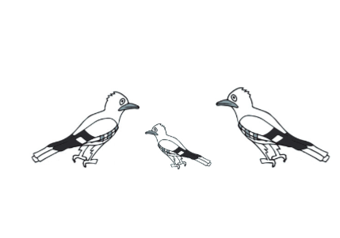
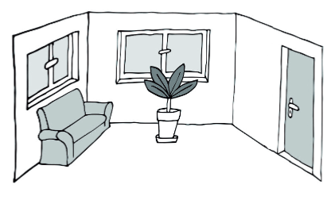
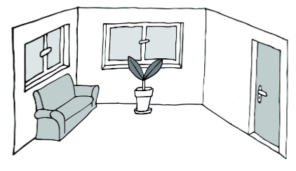
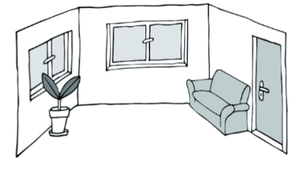
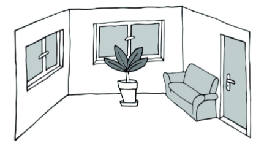
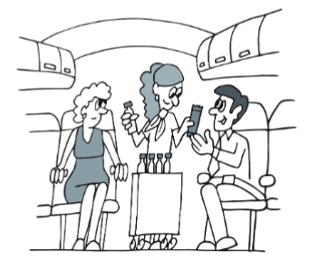
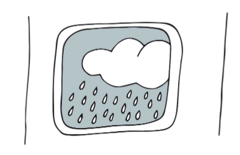
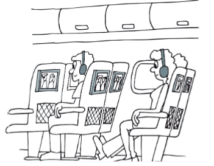
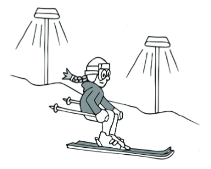
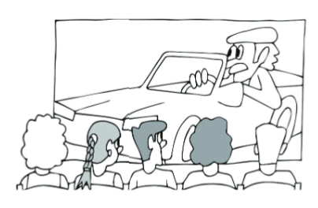

POSLECH - 1. ČÁST - ÚLOHY 1–4 
===

> Uslyšíte **čtyři** krátké nahrávky. Nejprve uslyšíte otázku a poté vyslechnete nahrávku. Na základě vyslechnutých nahrávek **vyberte** k úlohám **1–4** vždy jeden správný obrázek **A–D**.

# 1 Which animals did Ben see in the forest?

[audio 1](./audio/05%20CD%20Track.mp3)

- [A] 
- [B] 
- [C] 
- [D] 

# 2 What does the woman’s room look like now?

[audio 2](./audio/07%20CD%20Track.mp3)

- [A] 
- [B] 
- [C] 
- [D] 

# 3 What will happen at 3:00 pm according to the captain of the plane?

[audio 3](./audio/09%20CD%20Track.mp3)

- [A] 
- [B] 
- [C] 
- [D] 
# 4 What was Linda doing on Saturday evening?

[audio 4](./audio/11%20CD%20Track.mp3)

- [A] 
- [B] 
- [C] 
- [D] 

POSLECH - 2. ČÁST ÚLOHY 5–12
===

> Uslyšíte rozhovor mezi spolužáky o běhání. Na základě vyslechnuté nahrávky **rozhodněte**, zda jsou tvrzení v úlohách **5–12 pravdivá** (**P**), nebo **nepravdivá** (**N**).\
> \
> [audio 5](./audio/15%20CD%20Track.mp3)
 
# 5 Andrew has new running shoes. 
# 6 Penny has been running only two miles a day since this May. 
# 7 Andrew rarely goes for a run alone. 
# 8 Penny prefers running alone. 
# 9 Penny eats a chocolate bar before she goes running. 
# 10 Penny does __not__ mind running in the rain. 
# 11 Andrew injured his knee last weekend. 
# 12 Andrew and Penny agree on going running together next Friday. 

POSLECH - 3. ČÁST -ÚLOHY 13–20 
===

> Uslyšíte moderátora v rádiu hovořit o domě slavné herečky Marilyn Monroe. Na základě vyslechnuté nahrávky **odpovězte** v anglickém jazyce na otázky v úlohách **13–20**. 
> V odpovědích použijte **nejvýše 3 slova**. Čísla můžete zapisovat číslicemi. 
>
> **The Marilyn Monroe’s House in Brentwood, LA**\
> \
> [audio 6](./audio/21%20CD%20Track.mp3)

# 13 Who recommended buying the house to Marilyn Monroe?
# 14 In what year did Marilyn Monroe buy the house?
# 15 How much did Marilyn Monroe pay for the house?
# 16 How many bedrooms are there in the house now?
# 17 What are the floors of the house made of?
# 18 What was Marilyn Monroe’s favourite place in the house?
# 19 What was the profession of the person who bought the house in 1996?
# 20 What is the surname of the doctor whose villa will be talked about next time?

POSLECH - 4. ČÁST - ÚLOHY 21–24 
===
> Uslyšíte **čtyři** krátké nahrávky. Nejprve uslyšíte otázku a poté vyslechnete nahrávku. Na základě vyslechnutých nahrávek **vyberte** k úlohám **21–24** vždy jednu správnou odpověď **A–D**.

# 21 What does Caroline do to fall asleep?

[audio 7](./audio/26%20CD%20Track.mp3)

- [A] She counts sheep. 
- [B] She listens to music.
- [C] She drinks herbal tea.
- [D] She opens the window.
# 22 What does the man think about Fred?

[audio 8](./audio/28%20CD%20Track.mp3)

- [A] He’s a reliable person.
- [B] He’s a nervous person.
- [C] He’s an honest person.
- [D] He’s an annoying person. 
# 23 What is Hannah doing while speaking on the phone?

[audio 9](./audio/30%20CD%20Track.mp3)

- [A] She’s baking. 
- [B] She’s drawing. 
- [C] She’s shopping. 
- [D] She’s tidying up. 
# 24 Why did Jim return from his holiday early?

[audio 10](./audio/32%20CD%20Track.mp3)

be cause of:
- [A] an illness
- [B] the weather
- [C] a broken leg
- [D] an argument

ČTENÍ A JAZYKOVÁ KOMPETENCE - 5. ČÁST - ÚLOHY 25–29 
===

> Přečtěte si **pět** krátkých textů. Na základě informací v textech **vyberte** k úlohám **25–29** vždy jednu správnou odpověď **A–D**. 

# 25

> **A Lady and a Pigeon**
> Last Wednesday at noon Mrs Bowron from Bournville, UK, went shopping. On the road, right in 
> front of her house, she saw a pigeon lying there. Mrs Bowron thought that a car had probably 
> hit the bird that morning and injured it. She called a vet and told him about the bird. He 
> advised her to take it to The Bird Rescue Centre in Worcester. As Mrs Bowron doesn’t drive, she 
> decided to arrange a cab for the bird. She carefully placed the pigeon in a box, paid the driver 
> and asked him to take it to The Bird Rescue Centre. She called there in the evening to ask how 
> the pigeon was doing. She was told Lucky, as they named the bird in the centre, was doing fine. 
> It sure was a lucky day for the bird after all.
>
> (*www.bbc.com, upraveno*)

**What did Mrs Bowron do last Wednesday?**
- [A] She injured the pigeon.
- [B] She took the pigeon to a vet.
- [C] She gave the pigeon a name.
- [D] She called a taxi for the pigeon.

# 26
> **Hot Air Balloon Crash Lands^1^ in San Diego**
> A sunset wedding ceremony in a hot air balloon didn’t go quite as planned yesterday. 
> The balloon crash landed in the garden of a San Diego house because of strong winds. So, 
> the plans to fly until the sun set had to be cancelled. It happened just after the bride and 
> groom exchanged wedding rings, and the balloon could no longer be controlled. After 
> the crash landing, the San Diego Fire-Rescue Department reported that one of the 10 
> people on board suffered a back injury. The married couple told KGTV that the wind caught 
> the balloon and made it move slowly from side to side over the neighbourhood. The whole 
> situation was filmed by the surprised owner of the San Diego house. The video showed 
> the balloon hanging from trees near his garden afterwards. Despite all that, the married 
> couple and their guests enjoyed their wedding reception in a nearby restaurant soon after 
> the accident.
>
> (*www.foxnews.com, upraveno*)
>
> ^1^ crash land: nouzově přistát

**What do we find out about the wedding ceremony from this article?**
- [A] It took place in the hot air balloon. 
- [B] It was cancelled because of strong winds. 
- [C] It continued in the garden of a San Diego house.
- [D] 10 people in the hot air balloon were injured during it. 

# 27 
> One summer night in 2012, a search was organised in Iceland to find Inga Árnadóttir, a tourist 
> who hadn’t returned to her tour bus after a 10 pm rest stop. But the funny part? She had returned. 
> Inga became part of the group of tourists looking for her because she didn’t know that she was 
> the person everyone was searching for. The tour bus had stopped near Iceland’s Eldgjá canyon. 
> Inga used the time to go to the bathroom and change clothes. When she got on the bus again, 
> the passengers didn’t recognize her. Instead, they became worried that she’d gone missing. 
> The search of the area went on for two hours, but the group failed to find Inga. So, the tour guide 
> called the police. However, before they arrived, Inga had realized that she was the missing tourist. 
> She was right in Eldgjá canyon at that time, and called the tour guide from there immediately to 
> stop the search. The police advised everyone to count the passengers properly next time.
>
> (*www.mentalfloss.com, upraveno*)

**What is the best title for this article?**
- [A] Tourist Joins Her Own Search
- [B] All-night Search for a Tourist Failed
- [C] Tourist Got Lost While in Eldgjá Canyon
- [D] Police Found Missing Tourist in Eldgjá Canyon

# 28 
> **Arduino Projects**\
> *Blog post by Andrew Matthews*\
> I’ve just finished my third Arduino project and I’m already thinking about the next one. You 
> don’t know what an Arduino project is? It is a project using something like a tiny, very simple 
> computer (only a board with microcontrollers) to build digital devices. I learnt about Arduino 
> at school and I’ve been using it since. The first thing I created with the help of Arduino was 
> a wireless keyboard. It went well so I tried to make a TV remote control next. I enjoyed it as much 
> as creating the keyboard and while working on the remote, I was already thinking about my 
> next project. It was an LED wall clock for my mum’s new office. I loved the project and I definitely 
> want to make another LED wall clock one day. Now my brother wants my next Arduino project 
> to be a robotic arm for him, but I’ll go for another wireless keyboard instead. I want to create 
> a much better one now. After that, I might create a robotic arm for my brother. Arduino projects 
> are just cool.
> 
> (*www.all3dp.com, inspirováno*) 

**What Arduino project does Andrew Matthews want to do now?**
- [A] Robotic Arm 
- [B] LED Wall Clock
- [C] Wireless Keyboard
- [D] TV Remote Control

# 29 
> **Nick Bertholle**\
> 9 minutes ago\
> Hey, guys! So, those of you translating the short text on page 34, congratulations! 
> You are finishing the homework for Thursday’s French class. Yes, it’s due in six days, not four! I 
> thought it was due Tuesday, too, if it makes you feel better. Anyway, the last exercise on page 
> 33 is what Mrs Léfèbre wants us to fill in and have ready for Tuesday’s class. The teacher also 
> told me I may use the vocabulary on page 32 to be able to do the homework. But we learnt it 
> a week ago, so, no problem. Her lesson plan for Tuesday is to practise writing a short reply to an 
> e-mail, the one on page 35 I think she said. It’s going to be fun. Have a nice weekend!
> 
> (*CZVV*)

**What’s the homework for Tuesday’s French class?**
- [A] learn vocabulary on page 32
- [B] do the last exercise on page 33
- [C] translate the short text on page 34
- [D] write a short reply to an e-mail on page 35

ČTENÍ A JAZYKOVÁ KOMPETENCE - 6. ČÁST -ÚLOHY 30–39
===

**The Blue River English Language Camp**\
*This is a basic information leaflet about camp life during your stay.* 
*Further information at 4 pm in the main building.*

**Accommodation and meals:** All participants1 stay in double rooms. All your meals, except for 
lunch, will be served in the main building. The mid-day meal will be given to participants in 
brown bags to eat outside because the main building is closed at lunchtime.

**English classes:** 9 – 12 every day. You will be divided into groups, depending on the level of 
your English. Check the notice board to see your timetable, and please remember to come to 
class on time. Otherwise, you will be prevented from joining an afternoon activity that day.

**Afternoon activities:** After classes, you can take part in a range of activities in the camp. 
There are a variety of options, including some activities prepared only for those who are just 
starting to learn the language. We also organise sailing lessons which take place on Lake Tayn. 
The lessons are designed for those with some experience with sailing as well as for those who 
have never tried it. Check the times and places of the activities on the notice board. 

**Free time:** Spend your free time in the camp or outside it. It’s up to you. Just note that every 
time you want to spend your free time outside the camp, you must be accompanied by 
a member of the staff unless you are at least 16. If you d ecide to visit Wauxhelm, the nearby 
town, you need to take a bus. There is a bus stop at the camp and three buses – a yellow one 
(at 2:15 pm), a blue one (at 3:30 pm), and a red one (at 6:00 pm) stop there. However, the last 
one comes from the town instead of going to it. So, keep that in mind while planning your visit 
to Wauxhelm.

**Day trips by coach:** Day trips are organised on Saturdays; everyone is expected to take part.

> **A Day Trip t o Lake Lowren**\
> You will go to Lake Lowren 
> where a cruise is booked for 
> you to see the wildlife. Before 
> lunch, apart from swimming in 
> the lake’s clear water, you can 
> also go sailing. The afternoon 
> hike along the lake includes 
> stops at places of interest. 
> A six-kilometre hiking tour 
> might be too much for you to 
> walk without a break so there 
> will be one every two kilometres. 
> This way, you will not hike more 
> than two kilometres without 
> stopping and the tour will be 
> less tiring for you. After the tour, 
> you will go back to the camp. 

> **A Day Trip to Lake Moer**\
> After arriving at Lake Moer, you will visit the Moer 
> Farm on the shore. Then, you will spend some time 
> on Linteau, one of the islands on Lake Moer, where 
> you might see many rare birds. In 2019, a bridge was 
> officially opened to connect the farm with Linteau. It 
> replaced the ferry run by the farm. So you are lucky to 
> be able to save time because a ferry is still the only way 
> to get to the other islands on Lake Moer. After visiting 
> Linteau, you will have lunch back at the farm. Then, 
> you will set off on a hike along the lake. The footpath 
> round the lake is 6 km long but you will hike only half 
> its length to the coach which will take you back to 
> the camp. Although there  are many opportunities for 
> you to spend time in the swimming pool in our camp, 
> having fun in Lake Moer will be an unforgettable 
> experience for you. You will not have another chance to 
> swim in Lake Moer during your stay.

**Blue River English Language Camp T-shirts:** If you want to buy a T-shirt with the camp logo 
on it, you can order and pay for one today only, right after dinner, and collect it at the same 
time and place tomorrow. 

(*CZVV*)

^1^ participant: účastník

> Přečtěte si tvrzení v úlohách **30–39** a informační leták, který jste právě obdržel/a při příjezdu na letní jazykový tábor jako jeho účastník/účastnice. Na základě informací v textu **rozhodněte**, zda jsou tvrzení **pravdivá (P)**, nebo **nepravdivá (N)**.
 
# 30 Lunch will be served in the main building. 
# 31 You __won’t__ be allowed to take part in an afternoon activity if you come late to your English class that day. 
# 32 There are afternoon activities organised specially for the English language beginners. 
# 33 You need to have some experience with sailing if you want to attend any sailing lessons. 
# 34 Participants ^1^ 16 years of age and older can leave the camp alone. 
^1^ participant: účastník
# 35 The red bus will take you to Wauxhelm from the bus stop at the camp. 
# 36 Both day trips include some travel by ship. 
# 37 You will be hiking six kilometres along a lake on either day trip. 
# 38 You will have a chance to swim in a lake on both day trips. 
# 39 You will get a T-shirt with the camp logo on it right after you pay for it. 

ČTENÍ A JAZYKOVÁ KOMPETENCE - 7. ČÁST - ÚLOHY 40–44
===

Přečtěte si článek o slavné foto grafii. Na základě informací v textu vyberte k úlohám 40–44 
vždy jednu správnou odpověď A–D.

**The Story Beh ind a Famous Photograph**
Professional photographer Charles O’Rear often drove through Sonoma 
County, California to visit his girlfriend. He loved the region’s hills so he 
waited for the right moment to take a picture of them. Then, one Friday in 
1996, the right moment finally came. So, Charles O’Rear stopped his car 
and took the now-famous photo. He thought about eventually sending it 
to National Geographic, as they had bought some of his previous photos. 
So had the Los Angeles Times, whose editors would surely be interested in more photos of 
the California countryside. In the end, he decided to upload it to a photo licensing website. Then 
in 2000, Microsoft was looking for a photo that would make a default desktop background1 for 
its newest operating system. Microsoft found O’Rear’s photo on the photo licensing website and 
bought it from him.

O’Rear was never told exactly why his photo was selected and he was only left to guess. ‘I believe 
they wanted a photo of a nice summer countryside because their new operating system was going 
to be introduced in August. If that was the case, they couldn’t be more wrong,’ says O’Rear. He admits 
that he had been waiting for the right moment to take the photo since October of the previous year. 
It was only a week after New Year’s Eve when he finally took it that Friday. However, he didn’t upload 
the photo to the website right then in January. He found time to do so two months later, in March. 
‘Every time I tell people when I took the photo, they’re surprised,’ laughs O’Rear.

When people see the photo, many of them recognize it. But they hardly know what the author 
of the photo looks like. And those who do are often curious. They want to know: Did Charles 
make the grass and the sky look brighter on his computer? They can’t believe he didn’t. It 
was the Microsoft team, they changed the colours in the end. Charles was not angry about it. 
But Charles was disappointed with Microsoft about something else. It did not publish much 
information about the place in Charles’ photo. Charles says, ‘Some people think that it is a photo 
of New Zealand. I wish more people knew it is California.’ The one thing that Microsoft and 
Charles agreed on was never to publish the price. Charles can only say that it was the most he 
has ever been paid for a photo. When people ask him, he jokes that he got $1,000,000 for it. But 
nobody ever believed that he had got so much.

One more thing is also not well known: the Microsoft team gave the photo a name – it’s called 
‘__Bliss__’. It was because the word bliss described what they felt every time they looked at it. 
Sometimes they dreamt they were in the photo, listening only to the wind blowing and to birds 
singing loudly. The Microsoft team would look at the photo on their PC screens for a few minutes 
ev ery day. It was the only chance during their busy day to just sit and relax. The bright green 
grass, the sky, no traffic and no people – nothing could make them any happier. Charles O’Rear 
says, ‘That’s why I think the name matches my photo perfectly. That’s what I often felt while 
driving there.’ Although Microsoft stopped supporting that version of the operating system a few 
years ago, ‘Bliss’ will never be forgotten.

People have tried to find that piece of land and take a photo of it too. When they come to 
the place, they are surprised that it looks different now. That is because they expect to see a golf 
course or something similar. Some people go and knock on the doors of the new houses near 
the place from the photo. They go to those houses to ask about the rows of grapes. That’s what 
they see on the piece of land instead of the grass. The truth is that the grass was only there 
for a few years in the long history of this traditional winemaking region. If it was a region with 
a history of animal farming, there would be an animal farm there now. 

(*www.artsy.net, www.en.wikipedia.org/wiki/bliss_(image*)*; upraveno)*

^1^ a default desktop background: výchozí pozadí plochy počítače

# 40 Which company asked Charles O’Rear to take the now-famous photograph?
- [A] none
- [B] Microsoft
- [C] National Geographic
- [D] The Los Angeles Times
# 41 When did Charles O’Rear take the photograph? 
- [A] in January
- [B] in March
- [C] in August
- [D] in October
# 42 What does Charles O’Rear say about the photograph? 
He says that:
- [A] some people think it made him a millionaire. 
- [B] he changed the colours of it on his computer. 
- [C] some people think it was taken in New Zealand. 
- [D] he often gets recognized on the street because of it. 
# 43 What does the wor d ‘bliss’ in the 4th paragraph mean?
- [A] úplné ticho
- [B] vrcholné štěstí
- [C] jedinečná šance 
- [D] dávná vzpomínka 
# 44 What does the place from the famous photograph look like today?
- [A] There are houses there now. 
- [B] There is a golf course there now.
- [C] There is an animal farm there now.
- [D] There are grapes grown there now.

ČTENÍ A JAZYKOVÁ KOMPETENCE - 8. ČÁST - ÚLOHY 45–49 
===

Přečtěte si požadavky **pěti** cizinců, kteří nyní hledají psychologa **v Plzni**, a nabídky 
psychologických center. Na základě informací v textech **přiřaďte** k úlohám **45–49** vždy jednu 
odpovídající nabídku **A–G**. Dvě nabídky jsou **navíc** a nebudou použity.

# 45 Robert _____
He, his wife and their daughter moved to Pilsen six months ago. The little one needs 
a child psychologist, which is why Robert is looking for one there now. The psychologist 
should be free on Tuesday afternoons, and speak English.
# 46 Thomas _____
He hasn’t been feeling well lately, so he’s now looking for an adult psychologist in Pilsen. 
He can speak Czech quite well, so the psychologist needn’t speak English. He is only free 
on Wednesday mornings, which is when he wants to see a psychologist.
# 47 Edith _____
She was seeing an adult psychologist in the UK and she wants to continue in Pilsen now 
because she has moved there. She doesn’t speak Czech, so the psychologist must speak 
English. She is free on Mondays, but not before noon, only after.
# 48 Daisy _____
She is now looking for an adult psychologist in Pilsen, where she works. Her job keeps 
her busy, so she is only free on Thursday mornings. She doesn’t speak Czech. Therefore, 
the psychologist must speak English. 
# 49 Patrick _____
He is now looking for a child psychologist in Pilsen for his little boy who has been having 
trouble at school lately. Only Friday mornings work for him, so the psychologist should 
be free then. His son speaks Czech well, so the meetings can be in Czech.
\
\
PSYCHOLOGICAL CENTRES IN PILSEN

- [A] Do you need a psychologist for your 
child now? Has he/she not been feeling 
well lately and you want him/her to start 
seeing someone? Our experienced child 
psychologists will help him/her. They speak 
Czech, English and German and they are 
available for their clients every day from 
7 am to noon. Call 378 038 818 and make 
an appointment. We guarantee wait times 
no longer than two weeks!
- [B] Were you seeing a psychologist before? 
Do you want to continue now? Whether 
you were or you weren’t, we can provide 
the help you are looking for. There are 
four psychologists (two for adults, two for 
children) in our psychological centre, all 
available from Monday to Wednesday from 
8 am to 7 pm. We provide services in Czech 
and German. For sessions in English we 
recommend our centre in Tábor. 
Call: 378 031 222. Wait times are no longer 
than two weeks!
- [C] Do you want to start seeing a psychologist 
and only Mondays or Fridays work for you? 
Visit our psychological centre. We are open 
on those days from 7:30 am to 5:30 pm. 
There are three psychologists available, 
all of them for adults only. However, 
a child psychologist will start next winter 
too. He will be available for clients on 
Tuesdays, Wednesdays and Thursdays. 
Our psychologists speak English. Call: 
371 120 792. Wait times are no longer than 
two weeks!
- [D] Has your child not been feeling well lately 
or has been having trouble at school? Our 
psychological centre can help your child as 
it provides professional help for children. We 
are open daily, except for Fridays, from 7 am 
to noon. Besides Czech all our psychologists 
speak English, and some speak German as 
well. Contact us on 377 236 750 and make 
an appointment today! Wait times are no 
longer than two weeks!
- [E] Are you looking for a psychologist for yourself 
or your children? Our psychological centre 
provides professional help for both adults 
and children. There are six psychologists 
available for you from 12:30 pm to 6 pm 
every day except Mondays. Our psychologists 
are experienced and all of them speak 
Czech and English. Call our reception on 
377 636 113 for an appointment. Wait times 
are no longer than two weeks!
- [F] Our psychologists provide care for 
clients 18 years old or older, not younger. 
However, we can give recommendations 
for good child psychologists elsewhere, 
even for those who speak English. We are 
open from Monday to Friday from noon 
to 7 pm. You can call weekday mornings 
to make an appointment. We guarantee 
wait times no longer than two weeks! 
Meetings are in Czech only. For English, 
visit us in Prague.\
Contact: 378 186 777.
- [G] Psychologists in our psychological 
centre are experienced and speak Czech, 
German and English. They provide care 
for adult clients, whether the clients need 
to talk about trouble with their children, 
difficulties at work, with their high school 
or university studies or anything else. 
Our centre is open twice a week – on 
Thursdays and Fridays from 8 am to noon 
and from 1:30 pm to 6 pm. Wait times are 
never longer than two weeks! Call now on 
378 028 802.

ČTENÍ A JAZYKOVÁ KOMPETENCE - 9. ČÁST -ÚLOHY 50–64
===

Přečtěte si článek o vesnici s nejdelším názvem v Evropě. Na základě textu vyberte k úlohám 
50–64 vždy jednu správnou odpověď A–C.

**The Village with the Longest Name in Europe**

Have you ever heard of the village with the longest name in Europe? It (**50**) _________ in 
Wales, UK, and its name is *Llanfairpwllgwyngyllgogerychwyrndrobwllllantysiliogogogoch*. It is 
even listed in the Guinness Book of Records. It is not an old Welsh name: it (**51**) _________ in 
the 1860s by a local man who was trying to make the village famous.

In 2001, the population was 3,040 and since then the population (**52**) _________ to 3,307. 
The village is on an island and is connected to mainland Wales by bridge. Unfortunately, a fire 
damaged the original bridge (**53**) _________ May 23, 1970. The current bridge is now part of 
the road A55 and (**54**) _________ appearance is quite pleasing.

The village welcomes about 200,000 visitors (**55**) _________ year. The most popular attraction 
is the railway station (**56**) _________ a big board with the name of the village can be found. 
Other places of interest (**57**) _________ the zoo, St Tysilio’s Church and Plas Cadnat Gardens.

This village is a small community and there are only a (**58**) _________ places to stay. But 
the surrounding area has a wide variety of accommodation, so visitors (**59**) _________ worry 
about where they will stay. What visitors won’t miss in the village are places to eat and drink. 
There is a pub called *Tafarn Ty Gwyn* right outside the railway station. It is open every day and 
it offers drinks and sandwiches. If you (**60**) _________ like having something sweet, visit *Caffi* 
*Nellie*, a café close to the pub.

(**61**) _________ being a tiny village, it used to be a home to a couple of famous people: actor 
Taron Egerton and actress Naomi Watts. Naomi lived in the village with her grandparents 
(**62**) _________ three years when she was a child. She’s recently surprised TV viewers with 
her perfect pronunciation of the village’s name. The same happened with 33-year-old actor 
Taron Egerton who (**63**) _________ to primary school there. ‘Saying the name of the village is 
sometimes the only thing my fans want me (**64**) _________ when we meet,’ says Taron. Would 
you be able to pronounce it?
\
\
(*www.llanfairpwllgwyngyllgogerychwyrndrobwllllantysiliogogogoch.co.uk, upraveno*)

# 50 
- [A] lay 
- [B] lies 
- [C] is lying
# 51 
- [A] created 
- [B] has created 
- [C] was created
# 52 
- [A] increased 
- [B] has increased 
- [C] is increasing
# 53 
- [A] in 
- [B] on 
- [C] at
# 54 
- [A] its 
- [B] his 
- [C] her
# 55 
- [A] a 
- [B] an 
- [C] —
# 56 
- [A] where 
- [B] which 
- [C] that
# 57 
- [A] add 
- [B] consist 
- [C] include
# 58 
- [A] some 
- [B] little  
- [C] few
# 59 
- [A] needn’t 
- [B] haven’t 
- [C] mustn’t
# 60 
- [A] look 
- [B] feel 
- [C] are
# 61 
- [A] Because 
- [B] Despite 
- [C] However
# 62 
- [A] from 
- [B] since 
- [C] for 
# 63 
- [A] goes 
- [B] went 
- [C] gone
# 64 
- [A] doing 
- [B] do 
- [C] to do