POSLECH - 1. ČÁST - ÚLOHY 1–4
===
> Uslyšíte **čtyři** krátké nahrávky. Nejprve uslyšíte otázku a poté vyslechnete nahrávku. Na základě vyslechnutých nahrávek **vyberte** k úlohám **1–4** vždy jeden správný obrázek **A–D**.

# 1 Which factory are the students going to visit in Campton?
[audio](./audio/05%20AJMZD24C0T01.mp3)
- [A] 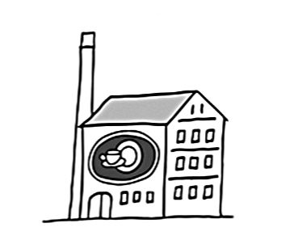
- [B] 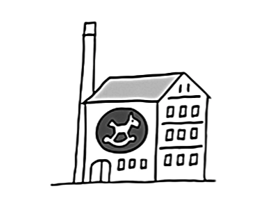
- [C] 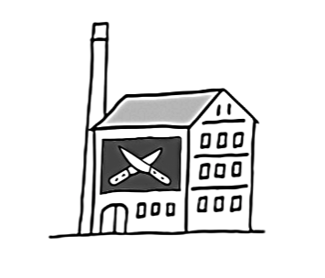
- [D] 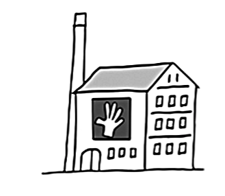

# 2 Which photograph of her grandpa is Lucy talking about?
[audio](./audio/07%20AJMZD24C0T01.mp3)
- [A] 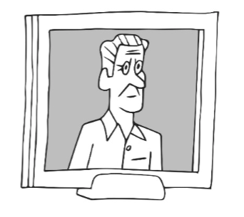
- [B] 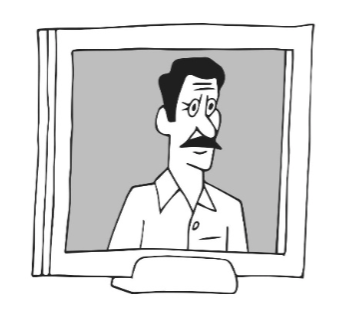
- [C] 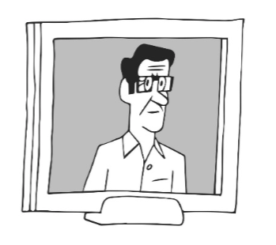
- [D] 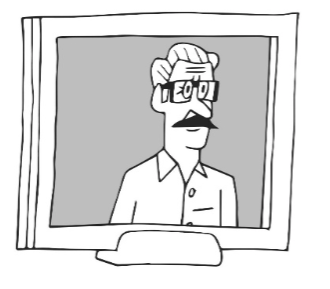

# 3 What does Steve do on Thursday afternoons?
[audio](./audio/09%20AJMZD24C0T01.mp3)
- [A] 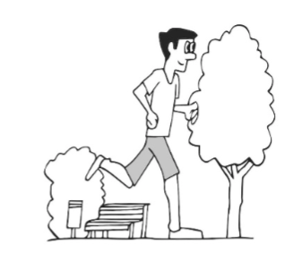
- [B] 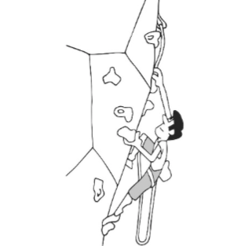
- [C] 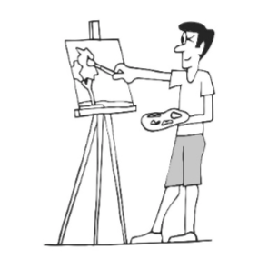
- [D] 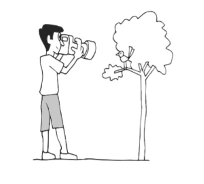

# 4 What did the man get from his girlfriend for Christmas? 
[audio](./audio/11%20AJMZD24C0T01.mp3)
- [A] 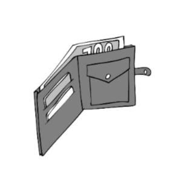
- [B] 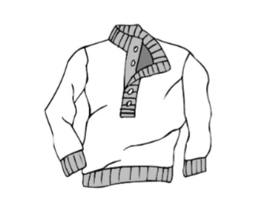
- [C] 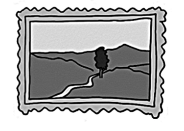
- [D] 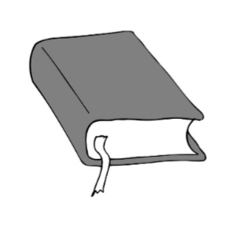

POSLECH - 2. ČÁST - ÚLOHY 5–12 
===
> Uslyšíte rozhovor mezi přáteli o letních brigádách.
> Na základě vyslechnuté nahrávky **rozhodněte**, zda jsou tvrzení v úlohách **5–12 pravdivá** (**P**), nebo **nepravdivá** (**N**).\
> \
> [audio](./audio/15%20AJMZD24C0T01.mp3)
 

# 5 The first time Mike worked as a lifeguard was last year.  
# 6 Elena thinks she wrote a good CV.   
# 7 According to Mike, working as a lifeguard was a boring job.  
# 8 Mike thinks that as a lifeguard he learnt skills useful for his future job. 
# 9 Elena worked 7 days a week.  
# 10 Elena and her colleague from the coffee bar became friends.  
# 11 Mike bought a new laptop with the money he earned as a lifeguard.  
# 12 Elena is planning to work in the same coffee bar during the next summer holidays.  

POSLECH - 3. ČÁST - ÚLOHY 13–20 
===
> Uslyšíte lektora anglického jazyka hovořit ke studentům na jejich první vyučovací hodině jazykového kurzu.
> Na základě vyslechnuté nahrávky **odpovězte** v anglickém jazyce na otázky v úlohách **13–20**. V odpovědích použijte **nejvýše 3 slova**.
> Čísla můžete zapisovat číslicemi. 
> \
> [audio](./audio/21%20AJMZD24C0T01.mp3)
> 
> English Language Lessons

# 13 How many times a week will the students have lessons with the teacher?   

# 14 On what date will the teacher’s last lesson with the students take place? 
# 15 What part of the English language will the students practise in the first six lessons?  
# 16 What does the teacher __not__ want the students to do during his lessons?  
# 17 What is the number of the teacher’s office? 
# 18  What is the surname of the author of the book which the teacher recommends to the students?  
# 19 What colour is the building where the exam will take place?   
# 20 What room is opposite the lecture hall? 

POSLECH - 4. ČÁST - ÚLOHY 21–24 
===
> Uslyšíte **čtyři** krátké nahrávky. Nejprve uslyšíte otázku a poté vyslechnete nahrávku. Na základě 
> vyslechnutých nahrávek **vyberte** k úlohám **21–24** vždy jednu správnou odpověď **A–D**.

# 21 What makes Brad’s dog lively?
[audio](./audio/26%20AJMZD24C0T01.mp3)
- [A] leaving for a walk
- [B] eating three times a day
- [C] waking up in Brad’s bed
- [D] following Brad’s orders at home
# 22 When does the Badminton club start for new members? 
[audio](./audio/28%20AJMZD24C0T01.mp3)
- [A] 27th September
- [B] 29th September
- [C] 3rd October
- [D] 5th October 
# 23 What is the man doing regarding the book *The Silence*? 
[audio](./audio/30%20AJMZD24C0T01.mp3)
- [A] He’s making fun of it.
- [B] He’s explaining why he likes it.
- [C] He’s complaining about its ending.
- [D] He’s describing its main character.
# 24 Where is the couple going to have dinner tonight?  
[audio](./audio/32%20AJMZD24C0T01.mp3)
- [A] at home
- [B] at Jane’s flat
- [C] in an Italian restaurant
- [D] in a fast food restaurant

ČTENÍ A JAZYKOVÁ KOMPETENCE - 5. ČÁST - ÚLOHY 25–29 
===
> Přečtěte si **pět** krátkých textů. Na základě informací v textech **vyberte** k úlohám **25–29** vždy jednu správnou odpověď **A–D**. 

# 25 Where does Hawaiian pizza come from?

> **The Hawaiian Pizza**
> 
> Pineapple on pizza? Where does it even come from? Pizza originates in Italy and Italians are proud 
> of their pizza. But the Hawaiian pizza, topped with ham and pineapple, has nothing to do with 
> Italy. It was a Greek immigrant called Sam Panopoulos who invented it and first introduced it to 
> the menu of his restaurant. It was in 1962, three years after Hawaii became the 50th state of the 
> USA. People loved everything Hawaiian. So, when they started to import Hawaiian pineapple into 
> North America, Panopoulos had the idea of putting it on a pizza and calling it the Hawaiian pizza. 
> He immediately brought this idea to life in his restaurant in the province of Ontario, Canada. His 
> guests loved it or hated it from the beginning. Recently a survey has found that 82% of people like 
> pineapple, but only 53% like the fruit on their pizza. And you? Do you love it or hate it?
> 
> (*www.bbc.co.uk, upraveno*)

- [A] Italy
- [B] Greece  
- [C] Canada
- [D] the USA

# 26 What does the article say about the unusual library?

> **An Unusual Library**
> 
> The phrase goes, ‘*One man’s trash is another man’s treasure*,’ and garbage collectors in Turkey have 
> really taken that phrase seriously. A few months ago, they opened a library composed only of books 
> they found in garbage cans in the country’s capital of Ankara. At the beginning, the library was 
> planned to be used only by garbage collectors and their families, but as interest grew, it officially 
> opened to the public. Since then, people have been bringing their unwanted books to leave them 
> there for somebody else. The library now has over 25,000 books, which is more than some schools in 
> the area can lend to their readers. Following the success of the library, the garbage collectors want to 
> do more: they will change an old garbage truck into a mobile library. They want to drive it to nearby 
> schools so that their students can borrow books they can’t find in their school libraries.  
> 
> (*www.matadornetwork.com, upraveno*)

- [A] It has become a mobile library.
- [B] It will borrow books from nearby schools.  
- [C] Anybody can come there to borrow a book.
- [D] There are only books found in garbage cans.

# 27 Why does Paul Barton upload videos onto his YouTube channel?

> **YouTuber Paul Barton**
> 
> A man named Paul Barton lives in an Asian rescue centre which takes care of blind and ill elephants. 
> To cheer them up, Barton plays the piano for them. ‘It’s entertaining for me. If the elephants 
> hate the music I’m playing, they make loud noises. If they love it, they dance. I have no idea who 
> taught them to react to music like that,’ smiles Barton. Either way, his playing attracts the animals’ 
> attention. Barton uploads videos of them on his YouTube channel. Most viewers understand that 
> Barton doesn’t mean to collect money through his videos. They send it anyway for Barton to have 
> some money for himself. But he keeps none of it. Viewers also send the links to his videos to others. 
> If they didn’t, Barton would never be able to make so many people interested in the centre. ‘I’m 
> happy people around the world know about it now. That’s all I intended,’ says Paul Barton.
> 
> (*www.dailymail.co.uk, upraveno*)

- [A] to make money for himself 
- [B] to bring attention to a rescue centre 
- [C] to entertain people by playing the piano 
- [D] to show his method of teaching elephants to dance

# 28 What did Jim Murphy do for his parents last summer?

> **My Parents**
> 
> Blog by Jim Murphy
> 
> When Mum asked me to find a retirement home[^1] for her and Dad last summer, I started looking 
> for one. But my wife felt that it wasn’t right and that we should move in with my parents and take 
> care of them ourselves. I had to agree and we decided to move. However, we needed the whole 
> summer to do it and my parents needed help right away. So, my children offered to take care 
> of them during the summer. But we didn’t want them to cancel their summer holiday activities, 
> which is why I decided to hire a nurse instead. I found one quickly and my parents had some 
> help. The nurse would look after my parents while we were getting ready to move. My parents 
> agreed to it. When the summer was over, my family and I moved in with my parents. I think they 
> are much happier with us and our children than they would be in any retirement home.
> 
> (*CZVV*)
> 
> [^1]:retirement home: domov důchodců

- [A] He paid a nurse to take care of them. 
- [B] He found a retirement home1 for them. 
- [C] He sent his children to take care of them.
- [D] He moved in with them to take care of them.

# 29 What happened at the wedding reception1?

> **The Wedding Reception[^1] of Estelle and Larry Bam**
> 
> Estelle and Larry Bam from Cape Town had a wedding reception that all their guests will 
> remember. A few weeks before their wedding, Larry secretly sent wedding invitations to Estelle’s 
> favourite celebrities. He didn’t want them to come to the wedding, he just hoped to collect as 
> many answers as possible, and he did.  Larry couldn’t wait to give the collection of the celebrities’ 
> replies to Estelle at the wedding reception. But when the moment came their parents suddenly 
> started shouting at each other. Soon other guests started joining them, a fight started and the 
> wedding reception had to end. Estelle was mad because her husband had lost his wedding ring 
> while trying to stop the fight. However, when they were alone in their hotel room and Larry 
> finally gave her the collection, she was happy again. She absolutely didn’t expect that. ‘It was the 
> best, even better than having our favourite celebrities show up. So I was glad none of them came 
> in the end because I’d feel embarrassed by the fight,’ said Estelle. 
> 
> (*www.boredpanda.com, inspirováno*)
> 
> [^1]:wedding reception: svatební hostina

- [A] The couple’s favourite celebrities showed up. 
- [B] The husband gave his wife a surprising gift.
- [C] The couple’s parents got into an argument.
- [D] The wife lost her husband’s wedding ring.

ČTENÍ A JAZYKOVÁ KOMPETENCE - 6. ČÁST - ÚLOHY 30–39
===

> Přečtěte si tvrzení v úlohách **30–39** a informační leták cestovní kanceláře *RouteRide* k výpravě 
> na motorkách značky Vespa po slavné americké mezistátní dálnici Route 66.
> Na základě informací v textu **rozhodněte**, zda jsou tvrzení **pravdivá** (**P**), nebo **nepravdivá** (**N**).

> **Los Angeles to Chicago or Chicago to Los Angeles with *RouteRide***
> 
> *2,278 miles, 8 states, 3 time zones, 16 days, 1 Vespa: an experience of a lifetime!*
> 
> - $760 for one or $1,400 for two! Besides all the fuel needed, the price is for: 
> accommodation, daily breakfast and dinner and accompanying staff. Nothing 
> extra is included in the price.
> - The number of clients is limited because of safety. In one 16-day trip there can be 
> up to 12 couples, or a combination of couples and singles (for example 6 couples 
> and 12 singles), but never more than 24 participants.
> 
> **ROUTE PLAN**
> 
> - In 16 days, you will cover 2,278 miles on Vespa motorbikes. Please don’t forget to check 
> the technical condition of your Vespa before the trip. If you don’t have time to look at your 
> Vespa, don’t worry. *RouteRide* hires mechanics who will check its clients’ motorbikes at the 
> places of departure. If you don’t have a Vespa and you plan to ride a rented one, please have 
> it checked by the rental company. *RouteRide* does not provide any Vespas.    
> - To make it to your destination in 16 days, you will need to ride your motorbike 143 miles 
> a day. At an average speed of 25 mph, this can be done in 5 h 45 min. However, the trip is  
> not only about riding a motorbike, it’s also about making stops at interesting sites along the 
> way. To visit everything as planned, you will set out on the journey every day just as the sun 
> comes up.
> - Please note that some sections of Route 66 run through states with dangerous wild 
> animals and hot and dry weather, especially Arizona. However, the animals there are not 
> as dangerous as the heat. The heat can make you unable to continue riding your Vespa so 
> remember to drink a lot of water. 
> - Although the plan has been carefully put together by *RouteRide*’s experienced guides, 
> changes are possible. However, *RouteRide* will not make any if they are not informed of your 
> wishes before the whole trip starts.
> 
> **ACCOMMODATION**
> 
> - *RouteRide* has had the best experience with motels along local roads off Route 66. Their 
> rooms are as cosy as the rooms in the motels along Route 66, but much cheaper. That’s why 
> *RouteRide* books rooms in them for you. Remember: breakfast and dinner are included!
> 
> **ROUTE L: Los Angeles → Chicago**
> **August 1 – August 16**
> 
> **Registration**: Any time before departure but no later than the day before departure. Your 
> registration will be confirmed within an hour via text message.
> 
> **Departure**: From *RouteRide*’s car park on the corner of Santa Monica Boulevard and Vine Street.
> 
> **Arrival**: The Main Station car park on the corner of Jefferson and Jackson Boulevard. *RouteRide* 
> is allowed to use it.
> 
> **Service**: Apart from our two experienced guides, Pedro and Nia, a nurse, a mechanic and a driver 
> of the accompanying vehicle will be part of the staff who take care of you during the whole trip.
> 
> 
> **ROUTE C: Chicago → Los Angeles**
> **August 17 – September 1**
> 
> **Registration**: Any time before departure until July 31. By August 4, *RouteRide* will confirm your 
> registration via e-mail.
> 
> **Departure**: From the petrol station on the corner of Jefferson and Jackson Boulevard, opposite 
> *RouteRide*’s car park. 
> 
> **Arrival**: *RouteRide*’s car park on the corner of Santa Monica Boulevard and Vine Street.
> 
> **Service**: You will be accompanied by two excellent guides: Shanice, who is also a nurse, and 
> Old Mike (25 years of experience!), who will also be your mechanic in case your Vespa breaks 
> down. Besides them, Jim, the driver of the accompanying vehicle, will also be part of the staff  
> during the trip.
> 
> (*CZVV*)

# 30 Fuel is included in the price. 
# 31 A maximum of 24 clients can take part in one trip. 
# 32 You can either choose to use your own motorbike or rent one from *RouteRide*. 
# 33 Daily motorbike rides start at sunrise. 
# 34 In Arizona, the greatest danger for clients is the wildlife. 
# 35 The route can be changed according to your wishes, but only to those expressed before departure from Los Angeles or Chicago. 
# 36 Accommodation is provided in motels located on Route 66. 
# 37 For both routes, you must register by the end of July. 
# 38 Both routes start at the same place. 
# 39 Five *RouteRide* employees will accompany you on both Route L and Route C. 

ČTENÍ A JAZYKOVÁ KOMPETENCE - 7. ČÁST - ÚLOHY 40–44 
===
> Přečtěte si dopis mladého britského lékaře George na zahraniční misi adresovaný jeho přítelkyni Celii.
> Na základě informací v textu **vyberte** k úlohám **40–44** vždy jednu správnou odpověď **A–D**.

> Hi Celia, 
> 
> I decided to write a letter to you. I don’t think I’ve ever used this way of communication with 
> anyone, except maybe with my Grandma when I was little. See, the idea came to me when 
> I saw a colleague writing a letter by hand because his phone had died shortly before my arrival 
> here. So, he gave up calling his girlfriend and just sat down and started to write. How romantic! 
> So, despite having the opportunity to be online here, I went for writing a letter by hand instead 
> of e-mailing or texting you. I feel so old-fashioned! Just like when my Grandpa was in Vietnam 
> writing letters to my Grandma. She showed me the letters once, they were in an old box. But 
> you don’t have to keep this letter in a box and open it again when we’re old if you don’t want 
> to. I just hope you feel my love more when you’re holding this.  
> 
> Anyway, my flight from London to Haiti was okay. A big, unpleasant surprise came when I got 
> to the hospital. I was told there were no more flats for foreign doctors at that moment. So, I’m 
> sleeping on an old bed in the doctors’ room for now, hoping the situation changes soon. And 
> work, Celia? I had a 12-hour shift, and then two more shifts just as long! Three days in a row! 
> I was so exhausted afterwards that I cried. I’d never cried after work before! But don’t worry 
> about me, I’m okay now. I simply must remember to eat and drink during my shifts. I’ve found 
> the local cuisine amazing! The meals are rich and tasty. I hate to say it, but English cuisine isn’t 
> as good. I don’t miss the cold sea at home either. The Caribbean Sea here is so much warmer. 
> My colleagues and I had so much fun swimming in it yesterday on our day off. It was my first 
> swim here. The beaches are a bit dirty, but it didn’t bother us.
> 
> And how are you, my love? Do you miss me? I miss you terribly. I had to stop drinking black 
> tea with milk here. Can you imagine? Me, an Englishman, not drinking tea! It is because it 
> reminded me of you and our afternoon tea together. And I started to miss you. Also, when I see 
> a girl in the hospital who looks like you, perhaps I look at her for too long. Sometimes I feel like 
> I see you everywhere. There are more things that make me miss you, but none is worse than 
> seeing couples holding hands. Those are the moments I really wish you were here with me. 
> Sometimes I drink a glass of sweet wine in the evening and think of you; what you are doing, 
> if you’re alright… I love such evenings here the most.
> 
> When I go to bed, I hope that you will be in my dreams. Do you feel like that too? I’d be in your 
> dreams every night if it was up to me, my love. Why haven’t you been in any of mine yet? I used 
> to dream about you twice a week before I came here. And now? Nothing. But I’ve dreamt about 
> my mum three times here already. Funny, isn’t it? Could you please also be in mine at least 
> once while I’m in Haiti? That way we could be together for a while. 
> Now, I’m just counting the days until we see each other next month. I can’t wait! My flight will 
> be much shorter than the one over here to Port-au-Prince, but I have to change planes once 
> because there is no direct flight to Orlando. It’s a pity I can’t go all the way to New York City, 
> honey. I know that would be the best plan for you, but I just can’t afford to go any further than 
> Orlando. Maybe some other time? Anyway, like I said I can’t wait to hug you and kiss you again. 
> I’ll be waiting for your flight from Paris at the airport. 
> 
> I love you.
> 
> George
> 
> (*CZVV*)

# 40 Why did George decide to write a letter to Celia? 
Because:
- [A] he found it romantic.
- [B] his mobile phone had died. 
- [C] he had no access to the Internet. 
- [D] he wanted her to have a memory in her old age. 
# 41 What is not true about George according to the 2nd paragraph? 
- [A] He likes Haitian cuisine more than English cuisine.
- [B] He cried after completing his first 12-hour shift. 
- [C] He is unhappy with his accommodation in Haiti.
- [D] He enjoyed his first swim in the Caribbean Sea.
# 42 When does George miss Celia the most? 
- [A] while seeing couples who are holding hands 
- [B] while drinking sweet wine in the evening  
- [C] while seeing girls who look like her 
- [D] while drinking black tea with milk 
# 43 How many times during his stay in Haiti has George seen Celia in his dreams so far? 
- [A] once 
- [B] twice
- [C] three times 
- [D] never
# 44 Where do George and Celia plan to see each other next month? 
- [A] in Port-au-Prince 
- [B] in New York City
- [C] in Orlando
- [D] in Paris 

ČTENÍ A JAZYKOVÁ KOMPETENCE - 8. ČÁST - ÚLOHY 45–49 
===
> Přečtěte si požadavky **pěti** rodin z Belfastu, které chtějí **tento víkend** navštívit mini zoo, 
> a nabídky mini zoo.
> Na základě informací v textech **přiřaďte** k úlohám **45–49** vždy jednu odpovídající nabídku **A–G**. Dvě nabídky jsou **navíc** a nebudou použity.

# 45 the Murphys 
They are busy this Sunday but are free this Saturday. They want to visit a mini zoo that 
has goats and sheep and is within a 30 km drive from Belfast. They want to take their dog 
with them, so dogs must be allowed in.
# 46 the Kellys
Their wish for their children is to see goats and sheep at a mini zoo. They want to visit one 
this Sunday, with a drive from Belfast not being longer than 30 km. They’d like to take 
their dog with them but if it’s not possible, it’s fine.
# 47 the McLaughlins
They went to see goats and sheep at a mini zoo last Sunday, and this Saturday they want 
to see chickens and ducks. They don’t want to drive more than 50 km from Belfast to the 
mini zoo. If their dog can’t enter the mini zoo, they won’t go there. 
# 48 the Hegartys
They want to spend this Sunday at a mini zoo to see sheep and goats. The drive from 
Belfast to the mini zoo must not be longer than 50 km. Dogs must be allowed to enter 
along with their owners.
# 49 the Gallaghers
They want to visit a mini zoo within a 30 km drive from Belfast this Sunday. The mini zoo 
should have ducks and chickens for their children to see. If they could take their dog with 
them, that would be great. If not, it’s fine.

- [A] Come and visit our mini zoo this weekend! 
Our mini zoo is only a 20 km drive from 
Antrim, and twice as long from Belfast. 
Visiting our mini zoo is the perfect family 
day out. Watch our goats, chickens,  
sheep, and ducks having fun. Feeding  
the animals is allowed while entering  
with a pet is not. We are open all weekend 
so come and bring your whole family  
with you. See you all here! More on  
*www.kellsminizoo.com*.
- [B] Thinking of a weekend out in the 
countryside? Busy on Saturday but free 
on Sunday? Come and visit our mini zoo 
as that’s the only day we’re open to the 
public! You can spend as much time with 
our tiny little chickens and ducks as you 
like. Feeding the animals is allowed and so 
is entering with a pet. Why should your dog 
stay at home? We are a 25 km drive from 
Larne and only a 20 km drive from Belfast. 
*www.ourzoo.com*
- [C] Looking for a fun weekend activity for the 
whole family? Then come and visit our mini 
zoo, only a 49 km drive from Belfast! Meet 
our friendly sheep and goats, and our cute 
chickens. Children will love learning about 
our farm animals and about feeding them. 
We are open all week except for Saturday. 
Please note that visitors’ pets are welcome 
to come with them, no need to leave them 
at home. More on *www.friendly-zoo.com*.
- [D] Visit our mini zoo and create memories to 
last a lifetime! We have lovely domestic 
animals for you to see and feed: little white 
goats, friendly sheep, and cute ponies. If 
you wait a month, you will also see our 
new animals: tiny chickens and ducks.  You 
don’t have to drive far, if you are coming 
from Belfast, it’s only a 26 km drive. We are 
open on weekdays as well as all weekend.  
Bringing dogs along with you is forbidden 
unlike feeding the animals, which is 
allowed. *www.mini-zoo.com*
- [E] Take your family to enjoy our mini zoo 
located just twelve kilometres northwest 
of Belfast. We have more animals than any 
other mini zoo in Northern Ireland: white 
goats, friendly ponies, lots of sheep and 
cows, and cute geese. Feeding the animals 
is allowed and so is bringing your pet with 
you. No need to leave it at home. We are 
open all week except for Sunday. We are 
looking forward to your visit. More on 
*www.minizoo.com*.
- [F] Discover a world of fun and adventure at 
our mini zoo, 27 km by car from Belfast! 
Please note that the drive is 10 km longer 
this month due to road repairs. We are 
quite a big mini zoo with cute goats, sheep, 
chickens, and ducks. You can come to our 
mini zoo with your dogs, but you must 
leave them at our playground for dogs 
outside our mini zoo. We’re open on both 
Saturday and Sunday. See you all soon!  
*www.petanimals.com*
- [G] Discover the magic of nature not far from 
Belfast! Visit our mini zoo and spend some 
fun time with our jolly ducks and chickens. 
Our zoo is perfect for a fun-filled Saturday, 
and it is only a 28 km drive from Belfast. We 
aren’t open on Sunday. Children will have 
fun watching and feeding the animals as 
well if they want. Even your dog is welcome 
so if you want to bring it with you, you can. 
More information on *www.belminizoo.com*.

ČTENÍ A JAZYKOVÁ KOMPETENCE - 9. ČÁST - ÚLOHY 50–59
===
> Přečtěte si článek o televizní soutěži v pečení.
> Na základě textu **vyberte** k úlohám **50–59** vždy jednu správnou odpověď **A–C**.

> **The Great British Bake Off**
> 
> The Great British Bake Off is a British television baking competition. In it, a group of amateur 
> bakers compete against (**50**) _______ every week. A group of judges decides who will continue 
> next week and who (**51**) _______. After one person is eliminated in each round, the winner is 
> chosen from the people who reach the final. (**52**) _______ episode of The Great British Bake Off 
> appeared on TV in 2010.
> 
> The idea came from producer Anna Beattie after she (**53**) _______ to a friend who had seen 
> ’bake-offs’ in America. However, it took Beattie four years (**54**) _______ get any TV channel 
> interested in the idea. In the end, it was BBC Two which agreed to make such a programme.
> 
> The competition (**55**) _______ in a garden and the filming normally lasts 13 weeks. 
> (**56**) _______ the COVID-19 pandemic, the filming of season 11 lasted only six weeks. 
> 
> In each episode, the bakers (**57**) _______ to complete three tasks: a signature bake, a technical 
> challenge, and a show-stopper. The signature bake is for the bakers to bake something based 
> on their own (**58**) _______. For the technical challenge, all the bakers must bake the same 
> thing. The show-stopper is for the bakers to show their special skills. In the final episode, the 
> winner is chosen. The Great British Bake Off (**59**) _______ fourteen winners so far – seven men 
> and seven women.
> 
> Can’t wait to see who wins the next season? Then remember to watch it later this year.
> 
> (*en.wikipedia.org, upraveno*)

# 50 
- [A] one another 
- [B] together 
- [C] themselves
# 51 
- [A] doesn’t 
- [B] isn’t 
- [C] won’t
# 52 
- [A] First 
- [B] The first  
- [C] A first
# 53 
- [A] said 
- [B] told 
- [C] spoke
# 54 
- [A] and 
- [B] to 
- [C] so
# 55 
- [A] films 
- [B] is filming 
- [C] is filmed
# 56 
- [A] Due to 
- [B] Despite 
- [C] Because
# 57 
- [A] must 
- [B] have 
- [C] should
# 58 
- [A] prescription 
- [B] receipt 
- [C] recipe 
# 59 
- [A] has  
- [B] had 
- [C] has had

ČTENÍ A JAZYKOVÁ KOMPETENCE - 10. ČÁST - ÚLOHY 60–64 
===

> Přečtěte si pozvánku na školní oslavu Dne Země. 
> Na základě kontextu **doplňte** do každé z úloh **60–64** vždy **jedno** vhodné slovo ve správném tvaru. Úloha (0) slouží jako **vzor**.

> **Earth Day Celebration**
>
> We are pleased (0) ____**have**_______ inform you that our school is going to celebrate 
> *Earth Day* this Tuesday, April 22nd, (**60**) ________________ 9:30 am to 2:30 pm. 
> We (**61**) ________________ inviting you all to *Earth Day* to spend it together. The main 
> guest at the event is going to be a famous scientist (**62**) ________________ attended 
> our school 25 years ago. His name is Dr Henry Daxon. We hope that you will take part 
> (**63**) ________________ the event. We believe it will make students more interested in 
> the problems and dangers of the Earth.
> 
> We look (**64**) ________________ to seeing you all there. We will have a great time!
> 
> (*CZVV*)

# 60
# 61
# 62
# 63
# 64

