POSLECH - 1. ČÁST - ÚLOHY 1–4 
===

> Uslyšíte **čtyři** krátké nahrávky. Nejprve uslyšíte otázku a poté vyslechnete nahrávku. Na základě 
> vyslechnutých nahrávek **vyberte** k úlohám **1–4** vždy jeden správný obrázek **A–D**.

# 1 How did Tom get to work today?
[audio 1](./audio/05%20AJMZD24C0T01.mp3)

- [A] 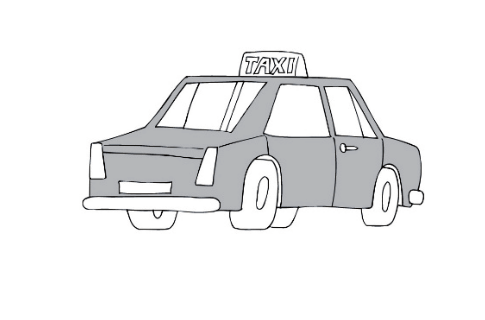
- [B] 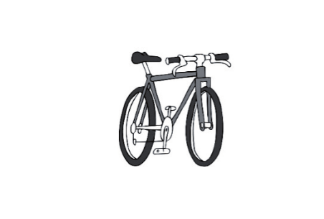
- [C] 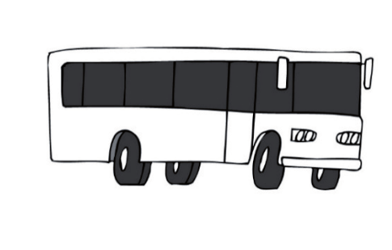
- [D] 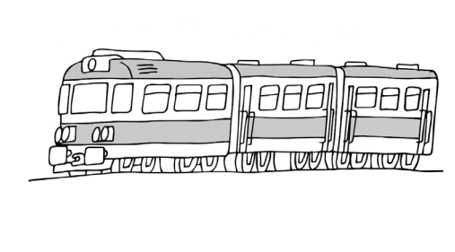

# 2 Which dining room set does the woman want to have?
[audio 2](./audio/07%20CD%20TRACK.mp3)

- [A] 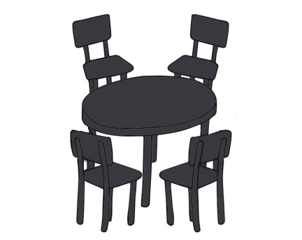
- [B] 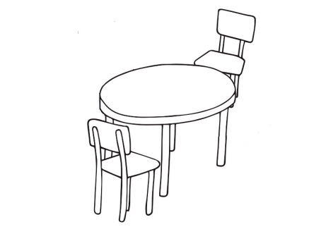
- [C] 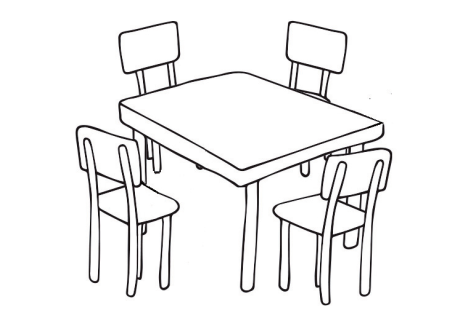
- [D] 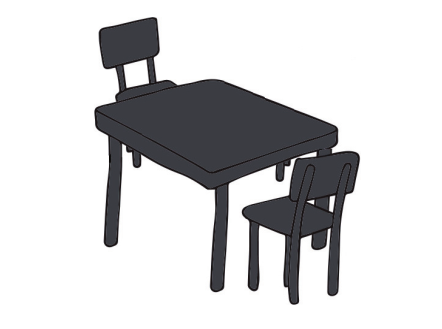

# 3 What does the wife want her husband to do this Saturday?
[audio 3](./audio/09%20CD%20TRACK.mp3)

- [A] 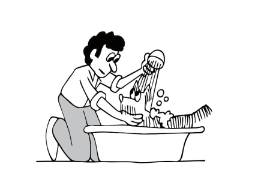
- [B] 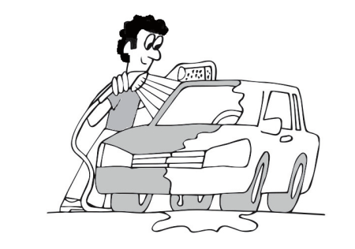
- [C] 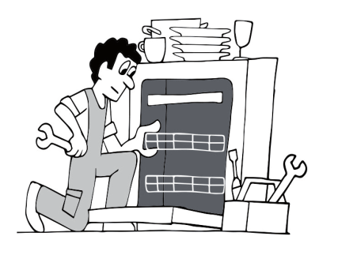
- [D] 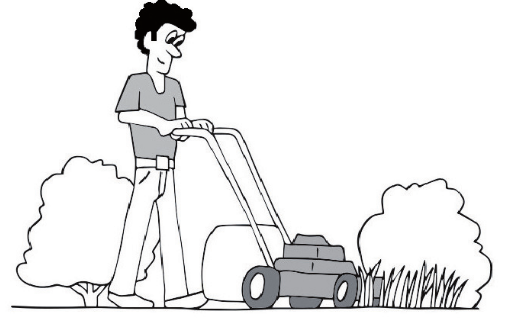

# 4 Where will Barry have his birthday party?
[audio 4](./audio/11%20CD%20TRACK.mp3)
- [A] 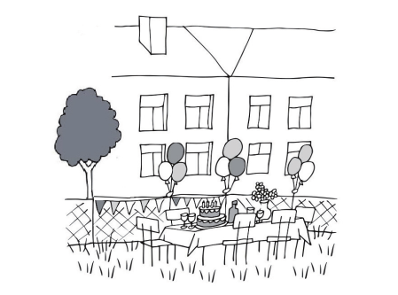
- [B] 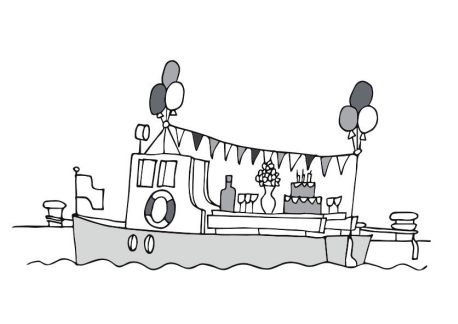
- [C] 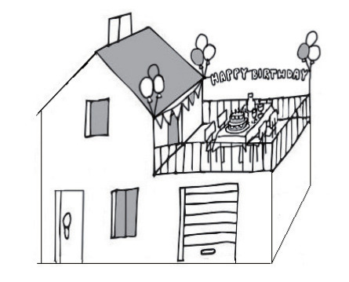
- [D] 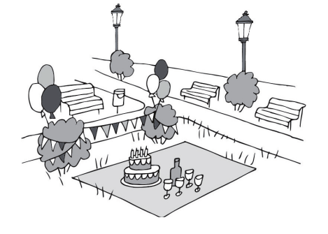

POSLECH - 2. ČÁST - ÚLOHY 5–12
===
> Uslyšíte rozhovor mezi bratrancem a sestřenicí o jejich rodinách. Na základě vyslechnuté 
> nahrávky **rozhodněte**, zda jsou tvrzení v úlohách **5–12 pravdivá (P)**, nebo **nepravdivá (N)**.
> \
> [audio 5](./audio/15%20CD%20TRACK.mp3)

 

# 5 The last time Alice and Billy saw each other was in February. 
# 6 Billy is older than his cousin Alice.  
# 7 Alice does not have Billy’s mother’s phone number in her contact list. 
# 8 Billy is getting married in September. 
# 9 Billy liked Alice’s wedding dress.  
# 10 Alice and her sister Emma are twins. 
# 11 Billy thinks Alice’s sister Emma can be trusted.  
# 12 Alice has prepared sandwiches for Billy’s visit. 

POSLECH - 3. ČÁST - ÚLOHY 13–20 
===
> Uslyšíte část rozhlasového pořadu o nezávislých knihkupectvích. Na základě vyslechnuté 
> nahrávky **odpovězte** v anglickém jazyce na otázky v úlohách **13–20**. V odpovědích použijte 
> **nejvýše 3 slova**. Čísla můžete zapisovat číslicemi.
> \
> [audio 6](./audio/21%20CD%20TRACK.mp3)
> 
> Find Your Bookshop

# 13 How many independent bookshops are there in the UK?
# 14 What is the name of the independent bookshop in the city of Belfast?
# 15 What colour is the building where the bookshop is situated?
# 16 What does the bookshop sell apart from books?
# 17 What evening event takes place in the bookshop on Fridays?
# 18 What piece of furniture in the bookshop is the reporter’s favourite?
# 19 What type of flower is on the bookshop wrapping paper?
# 20 On what date will *World Book Day* be celebrated in the UK next year?
on _______ (day and month)

POSLECH - 4. ČÁST - ÚLOHY 21–24 
===
> Uslyšíte **čtyři** krátké nahrávky. Nejprve uslyšíte otázku a poté vyslechnete nahrávku. Na základě 
> vyslechnutých nahrávek **vyberte** k úlohám **21–24** vždy jednu správnou odpověď **A–D**.

# 21 Which rule regarding the shared fridge must everyone follow?
[audio 7](./audio/26%20CD%20TRACK.mp3)
- [A] Put your name on your food.
- [B] All food must be in plastic boxes.
- [C] Check on your food once a month.
- [D] All drinks must be in the fridge door.
# 22 How does the man learn a foreign language?
[audio 8](./audio/28%20CD%20TRACK.mp3)
- [A] by living abroad
- [B] by dating a foreigner
- [C] by studying at a school
- [D] by watching movies with subtitles
# 23 What does the woman think of her holiday in Rome?
[audio 9](./audio/30%20CD%20TRACK.mp3)
- [A] It was fun.
- [B] It was tiring.
- [C] It was too short.
- [D] It was too expensive.
# 24 What does the man advise Jane to do?
[audio 10](./audio/32%20CD%20TRACK.mp3)
- [A] to go on holiday
- [B] to take some pills
- [C] to lose some weight
- [D] to do some exercise

ČTENÍ A JAZYKOVÁ KOMPETENCE - 5. ČÁST - ÚLOHY 25–29
====

> Přečtěte si **pět** krátkých textů. Na základě informací v textech **vyberte** k úlohám **25–29** vždy 
> jednu správnou odpověď **A–D**.

# 25 What is going to take place in the building next weekend?

> **ATTENTION TENANTS[^1]!**
>
> Next weekend on September 9th and 10th, there will be workers in our building. Following 
> the recent front and back door camera installation, they will come to take care of the promised 
> colour change of the hallway walls. Because the painters will need our lift, please, only use it 
> when they aren’t using it. Or, use the stairs that weekend if possible. You will find the exact work 
> schedule for each floor in your letter boxes. Remember that the boxes will be changed for new 
> ones two days before the workers arrive, as agreed. Please also note that the newly installed 
> front and back door cameras will be out of order for a while due to the work on September 9th 
> and 10th. Thank you.
>
> (*CZVV*)
>
> [^1]:tenant: nájemník

- [A] The lift is going to be out of order.
- [B] The hallway walls are going to be painted.
- [C] Front and back door cameras are going to be installed.
- [D] The old letter boxes are going to be replaced with new ones.

# 26 What is the best title for the article?

> Last week a woman from Fraddon, Cornwall got up at 6 am to work in the garden before it got 
> too hot. She took her new puppy with her to let it play. While she was working, she suddenly 
> heard a strange noise. Her puppy must have heard the noise, too, because it started running 
> towards the sound. The woman ran after the noise as well and got a shock when she discovered 
> that a newborn puppy was making the noise. It was clear that the puppy had been in the garden 
> overnight. The woman phoned her neighbour to ask him if he was searching for a puppy. He 
> had no idea what she was talking about until he discovered that his dog, Sadie, had given birth 
> to puppies in the night. Somehow one got into the woman’s garden. Her neighbour arrived in 
> a minute, thanked her for calling him, and went home with the puppy to take care of it. If you 
> want any of his dog’s puppies, call 1726 862929. The owner will be giving them away instead of 
> selling them.
> 
> (*CZVV*)

- [A] A Woman Found a Puppy in Her Garden
- [B] A Man Offers His Dog’s Puppies for Sale
- [C] A Man Searched for One of His Dog’s Puppies
- [D] A Woman Left Her Puppy in the Garden Overnight

# 27 What is true about the museum called *The Art in Island*?

> ***The Art in Island***
> In the Philippines, there is a museum called *The Art in Island* which was opened by a group of 
> Korean artists, and it has one hundred unique 3D pictures from all over the world. Each picture 
> was created by photographing the original paintings from specific positions to create an optical 
> illusion. This makes you think you’ve become a part of the picture when you look at it! Each room 
> shows a different theme. There are even some classics such as *Water Lilies* by Claude Monet, but, 
> of course, these are versions made for the museum. In the future the museum hopes to expand 
> its collections with some unique Korean art, which is missing at the moment. The museum will 
> also include workshops to teach art students how to make 3D pictures.
> 
> (*www.boredpanda.com, upraveno*)

- [A] It shows a collection of unique Korean art.
- [B] It’s showing an original Monet painting at the moment.
- [C] Its pictures make visitors think they are inside of them.
- [D] It offers classes for art students to paint 3D pictures there.

# 28 When did Vanessa arrive home from her parents’ house last year?

> **Last Year’s Drive Home** (*blog by Vanessa Argyl*)
> 
> Every year my husband and I meet my family at my parents’ house on December 24th and we 
> always go home on the 27th in the morning. Last year we left on the usual day, but after lunch. It 
> was Tuesday and we didn’t expect any traffic jams, and indeed there weren’t any. But what we also 
> didn’t expect was the weather that day. Two hours after leaving, it started snowing heavily. We 
> had to stop by the roadside and wait for the snowstorm to end. Soon we realised we would have 
> to wait there until morning. Would you believe that we spent the 28th there as well waiting for 
> firemen to help us get home? When they finally got to us on Thursday morning, we were cold and 
> hungry. They quickly warmed us up, gave us some snacks and drove us home. We had to wait until 
> Friday the 30th to be able to get our car back too. I wish we had left my parents’ house on the 27th in 
> the morning as usual. I am sure we would have arrived home that day and not on the 29th.
> 
> (*CZVV*)

- [A] December 27th
- [B] December 28th
- [C] December 29th
- [D] December 30th

# 29 What did Claire learn about herself during the two-month quarantine?

> **What did you learn about yourself during the two-month quarantine?**
> 
> *Claire Matthews, 17, Lakeside High School, New Hampshire:*
> 
> Well, I had just started to make friends at my new school, so when my new social life stopped 
> due to the pandemic, I was upset. See, I enjoyed being alone after school, doing homework 
> and such. But being alone most of the day wasn’t enjoyable at all. It surprised me how much it 
> bothered me. On the other hand, I didn’t have to set my alarm clock for 6:00 am for two months. 
> It was great, because being up so early has always been a nightmare for me. Unfortunately 
> getting up early is back now. However, I deal with it much better now because I discovered that 
> I’m not bad at handling stressful situations at all. See, I created a daily schedule and followed it 
> the whole time. That made me calm. To reduce stress, I also tried eating only healthy meals and 
> avoiding things like hamburgers, chips, chocolate, cakes, and cookies. I realised that I could live 
> without hamburgers and chips, but not the other three things. I couldn’t live without them.
> 
> (*CZVV*)

She learnt that:
- [A] she enjoys being alone.
- [B] she can give up sweets.
- [C] she likes getting up early.
- [D] she can deal with stress well.

ČTENÍ A JAZYKOVÁ KOMPETENCE - 6. ČÁST - ÚLOHY 30–39
====

> Přečtěte si tvrzení v úlohách **30–39** a informační text o slavném mrakodrapu The Comcast 
> Building v New Yorku. Na základě informací v textu **rozhodněte**, zda jsou tvrzení **pravdivá (P)**, 
> nebo **nepravdivá (N)**.

> **The Comcast Building**
> 
> 30 Rockefeller Plaza, New York City
> 
> **BASIC INFO** -> The Comcast Building is a skyscraper, which has 66 floors and it is best known 
> as the home of the NBC television network, and for the Rainbow Room. It is the 28th tallest 
> building in New York City and the 60th tallest in the United States. It is 400 feet shorter than 
> the Empire State Building which lies south of the Comcast Building.
> 
> **OWNERS** -> The construction of the building started in 1932 when businessman 
> John D. Rockefeller Jr. and his family’s company finally found the land to build it on. When 
> it was finished, its owners – the Rockefeller family company – rented some space to NBC, 
> an entertainment company. In 2000, after almost seventy years of owning the skyscraper, 
> the Rockefellers sold the building to Tishman Speyer Properties, a real estate company, 
> which has owned it ever since. The Comcast Building is one of the most desired locations for 
> companies looking for office space in New York City’s most prestigious business district. British 
> company Deloitte, for example, moved into the skyscraper recently.
> 
> The owner has the whole building checked regularly. The last time was in 2019, five years after 
> the last total repair of the building, which was carried out in 2014.
> 
> **MOST FAMOUS PLACES IN THE COMCAST BUILDING**
> 
> **THE ROOF**
> 
> This is a place from which visitors have an amazing view of the city. Visitors can only use one 
> lift to get there. It starts on the ground floor and goes directly to the roof. The other 59 lifts 
> in the building are only used to get to the other floors. On a clear day, visitors can even see 
> planes approaching and leaving John F. Kennedy International Airport. If the roof was a few 
> feet higher, the airport itself could be seen as well. In 1960, a 400-pound weather radar 
> was installed on the very top of the Comcast Building. It was used for weather forecasts for 
> thirty-five years. Although it is now out of service, it remains in its original location due to its 
> historic value.
> 
> **THE RAINBOW ROOM**
> 
> This is a restaurant on the top floor of the 66-floor building. It is listed among the most popular 
> places for weddings in New York City. On weekdays, it opens at 4:30 pm and closes at midnight. 
> During opening hours, the Rainbow Room serves dinner to more than a thousand visitors 
> every day. However, there were four times when the famous restaurant could not do that, 
> either due to renovation or financial difficulties. The last time this happened was ten years ago. 
> Let’s hope it doesn’t have to close again soon.
> 
> **NBC STUDIOS**
> 
> These are TV studios where many top talk shows are filmed. Many viewers think that 
> the studios are on the top floors of the 66-floor building. That is because a large picture of 
> the view from the top of the building is often used as a background for the shows. However, 
> the studios fill the building’s first fourteen floors. The studios are open to the public from 
> 8:20 am to 2:20 pm on weekdays. The number of tickets per hour is limited to 150 so that 
> the total number of visitors a day is less than one thousand. Tours of the studios actually began 
> as early as 1933, soon after the studios started working. The NBC studios have always been 
> open to the public except for one year in which tours weren’t possible. However, the studios 
> have never stopped working for a single day in its 90-year history.
> 
> In 2012, Hurricane Sandy hit New York City and damaged a lot of buildings. The NBC studios 
> staff reported on the hurricane. They did so despite the danger of being in the Comcast 
> Building at that time. The skyscraper itself remained whole and all right although it was 
> expected to be damaged by strong winds.
> 
> (*www.rockefellercenter.com, upraveno*)
 

# 30 The Comcast Building is located south of the Empire State Building.  
# 31 Two companies have owned the Comcast Building so far.  
# 32 The last time the whole Comcast Building was repaired was in 2014.  
# 33 There are 60 lifts altogether in the Comcast Building.  
# 34 You can see John F. Kennedy International Airport from the roof of the Comcast Building.  
# 35 The weather radar on the top of the Comcast Building is still used for weather forecasts.  
# 36 The Rainbow Room and the NBC studios are on the same floor.  
# 37 On weekdays, the Rainbow Room has more visitors than the NBC studios.  
# 38 The Rainbow Room and the NBC studios both stopped working for some time in the past.  
# 39 The Comcast Building was damaged by Hurricane Sandy in 2012.

ČTENÍ A JAZYKOVÁ KOMPETENCE - 7. ČÁST - ÚLOHY 40–44 
===

> Přečtěte si článek o stylu oblékání mladého Angličana. Na základě informací v textu vyberte 
> k úlohám 40–44 vždy jednu správnou odpověď A–D.

> **Fan of the 1810s Only Wears Historical Clothes**
> 
> Zack Pinsent, a 25-year-old man from Brighton, has chosen to reject modern fast fashion and 
> only wear 1810s-style clothing. The 1810s was a period of ten years known as the Regency 
> era so Zack is sometimes called a Regency-era gentleman. Zack burned his last pair of jeans in 
> a symbolic fire when he was 14, and he has been dressing as a Regency-era gentleman ever 
> since. What’s more, he has been designing clothes for other fans of history since he was 19. 
> After 11 years of wearing 1810s-style clothing Zack is confident and says that wearing these 
> clothes is the only way he can express himself in the 21st century.
> 
> Naturally, people look at Zack Pinsent in his 1810s-style clothing everywhere he goes. They 
> often ask him whether he loves history or whether he is a history professor. They think that 
> is the reason why Zack dresses as a Regency-era gentleman. Zack says, ‘The attention feels 
> good although sometimes I become tired of answering people’s questions. The reason for 
> my initial choice to put on historical clothes had nothing to do with a love of history. It was 
> quite a simple one. My family and I found a box full of my great-grandfather’s old suits from 
> the Regency era after we had moved house. I found that the suits fit me well, so I started 
> wearing them. I was surprised how comfortable I felt in them, I hadn’t expected that. In 
> the end, I wore nothing else. Wearing historical clothing is one of my greatest pleasures today. 
> I can’t imagine feeling comfortable in modern clothes.’
> 
> Zack remembers a surprising moment from his school days, when he was voted 
> the best-dressed person of the year. He won despite never wearing modern clothes to school 
> like everybody else. However, there was one day when people could see Zack in jeans and 
> a leather jacket. This was at a great 1950s-themed party at his classmate’s house. Zack bought 
> the clothes especially for the occasion. He went shopping for the set of clothes with his best 
> friend, who promised to buy it from Zack after the party. Interestingly, Zack saw his best 
> friend a week ago. Zack was walking in a park in his usual clothes when he saw his best friend 
> wearing the same outfit they had bought together. The jeans and the jacket remain the last 
> pieces of modern clothing that Zack has worn.
> 
> As a child, Zack didn’t care about fashion and his mother chose or made all his clothes. When 
> he began wearing 1810s-style clothing, he was lucky to have an uncle who knew a lot about 
> history and historical clothes. He became Zack’s advisor. After wearing out his first suits, Zack 
> now designs and hand-sews all his sets of clothes himself. Sometimes it takes him ten months 
> to make them perfect. Zack believes that his designs fit even better than those made by 
> a professional tailor.
> 
> And how do people usually react to Zack? He says, ‘I got used to the looks I receive, and I know 
> that people aren’t studying me to make me feel embarrassed. At first, I was worried that people 
> would be rude or upset by what I wear in public places. To my surprise, this has never been 
> the case. Everywhere I go, people are keen on knowing more about my clothes. But I must say 
> that I still feel a little nervous when a huge group of football fans walk towards me. My natural 
> reaction is to look down in a shy manner to prevent aggressive behaviour. However, football 
> fans have always been kind and asked me questions about the clothes.’
> 
> (*www.bbc.com, upraveno*)

# 40 At what age did Zack Pinsent begin to wear 1810s-style clothing?
- [A] at age 11
- [B] at age 14
- [C] at age 19
- [D] at age 25
# 41 Why did Zack first dress in historical clothes?
- [A] to attract attention
- [B] to feel comfortable
- [C] to express a love of history
- [D] to try out clothes he’d discovered
# 42 Where did Zack last wear modern clothes?
- [A] to a party
- [B] to school
- [C] to a shop
- [D] to a park
# 43 Who sews Zack’s historical clothes?
- [A] his mum
- [B] his uncle
- [C] Zack himself
- [D] a professional tailor
# 44 What is the usual reaction of people when they see Zack?
They are:
- [A] angry.
- [B] curious.
- [C] shocked.
- [D] embarrassed.

ČTENÍ A JAZYKOVÁ KOMPETENCE - 8. ČÁST - ÚLOHY 45–49 
===
Přečtěte si požadavky **pěti** skupin anglických středoškolských studentů, které chtějí jet na 
čtyřdenní školní výlet, a nabídky resortů. Na základě informací v textech **přiřaďte** k úlohám 
**45–49** vždy jednu odpovídající nabídku **A–G**. **Dvě** nabídky jsou **navíc** a nebudou použity.

# 45 Grapevine Secondary School students _____
They want to stay at a resort in the mountains in little huts. They refuse to spend 
the nights in tents. They want the resort to have a shared kitchen in which they can 
prepare their meals. They need the resort to have a sports facility[^1].
# 46 Coral Spring School students _____
They want to go to a resort in the mountains where they can stay at a hostel. The resort 
must offer some kind of cultural event. They can either cook their own meals in a shared 
kitchen or eat in the restaurant. It is not important for them.
# 47 H. C. Dylton School students _____
They can’t wait to spend their school trip at the seaside sleeping in tents. They hope it’ll 
be more fun than last year’s stay in little huts in the mountains. They want to cook their 
own meals, so there must be a shared kitchen. There must be a sports facility1.
# 48 Redlands Secondary School students _____
They want to stay at a resort where they can stay in little huts. They want the resort to be 
at the seaside and to offer some kind of cultural event. If there is no restaurant at the resort 
and visitors have to cook their own meals in a shared kitchen, they won’t go there.
# 49 Silverleaf Hill School students _____
After a trip to the seaside last year, they now want to go to a resort in the mountains 
where putting up tents is allowed. It is important to them that there is a sports facility1 at 
the resort. They don’t care if there’s a restaurant or a shared kitchen for visitors.
[^1]:sports facility: sportoviště

RESORTS FOR SCHOOL TRIPS

- [A] Come to **The Shallows Resort**. It is located 
in the Blue Mountains, away from the sea, 
and offers accommodation either in little 
huts, or a hostel, or an area where visitors 
can put up their tents. There is a big shared 
kitchen at Shallows where all visitors can 
do their cooking as there’s no restaurant. 
Why not watch a film every night in 
the outdoor cinema? It is the only free-time 
activity the resort offers.
- [B] Visit **The Glyndŵr Resort**, a resort at 
the seaside in Wales. Apart from a beautiful 
view of the sea, visitors also get an amazing 
view of the Black Mountains 50 km 
away. There are little huts and a hostel in 
the resort. In the hostel, visitors will find 
a restaurant where daily meals are served. 
There is also a large gym in the hostel 
where all visitors can work out. For cultural 
events, visitors have to go to the nearby 
city.
- [C] Spend your free time in **The Wrentrood 
Resort** in the Helve Mountains, 20 km from 
the seaside. The resort offers a large flat 
area for visitors’ tents, and a main building 
with a restaurant and a small cinema. 
Please note that cooking your own meals 
is not allowed. Apart from the cinema 
where visitors can watch popular films 
every night, there are two tennis courts in 
the resort for those keen on sports.
- [D] Welcome to **The Mareford Resort**, a resort 
at the seaside, where visitors can have fun 
at a pool or two tennis courts. The pool 
is in the hostel, where visitors can find 
accommodation. One of the tennis courts 
is behind the little huts in which visitors 
can stay. The second court is at the resort’s 
area where visitors can put up their tents. 
A shared kitchen is available to all visitors. 
To enjoy cultural events, visit the city just 
 5 km away.
- [E] Do you fancy a beautiful view of 
the sea from the mountains? Then visit 
**The Pressard Resort**, a resort in the Bennies 
Mountains, 20 km from the sea. After visitors 
put up their tents, they can explore the only 
building in the resort. This is where visitors 
will find bathrooms, a restaurant, a shared 
kitchen and a large room where concerts 
and disco dancing take place daily. There are 
no sport facilities1 in the resort.
- [F] Welcome to **The Dogskills Resort**, a resort 
where accommodation is possible in little 
huts with a beautiful view of the Grampian 
Mountains where the resort lies. To 
entertain themselves, visitors can listen to 
live music in the main building every night, 
or play baseball on the baseball field next 
to the main building. As for meals, come to 
the resort’s restaurant, or make your own 
meals in the shared kitchen in the main 
building. It’s up to you.
- [G] Visit **The Kearcove Resort**, a resort at 
the seaside in Cornwall. Besides a pool, 
visitors can play beach volleyball there. 
In the evenings, an outdoor dance floor 
and a live band are available. Visitors to 
Kearcove can stay in little huts or a hostel 
where they will also find a shared kitchen 
and a restaurant. These two places are 
the only places in the resort for visitors to 
eat or make meals.

ČTENÍ A JAZYKOVÁ KOMPETENCE - 9. ČÁST - ÚLOHY 50–64
===
> Přečtěte si článek o ostrově Tangier. Na základě textu vyberte k úlohám 50–64 vždy jednu správnou odpověď A–C.

> **Tangier Island – The Disappearing World**
> Tangier is a special place. People who come to the island say they didn’t (**50**) _________ a place 
> like this still existed in the USA. Tangier is a tiny island with 460 inhabitants. It (**51**) _________ 
> ninety miles south-east of Washington, DC, in the middle of Chesapeake Bay. It is a peaceful 
> island where there are almost (**52**) _________ cars. People don’t lock their doors, mobile 
> phones don’t work there, (**53**) _________ you won’t find alcohol for sale in the island’s grocery 
> store. If visitors bring their own alcohol, they (**54**) _________ asked not to drink it in public. 
> (**55**) _________ the past few hundred years, the only way to get on and off the island has been 
> by boat. This is why the island is one of the last places in the USA (**56**) _________ people still 
> speak the language of their colonial past.
> 
> When you (**57**) _________ people from the island, you immediately notice they do not 
> speak the same way as the rest of the people in the USA. Many words (**58**) _________ by 
> the inhabitants of Tangier are similar to the language of the first English settlers[^1]. Some people 
> have even described the Tangier way of speaking as ‘Elizabethan’ English. (**59**) _________ to 
> the strange accent, there are more than 300 expressions that don’t exist anywhere else. 
> 
> The inhabitants also use (**60**) _________ words that are from the 17th century – the time when 
> people sailed over from England.
> 
> People living on the island (**61**) _________ about the future of their language. With limited jobs 
> on the island, many people (**62**) _________ to leave Tangier to find work on the mainland USA. 
> Modern technologies are also a great danger to the language. According (**63**) _________ many 
> experts, the special way of speaking on the island is disappearing.
> 
> It is not only the language that is disappearing. At (**64**) _________ highest point, the island 
> is only 1.2 metres high, and as sea waters rise due to climate change, more than 35,000 m^2^ of 
> Tangier disappear each year. Scientists fear the island may be completely underwater by 2050.
> 
> (*www.tangier-island.com, upraveno*)
> 
> [^1]:settler: osadník

# 50 
- [A] realise 
- [B] find 
- [C] mean
# 51 
- [A] locates 
- [B] is locating 
- [C] is located
# 52 
- [A] any 
- [B] not 
- [C] no
# 53 
- [A] so 
- [B] and 
- [C] but
# 54 
- [A] will 
- [B] are 
- [C] were
# 55 
- [A] From 
- [B] Since 
- [C] For
# 56 
- [A] where 
- [B] which 
- [C] who
# 57 
- [A] meet 
- [B] met 
- [C] will meet
# 58 
- [A] are used 
- [B] used  
- [C] using
# 59 
- [A] Except 
- [B] As well 
- [C] In addition
# 60 
- [A] much 
- [B] a lot 
- [C] several
# 61 
- [A] are afraid 
- [B] are worried 
- [C] are frightened
# 62 
- [A] have 
- [B] must 
- [C] should
# 63 
- [A] for 
- [B] to 
- [C] —
# 64 
- [A] it’s 
- [B] his 
- [C] its