POSLECH - 1. ČÁST - ÚLOHY 1–4
===
> Uslyšíte **čtyři** krátké nahrávky. Nejprve uslyšíte otázku a poté vyslechnete nahrávku. Na základě vyslechnutých nahrávek **vyberte** k úlohám **1–4** vždy jeden správný obrázek **A–D**.

# 1 What shirt will the man wear to the party?
[audio 1](./audio/05.%20CD%20TRACK.mp3)
- [A] 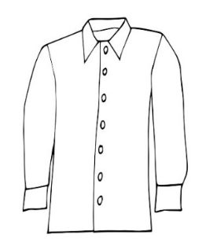
- [B] 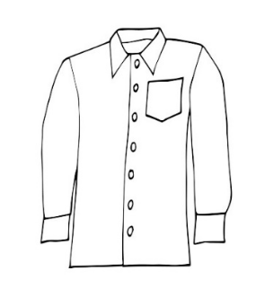
- [C] 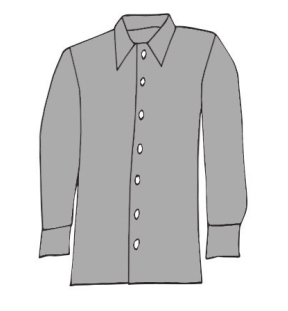
- [D] 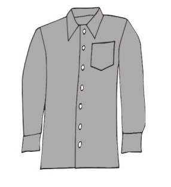
# 2 What did the young man enjoy last Sunday?
[audio 2](./audio/07.%20CD%20TRACK.mp3)
- [A] 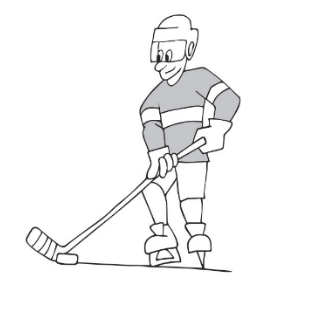
- [B] 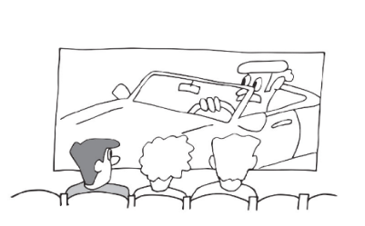
- [C] 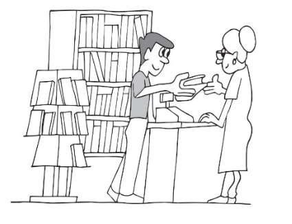
- [D] 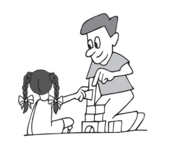
# 3 Which Christmas tree did the woman have last Christmas in the end?
[audio 3](./audio/09.%20CD%20TRACK.mp3)
- [A] 
- [B] 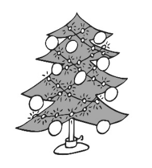
- [C] 
- [D] 
# 4 Which animal does Mary not have on her farm? 
[audio 4](./audio/11.%20CD%20TRACK.mp3)
- [A] 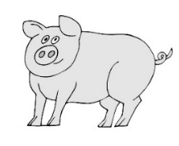
- [B] 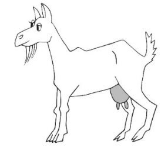
- [C] 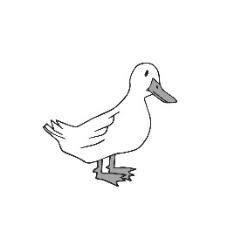
- [D] 

POSLECH - 2. ČÁST - ÚLOHY 5–12 
===
> Uslyšíte rozhovor o Havaji mezi spolužáky ze školy v New Yorku.
> Na základě vyslechnuté nahrávky **rozhodněte**, zda jsou tvrzení v úlohách **5–12 pravdivá** (**P**), nebo **nepravdivá** (**N**).\
> \
> [audio](./audio/15.%20CD%20TRACK.mp3)

# 5 Jack’s grandparents live in the capital of Hawaii.
# 6 Rosie always takes a non-stop flight from New York to Hawaii. 
# 7  The first time Jack ever went surfing was in Hawaii.
# 8 Rosie looked after her niece in Hawaii last year
# 9 Jack says that the best time to visit Hawaii is in the autumn
# 10 Rosie wants to live in Hawaii one day.
# 11 Jack likes Rainbow Falls.
# 12 Rosie and Jack will meet in Hawaii next year.

POSLECH - 3. ČÁST - ÚLOHY 13–20
===

> Uslyšíte učitele hovořit o divadelním představení.
> Na základě vyslechnuté nahrávky **odpovězte** v anglickém jazyce na otázky v úlohách **13–20**. V odpovědích použijte **nejvýše 3 slova**.
> Čísla můžete zapisovat číslicemi. 
> \
> [audio](./audio/21.%20CD%20TRACK.mp3)

# 13 What is the website of the theatre company coming to the school?
www._____________.com  
# 14 What is the name of the play to be performed at the school?
The _____________
# 15 On what date is the performance at the school?
on _____________ 
# 16 Where in the school will the performance take place? 
in the _____________ 
# 17 What time does the performance start?
at _____________ 
# 18 What prize can students win in the competition after the performance? 
_____________ 
# 19 Who will collect the money for the tickets this time?  
_____________ 
# 20 How much is a ticket for the performance this year?
£ _____________

POSLECH - 4. ČÁST - ÚLOHY 21–24 
===
> Uslyšíte **čtyři** krátké nahrávky. Nejprve uslyšíte otázku a poté vyslechnete nahrávku. Na základě 
> vyslechnutých nahrávek **vyberte** k úlohám **21–24** vždy jednu správnou odpověď **A–D**.

# 21 Which building in town has already  been completely repaired?
[audio 7](./audio/26.%20CD%20TRACK.mp3)
- [A] the library
- [B] the school
- [C] the railway station
- [D] the swimming pool

# 22 Why does the man want to return the shoes?
[audio 8](./audio/28.%20CD%20TRACK.mp3)

because of their:
- [A] size
- [B] price
- [C] colour
- [D] material

# 23 Why is Sophie calling her father?
[audio 9](./audio/30.%20CD%20TRACK.mp3)
- [A] to ask for his car
- [B] to invite him to lunch
- [C] to recommend a TV show
- [D] to say happy birthday to him
# 24 How does Susanne prepare for tests?
[audio 10](./audio/32.%20CD%20TRACK.mp3)
- [A] by typing her notes on her PC
- [B] by reading the textbook out loud
- [C] by watching videos on the given topic
- [D] by talking about the given topic with someone

ČTENÍ A JAZYKOVÁ KOMPETENCE - 5. ČÁST - ÚLOHY 25–29
===

> Přečtěte si **pět** krátkých textů. Na základě informací v textech **vyberte** k úlohám **25–29** vždy jednu správnou odpověď **A–D**.

# 25 Who invented the potato chip?

**Crispy Delight: The Invention of the Potato Chip**
> Eighty years before businessman Herman Lay founded the Lays Company, known today for 
> its potato chips, an incident took place at a resort in Saratoga Springs, New York. A customer 
> complained that the resort’s chef’s French fries were too thick. So, George Crum, the chef, 
> sliced the potatoes paper-thin and deep-fried them until crispy. The result was a revolutionary 
> creation – the first potato chip. At first, it was a regional specialty, but as mass production 
> techniques came in, potato chips became popular everywhere. It was William Tappenden who 
> began producing potato chips commercially. He was using a mechanical slicer invented by Mae 
> Gripp and her husband William. The Gripps’ invention really helped the production of potato 
> chips. Today, millions of bags of potato chips are produced in factories. 
> 
> (*www.snopes.com, upraveno*)

- [A] Herman Lay 
- [B] George Crum 
- [C] William Tappenden 
- [D] Mae and William Gripp

# 26 What did David Spargo do according to the article?

**An Australian Band’s Fan**
> David Spargo is a fan of the Australian band *Peking Duk*. After a concert in Melbourne, David 
> went backstage to their dressing room, but a security guard stopped him. David showed him 
> his ID and told him he was a band member’s cousin. To prove it, David opened *Peking Duk’s* 
> Wikipedia webpage on his phone and showed the guard his name there. So the guard let 
> David in. David introduced himself to the band who had no idea who he was. They thought he 
> was another fan using a fake ID to meet them. When David told them that he had added his 
> name to their Wikipedia webpage only a few minutes before, they couldn’t believe it. ‘It was 
> the smartest thing ever. It reminded me of my cousin who also did all kinds of crazy things to 
> meet his favourite artists backstage and made some people angry because of it. But we couldn’t 
> get annoyed with David. He was the first fan to get backstage without a fake ID. And that’s 
> something!’ said a band member.
> 
> (*www.mentalfloss.com, upraveno*)

- [A] He made the band members angry. 
- [B] He showed a security guard a fake ID. 
- [C] He changed some facts on a webpage.
- [D] He met his cousin backstage at a concert.  

# 27 What is this piece of news about?

> People travelling to work by public transport daily have been in various situations. Delays and 
> cancellations of services can make their lives harder, and we’re not just talking about heavy rain 
> or icy roads in the winter. Sometimes the situations are rather crazy. For example, last Friday 
> people taking a morning bus to south London saw a large lorry stuck under a railway bridge. It 
> couldn’t move. The situation was funny because the lorry had the slogan ‘WE FIT’ on it. However, 
> the passengers failed to see the funny side of it as they were going to be late for work. The driver 
> of the lorry, which was half a metre taller than the bridge, was half asleep in the rainy morning 
> weather. The company owner apologised at the weekend to road and train travellers for all the 
> delays caused with an amusing statement: ‘WE FIT. Except when we do not. Sorry.’
>
> (*CZVV*)

- [A] weekend traffic 
- [B] weather forecast 
- [C] a lorry driver’s apology 
- [D] passengers’ experiences 

# 28 Who was borrowed most often from the Human Library in 2021?

**Welcome to the Human Library**

> In Denmark, there is a library where visitors can borrow people instead of books. They meet the 
> people there at a certain time and listen to their life stories for 30 minutes. The goal is to share 
> situations with people that they have not experienced. Visitors can also come to ask for help. The 
> library went online in 2020 and it became especially popular in 2021 due to the difficult times 
> everybody was experiencing during the pandemic. That year, a thousand visitors borrowed 
> someone with financial difficulties. Twice as many visitors came to talk to someone with lots of 
> children. Most of the visitors had only one or two kids but they found it hard anyway. So, these 
> visitors looked for help in the library. Around eight hundred visitors visited the Human Library to 
> talk to unemployed people. This was three hundred visitors more than those who came to talk 
> to someone who was homeless. People with no job were borrowed most often from the Human 
> Library in the previous years, which was a surprising decrease. 
> 
> (*www.humanlibrary.org, inspirováno*)

- [A] people with no job 
- [B] people with no home 
- [C] people with lots of children
- [D] people with money problems

# 29 What is Dion Leonard planning to do?

**A Marathon Runner and a Homeless Dog**
> Scottish extreme marathoner, Dion Leonard, was joined by a homeless female dog in China 
> last month while competing in the Gobi March, a 6-day race. She ran with him to the end of 
> the difficult race. In the end, Dion decided to name the dog Gobi after the race, and to bring 
> her home with him. However, taking an animal out of China is not easy, so Dion left Gobi the 
> dog with a friend and went home to start the months-long legal process. But then last week, 
> he learnt that Gobi was missing. Dion flew back to China to look for Gobi himself. And indeed, 
> he found her, and she was in good health! But it will still take some more time to complete the 
> legal process to move Gobi to Scotland. ‘This time I’ll stay in China with Gobi by my side until it is 
> legally okay for her to leave with me. I’ve already spent all of my prize money on my staying here, 
> but I don’t care,’ says Dion.
> 
> (*www.dogstories.blog, upraveno*)

- [A] take Gobi the dog to Scotland with him 
- [B] go back to China to look for Gobi the dog 
- [C] use his prize money to help Gobi the dog 
- [D] stay in China until Gobi the dog is found 

ČTENÍ A JAZYKOVÁ KOMPETENCE - 6. ČÁST - ÚLOHY 30–39
===
> Přečtěte si tvrzení v úlohách **30–39** a informační text o Muzeu špatného umění (MOBA) v Bostonu. 
> Na základě informací v textu **rozhodněte**, zda jsou tvrzení **pravdivá** (**P**), nebo **nepravdivá** (**N**).

# 30 The Museum of Bad Art was founded [^1] in 1994.
[^1]:found: založit
# 31 MOBA was created by two people.  
# 32 MOBA’s first piece of art was a painting of a lady in a green dress.  
# 33 People can visit MOBA for free.  
# 34 Both pieces of art stolen from MOBA were returned.  
# 35 There is more than one security camera in MOBA.  
# 36 Guests at the Bad Cake Café can buy an item on the menu for $1. 
# 37 Both James L. Chung and Evelyn Rojo have visited MOBA twice. 
# 38 James L. Chung’s interview with the owners of MOBA took place sooner than Evelyn Rojo’s interview with them. 
# 39 Both James L. Chung and Evelyn Rojo have offered to give MOBA a piece of bad art. 

> **THE MUSEUM OF BAD ART (MOBA) IN BOSTON**
> 
> Art too bad to be ignored
> 
> **BASIC INFO** → The first exhibition of bad art in MOBA was shown to the world in March 1994, 
> five months after the museum had been founded[^1] in Boston.
> 
> One day antique dealer Scott Wilson discovered a really bad painting in the trash. He liked 
> how bad it was so much that he took it home. He showed it to his friend Jerry Reilly and that 
> was when they created a museum which they called The Museum of Bad Art. They started 
> collecting bad art and later Reilly’s wife Marie helped them prepare the first exhibition for 
> MOBA. 
> 
> **THE EXHIBITION** → Today there are hundreds of pieces of bad art. MOBA’s first piece of art, 
> which Wilson found in the trash, was a portrait of a lady in a field with flowers. Everything 
> except for her hair, chair, and dress is green, so it is a very lively painting. It is still one of the 
> most popular pieces in the museum. 
> 
> **PRACTICAL INFORMATION** → The museum is open Sun/Mon: 11:30 am – 9 pm, Tue – Thu: 
> 11:30 am – 10 pm, and Fri/Sat: 11:30 am – 11 pm. The highest price the museum asks visitors 
> to pay is $6.50, but not as an admission fee, because there is none. The price is for buying a 
> painting if visitors are interested in any. 
> 
> **INTERESTING FACTS** → Although the art has no value, there were two thefts[^2] in the past. In 
>  1996 a painting called *Eileen* disappeared. The museum immediately offered $36.73 for it, but 
> nobody returned it. The second theft happened in 2004, when a painting called *Self Portrait as a Drainpipe* was taken by someone who demanded $10 for its return. However, very soon the 
> painting just appeared back at the museum door without that money being paid. Surprisingly, 
> the same happened with *Eileen* two years later. The thieves were never found.
> 
> After the first theft, museum staff installed a fake security camera inside the museum. But as 
> it did not prevent the other theft no more cameras were added and the one already installed 
> there became a part of the exhibition. 
> 
> **THE BAD CAKE CAFÉ** → The café offers cakes that look just as bad as the paintings. But it is 
> great fun. Guests can decide how much they want to pay for each item on the menu but never 
> less than a dollar. Sometimes people are willing to pay up to $5 for the last ugly, blue muffin. 
> 
> **JOURNALISTS GIVE THEIR VIEWS:**
> 
> **James L. Chung, The Boston Planet:**
> 
> ‘When I visited MOBA for the first time I had so much fun. So, I soon went again with my whole 
> family. That’s when I asked the owners for an interview. They weren’t available until January 
> 2024, but it was worth the wait. The interview took place outside the museum and was fun. 
> They love their museum and are happy that it has so many visitors each year. There are strict 
> rules about what they accept to become a part of the collection. No children’s drawings are 
> accepted for example. I found that out when I offered some of my son’s bad pictures. The 
> owners really don’t want to make fun of the works; they just want to share joy. I definitely 
> recommend that you visit the museum.’
> 
> **Evelyn Rojo, El Arte:**
> ‘You’ll laugh but MOBA was the first museum I visited in the US when I came here in January 
> 2024. And I intend to visit it more than once. Surprisingly, I met the owners there that January 
> day and I asked them for an interview, which took place online six weeks later. As an art lover, 
> I was interested in their reasons for showing bad art. Are they making fun of the artists? No, 
> don’t worry. They just want to show anything can be art if people like it. I offered to give MOBA 
> an excellent, well-known piece of art for the museum to have something nice, but the owners 
> politely refused. I give MOBA five stars!’
> 
> (*www.museumofbadart.org, upraveno*)
>
> [^1]:found: založit
> [^2]:theft: krádež

ČTENÍ A JAZYKOVÁ KOMPETENCE - 7. ČÁST - ÚLOHY 40–44 
====

> Přečtěte si e-mail mladé sportovkyně ze soustředění v orientačním běhu ve Švédsku.
> Na základě informací v textu **vyberte** k úlohám **40–44** vždy jednu správnou odpověď **A–D**.

> Dear Mum,
> 
> Greetings from training camp in Sweden! The journey to Sweden was long but exciting. The 
> flight from Prague took about two hours. I had a window seat, so I had the chance to enjoy 
> some great views. In Stockholm, I was supposed to hop on a train, but I was late, and the train 
> had already left. There wasn’t another train going in my direction for nearly two hours. So, I 
> waited, got on that one and was lucky my trainer was still waiting to pick me up when I finally 
> arrived at the station near our training camp.  What a patient man! Before he drove me to the 
> hostel the day I arrived, he had taken other athletes from our orienteering club in that same 
> car all the way from Prague. They had to spend eight hours on a ferry to cross the sea from 
> Germany to Sweden. What a cool man! If I had to use a ferry instead of the plane, I wouldn’t go. 
> 
> When I finally got to the training camp hostel, I was tired but also excited to start the training. 
> The hostel is in a forested area, so I was surprised to find there is a big town not far from it. 
> At home, there are usually large forests near villages, not near towns and cities like here. The 
> nearest village is more than thirty miles away. I also thought the hostel would be located near 
> the mountains, but it is flat here. I’m glad because the weather’s really hot and running uphill 
> would make us sweat even more. I miss having water around to cool down in. But thanks to 
> our days spent training near lakes at a far distance from the hostel, there is a chance to have a 
> swim.
> 
> The accommodation is basic but comfortable. I was looking forward to spending time with my 
> friend Julia and sharing a room with her. However, I learned that everybody here must stay on 
> their own as there aren’t rooms for more than one person. Some people appreciate staying in 
> a room with one bed, they say they can relax better that way after training hard. I would still 
> rather share a room with Julia. She was also disappointed when I texted her. She is on her way 
> over here now as she was sick and couldn’t leave for Stockholm with me. I just hope I’m not 
> going to get sick because I hate being alone when I’m not feeling well. 
> 
> The food is tasty here, and we get plenty of it. For breakfast, we typically have bread and 
> cheese or yogurt. I only wish there were eggs, which I love having in the morning and which 
> I never eat at any other time of the day. Lunch and dinner are usually warm meals. We’ve been 
> told that meatballs will be served a few times during our stay. I’m looking forward to trying 
> them here. We had the opportunity to try some fish yesterday and it wasn’t bad, but I’d prefer 
> the meatballs anyway. Desserts are always simple, just pudding or some cookies. So, we’ve 
> decided to bake a pie for ourselves as there are giant blueberries everywhere. There will finally 
> be time for it tomorrow.
> 
> We train hard in the Swedish woods and we learn new techniques. Whenever I make a mistake, 
> my trainer encourages me. And I trust him. We learn how to run fast in these woods full of big 
> stones and it’s much more difficult than I expected. Also, map reading is very different at this 
> training camp compared to what we’re used to, which is an unpleasant surprise. There aren’t 
> many paths here, and all the places look the same. But none of this bothers me. Often, we’re 
> not patient enough and for a moment we regret being here. But improvement needs hard 
> work, right? I know we must always remember the basic skill: quick decision-making. Of course, 
> it can lead to more mistakes, but we mustn’t be afraid to make them. It will only help us not to 
> repeat the same mistakes in the future.
> 
> Love, Adele
> 
> (*CZVV*)

# 40 Which means of transport did Adele not use on her way to the training camp?
- [A] a car  
- [B] a train
- [C] a ferry 
- [D] a plane 
# 41 Where is the training camp hostel located?
- [A] near a lake 
- [B] near a town 
- [C] near a village
- [D] near mountains
# 42 Why is Adele staying alone in her hostel room?
Because:
- [A] it is a single room. 
- [B] she doesn’t feel well.
- [C] she prefers staying alone.
- [D] her friend hasn’t come yet.
# 43 Which of the following foods has Adele tasted at the camp already?
- [A] fish  
- [B] pie 
- [C] eggs
- [D] meatballs 
# 44 What does Adele mean by the fifth paragraph?
She wants to:
- [A] explain why she decided to take part in the training camp. 
- [B] criticize the trainer’s new coaching techniques.
- [C] complain about the training being hard.  
- [D] express the challenges of the training. 

ČTENÍ A JAZYKOVÁ KOMPETENCE - 8. ČÁST - ÚLOHY 45–49 
===
> Přečtěte si požadavky **pěti** anglicky mluvících zahraničních studentů, kteří chtějí příští víkend 
> vyrazit s někým z Česka na jednodenní výlet s odjezdem z Prahy, a nabídky výletů v mobilní 
> aplikaci DayTrip©. 
> Na základě informací v textech **přiřaďte** k úlohám **45–49** vždy jednu odpovídající nabídku **A–G**. Dvě nabídky jsou **navíc** a nebudou použity.

# 45 Joe _____
He wants to go on a day trip and visit a city or a town. He wants to do so next Saturday 
and he wants to travel there and back by train. The person he wants to go with must be  
a student too.
# 46 Jim _____
He wants to go on a day trip by car. He dislikes visiting cities and towns so he wants 
to do some hiking in the countryside. He is looking for somebody to go with next 
Sunday. 
# 47 Kate _____
She wants to spend next Sunday on a day trip with somebody who is a student too. She 
has been to the countryside lately so now she wants to visit a city or a town. She needs to 
get there and back home by car as it’s more comfortable than by train. 
# 48 Susie _____
She wants to go on a day trip with somebody who will go and see a city or a town with 
her next Sunday. She loves railways and she wouldn’t be able to enjoy them if they 
travelled by car. So, they must travel there and back home by train.
# 49 Rose _____
She wants to go on a day trip next Saturday with another student. The student must 
prefer hiking in the countryside to visiting a city or a town because that’s what she wants 
to do. She dislikes trains, so they must go by car.

- [A] Hi, I’m Tonda. I live in Prague where I teach 
English literature at a secondary school. I’m 
offering to take you to visit my hometown 
– Hradec Králové. I’ll walk you through the 
historic centre, you’ll love it! I’m offering 
a ride in my car but I’m also willing to go 
by train with you. In fact, it’s even better 
by train because you’ll see the beautiful 
countryside on the way. I’m free on both 
Saturday and Sunday.
- [B] Hey, I’m Dita. I live in Prague now but I come 
from České Budějovice. I’ll take you there. 
You can see historical buildings and other 
places worth seeing. I’m a history student 
at Charles University so you can ask me 
anything about the places we’ll see! I usually 
go on day trips on Saturdays but I’m busy 
next Saturday so I’m only free on Sunday 
this time. Instead of going by train, I’ll drive 
us there and back to Prague.
- [C] Hello, my name’s Marek. I study maths at 
one of Prague’s universities. I’m from Pilsen, 
a beautiful city with both a cathedral and a 
synagogue. I’m offering to take you hiking 
to the woods and hills near Pilsen. We might 
even find some mushrooms! The easiest way 
to get there is by train, which is what we’ll 
do. The journey is great, you might even get 
a quick look at Karlštejn Castle. Both Saturday 
and Sunday are fine by me, so just let me know 
which one works for you and I’ll be ready.
DayTrip©
 *free travelling for free English*
 *conversation lessons*
- [D] Hi, I’m Veronika and I come from Prague 
where I am attending university to become 
a doctor. If you prefer Saturday to Sunday, 
it’s great as it’s the only day I’m free. I’m 
offering to take you either to visit Brno, a city 
in Moravia, which I know very well, or on a 
hike through woods to the Macocha Abyss, 
near Blansko, north of Brno. I used to drive to 
Moravia but it takes a long time now, so we’ll 
go by train. I hope you don’t mind.
- [E] Hey, I’m Petra and I’m from Prague. I love 
going on day trips at the weekend to cities 
and the countryside. I study psychology at 
university and I have a Saturday job so I’m 
available on Sundays only. I’m offering to 
take you on a hiking trip to Říp, a legendary 
Czech hill. It’s near the town of Terezín, 
which we can visit some other time. I’d like 
to go by train, but if you prefer going by car, 
I’ll drive us.
- [F] Hello, my name’s Katka and I live in Mělník 
but I work full time for Charles University 
where I studied English. I teach it now! I 
love going on day trips. Next weekend I’m 
going to visit Karlovy Vary and I’m offering 
to take you with me either on Saturday or 
on Sunday, it doesn’t matter to me. There are 
interesting natural sites in the area of the spa 
town, so I’m offering to take you hiking some 
other time. I dislike trains, so we’ll go by car.
- [G] Hey, I’m Pavel and I live in Prague now. 
I work as a waiter in Café Palais while 
attending university to become a historian. 
I’m offering to take you to go and see Kutná 
Hora next Saturday, or on a hiking trip to 
Bohemian Paradise, a protected landscape 
area. Just let me know which one you prefer.  
We can do the other some day on a Sunday. 
The best way to get to either place is by 
train. However, there will be repairs taking 
place on both railways so we’ll go by car.

ČTENÍ A JAZYKOVÁ KOMPETENCE - 9. ČÁST - ÚLOHY 50–59 
===

> Přečtěte si článek o nejhlubším bazénu pro potápěče na světě. 
> Na základě textu **vyberte** k úlohám **50–59** vždy jednu správnou odpověď **A–C**.

> **Deep Dive Dubai – The World’s Deepest Swimming Pool**
> 
> The city of Dubai is famous for wonderful world records. There are so many records and there is 
> no one who (**50**) __________ all of them. One of them is Deep Dive Dubai. (**51**) __________ you 
> ever heard about this very deep diving pool open since 2021? Deep Dive Dubai is the only 
> diving pool in the world where it is possible (**52**) __________ to depths of 60 metres. The pool 
> is 15 meters (**53**) __________ than any other diving pool in the world and holds 14 million litres 
> of water. That means it contains as (**54**) __________ water as is in six Olympic-sized swimming 
> pools. 
> 
> The biggest attraction in Deep Dive Dubai is (**55**) __________ underwater city. The pool also 
> offers courses for both diving beginners and certified divers. The pool’s professional diving 
> instructors will (**56**) __________ you advanced diving techniques. (**57**) __________ the pool 
> itself, the attraction is also home to a dive shop, a gift shop, an 80-seat restaurant, conference 
> spaces, and a film studio. 
> 
> In (**58**) __________ you are planning to visit the Burj Khalifa skyscraper, the world’s tallest 
> building, after visiting Deep Dive Dubai, do not go to the top of it as it might be dangerous for 
> your health to change altitudes[^1] so quickly. (**59**) __________, there is no risk in going diving in 
> Deep Dive Dubai after visiting the Burj Khalifa building. 
> 
> (*www.deepdivedubai.com, upraveno*)
> 
> [^1]:altitude: (nadmořská) výška

ČTENÍ A JAZYKOVÁ KOMPETENCE - 9. ČÁST - ÚLOHY 50–59

# 50 
- [A] doesn’t know 
- [B] know 
- [C] knows 
# 51 
- [A] Did 
- [B] Have  
- [C] Do
# 52 
- [A] dive 
- [B] to dive 
- [C] diving
# 53 
- [A] deep 
- [B] deeper 
- [C] the deepest
# 54 
- [A] a lot of 
- [B] much 
- [C] many
# 55 
- [A] its 
- [B] his 
- [C] her
# 56 
- [A] teach  
- [B] learn  
- [C] give
# 57 
- [A] Besides  
- [B] Except 
- [C] Apart
# 58 
- [A] fact 
- [B] case 
- [C] general 
# 59 
- [A] Although 
- [B] In spite 
- [C] However

ČTENÍ A JAZYKOVÁ KOMPETENCE - 10. ČÁST - ÚLOHY 60–64 
===
> Přečtěte si příspěvek na blogu o vysněném povolání. 
> Na základě kontextu **doplňte** do každé z úloh **60–64** vždy **jedno** vhodné slovo ve správném tvaru. Úloha (0) slouží jako **vzor**.

> **A Dream Job**
> 
> I think all people _______**have**_________ their dream jobs. For example, I want to become a 
> writer. I (**60**) ________________ born into a family of biologists. When I was a young child, we 
> used (**61**) ________________ visit zoos, parks, and museums. I also liked reading books and 
> stories about animals. (**62**) ________________ were hundreds of books like those in our house!  
> When I was a bit older, I started to prefer people to animals. I began reading novels full of 
> interesting people’s life stories and I decided to write a short story myself. I think writing stories is 
> much better (**63**) ________________ reading them! I’d really love to (**64**) ________________ as 
> a writer full time one day. I hope my books will find many readers.
> 
> (*CZVV*)

# 60 
# 61 
# 62 
# 63 
# 64 