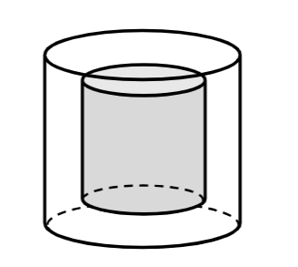
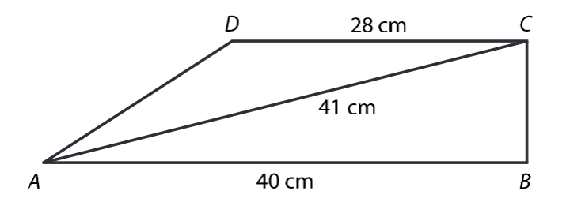
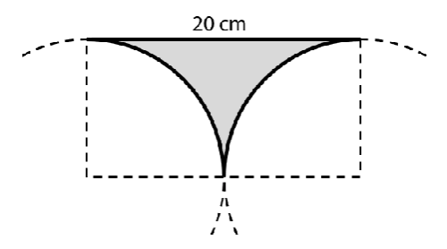
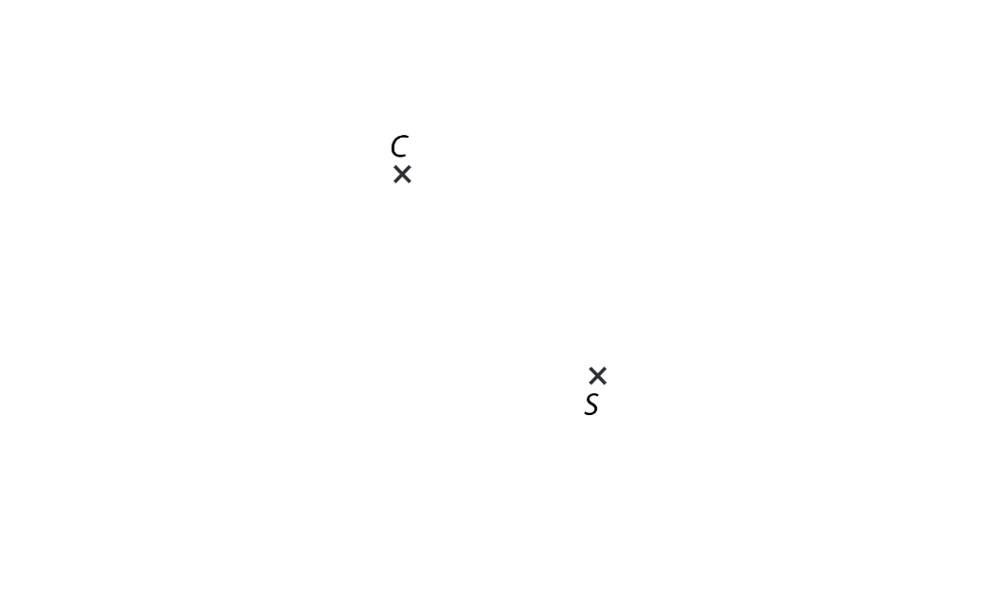
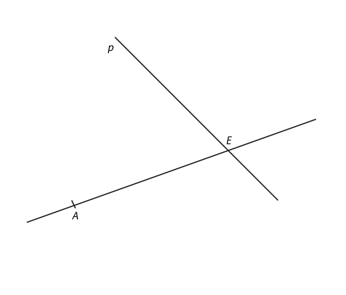
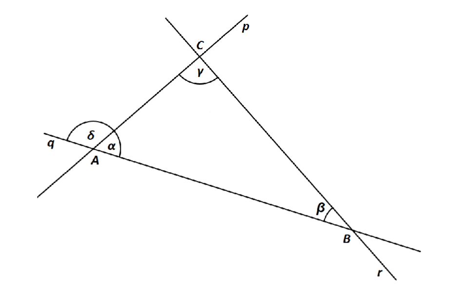
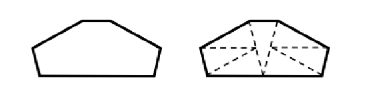
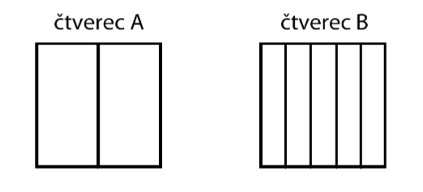

# 1 Pět švadlen, které šíjí oblečení, pracují stejným tempem. Tyto švadleny splní danou zakázku za 24 hodin.
Za jakou dobo splní o polovinu větší zakázku čtyři švadleny?

VÝCHOZÍ TEXT A OBRÁZEK K ÚLOZE 2
===

> Skleněné těžítko má tvar rotačního válce s plolměrem podstavy 10 cm a výškou 12 cm. Vnější část těžítka je z čirého skla, uvnitř je část z modrého skla, která má také tavr rotačního válce, a to s poloměrem podstavy 5 cm a výškou 8 cm.
> 
> 

# 2 Vypočítejte objem čirého skla v těžítku.

Výsledek zaokrouhlete na desítky cm^3^. Pro výpočet použijte zaokrouhlenou hodnotu čísla $\pi$ z tabulky na začátku testového sešitu.

# 3 Vypočítejte a výsledek zapište zlomkem v základním tvaru.
**Do záznamového archu** uveďte u obou podúloh **celý postupu řešení**.

## 3.1
$$
\left(2\div\frac{3}{2}\right)\div\frac{1}{2}+\left(\frac{5}{6}\div\frac{3}{4}\right)\div\frac{2}{3}
$$

## 3.2
$$
\frac{\frac{13}{10}-1,4}{\frac{2}{15}+\frac{1}{6}}
$$

# 4 Proveďte úpravu výrazů.

## 4.1 Zjednodušte (výsledný výraz nesmí obsahovat závorky):
$$
\left(a - \frac{a}{4}\right)^2 =
$$

## 4.2 Rozložte na součin podle vzorce:
$$
9a^2 - 16 =
$$

## 4.3 Zjednodušte a výsledek rozložte na součin vytýkáním:
$$
(c-5)\cdot(2-3c)-(c-2c)\cdot3c-c\cdot7=
$$

**Do záznamového archu** uveďte u podúlohy 4.3 **celý postupu řešení**.

# 5 Řešte rovnice.
**Do záznamového archu** uveďte u obou podúloh **celý postupu řešení**.\
Zkoušku nazapisujte.

## 5.1
$$
-2\cdot(x+4)-3\cdot(x+1)^2 = x\cdot(2-3x)
$$

## 5.2
$$
6-\frac{3-2y}{5}\cdot2 = 4y
$$

VÝCHOZÍ TEXT A OBRÁZEK K ÚLOZE 6
===

> Pravoúhlý lichoběžník ABCD se základnami AB a CD má pravý úhel při vrcholu B.\
> Základna AB má délku 40 cm, základna CD délku 28 cm a úhlopříčka AC délku 41 cm.
>
> 

# 6

## 6.1 Vypočítejte obsah lichoběžníku ABCD.
Výsledek uveďte v cm^2^.

## 6.2 Vypočítejte délku ramene AD.
Výsledek uveďte v cm.

# 7 Žáci třídy 8.B se dělí na dvě skupiny podle toho, zda chodí na němčinu nebo angličtinu. V obou skupinách je stejný počet žáků. Ve třídě je 14 chlapců a 5 z nich chodí na angličtinu. Na němčinu chodí 4 dívky.

## 7.1 Kolik dívek celkem chodí na angličtinu?
## 7.2 Kolik má třída 8.B celkem žáků?

VÝCHOZÍ TEXT A OBRÁZEK K ÚLOZE 8
===

> Šedý obrazec je ohraničen úsečkou délky 20 cm a dvěma schodnými čtvrtkružnicemi.
> 
> 
> V podúlohách 8.1 a 8.2 pro výpočet použijte zaokrouhlenou hodnotu čísla $\pi$ z tabulky na začátku testového sešitu.

# 8
## 8.1 Výpočítejte obsah šedého obrazce.
Výsledek uveďte v cm^2^ a zaokrouhlete ho na celé cm^2^.

## 8.2 Výpočítejte obvod šedého obrazce.
Výsledek uveďte v cm a zaokrouhlete ho na celé cm.

VÝCHOZÍ TEXT A OBRÁZEK K ÚLOZE 9
===
> V rovině leží body C a S. Bod C je vrchol rovnostranného trojúhelníku ABC.\
> Bod S je středem strany AB.
> 
> 

# 9 Sestrojte vrcholy A,B rovnostranného trojúhelníku ABC a trojúhleník narýsujte.

**V záznamovém archu** obtáhněte celou konstrukci **propisovací tužkou** (všechny čáry, kružnice nebo jejich části i písmena).

VÝCHOZÍ TEXT A OBRÁZEK K ÚLOZE 10
===
> V rovině leží přímka AE a přímka p procházející bodem E. Bod A je vrchol obdelníku ABCD. Vrchol B leží na přímce AE a vrchol C na přímce p. Úhlopříčka BD obdelníku ABCD má stejnou délku jako úsečka AE.
> 
> 

# 10 Sestrojte vrcholy B,C,D obdelníku ABCD, označte je písmeny a obdelník narýsujte.

**V záznamovém archu** obtáhněte celou konstrukci **propisovací tužkou** (všechny čáry, kružnice nebo jejich části i písmena).

VÝCHOZÍ TEXT A OBRÁZEK K ÚLOZE 11
===
> V rovině leží přímky p, q a r, jejichž průsečíky tvoří vrcholy trojúhelníku ABC.\
> Jsou dány úhly $\beta = 23°$ a $\delta = 107°$.
>
> 

# 11 Jaká je velikost rozdílu úhlů $\gamma -\alpha$ ? 
Velikost úhlů neměřte, ale vypočítejte (obrázek je ilustrační).
- [A] 10°
- [B] 11°
- [C] 12°
- [D] 13°
- [E] jiná velikost

VÝCHOZÍ TEXT A OBRÁZEK K ÚLOZE 12
===
> Obrazec je možné rozstříhat na 7 shodných rovnoramenných trojúhelníků.\
> Obvod jednoho takového trojúhelníku je 30 cm.
>
> 

# 12 Jaký je obvod obrazce? 
- [A] 55 cm
- [B] 60 cm
- [C] 66 cm
- [D] 72 cm
- [E] 90 cm

VÝCHOZÍ TEXT A OBRÁZEK K ÚLOZE 13
===
> Máme shodné čtverce A a B. Čtverec A je rozdělen na dva shodné obdélníky, čtverec B na pět shodných obdélníků. Obvod jednoho ze dvou obdélníků ve čtverci A je o 6 cm větší než obvod jednoho z pěti obdélníků ve čtverci B.
>
> 

# 13 Jaký je obvod jednoho ze čtverců A nebo B? 
- [A] 40 cm
- [B] 72 cm
- [C] 80 cm
- [D] 96 cm
- [E] 128 cm

# 14 Vynásobíme-li neznámé číslo dvěma a odečteme-li od výsledku 135, získáme polovinu hodnoty neznámého čísla.
**Jaká je hodnota neznámého čísla?**
- [A] 270
- [B] 170
- [C] 135
- [D] 90
- [E] jiný výsledek

# 15 Půdorys domu má tvar obdélníku. Šířka domu je 10 metrů. V plánu je tato šířka vyznačena úsečkou o délce 10 cm. Délka domu je v plánu zakreslena jako úsečka o délce 2 dm.

**Rozhodněte o každém z následujích tvrzení (15.1-15.3), zda je pravdivé (A), či nikoliv (N).**

## 15.1 Měřítko plánu je 1:1 000.
## 15.2 Skutečná délka domu je 20m.
## 15.3 Obsah obdélníku na plánu a obsah půdorysu domu jsou v poměru 1:100.

# 16 Přiřaďte ke každé úloze (16.1-16.3) odpovídající výsledek (A-F).

## 16.1 Pan Novák si vypůjčil 20 000 Kč na jeden rok. Po roce vrátí věřiteli vypůjčenou částku, a navíc mu zaplatí úrok ve výši 13,5% z vypůjčené částky.

**Kolik korun celkem věřiteli vrátí?**

## 16.2 Paní Dlouhá na začátku roku vložila do banky 1 000 000 Kč s roční úrokovou sazbou 2,5%. Výnosy z úroků jsou zdaněny srážkovou daní.

**Kolik korun získá paní Dlouhá navíc ke svému vkladu za jeden rok, bude-li jí odečtena daň z úroků 15%?**

## 16.3 Kolo v obchodě stálo 20 000 Kč. Nejdříve bylo zlevněno o 10% z původní ceny, po měsíci bylo zdraženo o 10% z nové ceny.

**Jaká byla výsledná cena kola po zlevenění i zdražení?**

- [A] 22 700 Kč
- [B] 21 350 Kč
- [C] 21 250 Kč
- [D] 20 000 Kč
- [E] 19 800 Kč
- [F] jiný výsledek

