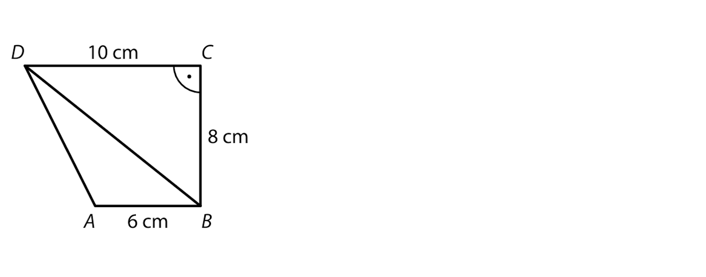
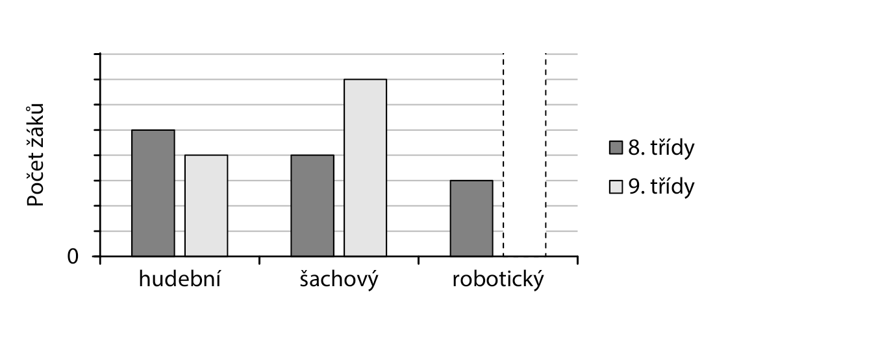
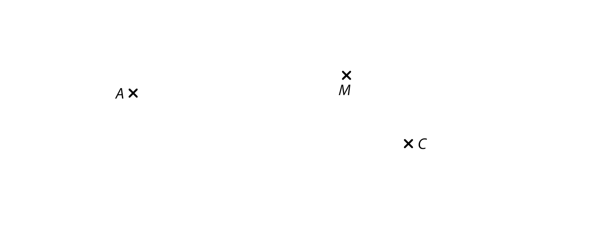
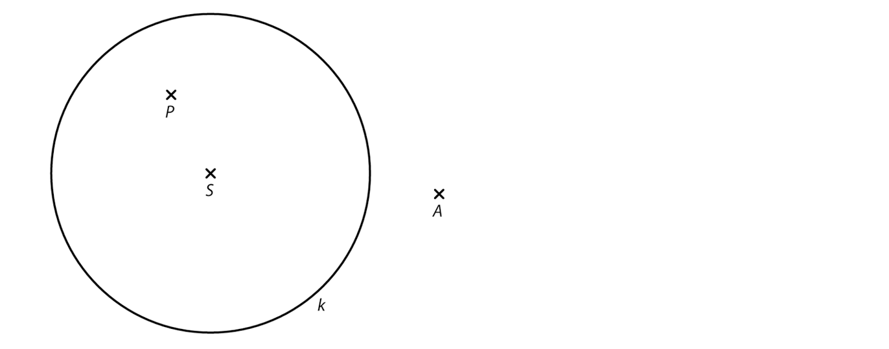
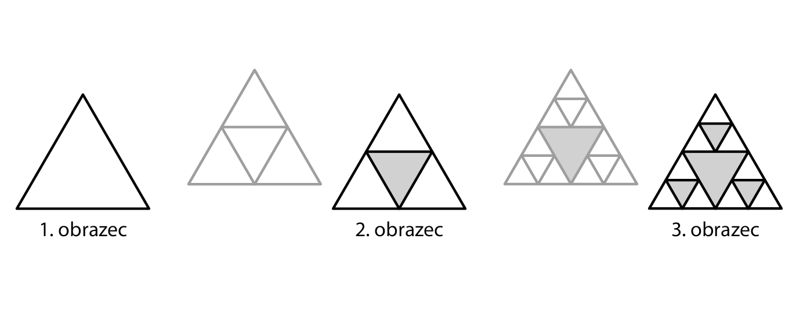

VÝCHOZÍ TEXT K ÚLOZE 1
===

> Celý film trvá 1 hodinu. Doba, která ještě zbývá do konce filmu, je polovinou doby, která již uplynula od začátku filmu.

# 1 Vypočtěte, kolik minut zbývá do konce filmu.

# 2

## 2.1

Vnitřní objem sudu je 15krát větší než objem kbelíku.\
Objem kbelíku je 5krát větší než objem konvičky. \
Ze sudu plného vody jsme třetinu vody odebrali, takže v něm zbylo 60 litrů vody.

**Vypočtěte v litrech objem konvičky.**

## 2.2

Kvádr je možné beze zbytku rozřezat na 200 krychlí, z nichž každá má objem 8 dm^3^.

**Vypočtěte, na kolik krychliček o objemu 1 cm^3^ lze tento kvádr beze zbytku rozřezat.**

# 3 Vypočtěte a výsledek zapište zlomkem v základním tvaru.

## 3.1 
$$ {5 \over 9} - {5 \over 9}: 5 = $$

## 3.2
$$ {4-7 \over 8} \cdot {16 \over 21} = $$

## 3.3
$$ {{3\over5} : \left({2\over5} + {1\over2}\right) \over {7\over6} + {7\over10} } = $$

# 4
## 4.1 **Upravte a rozložte** na součin vytknutím:
$$ 2\cdot(x^2-x ) +x = $$

## 4.2 **Umocněte a zjednodušte** (výsledný výraz nesmí obsahovat závorky):

$$ (\frac{2}{3}a - 3)^2 = $$

## 4.3  **Zjednodušte** (výsledný výraz nesmí obsahovat závorky):

$$ 3n \cdot (2 - n + 2n) + (2n + 1) \cdot (7 - n) = $$

# 5 Řešte rovnici:

## 5.1
$$ 0,5x + 2 \cdot (x + 2,5) = 2,5 \cdot (x + 3) $$

## 5.2
$$ \frac{y + 10}{15} + \frac{2y}{5} = 1 - \frac{5 - y}{3} $$

VÝCHOZÍ TEXT K ÚLOZE 6
===

> Pravoúhlý lichoběžník ABCD se základnami AB, CD má pravý úhel při vrcholu C.
>
> Některé rozměry lichoběžníku jsou uvedeny v obrázku.\
> 

# 6 Vypočtěte v cm^2^
## 6.1 obsah trojúhelníku ABD,
## 6.2 obsah lichoběžníku ABCD.

VÝCHOZÍ TEXT A GRAF K ÚLOZE 7
===

> Pouze pro žáky 8. a 9. tříd byly otevřeny tři kroužky – hudební, šachový a robotický.\
> Každý žák může být jen v jednom z těchto tří kroužků.\
> Graf znázorňuje počty žáků v jednotlivých kroužcích, jeden údaj a čísla na svislé ose chybí.
> 
> V hudebním kroužku je celkem o 6 žáků méně než v šachovém.\
> Ve všech třech kroužcích dohromady je poměr počtu žáků 8. tříd ku počtu žáků 9. tříd 2 ∶ 3.

# 7 Určete,
## 7.1 o kolik procent více je v hudebním kroužku žáků 8. tříd než žáků 9. tříd,
## 7.2 kolik žáků 9. tříd je v šachovém kroužku,
## 7.3 jaký je v robotickém kroužku poměr počtu žáků 8. tříd ku počtu žáků 9. tříd.

VÝCHOZÍ TEXT A OBRÁZEK K ÚLOZE 8
===

> Čtvercový pozemek má stejný obvod jako
obdélníkový pozemek.
Obdélníkový pozemek má jednu stranu o 25 % kratší
než čtvercový pozemek a druhou stranu o 10 m delší
než čtvercový pozemek.
>

# 8 Délku strany čtvercového pozemku označíme 𝑎.

## 8.1 **Vyjádřete výrazem** s proměnnou 𝑎 délku kratší strany obdélníkového pozemku.
## 8.2 **Vypočtěte** v metrech délku 𝑎 strany čtvercového pozemku.
## 8.3 **Vypočtěte**, o kolik m^2se liší obsahy obdélníkového a čtvercového pozemku.

VÝCHOZÍ TEXT A OBRÁZEK K ÚLOZE 9
===

> V rovině leží body A, C, M.
> 

# 9
 Body A, C jsou vrcholy obdélníku ABCD.
 Bod M leží na úhlopříčce BD tohoto obdélníku./
 **Sestrojte** vrcholy B, D obdélníku ABCD, **označte** je písmeny a obdélník **narýsujte.**

**V záznamovém archu** obtáhněte celou konstrukci **propisovací tužkou** (čáry i písmena).

VÝCHOZÍ TEXT A OBRÁZEK K ÚLOZE 10
===

> V rovině leží body A, P a kružnice k se středem S.
> 

# 10

Bod A je vrchol **rovnoramenného** trojúhelníku ABC, jehož **základna** leží na přímce AP.\
Vrcholy B, C tohoto trojúhelníku leží na kružnici k.

**Sestrojte** vrcholy B, C trojúhelníku ABC, **označte** je písmeny a trojúhelník **narýsujte**.**Najděte** všechna řešení

**V záznamovém archu** obtáhněte celou konstrukci **propisovací tužkou** (čáry i písmena).

VÝCHOZÍ TEXT K ÚLOZE 11
===

> Každých 3,5 cm na turistické mapě rovinaté oblasti je ve skutečnosti 700 m.\
> Délka vycházkové trasy je přesně 6 km, což je trojnásobek délky přímé trasy.
> (Uvažované trasy nemají žádné převýšení.)

# 11 Rozhodněte o každém z následujících tvrzení (11.1–11.3), zda je pravdivé (A), či nikoli (N).

## 11.1 Trasa, která na mapě měří 49 mm, je ve skutečnosti delší než 1 km.
## 11.2 Na mapě je vycházková trasa o 20 cm **delší** než přímá trasa.
## 11.3 Měřítko turistické mapy je 1 ∶ 200 000. 

VÝCHOZÍ TEXT A OBRÁZEK K ÚLOZE 12
===

>  Vnitřní prostor haly má tvar kvádru ABCDEFGH, jehož výška je 6 m a délka 15 m.
Uvnitř haly je na podlaze, stropě a dvou stěnách vyznačena uzavřená lomená čára ACFHA.
Úhlopříčka vyznačená na podlaze haly měří 17 m a tvoří úsek AC této lomené čáry.
>

# 12 **Jaká je délka lomené čáry** ACFHA?

- [A] 46 m
- [B] 50 m
- [C] 54 m
- [D] 68 m
- [E] jiná délka

VÝCHOZÍ TEXT K ÚLOZE 13
===
> Obsah pláště rotačního válce je třikrát větší než obsah jedné podstavy tohoto válce.
> Poloměr podstavy válce je 10 cm.

# 13 Jaký je povrch válce?

Výsledek je zaokrouhlen na desítky cm^2

- [A] menší než 930 cm2
- [B] 940 cm2
- [C] 1260 cm2
- [D] 1570 cm2
- [E] větší než 1580 cm2

VÝCHOZÍ TEXT A OBRÁZEK K ÚLOZE 14
===

> V rovině leží čtyři přímky, z nichž dvě jsou rovnoběžné.

# 14 Jaká je velikost úhlu 𝛽? Velikosti úhlů neměřte, ale vypočtěte.

- [A] 100°
- [B] 108°
- [C] 116°
- [D] 120°
- [D] jiná velikost

# 15 Přiřaďte ke každé úloze (15.1–15.3) odpovídající výsledek (A–F).

## 15.1 V roce 2020 firma vyrobila 250 výrobků.Jak v roce 2021, tak v roce 2022 vyrobila firma vždy o 20 % výrobků více nežv předchozím roce.

**Kolik výrobků vyrobila firma v roce 2022?**

## 15.2 Roman i Jana jezdili během dovolené na kole.Roman ujel 400 km, což bylo o čtvrtinu více, než ujela Jana.

**Kolik km ujela na kole během dovolené Jana?**

## 15.3 Firma během krize propouštěla zaměstnance,takže jich měla na konci krize o 40 % méně než před krizí.Když firma po odeznění krize přijala 42 nových zaměstnanců,měla jich o 25 % více než na konci krize.

**Kolik zaměstnanců měla firma před krizí?**

- [A] 280
- [B] 300
- [C] 320
- [D] 350
- [E] 360
- [F] jiný počet

 ---

VÝCHOZÍ TEXT A OBRÁZEK K ÚLOZE 16
===

> Prvním obrazcem je bílý rovnostranný trojúhelník.
> Každý další obrazec vznikne z předchozího obrazce dle následujících pravidel:
> 1. Nejprve každý bílý trojúhelník v obrazci rozdělíme na 4 shodné rovnostranné trojúhelníky.
> 2. Poté v každé takto vzniklé čtveřici bílých trojúhelníků obarvíme vnitřní trojúhelník na šedo.
> 

# 16
## 16.1 Určete, kolik bílých trojúhelníků obsahuje pátý obrazec.

## 16.2 Šestý obrazec obsahuje 121 šedých trojúhelníků.Určete, kolik šedých trojúhelníků obsahuje sedmý obrazec.
## 16.3 Počet šedých trojúhelníků v posledním a v předposledním obrazci se liší o 6 561.Určete, kolik bílých trojúhelníků obsahuje poslední obrazec