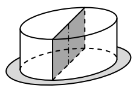
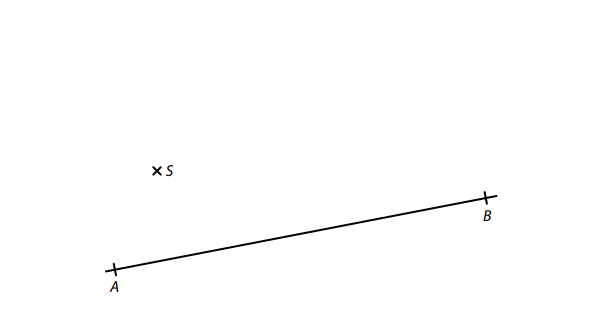
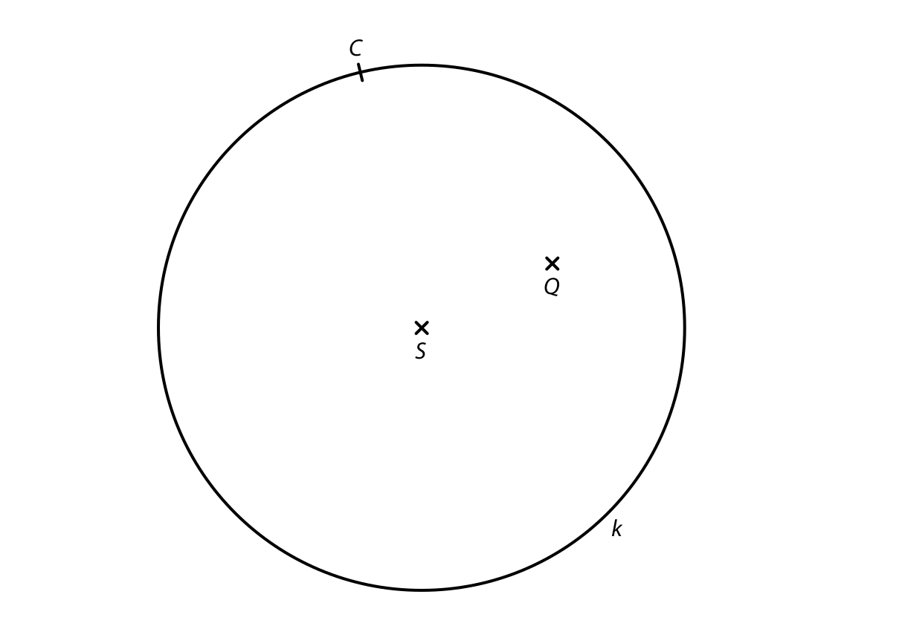
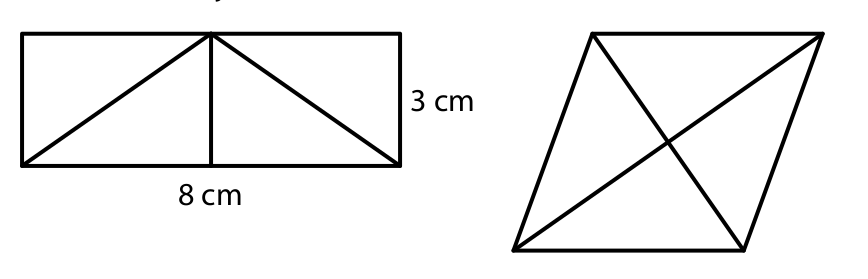
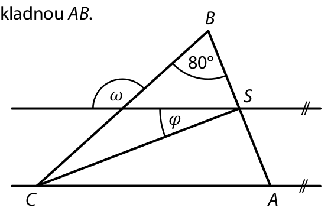
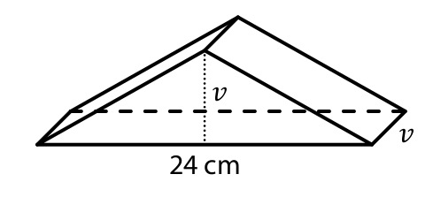
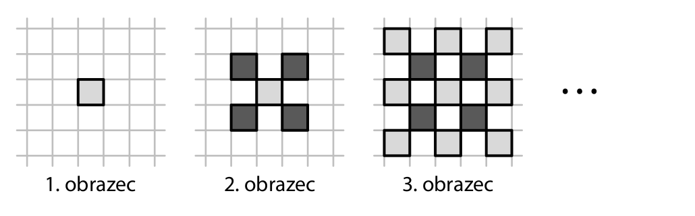

# 1 Vypočtěte: 
$$
\sqrt{\left({-5}\right)^{2}}-3^2= 
$$

VÝCHOZÍ TEXT K ÚLOZE 2 
===

> Třídenní lyžařská permanentka je o 150 % dražší než jednodenní permanentka. 
> Jednodenní permanentka stojí 600 korun. 
> (*CZVV*) 

# 2 Vypočtěte, 
## 2.1 kolikrát více se zaplatí za třídenní permanentku než za jednodenní permanentku, 
## 2.2 o kolik korun jsou 3 jednodenní permanentky dražší než 1 třídenní permanentka. 
 
**Doporučení:** Úlohy **3.3, 4.3 a 5** řešte přímo **v záznamovém archu**.

# 3 Vypočtěte a výsledek zapište zlomkem v základním tvaru. 
## 3.1
$$
\frac{1}{3}\cdot\frac{1}{2}-\frac{8}{9} = 
$$

## 3.2
$$
\left(2-\frac{5}{6}\right):\frac{5}{3} =
$$

## 3.3
$$
\frac{\frac{2}{3}+\frac{2}{7}}{\left(\frac{9}{14}+\frac{3}{2}\right)\cdot2} =
$$

**V záznamovém archu** uveďte pouze v úloze 3.3 celý **postup řešení**. 

# 4 
## 4.1 **Upravte a rozložte** na součin vytknutím: 
$$
x\cdot(y−3)+3\cdot(x−2y) = 
$$

## 4.2 Určete pomocí vzorce nejjednodušší výraz, kterým je třeba vynásobit výraz $ 3a−2^2 $,  abychom získali výraz $ 9𝑎^2−16 $. 

## 4.3 Zjednodušte (výsledný výraz nesmí obsahovat závorky): 

$$
(3n+2)^2−n\cdot(3n+4)+(2n−n)⋅n =
$$

**V záznamovém archu** uveďte pouze v úloze 4.3 celý **postup řešení**. 

# 5 Řešte rovnici: 

## 5.1 

$$ 
2+{0.5}\cdot(x−3)={0.4}\cdot({1.5}x+2) 
$$

## 5.2 
$$ 
3\cdot\frac{2y−1}{6} = \frac{3y+2}{8} + \frac{3}{4}\cdot\frac{y-1}{6}
$$
 
**V záznamovém archu** uveďte v obou částech úlohy celý **postup řešení** (zkoušku nezapisujte). 

VÝCHOZÍ TEXT K ÚLOZE 6 
===

> V chatě za polárním kruhem jsou připraveny zásoby masa pro 12člennou expedici přesně 
> na 30 dní. 
> Každý člen expedice spotřebuje za den z připravených zásob stejné množství masa. 
>
> (*CZVV*) 

# 6 
## 6.1 **Vypočtěte, za kolik dní** by 12členná expedice spotřebovala pět šestin připravených zásob masa. 
## 6.2 **Vypočtěte, kolikačlenná expedice** by všechny připravené zásoby masa spotřebovala za 45 dní. 
## 6.3 
Dvě expedice společně spotřebovaly všechny připravené zásoby masa.  
První expedice pobývala na chatě 4 dny.  
Druhá expedice měla dvakrát více členů než první a pobývala na chatě 8 dní. 

**Vypočtěte, kolik členů měla první expedice.**

VÝCHOZÍ TEXT K ÚLOZE 7 
===

> Ondrovi trvá cesta do práce autobusem dvakrát déle než rychlíkem.  
> Osobním vlakem mu trvá cesta do práce o čtvrtinu déle než autobusem. 
> (*CZVV*)
# 7 Dobu Ondrovy cesty do práce autobusem označíme 𝑥. 
## 7.1 **Vyjádřete výrazem** s proměnnou 𝑥, jak dlouho trvá Ondrovi cesta do práce rychlíkem. 
## 7.2 **Vyjádřete výrazem** s proměnnou 𝑥, jak dlouho trvá Ondrovi cesta do práce osobním vlakem. 
## 7.3 Cesta do práce trvá Ondrovi rychlíkem o 15 minut méně než osobním vlakem.  
**Vypočtěte**, kolik minut trvá Ondrovi cesta do práce autobusem. 
 
VÝCHOZÍ TEXT A OBRÁZEK K ÚLOZE 8 
===

> Dort tvaru rotačního válce leží na kruhovém tácu.  
> (Průměr podstavy dortu je větší než výška dortu, ale menší než průměr tácu.) 
> Dort jsme rozdělili svislým řezem na dvě stejné poloviny. 
> 
> 
> 
> (*CZVV*) 

# 8 
## 8.1 Tác má tvar kruhu o průměru 𝑑 a obsahu π⋅144 cm^2^. 
**Vypočtěte v cm průměr 𝑑 tácu.**
## 8.2 Plocha řezu dortu má obsah 200 cm^2^ a tvoří ji obdélník, který lze rozdělit na dva čtverce. 
**Vypočtěte v cm^3^ objem celého dortu.**
Výsledek zaokrouhlete na desítky cm^3^. 

**Doporučení** pro úlohy **9** a **10**: Rýsujte přímo **do záznamového archu**. 

VÝCHOZÍ TEXT A OBRÁZEK K ÚLOZE 9 
===

> V rovině leží úsečka *AB* a bod S.
>
> 
> 
> (*CZVV*) 

# 9 
Úsečka *AB* je základna **rovnoramenného** lichoběžníku *ABCD*.  
Bod S je střed ramene *AD* tohoto lichoběžníku. 
**Sestrojte** vrcholy C, D lichoběžníku *ABCD*, **označte** je písmeny a lichoběžník **narýsujte**. 
rovnoramenný trojúhelník ABC se základnou AB
**V záznamovém archu** obtáhněte celou konstrukci **propisovací tužkou** (čáry i písmena). 
 
VÝCHOZÍ TEXT A OBRÁZEK K ÚLOZE 10 
===

> V rovině leží body C, Q a kružnice k se středem S, která prochází bodem C. 
>
> 
> 
> (*CZVV*) 

# 10 
Bod C je vrchol trojúhelníku *ABC* s pravým úhlem při vrcholu C.  
Na kružnici k leží také zbývající dva vrcholy A, B tohoto trojúhelníku  
a bodem Q prochází jedna jeho strana. 

**Sestrojte** vrcholy A, B trojúhelníku *ABC*, **označte** je písmeny a trojúhelník **narýsujte**.  
Najděte všechna řešení. 

**V záznamovém archu** obtáhněte celou konstrukci **propisovací tužkou** (čáry i písmena). 
 
VÝCHOZÍ TEXT A OBRÁZEK K ÚLOZE 11 
===

> Obdélník se stranami délek 8 cm a 3 cm se skládá ze čtyř shodných trojúhelníků (viz obrázek). 
> Přemístěním trojúhelníků vznikl kosočtverec.
> 
> 
>  
> (*CZVV*) 

# 11 Rozhodněte o každém z následujících tvrzení (11.1–11.3), zda je pravdivé (A), či nikoli (N). 
## 11.1 Obsah kosočtverce je větší než obsah obdélníku. 
## 11.2 Strana kosočtverce měří 5 cm. 
## 11.3 Výška kosočtverce měří 4,8 cm. 
 
VÝCHOZÍ TEXT A OBRÁZEK K ÚLOZE 12 
===

> V rovině leží rovnoramenný trojúhelník *ABC* se základnou *AB*.  
> Bod S je střed základny *AB* a prochází jím  
> rovnoběžka s přímkou *AC*. 
>  
> 
>   
> (*CZVV*) 

# 12 Jaký je součet $ \varphi+\omega $?  
Velikosti úhlů neměřte, ale vypočtěte. 
- [A] $ 150\degree $ 
- [B] $ 155\degree $ 
- [C] $ 160\degree $ 
- [D] $ 165\degree $ 
- [E] $ 170\degree $ 

VÝCHOZÍ TEXT A OBRÁZEK K ÚLOZE 13 
===

> Trojboký hranol je položen na jedné boční stěně. 
>
> Podstavu hranolu tvoří rovnoramenný trojúhelník, který má základnu délky 24 cm a obsah 60 cm2.  
> Velikost 𝑣 výšky na základnu tohoto trojúhelníku   je stejná jako délka nejkratší hrany hranolu. 
> 
> 
> 
> (*CZVV*) 

# 13 Jaký je objem trojbokého hranolu? 
- [A] 150 cm^3^ 
- [B] 200 cm^3^ 
- [C] 300 cm^3^ 
- [D] 370 cm^3^ 
- [E] jiný objem 

 
VÝCHOZÍ TEXT K ÚLOZE 14 
===

> Košíkář prodal během prvních dvou dnů velikonočních trhů všechny upletené pomlázky.  
> První den prodal pětinu všech upletených pomlázek.  
> Druhý den prodal o 180 pomlázek více než první den. 
> 
> (*CZVV*) 

# 14 Kolik pomlázek prodal košíkář **první den** velikonočních trhů? 
- [A] 60 pomlázek 
- [B] 45 pomlázek 
- [C] 36 pomlázek 
- [D] 30 pomlázek 
- [E] jiný počet pomlázek 

# 15 Přiřaďte ke každé úloze (15.1–15.3) odpovídající výsledek (A–F). 
## 15.1 Letos má skautský oddíl 60 členů, což je o 20 členů více než loni. 
**O kolik procent má letos skautský oddíl více členů než loni?**

## 15.2 Během výletu Jakub utratil tři pětiny kapesného. Tři čtvrtiny z této utracené částky použil k nákupu turistické známky. 
**Kolik procent z kapesného utratil Jakub za turistickou známku?**

## 15.3 Na třídenním festivalu se první a druhý den prodal stejný počet vstupenek. Třetí den se prodalo o třetinu více vstupenek než druhý den. 
**Kolik procent všech vstupenek prodaných během festivalu se prodalo třetí den?**

- [A] méně než 40 % 
- [B] 40 % 
- [C] 45 % 
- [D] 50 % 
- [E] 55 % 
- [F] více než 55 % 

VÝCHOZÍ TEXT A OBRÁZEK K ÚLOZE 16 
===

> Vybarvováním některých prázdných polí čtvercové sítě postupně vytváříme obrazce.
> 
> Prvním obrazcem je jedno světle vybarvené pole čtvercové sítě. 
> 
> Každý další obrazec vytvoříme z předchozího obrazce tak, že vybarvíme všechna prázdná pole, která mají s předchozím obrazcem společné pouze vrcholy. Tato nově vybarvená pole jsou u sudých obrazců tmavá a u lichých obrazců světlá. 
>
> 
>  
> Druhý obrazec jsme vytvořili z prvního obrazce vybarvením 4 dalších polí tmavou barvou. 
> Třetí obrazec má celkem 13 polí (9 světlých a 4 tmavé) a vytvořili jsme jej z druhého obrazce vybarvením 8 dalších polí světlou barvou. 
> 
> (*CZVV*) 
# 16 Určete, 
## 16.1 vybarvením kolika dalších polí jsme z 8. obrazce vytvořili 9. obrazec, 
## 16.2 o kolik se liší počet tmavých a světlých polí v 10. obrazci, 
## 16.3 kolik světlých polí může mít obrazec, který má 400 tmavých polí.
Najděte všechna řešení. 
