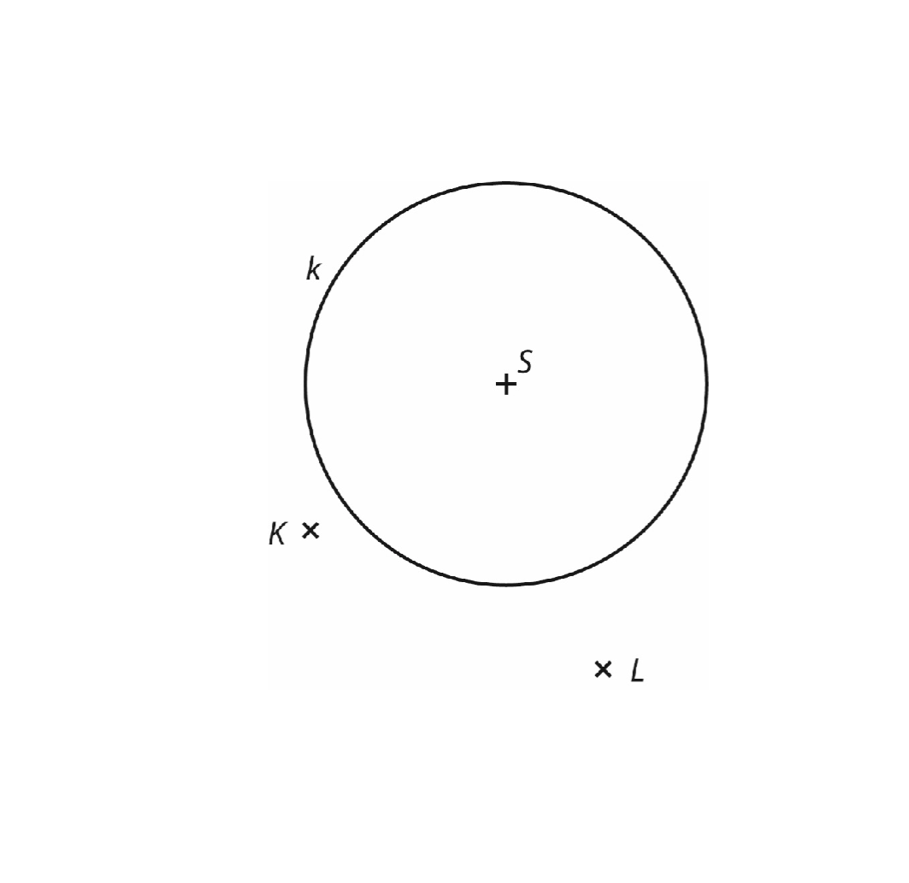
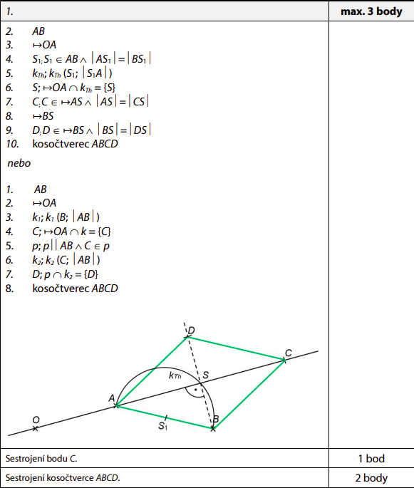

# 1 Josef má délku kroku 75 cm, Naďa má krok dlouhý 60 cm. Josef i Naďa každý ušli 10 000 kroků.
**O kolik kilometrů ušel Josef více než Naďa?**

VÝCHOZÍ TEXT A OBRÁZEK K ÚLOZE 2
===

> Adam a Ota jsou z místa A do místa C. Každý jde jinou cestou tak, jak je vyznačeno na obrázku. Adam jde z místa A do místa C po rovných silnicích přes místo B. Ota jde zkratkou přímo z A do C.
> 
> 

# 2 O kolik procent je Adamova cesta delší než cesta, kterou jde Ota?

# 3 Vypočítejte a výsledek zapište zlomkem v základním tvaru.
**Do záznamového archu** uveďte u obou podúloh **celý postupu řešení**.

## 3.1
$$
\left(\frac{3}{4}+\frac{4}{3}\right)\cdot\left(\frac{2}{3}-\frac{6}{5}\right)\
$$

## 3.2
$$
\frac{\frac{5}{9}-\frac{3}{2}\div\frac{3}{5}}{\frac{2}{3}+\frac{1}{6}-\frac{7}{12}}
$$

# 4

## 4.1 Umocněte:
$$
(-3-2x)^2 =
$$

## 4.2 Upravte a rozložte na součin podle vzorce:
$$
6400 - (x^2-3600) =
$$

## 4.3 Zjednodušte a výsledek rozložte na součin vytýkáním:
$$
(3x+1)^2-x\cdot7x-(2x-5)\cdot(x+4)=
$$

**Do záznamového archu** uveďte u podúlohy 4.3 **celý postupu řešení**.

# 5 Řešte rovnice.
**Do záznamového archu** uveďte u obou podúloh **celý postupu řešení**.\
Zkoušku nazapisujte.

## 5.1
$$
1,6\div2-\frac{x}{2}= 3\cdot0,7x+3,4
$$

## 5.2
$$
\frac{5-2y}{3}+\frac{y}{9} = \frac{3-y}{6}
$$

VÝCHOZÍ TEXT A OBRÁZEK K ÚLOZE 6
===

> Čtyřúhelník ABCD je takový lichoběžník se základnami AB a CD, že úsečka BD je jeho výška. Pro délky stran platí |AD| = 17cm, |BD| = 18cm, obsah trojúhelníku BCD je S~BCD~ = 24 cm^2^.
>
> 

# 6

## 6.1 Vypočítejte obsah lichoběžníku ABCD.
Výsledek uveďte v cm^2^.

## 6.2 Vypočítejte obvod lichoběžníku ABCD.
Výsledek uveďte v cm.

# 7 Petr sbírá modely aut. Druhý rok nasbíral o polovinu počtu modelů aut více, než které nasbíral první rok. Třetí rok nasbíral 72 modelů. Počet modelů, které Petr nasbíral v prvním roce, označte x.

## 7.1 V závislosti na veličině x vyjádřete, kolik modelů nasbíral Petr během druhého roku.
## 7.2 Vypočítejte, kolik modelů nasbíral Petr během prvního roku, pokud za tři roky nasbíral 217 modelů.

VÝCHOZÍ TEXT A OBRÁZEK K ÚLOZE 8
===

> Obrazce jsou tvořeny z velkých bílých a malých tmavých kruhů podle určitého pravidla. První obrazec tvoří jeden velký bílý kruh. Druný obrazec tvoří čtyři bílé kruhy, jejichž středy tvoří vrcholy čtverce, a jeden tmavý kruh uprostřed. Každé dva sousední kruhy mají společný právě jeden bod. Třetí obrazec je sestaven za dodržení pravidla vytváření obrazců tak, že je tvoří devět bílých kruhů a čtyři kruhy tmavé. Daným způsobem sestavujeme další obrazce.
>
> 

# 8
## 8.1 Kolik velkých bílých kruhů obsahuje osmý obrazec?
## 8.2 Kolikátý obrazec obsahuje 361 malých tmavých kruhů?

VÝCHOZÍ TEXT A OBRÁZEK K ÚLOZE 9
===

> V rovnině jsou dány body A,B a O. Body A,B jsou vrcholy kosočtverce ABCD.\
> Vrchol C kosočtverce leží na přímce OA.
> 
> 

# 9 Sestrojte kosočtverec ABCD.

**V záznamovém archu** obtáhněte celou konstrukci **propisovací tužkou** (všechny čáry, kružnice nebo jejich části i písmena).

VÝCHOZÍ TEXT A OBRÁZEK K ÚLOZE 10
===

> V rovině je dána kružnice k se středem S a body K,L.\
> Body K,L jsou vrcholy rovnoramenného trojúhelníku KLM se základnou LM.
> 
> 

# 10 Sestrojte rovnoramenný trojúhelník KLM, leží-li bod M na kružnici k.
Nalezněte všechna řešení.

**V záznamovém archu** obtáhněte celou konstrukci **propisovací tužkou** (všechny čáry, kružnice nebo jejich části i písmena).

# 11 Hračka stála 250 korun. Nejdříve byla zdražena o 40 % oproti původní ceně, po měsíci pak byla zlevněna o 40 % z nové ceny.

**Kolik stála hračka po této dvojí úpravě cen?**
- [A] 220 Kč
- [B] 210 Kč
- [C] 230 Kč
- [D] 250 Kč
- [E] 280 Kč

# 12 Pekař na trhu prodával malé a velké koláčky. Velký koláček byl o polovinu dražší než malý koláček a stál 30 Kč. Velké koláčky prodal pekař všechny a utržil za ně 3 000 Kč. Desitinu malých koláčků neprodal a za prodané malé koláčky utržil 3 600 Kč.

**Kolik pekař původně přivezl na trhu malých koláčků?**
- [A] 100
- [B] 180
- [C] 200
- [D] 240
- [E] jiný počet

VÝCHOZÍ TEXT A OBRÁZEK K ÚLOZE 13
===
> V rovině leží přímky k,l,m a n. Průsečíky přímek k,l a m tvoří vrcholy trojúhelníku ABC.\
> Bodem B prochází také přímka n.
>
> 

# 13 Jaká je velikost úhlů $\alpha$ ? 
Velikost úhlů neměřte, ale vypočítejte (obrázek je ilustrační).
- [A] $55\degree$
- [B] $50\degree$
- [C] $45\degree$
- [D] $40\degree$
- [E] $35\degree$

VÝCHOZÍ TEXT A OBRÁZEK K ÚLOZE 14
===

> Ve čtvercové síti je zakreslen šedý obrazec - půlkruh s průměrem AB. Body A a B leží v mřížových bodech. Délka strany čtverce ve čtvercové síti je 2 cm.
> 
> 

# 14 Jaké je obsah šedé části?

Pro výpočet použijte zaokrouhlenou hodnotu čísla $\pi$ z tabulky na začátku testového sešitu.
- [A] 20,28 cm^2^
- [B] 22,56 cm^2^
- [C] 24,56 cm^2^
- [D] 25,12 cm^2^
- [E] 30,24 cm^2^

VÝCHOZÍ TEXT A OBRÁZEK K ÚLOZE 15
===
> Žáci 9. ročníku mezi sebou provedli statistický průzkum. Každý žák volil svou nejoblíbenější předmět, přičemž každý si zvolil právě jeden. Výsledky jsou zaznamenány v grafu.
>
> 

**Rozhodněte o každém z následujích tvrzení (15.1-15.3), zda je pravdivé (A), či nikoliv (N).**

## 15.1 V 9.ročníku je stejný počet dívek jako chlapců.
## 15.2 Český jazyk volilo více než 16 % všech žáků 9. ročníku.
## 15.3 Počet chlapců, kteří volili matematiku, je o 75 % větší než počet děvčat, která volila také matematiku.

# 16 Přiřaďte ke každé úloze (16.1-16.3) odpovídající výsledek (A-F).

## 16.1 Lyžařský pobyt stál celkem 7 000 Kč. Cena zarhnovala dopravu, ubytování a lístek na vlek. Doprava tvořila desitinu celkové ceny, 60 % ceny stálo ubytování.

**Kolik procent ceny pobytu tvořila cena lístku na vlek?**

## 16.2 Cena učebnice matematiky se snížila na částku 1 500 Kč z původních 2 000 Kč.

**Kolik procent činila sleva?**

## 16.3 Petr přivezl nemocnému kamarádovi dárek ze zahraničních zájezdu za 40 EUR. Celkem měl vyměněno 200 EUR.

**Kolik procent z vyměněných EUR tvořila cena dárku?**

- [A] 15 %
- [B] 20 %
- [C] 25 %
- [D] 30 %
- [E] 40 %
- [F] jiný výsledek
