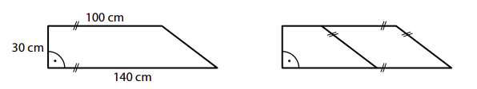
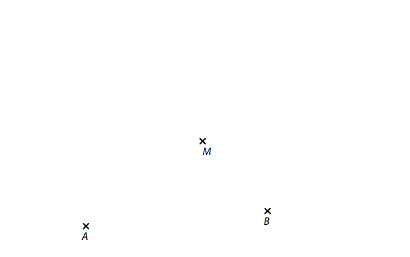
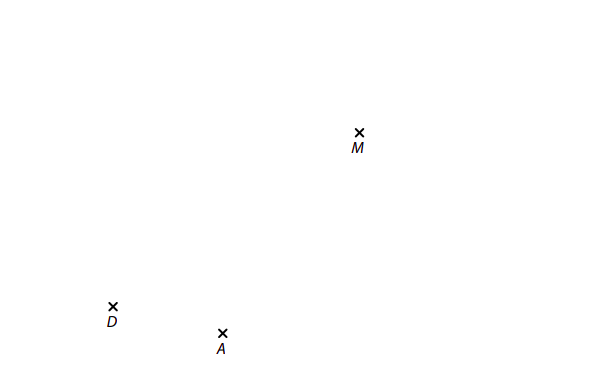
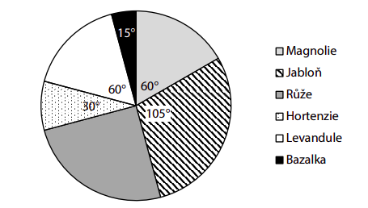
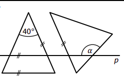
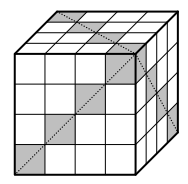
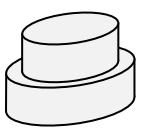

VÝCHOZÍ TEXT K ÚLOZE 1 
===
> Cena dětské vstupenky do muzea je rovna dvěma pětinám ceny vstupenky pro dospělého. 
> Jeden dospělý se třemi dětmi zaplatil za vstupenky 330 korun. 

> (*CZVV*) 

# 1 Vypočtěte v korunách cenu jedné dětské vstupenky. 
# 2 Vypočtěte druhou odmocninu ze součinu smíšených čísel a $6\frac{1}{4}$ a $2\frac{7}{9}$. 
Výsledek zapište zlomkem v základním tvaru. 
 
# 3 Vypočtěte a výsledek zapište zlomkem v základním tvaru. 
## 3.1 

$$ 
\left(\frac{11}{5}-\frac{11}{6}\right) \div \left(-\frac{1}{3}\right)=
$$

## 3.2 
$$
\frac{20-\sqrt{4\cdot3^2}}{3\cdot\sqrt{100−64}} \div \frac{4+3}{4\cdot3}= 
$$

# 4 
## 4.1 **Upravte** na co nejjednodušší tvar bez závorek:
$$
x\cdot3x-2x\cdot3-(x-3)^2= 
$$

## 4.2 **Upravte** a výsledný výraz r**ozložte na součin** vytknutím: 
$$
(2k)^2-k\cdot(1+2k)= 
$$

## 4.3 **Upravte** na co nejjednodušší tvar bez závorek: 
$$
7a\cdot(a+3)+2\cdot(1−3a)\cdot(a+5)= 
$$

# 5 

## 5.1 **Řešte** rovnici: 
$$
\frac{7}{12}x+2\cdot\left(\frac{3}{8}x-1\right)=-3\cdot\left(\frac{x}{9}+1\right)
$$
## 5.2 **Řešte** soustavu rovnic: 
$$

\begin{aligned}
6x+y =14\\
3x+2y=15
\end{aligned}

$$

# 6 Číslo 231 lze rozložit na součin tří prvočísel 𝑎⋅𝑏⋅𝑐. 
**Určete**
## 6.1 nejmenší z prvočísel 𝑎, 𝑏, 𝑐, 
## 6.2 součet všech tří prvočísel 𝑎+𝑏+𝑐, 
## 6.3 největší dvojciferné číslo, které je dělitelem čísla 231. 
 
VÝCHOZÍ TEXT K ÚLOZE 7 
===

> Farmář prodával saláty za jednotnou cenu za kus a v průběhu tří dnů všechny saláty prodal. 
> 
> První den prodal třetinu všech salátů, druhý den prodal o třetinu méně salátů než první den a třetí den prodal zbytek salátů. 
> 
> (*CZVV*) 

# 7 
## 7.1 Za všechny prodané saláty utržil farmář celkem 5 400 korun.
**Vypočtěte**, kolik korun utržil farmář za saláty prodané druhý den.

## 7.2 Počet všech salátů, které farmář prodal, označíme 𝑥.
**Vyjádřete výrazem** s proměnnou 𝑥, kolik salátů prodal farmář druhý den.

## 7.3 Třetí den prodal farmář 120 salátů.
**Určete** počet **všech** salátů, které farmář prodal.

VÝCHOZÍ TEXT A OBRÁZEK K ÚLOZE 8 
===

> Velký pravoúhlý lichoběžník, jehož rozměry jsou uvedeny na obrázku vlevo,  
> jsme jednou úsečkou rozdělili na menší lichoběžník a rovnoběžník (obrázek vpravo).
> 
> Oba tyto nové útvary (menší lichoběžník a rovnoběžník) mají stejný obvod. 
> 
> 
> 
> (*CZVV*) 

# 8 Vypočtěte 
## 8.1 v cm^2^ obsah velkého pravoúhlého lichoběžníku, 
## 8.2 v cm obvod velkého pravoúhlého lichoběžníku, 
## 8.3 v cm obvod rovnoběžníku. 

VÝCHOZÍ TEXT A OBRÁZEK K ÚLOZE 9 
===

> V rovině leží body A, B, M. 
> 
> 
> 
> (*CZVV*) 

# 9 
Body A, B jsou vrcholy **rovnoramenného** trojúhelníku *ABC*.\
Bod M je uvnitř tohoto trojúhelníku a leží na těžnici tc na stranu *AB*.\
(Bod M není těžištěm trojúhelníku *ABC*.) 

**Sestrojte** vrchol C trojúhelníku *ABC*, **označte** ho písmenem a trojúhelník **narýsujte**.  
Najděte všechna řešení. 

VÝCHOZÍ TEXT A OBRÁZEK K ÚLOZE 10 
===

> V rovině leží body A, D, M. 
> 
>  
> 
> (*CZVV*) 

# 10 
Body A, D jsou vrcholy rovnoběžníku *ABCD*.\
Na polopřímce *DM* leží jedna z úhlopříček tohoto rovnoběžníku.\ 
Druhá úhlopříčka rovnoběžníku *ABCD* má stejnou délku jako úsečka *DM*.

**Sestrojte** vrcholy B, C rovnoběžníku *ABCD*, **označte** je písmeny  
a rovnoběžník **narýsujte**. 

VÝCHOZÍ TEXT A GRAF K ÚLOZE 11 
===

> V zahradě se pěstuje 6 druhů rostlin. Diagram udává, jakou část osázené plochy zahrady 
> zabírají jednotlivé druhy rostlin. V každé části zahrady se pěstuje pouze jeden druh rostlin. 
> Magnolie zabírají plochu o rozloze 20 m2. 
> 
>  
> 
> V některých výsečích diagramu je uvedena velikost úhlu, který příslušnou výseč vymezuje. 
> 
> (*CZVV*) 

# 11 Rozhodněte o každém z následujících tvrzení (11.1–11.3), zda je pravdivé (A), či nikoli (N). 
 

## 11.1 Jabloně zabírají o 15 m^2^ větší plochu, než zabírají magnolie. 
## 11.2 Levandule a bazalka dohromady zabírají 1,5krát větší plochu než hortenzie. 
## 11.3 Růže zabírají plochu menší než 30 m^2^. 
 
 
VÝCHOZÍ TEXT A OBRÁZEK K ÚLOZE 12 
===

> V rovině leží dva **shodné rovnoramenné** trojúhelníky a přímka p rovnoběžná se základnou jednoho z nich.
> Druhý trojúhelník má právě jedno rameno rovnoběžné s ramenem prvního trojúhelníku.
>  
> 
>  
> (*CZVV*) 

# 12 Jaká je velikost úhlu 𝛼?  
Velikosti úhlů neměřte, ale vypočtěte (obrázek je pouze ilustrativní). 
- [A] $160\degree$
- [B] $140\degree$ 
- [C] $130\degree$ 
- [D] $110\degree$ 
- [E] jiná velikost 
 
VÝCHOZÍ TEXT A OBRÁZEK K ÚLOZE 13 
===

> Ze shodných bílých a šedých krychliček byla sestavena krychle tak, že v každé řadě i v každém sloupci jsou 4 krychličky.
> 
> Šedé krychličky byly umístěny vždy podél jedné ze dvou úhlopříček každé stěny krychle (viz obrázek).\
> Všechny zbývající krychličky v krychli jsou bílé. 
>  
> 
>  
> (*CZVV*) 
# 13 Jaký je počet všech bílých krychliček v krychli? 
- [A] méně než 36 
- [B] 36 
- [C] 48 
- [D] 54 
- [E] 72 
 

VÝCHOZÍ TEXT A OBRÁZEK K ÚLOZE 14 
===

> Na výrobu dortu byly použity dvě různé formy tvaru rotačního válce.
> 
> Poloměr podstavy první formy je 8 cm a poloměr podstavy druhé formy je o čtvrtinu menší. Výška obou forem je stejná, a to 5 cm. 
> 
> Dvoupatrový dort je složen z většího a menšího korpusu.Každý korpus má stejný objem jako forma, v níž byl upečen.  
> 
> 
>  
> (*CZVV*) 
# 14 Jaký je celkový objem obou korpusů dvoupatrového dortu? 
- [A] 350π cm^3^ 
- [B] 400π cm^3^ 
- [C] 450π cm^3^ 
- [D] 500π cm^3^ 
- [E] 550π cm^3^ 

VÝCHOZÍ TEXT K ÚLOZE 15 
===

> Na táboře bylo 80 dětí, 5 vedoucích a 4 instruktoři. 
> 
> (*CZVV*) 

# 15 Přiřaďte ke každé úloze (15.1–15.3) odpovídající výsledek (A–F). 
## 15.1 Vedoucí si všechny děti rozdělili do stejně početných oddílů.  Každý vedoucí pak měl na starost jeden oddíl. 
**Kolik procent všech dětí měl na starost jeden vedoucí?**

## 15.2 Na táboře bylo mladších dětí o jednu třetinu méně než starších dětí. 
**O kolik procent bylo starších dětí více než mladších?**
_____ 
## 15.3 Děti z tábora se vydaly do lesa na borůvky. Šla čtvrtina všech chlapců a polovina všech dívek, tedy chlapců šlo do lesa o 4 méně než dívek.
**Kolik procent všech dětí na táboře tvořily dívky?**
_____ 
- [A] 20 % 
- [B] 25 % 
- [C] 33 % 
- [D] 40 % 
- [E] 45 % 
- [F] 50 % 

VÝCHOZÍ TEXT K ÚLOZE 16 
===

> Mirek a Zuzka odříkávali čísla následujícím způsobem:\ 
> Mirek postupně odříkával všechna po sobě jdoucí přirozená čísla od 1 do 1 000. Za každým 
> druhým číslem udělal krátkou pauzu, během níž Zuzka řekla součet posledních dvou čísel, 
> které vyslovil Mirek. 
> 
> Na začátku tedy zazněla čísla:\
> 1, 2, **3**, 3, 4,** 7**, 5, 6, **11**, … 
> 
> (Tučně zapsaná čísla vyslovila Zuzka, ostatní čísla Mirek.) 
> 
> (*CZVV*) 

# 16 
## 16.1 Určete číslo, které zaznělo mezi čísly 24 a 25. 
## 16.2 Jako 90. v pořadí bylo vysloveno číslo 𝐶, které později zaznělo ještě jednou. 
**Určete číslo, které bylo vysloveno bezprostředně předtím, než podruhé 
zaznělo číslo** 𝐶. 
## 16.3 Určete největší číslo, které mezi prvními 150 vyslovenými čísly zaznělo dvakrát.