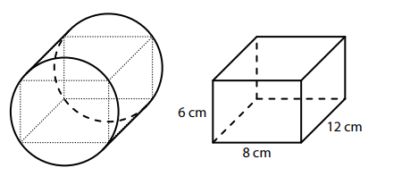
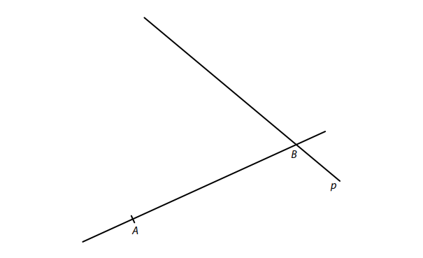
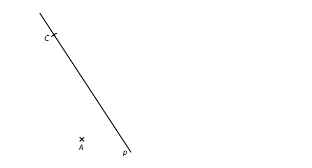
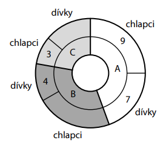
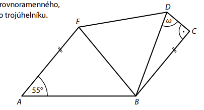
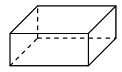
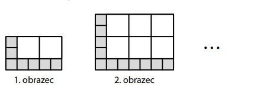

# 1 Vypočtěte, kolikrát je součet čísel 0,2 a 0,5 větší než jejich součin. 
# 2 Vypočtěte: 
## 2.1 
$$
4+6∶2−5⋅(−3+5)= 
$$
## 2.2 
$$
\sqrt{1,3^2−1,2^2}= 
$$
 
 
# 3 Vypočtěte a výsledek zapište zlomkem v základním tvaru. 
## 3.1 
$$
3⋅\frac{2}{7}−\frac{2}{7}=
$$ 
## 3.2 
$$
1−\frac{14}{5}∶2= 
$$

## 3.3 
$$ 
\frac{\frac{3}{4}+\frac{4}{3}}{\frac{5}{7}\cdot\frac{14}{3}}= 
$$
 

# 4 
## 4.1 **Rozložte** na součin podle vzorce: 
$$
4𝑎^2−9= 
$$
## 4.2 **Zjednodušte** (výsledný výraz nesmí obsahovat závorky): 
$$
(2𝑥−1)\cdot\frac{1}{2}−𝑥= 
$$
## 4.3 **Zjednodušte** (výsledný výraz nesmí obsahovat závorky): 
$$
(4𝑛−3)^2−4𝑛⋅(4𝑛−3)= 
 $$
 

# 5 Řešte rovnici: 
## 5.1 
$$
0,3\cdot(2𝑥+1)=0,2𝑥−0,7 
$$
## 5.2 
$$ 
𝑦+\frac{5𝑦}{6}=\frac{2𝑦−1}{4}+\frac{𝑦+1}{2}
$$ 

VÝCHOZÍ TEXT K ÚLOZE 6 
===

> Vítek, Rudolf a Ondra jeli společně autem k moři. Každý z nich odřídil část trasy. 
> 
> Vítek odřídil třetinu celé trasy, Rudolf odřídil o 60 km méně než Vítek a Ondra odřídil zbývající dvě pětiny celé trasy. 
> 
> (*CZVV*) 

# 6 Celá trasa měřila 𝑥 km. 
## 6.1 Vyjádřete výrazem s proměnnou 𝑥, kolik km trasy odřídil Rudolf. 
## 6.2 Vypočtěte, kolik km měřila celá trasa. 

VÝCHOZÍ TEXT A OBRÁZEK K ÚLOZE 7 
===

> Rotační válec má výšku 12 cm.  
> Odstraněním čtyř částí vytvoříme z tohoto válce kvádr s rozměry 8 cm, 6 cm a 12 cm.  
> Všechny hrany kvádru leží na povrchu válce. 
> 
> 
>  
> (*CZVV*) 

# 7 Vypočtěte 
## 7.1 v cm poloměr podstavy válce, 
## 7.2 v cm^3^ objem válce. 
Výsledek zaokrouhlete na desítky cm^3^. 

VÝCHOZÍ TEXT A TABULKA K ÚLOZE 8 
===

> V obchodě s oříšky prodávají různé směsi. Jejich cena závisí pouze na hmotnosti a ceně 
> použitých surovin. Tabulka udává ceny za 1 kg jednotlivých surovin. 
> 
> 
> |Surovina |Cena za 1 kg|
> |---|:---:|
> |Arašídy |80 korun|
> |Kešu    |280 korun| 
> |Mandle  |200 korun| 
> 
> (Např. 200gramové balení směsi obsahující 50 gramů kešu a 150 gramů mandlí stojí 44 korun, tedy 1 kg této směsi stojí 220 korun.) 
> 
> (*CZVV*) 

# 8 
## 8.1 Dvoukilogramové balení směsi arašídů a mandlí obsahuje 800 gramů arašídů a 1 200 gramů mandlí. 
**Vypočtěte, kolik korun stojí __jeden__ kilogram této směsi.**

## 8.2 Jiná směs obsahuje pouze arašídy a kešu, přičemž 1 kg této směsi stojí 200 korun. Velké balení této směsi obsahuje 500 gramů arašídů. 
**Vypočtěte, kolik gramů kešu obsahuje velké balení této směsi.**
 

VÝCHOZÍ TEXT A OBRÁZEK K ÚLOZE 9 
===

> V rovině leží přímka *AB* a přímka p procházející bodem B. 
> 
> 
>  
> (*CZVV*) 

# 9 

Úsečka *AB* je strana **pravoúhlého** lichoběžníku *ABCD*.  
Vrchol C tohoto lichoběžníku leží na přímce p,  
úhlopříčka *AC* má stejnou délku jako strana *AB* lichoběžníku *ABCD*. 
**Sestrojte** vrcholy C, D lichoběžníku *ABCD*, **označte** je písmeny a lichoběžník **narýsujte**.

Najděte všechna řešení.

VÝCHOZÍ TEXT A OBRÁZEK K ÚLOZE 10 
===

> V rovině leží body A, C a přímka p procházející bodem C. 
> 
> 
>  
> (*CZVV*) 

# 10 
Úsečka *AC* je základna **rovnoramenného** trojúhelníku *ABC*.  
Na přímce p leží jedna ze tří výšek tohoto trojúhelníku. 
## 10.1 **Sestrojte** osu souměrnosti trojúhelníku *ABC* a **označte** ji písmenem o.
## 10.2 **Sestrojte** vrchol B trojúhelníku *ABC*, **označte** ho písmenem a trojúhelník **narýsujte**. 

 
VÝCHOZÍ TEXT A GRAF K ÚLOZE 11 
===

> Na táboře je každé dítě zařazeno do jednoho ze tří oddílů A, B a C. 
> V oddíle A je dvakrát více dětí než v oddíle C. 
> Poměr počtu dětí v oddíle A ku počtu dětí v oddíle B je 4∶3. 
> Graf udává počty chlapců a dívek  v jednotlivých oddílech,  dva údaje však chybí. 
> 
> 
>  
> (*CZVV*) 

# 11 Rozhodněte o každém z následujících tvrzení (11.1–11.3), zda je pravdivé (A), či nikoli (N). 
## 11.1 V oddíle C je 5 dívek. 
## 11.2 V oddíle B je chlapců o polovinu více než dívek. 
## 11.3 Na táboře je dívek o pětinu méně než chlapců. 
 
VÝCHOZÍ TEXT K ÚLOZE 12 
===

> Ve vlakové soupravě jsou pouze stejně dlouhé vagony a jedna lokomotiva.
> 
> Lokomotiva je o čtvrtinu kratší než jeden vagon a její délka tvoří jednu sedmnáctinu délky celé vlakové soupravy. 
> 
> (*CZVV*) 
# 12 Kolik vagonů je celkem ve vlakové soupravě? 
- [A] 10 vagonů 
- [B] 11 vagonů 
- [C] 12 vagonů 
- [D] 13 vagonů 
- [E] jiný počet vagonů 
 

VÝCHOZÍ TEXT A OBRÁZEK K ÚLOZE 13 
===

> Pětiúhelník *ABCDE* se skládá z rovnoramenného, rovnostranného a pravoúhlého trojúhelníku.\
> Základnou rovnoramenného Trojúhelníku je strana *AB*.\
> Strany *BC* a *AE* pětiúhelníku jsou rovnoběžné.
>  
> 
>  
> (*CZVV*) 

# 13 Jaká je velikost úhlu 𝜔?  
Velikosti úhlů neměřte, ale vypočtěte. 
- [A] $ 65\degree $
- [B] $ 70\degree $
- [C] $ 75\degree $
- [D] $ 80\degree $
- [E] jiná velikost 

VÝCHOZÍ TEXT A OBRÁZEK K ÚLOZE 14 
===

> Povrch pravidelného čtyřbokého hranolu je 144 cm^2^.\
> Obsah pláště tohoto hranolu je dvakrát větší než obsah jedné jeho čtvercové podstavy.\
> (Plášť tohoto hranolu tvoří čtyři shodné boční stěny.) 
> 
> 
>  
> (*CZVV*) 

# 14 Jaký je objem hranolu? 
- [A]  72 cm^3^ 
- [B] 108 cm^3^ 
- [C] 144 cm^3^ 
- [D] 216 cm^3^ 
- [E] jiný objem 
 
 
 
# 15 Přiřaďte ke každé úloze (15.1–15.3) odpovídající výsledek (A–F). 
## 15.1 Encyklopedie má o 25 % více stran než atlas, který má 200 stran. 
**Kolik stran má encyklopedie?**

## 15.2 Róza čte knihu, která má 500 stran. Počet stran, které Róza již přečetla, je o 50 % větší než počet stran, které dosud nepřečetla. 
**Kolik stran knihy Róza dosud nepřečetla?**

## 15.3 
V knihovně jsou některé knihy psané německy, jiné anglicky a ostatní česky.

Německy psaných je 30 knih, což je 10 % všech knih v knihovně.
Anglicky psané knihy tvoří pětinu všech knih v knihovně.

**Kolik je v knihovně česky psaných knih?**

- [A] méně než 210 
- [B] 210 
- [C] 220 
- [D] 240 
- [E] 250 
- [F] jiný počet 

VÝCHOZÍ TEXT A OBRÁZEK K ÚLOZE 16 
===

> Každý obrazec tvaru obdélníku je složen z malých šedých čtverečků a větších bílých čtverečků.
> Všechny šedé čtverečky jsou stejné a jsou poskládány do spodní řady a do levého sloupce. 
> Zbytek obrazce tvoří bílé čtverečky. Každý bílý čtvereček má dvakrát delší stranu než šedý. 
> 
> První obrazec má ve spodní řadě 5 šedých čtverečků a v levém sloupci 3 šedé čtverečky. Skládá se celkem z 9 čtverečků (bílých i šedých dohromady). 
> 
> Každý další obrazec má oproti předchozímu vždy o 2 šedé čtverečky více jak ve spodní řadě, tak i v levém sloupci. 
>  
> 
>
> (*CZVV*)

# 16 
## 16.1 Obrazec má ve spodní řadě 41 šedých čtverečků. 
**Určete počet bílých čtverečků v obrazci.**

## 16.2 V obrazci je 90 bílých čtverečků. 
**Určete počet šedých čtverečků v obrazci.**

## 16.3 Počet všech čtverečků (bílých i šedých dohromady) v posledním a v předposledním obrazci se liší o 106. 
**Určete počet šedých čtverečků v posledním obrazci.**