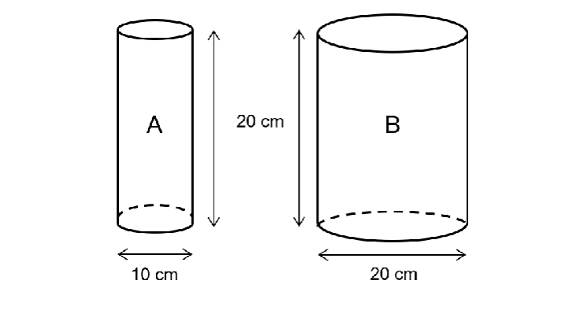
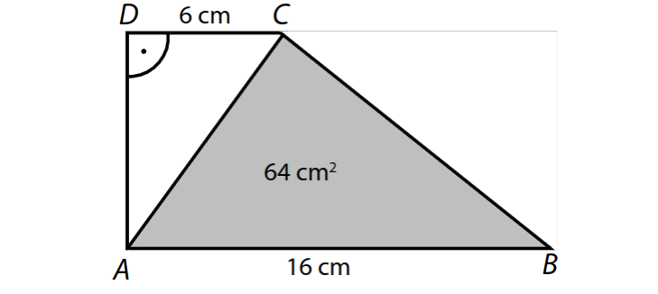
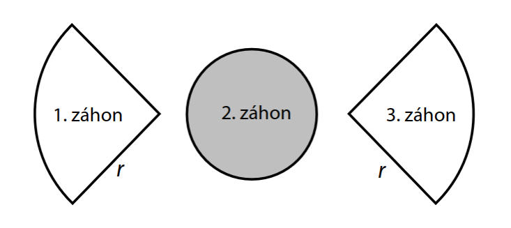
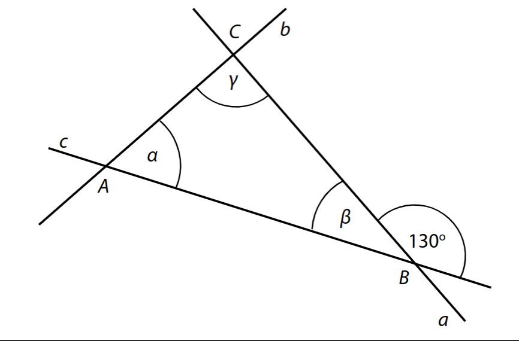
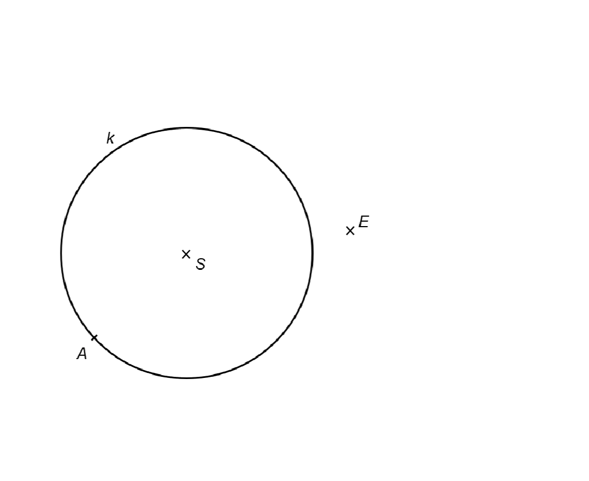
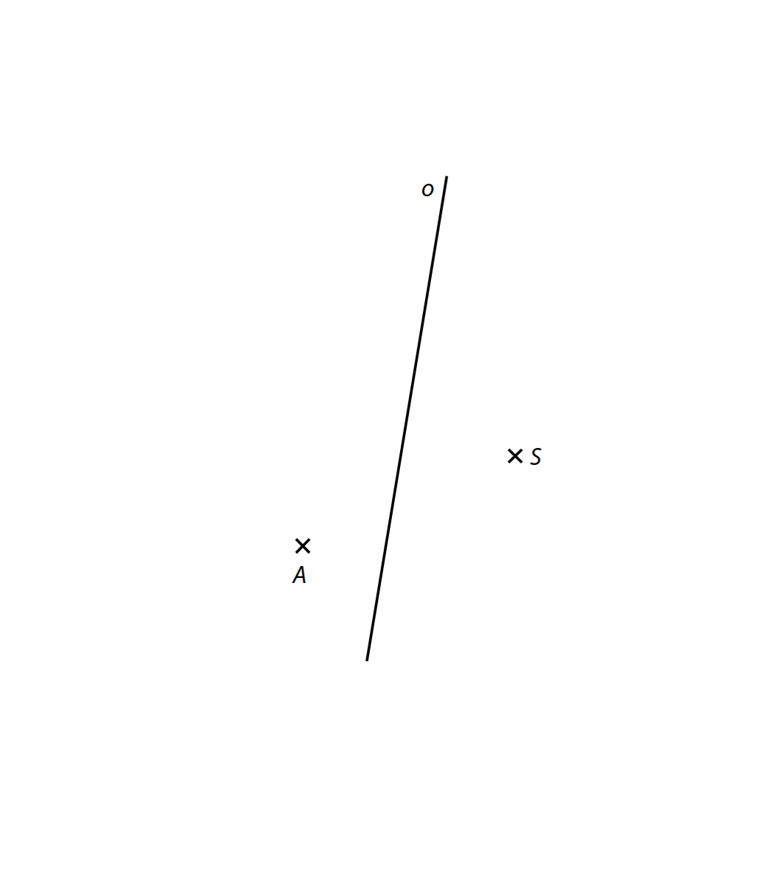
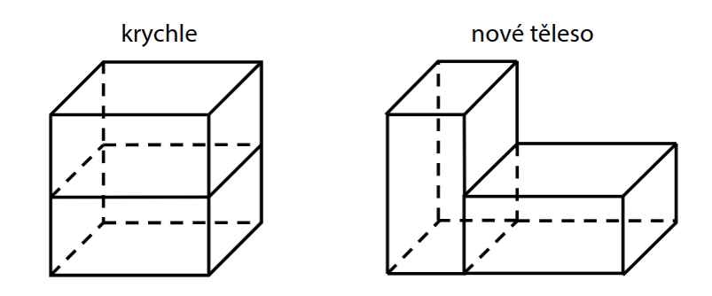
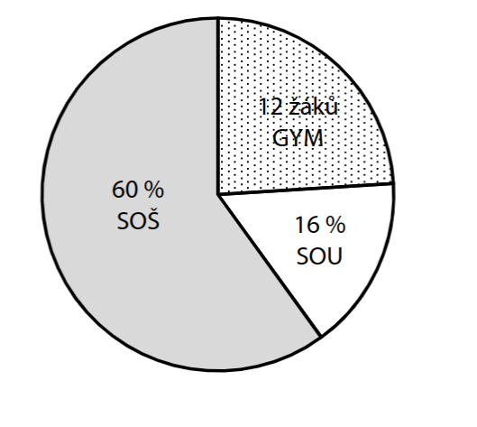

# 1 Města Jihlava a Třebíč mají dohromady 86 200 obyvatel. Jihlava má o 16 000 obyvatel více. 
**Kolik obyvatel má Třebíč?**

VÝCHOZÍ TEXT A OBRÁZEK K ÚLOZE 2 
===

> Dvě válcové nádoby A a B mají stejnou výšku *v* = 20 cm. Nádoba A má průměr podstavy 
> d1 = 10 cm, nádoba B má průměr podstavy d2 = 20 cm. Nádoba A je naplněna až po okraj 
> vodou, nádoba B je prázdná. 
> 
> 

# 2 Do jaké výšky bude sahat voda v nádobě B, pokud všechnu vodu z nádoby A přelijeme do nádoby B? 
 
Pro výpočet použijte zaokrouhlenou hodnotu čísla π z tabulky na začátku testového 
sešitu. 
# 3 Vypočítejte a výsledek zapište zlomkem v základním tvaru. 
**Do záznamového archu** uveďte u obou podúloh **celý postup řešení.** 
## 3.1 

$$
\frac{\frac{7}{5} + 3,3 - \frac{1}{2}}{\frac{1}{15}+\frac{1}{3}}=
$$

## 3.2 
$$
\left(\frac{1}{2}+\frac{1}{3}:\frac{5}{6}\right)-\frac{7}{2}+\frac{3}{5}:\frac{3}{2}-1=
$$

# 4 Proveďte úpravu výrazů. 
## 4.1 Umocněte a zjednodušte. 
Výsledek zapište zlomkem v základním tvaru. 
$$
\left(\frac{b}{3}-3b\right)^2=
$$
## 4.2 Upravte a výsledný výraz rozložte na součin pomocí vzorců: 
$$
5-(1-x^2)-x\cdot2x=
$$
## 4.3 Zjednodušte (výsledný výraz nesmí obsahovat závorky): 
$$
(c-7)\cdot(c-7)-(c-5)\cdot3c+c\cdot(c+c)=
$$
**Do záznamového archu** uveďte u podúlohy 4.3 **celý postup řešení**. 

# 5 Řešte rovnice. 
**Do záznamového archu** uveďte u obou podúloh **celý postup řešení**. 
Zkoušku nezapisujte. 

## 5.1 
$$
\left(x + \frac{1}{2}x)\right)\cdot2 = \left(x + \frac{1}{6}x\right)\cdot2+6
$$

## 5.2  
$$
\frac12\cdot(x+2)-(x-2)^2 = 6-x^2
$$

VÝCHOZÍ TEXT A OBRÁZEK K ÚLOZE 6 
===

> Pravoúhlý lichoběžník *ABCD* se základnami *AB* a *CD* a s pravým úhlem při vrcholu D je úhlopříčkou *AC* rozdělen na dva trojúhelníky *ABC* a *ACD*. 
> 
> Pro délky stran platí: |*AB*| = 16 cm, |*CD*| = 6 cm. Obsah trojúhelníku *ABC* je 64 cm2. 
> 
> 
# 6 
## 6.1 Vypočítejte výšku lichoběžníku *ABCD*.  
 
Výsledek uveďte v cm. 
## 6.2 Vypočítejte obsah lichoběžníku *ABCD*.  
Výsledek uveďte v cm^2^. 

VÝCHOZÍ TEXT A OBRÁZEK K ÚLOZE 7 
===

> V parku jsou 3 okrasné záhony. První a třetí záhon o stejné velikosti mají tvar čtvrtkruhu, 
> druhý záhon má tvar kruhu. Každý ze tří záhonů má obsah 314 dm2. 
> 
> 

# 7 
V podúlohách 7.1 a 7.2 pro výpočet použijte zaokrouhlenou hodnotu čísla π z tabulky na začátku testového sešitu. 
## 7.1 Vypočítejte obvod druhého (kruhového) záhonu. 
Výsledek uveďte v celých metrech. 
## 7.2 Vypočítejte poloměr r jednoho z čtvrtkruhových záhonů. 
Výsledek uveďte v celých metrech. 
 
 
VÝCHOZÍ TEXT A OBRÁZEK K ÚLOZE 8 
===

> Trojúhelník *ABC* je vymezen třemi různoběžkami a, b, c. Přímky a a c svírají úhel 130° a velikosti úhlů α a γ jsou v poměru 2:3. 
> 
> 
# 8 
## 8.1 Vypočítejte velikost vnitřního úhlu γ při vrcholu C. 
## 8.2 Vypočítejte rozdíl *α – β*  vnitřních úhlů *α* a *β*. 
Velikosti úhlů neměřte, ale vypočítejte (obrázek je ilustrační). 
 
 
VÝCHOZÍ TEXT A OBRÁZEK K ÚLOZE 9 
===

> SV rovině leží bod E a kružnice k se středem S, která prochází bodem A. Bod A je vrchol 
> pravoúhlého lichoběžníku *ABCD* se základnami *AB* a *CD* a pravým úhlem při vrcholu A. 
> Vrcholy C a D tohoto lichoběžníku leží na kružnici k, bod E je střed ramene *BC*. 
> 
> 

# 9 Sestrojte zbývající vrcholy B, C a D lichoběžníku *ABCD*, označte je písmeny a lichoběžník narýsujte. 

**V záznamovém archu** obtáhněte celou konstrukci **propisovací tužkou** (všechny 
čáry, kružnice nebo jejich části i písmena).

VÝCHOZÍ TEXT A OBRÁZEK K ÚLOZE 10 
===

> V rovině je dána přímka o a body A a *S,* které neleží na přímce *o*. Bod A je vrchol 
> rovnoramenného lichoběžníku *ABCD*, bod S je střed strany *BC*. Přímka o je osa 
> souměrnosti lichoběžníku. 
>
> 

# 10 Sestrojte lichoběžník *ABCD*. 
**V záznamovém archu** obtáhněte celou konstrukci **propisovací tužkou** (všechny 
čáry, kružnice nebo jejich části i písmena). 
 
 
VÝCHOZÍ TEXT A OBRÁZEK K ÚLOZE 11 
===

> Krychle má délku hrany 3 dm. Krychli rozdělíme vodorovným řezem na dva shodné hranoly a vytvoříme nové těleso. 
> 
> 

# 11 O kolik dm^2^ se zvětší povrch nového tělesa? 
- [A] o 4,5 dm^2^ 
- [B] o 9 dm^2^ 
- [C] o 18 dm^2^ 
- [D] oba povrchy jsou stejné 
- [E] jiný výsledek 

# 12 Dva sourozenci Eva a Michal šetří společně na dárek pro rodiče. Eva našetřila 40 % potřebné částky, Michal o 24 korun více než Eva. Sourozencům zbývá našetřit 72 korun. 

**Kolik korun stojí dárek?**
- [A] 96 Kč 
- [B] 120 Kč 
- [C] 480 Kč 
- [D] 1 920 Kč 
- [E] jiný výsledek 

# 13 V divadle bylo těsně před začátkem představení v sále obsazeno 70 % sedadel. Po začátku představení přišlo se zpožděním ještě 11 lidí a obsazenost sálu se tím zvýšila na 75 %. 
**Jaká je kapacita sálu? **
- [A] méně než 200 
- [B] 200 
- [C] 210 
- [D] 220 
- [E] více než 220 
# 14 Tři kamarádi Petr, Cyril a Honza čtou komiksy. Petr přečetl o 3 komiksy více než Cyril, Honza přečetl o osminu komiksů více než Cyril. Petr a Honza přečetli stejný počet komiksů. 
**Kolik komiksů přečetl Petr?**
- [A] 22 
- [B] 24 
- [C] 25 
- [D] 26 
- [E] 27 
 
 
VÝCHOZÍ TEXT A OBRÁZEK K ÚLOZE 15 
===

> Všichni žáci 9. A a 9. B odpověděli v průzkumu, jakou střední školu chtějí studovat. Žáci chtějí na gymnázia (GYM), střední odborné školy (SOŠ) nebo střední odborná učiliště 
> (SOU). Ti, kteří chtějí na střední odbornou školu, uvedli také obor zaměření – humanitní, technický či umělecký. Výsledky průzkumu jsou zaznamenány v grafech. Na gymnázia chce jít studovat 12 žáků. Nejmenší zájem je o odborná učiliště, kam chce jít 16 % žáků. 
> Největší zájem je o střední odborné školy, na kterých chtějí studovat všichni, kteří 
> nechtějí jít na gymnázia ani na odborná učiliště. Na uměleckou střední školu chtějí 3 žáci, 15 žáků na technicky zaměřenou střední školu, ostatní, kteří chtějí na střední odborné školy, by si vybrali humanitní obor. 
> 
> Zájem o gymnázia, SOŠ a SOU 
>
> 
> 
> SOŠ podle zaměření 
>
> 

# 15 Rozhodněte o každém z následujících tvrzení (15.1–15.3), zda je pravdivé (A), či nikoli (N).  
 

## 15.1 Na uměleckou střední školu chce jít 6 % všech žáků.  
## 15.2 V 9. A a 9. B je celkem více než 50 žáků.  
## 15.3 Na gymnázia a na humanitní střední školy se chce hlásit stejný počet žáků.  

# 16 Deset zedníků dokončí stavbu budovy za 20 dní. Všichni zedníci jsou stejně výkonní a pracují rovnoměrným tempem. 

Přiřaďte ke každé úloze (16.1–16.3) odpovídající výsledek (A–F). 

## 16.1 Za kolik dní dokončí stavbu budovy 4 zedníci?  
## 16.2 Kolik zedníků dokončí stavbu budovy za 5 dní? 
## 16.3 Kolik dní bude trvat dokončení stavby budovy, jestliže na první polovině stavby pracuje 8 zedníků a současně na druhé polovině stavby pracuje 10 zedníků? 

- [A] 10 
- [B] 12,5 
- [C] 22,5 
- [D] 40 
- [E] 50 
- [F] 52,5 