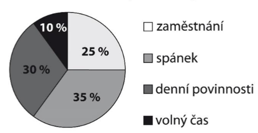
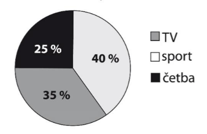
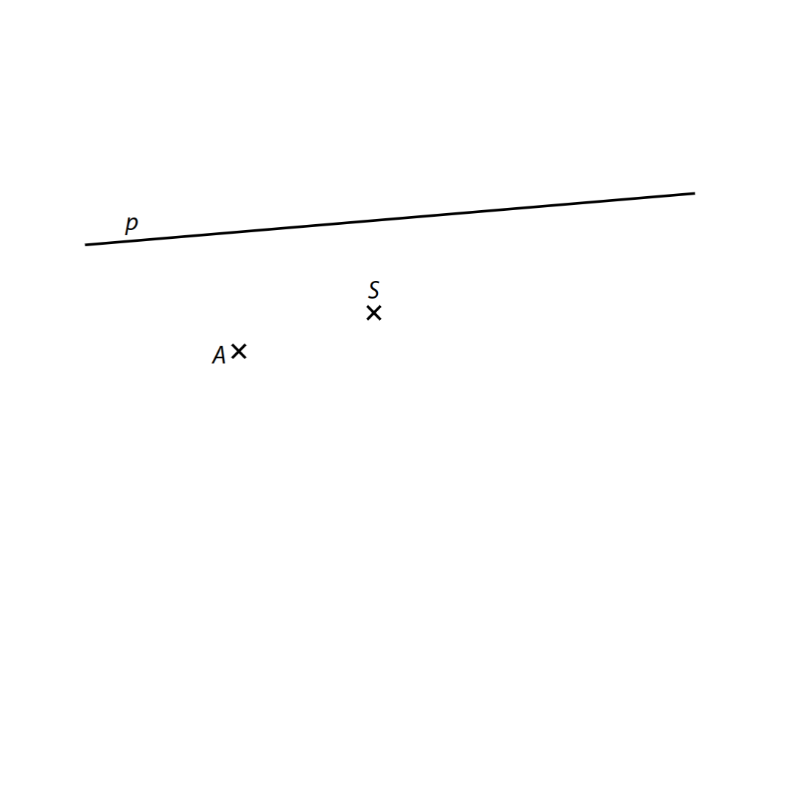
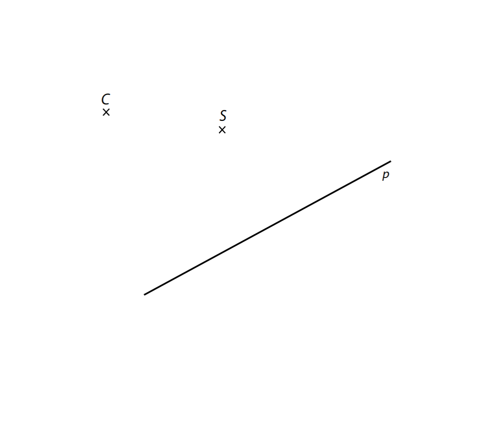
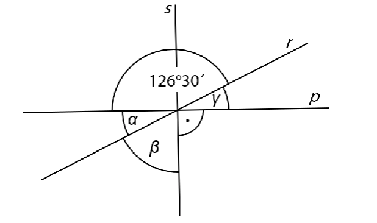

# 1 Adam a Naďa šli spolu z Heraltic do Hvězdoňovic trasou dlouhou 2,7 km. Adam má délku každého kroku 75 cm, Naďa má každý krok dlouhý 60 cm.  
**O kolik kroků udělala Naďa více?**
# 2 Reproduktory byly před Vánocemi zlevněny z původní ceny o 150 korun, což bylo 15 % původní ceny. Po Vánocích je prodejce zlevnil ještě o 200 korun z nové ceny. 

**O kolik procent byla konečná cena nižší než cena původní?**

# 3 Vypočítejte a výsledek zapište zlomkem v základním tvaru. 
**Do záznamového archu** uveďte u obou podúloh **celý postup řešení.** 
## 3.1 
$$
\frac{\left(\frac16-\frac13\right):\left(-\frac53\right)}{0,3}=
$$
## 3.2 
$$
\frac16+\frac13\cdot\left(\frac25-1\right)
$$
# 4 
## 4.1 Upravte a rozložte na součin vytknutím: 
$$
a\cdot(-a)-2^2\cdot3a+6a^2=
$$

## 4.2 Umocněte a zjednodušte: 
$$
\left(\frac13-4b\right)^2=
$$

## 4.3 Upravte výraz tak, aby neobsahoval závorky, a zjednodušte: 
$$
(2x+3)^2-x\cdot6-4\cdot(x-1)^2=
$$

**Do záznamového archu** uveďte u podúlohy 4.3 **celý postup řešení**. 

# 5 Řešte rovnice. 
**Do záznamového archu** uveďte u obou podúloh **celý postup řešení**. 
Zkoušku nezapisujte. 
## 5.1 
$$
x-\frac{x-2}{2}=\frac{2x}{3}-2
$$
## 5.2 
$$
2\cdot(3x-2,5)=-5+3\cdot(3x-2)
$$

# 6 Ve vnitrostátním rychlíku jsou řazeny vagóny 1. a 2. třídy. Vagónů 2. třídy je  dvakrát více než vagónů 1. třídy. V každém vagónu je 10 kupé (oddílů pro cestující).  Ve vagónech 1. třídy je v každém kupé šest míst k sezení, ve vagónech 2. třídy osm míst k sezení. Ve všech kupé rychlíku je dohromady 440 míst k sezení. 
## 6.1 Kolik vagónů 2. třídy je součástí rychlíku? 
## 6.2 Kolik míst k sezení je dohromady ve vagónech 1. třídy? 
 
 
VÝCHOZÍ TEXT A TABULKA K ÚLOZE 7 
===

> V restauraci nabízejí tři různá obědová menu (polévku, hlavní jídlo a nápoj) označená písmeny A, B a C. Do restaurace přijely tři skupiny turistů po dvaceti lidech. V tabulce jsou uvedeny obědy, které si jednotlivé skupiny objednaly, a kolik za ně zaplatily. 
>  
> ||Počet obědů|Počet obědů|Počet obědů|Celková cena za obědy|
> |:---:|:---:|:---:|:---:|:---:|
> ||A|B|C||
> |skupina 1|20|0|0|4 000 Kč|
> |skupina 2|10|10|0|4 800 Kč|
> |skupina 3|5|5|10|5 400 Kč|

# 7 
## 7.1 Jaká byla cena oběda B? 
## 7.2 Jaká byla cena oběda C? 
 
VÝCHOZÍ TEXT A GRAFY K ÚLOZE 8 
===

> V prvním grafu je uvedeno průměrné časové rozložení všech denních činností paní Kratochvílové v pracovní den. Ve druhém grafu je zaznamenáno rozložení jejího volného času v pracovní den.
> 
> **Denní činnosti (24 hodin)**
> 
> 
> 
> **Volný čas**
> 
> 

# 8 Vypočítejte:
## 8.1 Kolik hodin denně paní Kratochvílová tráví v zaměstnání? 
## 8.2 Kolik minut denně paní Kratochvílová sportuje?  
Výsledek zaokrouhlete na celé minuty. 
 
VÝCHOZÍ TEXT A OBRÁZEK K ÚLOZE 9 
===

> V rovině je dána přímka p a body A a S, které neleží na přímce *p*. Bod A je vrchol 
> obdélníku *ABCD*, bod S je střed obdélníku (průsečík úhlopříček). Vrchol D obdélníku leží na přímce p. 
> 
> 

# 9 Sestrojte obdélník *ABCD*.  
Nalezněte všechna řešení. 
 
**V záznamovém archu** obtáhněte celou konstrukci **propisovací tužkou** (všechny 
čáry, kružnice nebo jejich části i písmena). 
 
VÝCHOZÍ TEXT A OBRÁZEK K ÚLOZE 10 
===

> V rovině leží body C, S a přímka p. Bod C je vrchol pravoúhlého trojúhelníku *ABC*.  
> Bod S je střed strany *BC* tohoto trojúhelníku. Strana *AB* tohoto trojúhelníku je 
> rovnoběžná s přímkou p. 
> 
> 

# 10 Sestrojte pravoúhlý trojúhelník *ABC*. 

Najděte všechna řešení. 

**V záznamovém archu** obtáhněte celou konstrukci **propisovací tužkou** (všechny 
čáry, kružnice nebo jejich části i písmena). 
 
# 11 V obchodě prodávají dámská a pánská trička. Ráno před začátkem otevírací doby tvořila dámská trička 60 % z celkového naskladněného množství triček, zbytek byla trička pánská. Přes den se prodalo 45 dámských triček, což je čtvrtina všech dámských triček, která byla v obchodě naskladněna ten den ráno. Pánských triček se ze všech naskladněných pánských triček prodala polovina. 

**Kolik zůstalo na konci dne v obchodě triček (dámských i pánských dohromady)?**
- [A] méně než 200 
- [B] 200 
- [C] 210 
- [D] 220 
- [E] více než 220 
# 12 Petr přečetl již 1 050 stran knižní série, do konce mu zbývá přečíst ještě 450 stran.  
**Kolik procent stran knižní série Petrovi zbývá dočíst?**
- [A] 27 % 
- [B] 30 % 
- [C] 33 % 
- [D] 40 % 
- [E] 43 % 

# 13 Maminka oškrabe 6 kg brambor za 2 hodiny a 24 minut. Babička oškrabe 2 kg brambor za 1 hodinu a 20 minut. Maminka i babička škrabou brambory stálým tempem. 
**Za kolik minut oškrabou maminka a babička 1 kg brambor, pokud škrabou 
obě dohromady?**

- [A] za 64 minut 
- [B] za 32 minut 
- [C] za 15 minut 
- [D] za 12 minut 
- [E] jiný výsledek 
 
VÝCHOZÍ TEXT A OBRÁZEK K ÚLOZE 14 
===

> Přímky p, r a s se protínají v jednom bodě. 
> 
> 

# 14 Jaký je součet úhlů α + β + γ? 
Velikosti úhlů neměřte, ale vypočítejte (obrázek je ilustrační). 
- [A] 126° 30´
- [B] 133° 30´
- [C] 143° 30´
- [D] 180°
- [E] jiný výsledek

# 15 V obchodě mají dva druhy jablek. Kilogram jednoho druhu (dražších) jablek stojí 30 Kč, kilogram druhého druhu (levnějších) jablek stojí 25 Kč. Paní Vitamínová koupila x kilogramů jablek, kde x je celé číslo, a zaplatila 330 Kč. 

**Rozhodněte o každém z následujících tvrzení (15.1–15.3), zda je pravdivé (A), či nikoli (N).**
 

## 15.1 Pokud paní Vitamínová koupila 12 kg jablek, koupila stejná  množství obou druhů jablek.  
## 15.2 Paní Vitamínová mohla koupit jen levnější druh jablek.  
## 15.3 Pokud chce paní Vitamínová koupit co nejvíce kilogramů jablek, musí koupit právě jeden kilogram drahých jablek.  

# 16 Přiřaďte ke každé podúloze (16.1–16.3) odpovídající výsledek (A–F). 

## 16.1 Zvětšíme-li neznámé číslo o 4 %, dostaneme číslo 780. 
Jaké je toto neznámé číslo? 

## 16.2 O kolik procent musíme zvětšit $\frac18$ , abychom dostali $\frac12$? 

## 16.3 Máme dvě čerpadla. Jejich výkony jsou v poměru 3:7. Méně výkonné čerpadlo vyčerpá 150 litrů vody za dvě hodiny. Kolik litrů vody vyčerpá výkonnější čerpadlo za 5 hodin?
- [A] 300
- [B] 400
- [C] 720
- [D] 750
- [E] 875
- [F] jiný výsledek 