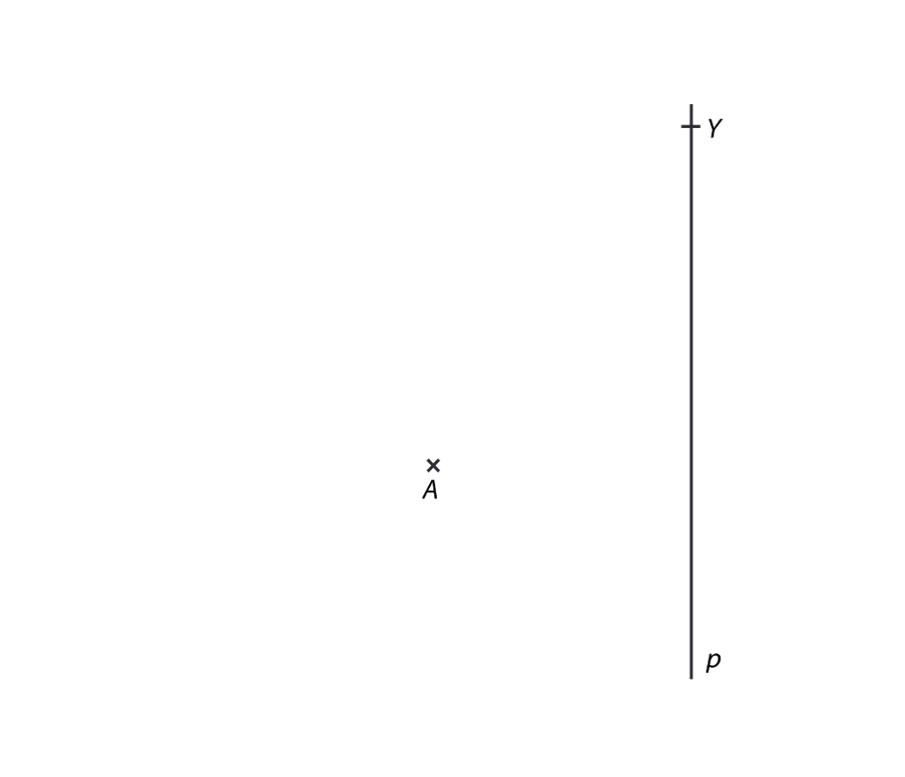
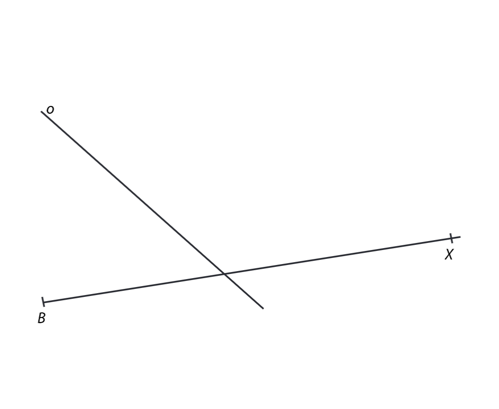

# 1 Vypočítejte.

## 1.1 Máme čísla A a B. A = 1,6, B = -1,2.

**Kolikrát je součet A + B menší než rozdíl A-B?**

## 1.2 Napište desetinné číslo, které je o 0,093 menší než $ \frac{7}{8} $.

# 2 Vypočítejte a výsledek zapište zlomkem v základním tvaru.

**Do záznamového archu** uveďte u obou podúloh **celý postup řešení**.

## 2.1
$$
\frac{\left(\frac58 - \frac16\right):\frac{11}{12}}{4\cdot\frac78}=
$$

## 2.2
$$
2,5-\frac78\cdot\frac45-\frac{27}{18}:\frac{15}{9}=
$$

VÝCHOZÍ TEXT A OBRÁZEK K ÚLOZE 3
===
> Na číselné ose se stejně velkými dílky jsou označeny obrazy čísel 1,4 a 5,6 a obrazy neznámých čísel A,B,C.
>
> 

# 3
## 3.1 Zapište hodnotu čísla C.
## 3.2 Zapište, kolikrát je číslo B větší než číslo 1,4.
## 3.3 Vypočítejte rozdíl A - B.

VÝCHOZÍ TEXT A OBRÁZEK K ÚLOZE 4
===
> Na obrázku je částečně vyplněný tzv. magický čtverec, pro který platí: součet všech tří zlomků je stejný v každém řádku, sloupci a v každé úhlopříčce a rovná se 1.
>
> 

# 4 Jaký zlomek se nachází v šedém poli?

VÝCHOZÍ TEXT A OBRÁZEK K ÚLOZE 5
===
> V kruhovém diagramu je vyznačeno, kolik dětí z jedné základní školy navštěvuje jednotlivé kroužky a kolik dětí této školy nechodí do žádného kroužku. Víme, že na florbal chodí 114 dětí a každé dítě navštěvuje nejvýše jeden kroužek.
>
> 

# 5 
## 5.1 Kolik dětí navštěvuje nějaký kroužek?
## 5.2 Kolik dětí chodí na basketbal?

# 6 Počet sportovců na závodech byl více než 1 a zároveň méně než 90. Pořadatel chtěl sportovce seřadit do slavnostního průvodu, ale ať je rozděloval do dvojic, trojic, čtveřic nebo pětic, vždy mu jeden sprotovec zbyl.

**Kolik sportovců se sešlo na závodech?**

# 7 V útulku mají 5 štěňat. Krmení zvířat probíhá každý den odpoledne. 2. dubna ráno otevřeli 10kg balení granulí pro psy, které těmto pěti štěňatům dohromady vystačí na 16 dní. 8.dubna ráno bylo do útulku přivezeno 1 štěně a 2 dospělí psi. Víme, že každý dospělý pes sní za den dvojnásobek dávky určené pro štěně.

**Kolikátého dubna byli naposledy psi a štěňata krmeni granulemi z tohoto balení?**

VÝCHOZÍ TEXT A OBRÁZEK K ÚLOZE 8
===
> Je dána přímka p a bod A, který neleží na přímce p.
>
> 

# 8 Sestrojte pravoúhlý lichoběžník ABCD, pokud platí:

Rameno kolmé k základně AB leží na přímce p.
Strana AB lichoběžníku ABCD má stejnou délku jako strana AD.
Strana AB je dvakrát delší než strana BC.
Bod C leží na polopřímce BY.

**Najděte všechna řešení.**

**V záznamovém archu** obtáhněte celou konstrukci **propisovací tužkou** (všechny čáry, kružnice nebo jejich části i písmena).

VÝCHOZÍ TEXT A OBRÁZEK K ÚLOZE 9
===
> V rovině leží polopřímka BX a přímka o.
>
> 

# 9 Bod B je vrchol rovnoramenného trojúhelníku ABC. Přímka o je osou strany BC trojúhelníku. Bod A leží na polopřímce BX.

**Sestrojte rovnoramenný trojúhelník ABC se základnou AC.**

**V záznamovém archu** obtáhněte celou konstrukci **propisovací tužkou** (všechny čáry, kružnice nebo jejich části i písmena).

VÝCHOZÍ TEXT K ÚLOZE 10
===
> Na letním táboře jsou kromě dětí také instruktoři, vedoucí, kuchařky a jeden zdravotník. Počet zdravotníků a počet kuchařek je v poměru 1:4, počet kuchařek a vedoucích 1:2, počet vedoucích a instruktorů 1:2 a počet instruktorů a dětí 1:4. Všichni jsou ubytováni ve 47 stanech. Zdravotník je ve stanu sám, ostatní jsou ubytováni po dvou.

# 10 Rozhodněte o každém  následujích tvrzení (8.1-8.3), zda je pravdivé (A), či nikoliv (N).

## 10.1 Na táboře je dohromady 22 vedoucích a instruktorů.
## 10.2 Instruktorů je 4krát více než kuchařek.
## 10.3 Na táboře je celkem 64 dětí.

# 11 V ohradě probíhali králici a slepice. Králíků bylo o 5 méně než slepic. Králíci a slepice měli dohromady 106 nohou a 37 hlav.

**Kolik bylo v ohradě slepic?**
- [A] 16
- [B] 18
- [C] 19
- [D] 20
- [E] 21

# 12 Charitativní závod startoval ve 14:00 (14 hodin). Závodit se mohlo pěšky nebo s využitím libovolného dopravního prostředku. Jana se rozhodla pro chůzi a šla rychlostí 4 kilometry za hodinu, Petra jela na kolečkových bruslích, Roman je na kole a Adam běžel. Roman byl pěkrát rychlejší než Jana a v cíli byl ve 14:30. Adamův běh byl třikrát rychlejší než chůze Jany, ale 40 minut po startu se Adam zranil a zbytek závodu absolvoval chůzí stejnou rychlostí jako Dana. Do cíle přišel 5 minut před Petrou.

**V kolik hodin se dostal do cíle Adam?**
- [A] 14:30
- [B] 14:45
- [C] 15:00
- [D] 15:10
- [E] 15:15

# 13 Kolikrát je obsah obdelníku o straně a = 36 cm a straně b = 12cm větší než obsah čtverce se stranou délky 6 cm?

- [A] 3krát
- [B] 6krát
- [C] 7,5krát
- [D] 12krát
- [E] 12,5krát

VÝCHOZÍ TEXT A OBRÁZEK K ÚLOZE 14
===
> Přímky m,n jsou rovnoběžné.
> 

# 14 Jaká je velikost úhlu $\alpha$?
- [A] $145\degree$
- [B] $110\degree$
- [C] $105\degree$
- [D] $75\degree$
- [E] $35\degree$

# 15 Přiřaďte ke každé úloze (15.1-15.3) odpovídající výsledek (A-F)
## 15.1 Koupaliště během letošního léta navštívilo 680 návštěvníků, což je 80 % všech návštěvníků za celý minulý rok.
**Kolik návštěvníků přišlo na koupaliště v loňském roce?**

## 15.2 S cestovní kanceláří vycestovalo v červnu 330 klientů, což bylo o 40 % méně než v měsíci červenci.
**Kolik klientů vycestovalo s cestovní kanceláří v červenci?**

## 15.3 Na mapě s měřítkem 1:3 000 je vyznačen čtvercový pozemek o straně 15 cm.
**Jaká je skutečná délka strany tohoto pozemku v metrech?**

- [A] 450
- [B] 550
- [C] 650
- [D] 750
- [E] 850
- [F] jiný výsledek

VÝCHOZÍ TEXT A OBRÁZEK K ÚLOZE 16
===
> Hranol o výšce 15 cm se skládá ze dvou shodných kvádrů s obdelníkovou podstavou a jednoho kvádru se čtvercovou podstavou. Podstava hranolu i s rozměry je na obrázku.
> 

# 16
## 16.1 Vypočítejte povrch tělesa.
Výsledek uveďte v cm^2^.

## 16.2 Vypočítejte objem tělesa.
Výsledek uveďte v cm^3^.
