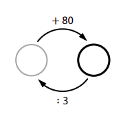
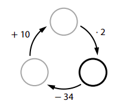
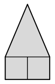
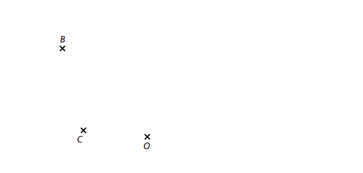
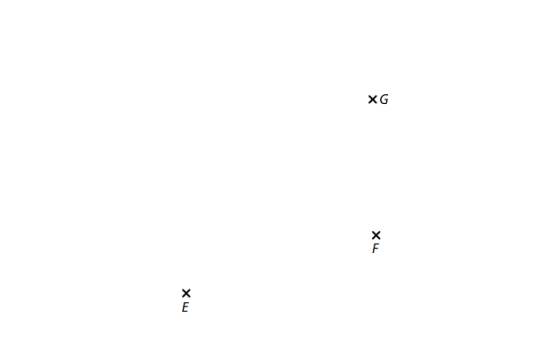
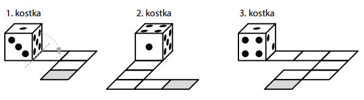
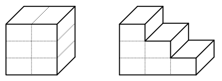
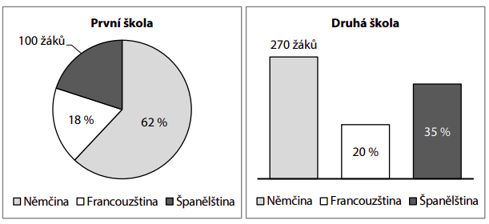
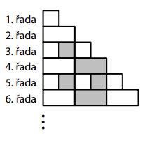

VÝCHOZÍ TEXT K ÚLOZE 1 
===

> Večerní ceremoniál začal ve tři čtvrtě na šest a starosta ho ukončil pět minut po půl osmé. 
> Přesně v polovině ceremoniálu začalo promítání a zabralo pětinu celkové doby ceremoniálu. 
> 
> (*CZVV*) 

# 1 
## 1.1 **Určete** v hodinách a minutách přesný čas začátku promítání. 
## 1.2 **Vypočtěte**, kolik minut uplynulo od konce promítání do ukončení ceremoniálu. 

# 2 Vypočtěte a výsledek zapište zlomkem v základním tvaru. 
[!NOTE]
**V záznamovém archu** uveďte v obou částech úlohy **postup řešení**.

## 2.1 
 
$$
1−1∶\frac35+\frac53∶10=
$$
## 2.2 
 
$$
\frac{5⋅\frac{7}{100}+0,01}{\frac25+\frac{2}{25}}= 
$$

# 3 V každém diagramu se do prázdných kroužků doplní taková čísla, aby byly všechny výpočty provedené ve směru šipek správné. 
**Pro každý diagram určete číslo, které patří do silně ohraničeného kroužku.**
## 3.1

## 3.2 

 
 
[!NOTE]
**V záznamovém archu** uveďte **čísla doplněná do silně ohraničených kroužků**.
 
VÝCHOZÍ TEXT K ÚLOZE 4
===

> Sourozenci Adam, Bára a Cyril přispěli na výcvik asistenčního psa.\
> Adam přispěl částkou o 300 korun vyšší než Bára.\ 
> Přitom třetina Adamova příspěvku je stejná jako polovina Bářina příspěvku a třetina Bářina příspěvku je stejná jako polovina Cyrilova příspěvku. 
> 
> (*CZVV*) 

# 4 **Vypočtěte**, 
## 4.1 kolika korunami přispěla Bára, 
## 4.2 o kolik korun se liší Bářin a Cyrilův příspěvek, 
## 4.3 kolika korunami přispěli všichni tři sourozenci dohromady. 
 
VÝCHOZÍ TEXT K ÚLOZE 5 
===

> V obchodě se za jednotnou cenu prodávají různé figurky.\
> Lída měla přesný obnos na nákup 7 figurek po 39 korunách. Figurky však byly zdraženy.\
> Lída proto koupila jen 6 figurek a zbylo jí přesně tolik korun, kolik jí chybělo na nákup sedmé figurky. 
> 
> (*CZVV*) 
# 5 **Vypočtěte**,
## 5.1 kolik korun zbylo Lídě po nákupu 6 figurek, 
## 5.2 kolik korun stála jedna figurka po zdražení. 
 
VÝCHOZÍ TEXT K ÚLOZE 6 
===

> Petr, Tonda a Jirka přinesli do klubu své sbírky kartiček s fotbalisty a některé kartičky si vyměnili.\
> Tonda vyměnil 4 své kartičky za 6 Petrových a několik dalších svých kartiček za 4 Jirkovy.\
> Petr potom vyměnil 2 své kartičky za 3 Jirkovy.\
> Před odchodem dostal každý z chlapců ještě 4 kartičky od vedoucího klubu.\
> Petr tak rozšířil svou sbírku na 80 kartiček a Jirka měl nakonec o 2 kartičky více než při příchodu do klubu.
> 
> (*CZVV*) 
# 6 **Vypočtěte**, 
## 6.1 kolik kartiček si do klubu přinesl Petr, 
## 6.2 kolik kartiček získal Jirka od Tondy, 
## 6.3 o kolik kartiček rozšířil svou sbírku Tonda. 

VÝCHOZÍ TEXT A OBRÁZEK K ÚLOZE 7 
===

> Osově souměrný pětiúhelník ve tvaru domečku se skládá ze dvou čtverců  
> a rovnoramenného trojúhelníku. 
> 
> Obvod pětiúhelníku je 46 cm. 
> 
> V rovnoramenném trojúhelníku je rameno o 3 cm delší než základna  
> a výška na základnu je o 1 cm kratší než rameno. 
> 
>  
>  
> (*CZVV*)

# 7 **Vypočtěte**
## 7.1 v cm délku strany čtverce, 
## 7.2 v cm^2^ obsah pětiúhelníku. 

[!NOTE]
**V záznamovém archu** uveďte v obou částech úlohy **postup řešení**. 

VÝCHOZÍ TEXT A OBRÁZEK K ÚLOZE 8 
===

> V rovině leží body B, C, O.
> 
> 
>  
> (*CZVV*) 

# 8 
Body B, C jsou vrcholy trojúhelníku *ABC*.\
Polopřímka *BC* tvoří rameno vnitřního úhlu trojúhelníku *ABC* při vrcholu B a přímka *BO* je osa tohoto úhlu.\
Vrcholy A i B mají stejnou vzdálenost od bodu O.
## 8.1 **Sestrojte** obě ramena vnitřního úhlu trojúhelníku *ABC* při vrcholu B. 
## 8.2 
**Sestrojte** vrchol A trojúhelníku *ABC*, **označte** ho písmenem a trojúhelník **narýsujte**. 

[!NOTE]
**V záznamovém archu** obtáhněte vše **propisovací tužkou** (čáry i písmena).

VÝCHOZÍ TEXT A OBRÁZEK K ÚLOZE 9 
===

> V rovině leží body E, F, G. 
> 
> 
> 
> (*CZVV*) 

# 9 
Body E, F, G jsou vrcholy rovnoramenného lichoběžníku *EFGH*.\
**Sestrojte** vrchol H lichoběžníku *EFGH*, **označte** ho písmenem a lichoběžník **narýsujte**.\
Najděte všechna řešení.\

[!NOTE]
**V záznamovém archu** obtáhněte vše **propisovací tužkou** (čáry i písmena).
 
VÝCHOZÍ TEXT A OBRÁZEK K ÚLOZE 10 
===

> Standardní hrací kostka tvaru krychle má na svých stěnách 1 až 6 teček. Součet počtu teček 
> na protějších stěnách kostky je vždy 7.
> 
> Na obrázku jsou tři takové kostky a každá stojí na začátku cesty složené z několika čtvercových 
> polí. Kostka postupně projde všemi poli cesty tak, že se vždy překlopí kolem své spodní hrany 
> na sousední pole, a skončí na šedém poli cesty. 
> 
> 
> 
> (Například první kostka se překlopí celkem čtyřikrát. Po prvním překlopení bude mít na spodní 
> stěně 5 teček.) 
> 
> (*CZVV*) 
# 10 Každá z kostek prošla celou svou cestu a nyní stojí __na šedém poli__.

**Rozhodněte o každém z následujících tvrzení (10.1–10.3), zda je pravdivé (A), či nikoli (N).**
 

## 10.1 První kostka má na spodní stěně 3 tečky. 
## 10.2 Druhá kostka má na spodní stěně nejméně teček ze všech tří kostek. 
## 10.3 Třetí kostka má na spodní stěně o 1 tečku méně než první kostka. 
 
VÝCHOZÍ TEXT K ÚLOZE 11 
===

> Vesnicí se prohnalo tornádo.\
> Po události bylo 40 % všech domů ve vesnici poškozených.\
> Zbylých 270 domů vyvázlo beze škod.\
> Následně bylo 30 % poškozených domů určeno k demolici.
> 
> (*CZVV*) 
# 11 Kolik poškozených domů bylo určeno k demolici? 
- [A] 36 domů 
- [B] 54 domů 
- [C] 60 domů 
- [D] 81 domů 
- [E] jiný počet domů 
 
 
VÝCHOZÍ TEXT K ÚLOHÁM 12–13 
===

> Tibor a Matyáš jsou na táboře v rovinaté oblasti a chystají se vydat podle mapy ke studánce.\
> Tibor má mapu s měřítkem 1∶50 000 a plánovaná trasa má na jeho mapě délku 4,2 cm.\
> Na Matyášově mapě tato trasa měří 28 mm. 
> 
> (*CZVV*) 
# 12 Jaké měřítko má Matyášova mapa? 
- [A] 1∶28 000 
- [B] 1∶56 000 
- [C] 1∶75 000 
- [D] 1∶140 000 
- [E] jiné měřítko 
# 13 Jaká je skutečná délka plánované trasy? 
- [A] 2,1 km 
- [B] 2,8 km 
- [C] 5,6 km 
- [D] 7,5 km 
- [E] jiná délka 

VÝCHOZÍ TEXT A OBRÁZEK K ÚLOZE 14 
===

> Z 12 shodných kvádrů jsou slepena dvě tělesa – krychle s hranou délky 9 cm (obrázek vlevo) 
> a těleso tvaru schodiště (obrázek vpravo). 
> 
>  
> 
> (*CZVV*) 

# 14 O kolik cm^2^ se liší povrch tělesa tvaru schodiště a povrch krychle? 
- [A] neliší se 
- [B] o 27,0 cm^2^ 
- [C] o 40,5 cm^2^ 
- [D] o 81,0 cm^2^ 
- [E] o 108,0 cm^2^ 

VÝCHOZÍ TEXT A GRAFY K ÚLOZE 15 
===

> Na dvou jazykových školách se každý žák učí dva cizí jazyky. K angličtině, která je povinná 
> pro všechny, volí žáci jako druhý cizí jazyk němčinu, francouzštinu, nebo španělštinu.
> 
> Grafy ukazují volbu druhého cizího jazyka na jednotlivých školách. 
> 
> 
>  
> (*CZVV*) 

# 15 Přiřaďte ke každé otázce (15.1–15.3) správnou odpověď (A–F). 
## 15.1 O kolik se liší celkový počet žáků na první a na druhé škole? 
## 15.2 Kolik žáků z obou škol dohromady se učí francouzštinu? 
## 15.3 O kolik žáků více se na první škole učí němčinu než francouzštinu? 
- [A] 100 žáků 
- [B] 120 žáků 
- [C] 150 žáků 
- [D] 180 žáků 
- [E] 210 žáků 
- [F] jiný počet žáků 

VÝCHOZÍ TEXT A OBRÁZEK K ÚLOZE 16 
===

Obrazec na obrázku se postupně vytváří přidáváním dalších řad podle následujících pravidel: 
- Liché řady obsahují pouze čtverce o straně délky 1 cm. 
- Sudé řady obsahují pouze obdélníky s rozměry 1 cm a 2 cm. 
- První řada obsahuje jeden čtverec a každá další řada je vždy o 1 cm delší než předchozí řada. 
- Ve třetí a každé další řadě má každý druhý čtyřúhelník šedou barvu. Všechny ostatní čtyřúhelníky v obrazci jsou bílé. 
 

(*CZVV*) 

# 16 
## 16.1 Určete nejvyšší pořadové číslo řady, která obsahuje právě 9 šedých obdélníků. 
## 16.2 Určete celkový počet bílých čtyřúhelníků (čtverců i obdélníků dohromady) v části obrazce obsahující pouze 29. a 30. řadu. 
## 16.3 Vypočtěte poměr obsahu bílé plochy ku obsahu šedé plochy v části obrazce obsahující pouze 50. a 51. řadu. 