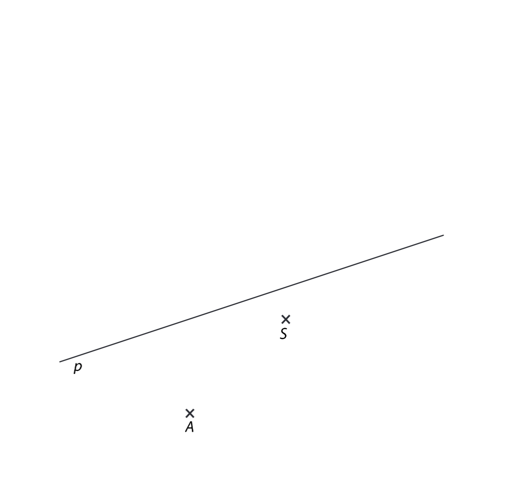

# 1 Vypočtěte:

## 1.1

$$ 
5 \cdot 115 + (232 + 21 \cdot 8) : (5 + 60 : 3) = 
$$

## 1.2

$$
(128 + 16:4 - 32):(30+5 \cdot 13-9\cdot5) - 1 = 
$$

# 2 Najděte a napište jednu číslici, kterou lze nahradit všechny hvězdičky tak, aby byl výpočet správný.

**Do záznamového archu** uveďte pouze **chybějící číslici**.

VÝCHOZÍ TEXT A OBRÁZEK K ÚLOZE 3
===
> V součtovém trojúhelníku platí, že součet dvou čísel, které jsou v řádku vedle sebe, je vždy zapsán o řádek níže do rámečku, který s těmito oběma čísly sousedí.

Například:

Mějme součtový trojúhelník:

# 3 Do obou šedých polí patří stejné číslo.
**Jaké číslo musí být v obou šedých polích?**

**Do záznamového archu** uveďte pouze **chybějící číslo**, které patří do **šedých polí**.

# 4 Řešte slovní úlohy.

## 4.1 Zuzanka koupila dárek a krabičku, do které ho chtěla zabalit. Celková cena za dárek i krabičku byla 84 Kč. Dárek byl o 72 Kč dražší než krabička.

**Kolikrát je dárek dražší než krabička?**

## 4.2 Lukáš má svůj účet, na který mu maminka pravidelně posílá kapesné, on sám si tam ukladá všechny své našetřené peníze. K narozeninám dostal od babičky 500 Kč. Ty použil na koupi knížky, která stála 186 Kč, a zbylé peníze si uložil na účet. Poté mu na účet  maminka poslala kapesné 150 Kč a Lukáš druhý den z účtu vybral 263 Kč na dárek pro tatínka. Na účtu mu pak zbylo 470 Kč.

**Kolik peněz měl Lukáš na účtu před narozeninami, pokud k jiným pohybům na účtu nedošlo?**

## 4.3 U úterý ráno měli v obchodě bednu plnou jablek. Dopoledne z jablek v této bedně prodali jednu pětinu a do konce dne ještě 20 kusů. Poté jim na druhý den v bedně zůstaly dvě pětiny jablek.

**Kolik jablek bylo v úterý ráno v plné bedně?**

# 5 Doplňte do rámečku takové číslo, aby platila rovnost.
## 5.1 1 hodina + 20 minut = |???| sekund
## 5.2 $\frac12$ metru + |???| milimetrů = 1 metr + 26 centimetrů

VÝCHOZÍ TEXT A OBRÁZEK K ÚLOZE 6
===
> Na číselné ose je vyznačeno 12 shodných úseků, čísla 44 a 110 a neznámá čísla X a Y.
> 
> 

# 6 
## 6.1 Určete neznámá čísla X a Y.
## 6.2 Na číselné ose vyznačte nulu.

VÝCHOZÍ TEXT A OBRÁZEK K ÚLOZE 7
===
> V rovině leží přímka p a mimo ni body A a S.
>  

# 7 Bod A je vrcho obdélníku ABCD. Bod S je střed strany AB tohoto obdélníkj. Na přímce p leží bod Q, střed některé ze sousedních stran strany AB tohoto obdélníku.

## 7.1 Sestrojte vrchol B.
## 7.2 Na přímce p najděte a popište střed Q delší strany obdelníku, sestrojte a popište vrcholy C a D a obdélník ABCD narýsujte. Najděte všechna řešení.

**V záznamovém archu** obtáhněte celou konstrukci **propisovací tužkou** (všechny čáry, kružnice nebo jejich části i písmena).

VÝCHOZÍ TEXT A OBRÁZEK K ÚLOZE 8
===
> Ve čtercové síti jsou nakresleny dva obrazce A a B, jejichž vrcholy leží v mřížových bodech. Každý čtvereček čtvercové sítě má stranu délky 1 cm a obsah 1 cm ^2^.
> 

# 8 Rozhodněte o každém  následujích tvrzení (8.1-8.3), zda je pravdivé (A), či nikoliv (N).

## 8.1 Obsahy obou obrazců si jsou rovny.
## 8.2 Obsah obrazce A je 11 cm^2^.
## 8.3 Obvod obrazce B je 16 cm..

# 9 Tereza a její kamarádka Nikola píší novoroční přání. Všechna přání mají stejný text a každá z dívek píše stálou rychlostí. Tereza za každých 5 minut napíše 14 novoročenek, zatímco Nikola 10.

**Za jak dlouho společně napíší 120 novoročních přání?**
- [A] za 24 minut
- [B] za 25 minut
- [C] za 30 minut
- [D] za 32 minut
- [E] za jiný počet minut

VÝCHOZÍ OBRÁZEK K ÚLOZE 10
===

> 

# 10 Který z uvedených obrázků (A-E) logicky nepatří mezi ostatní?

VÝCHOZÍ TEXT A OBRÁZEK K ÚLOZE 11
===
> Máme šestiúhelník ABCDEF, který lze úsečkami AD, BE a CF rozdělit na šest shodných rovnoramenných trojúhelníků. Body A,B,D a E leží ve vrcholech obdélníku. Obsah tmavé části šestiúhelníku je 112 cm^2^.
> 

# 11 V je obsah bílé části šestiúhelníku?
- [A] 28 cm^2^
- [B] 112 cm^2^
- [C] 196 cm^2^
- [D] 224 cm^2^
- [E] jiný obsah

VÝCHOZÍ TEXT A OBRÁZEK K ÚLOZE 12
===
> Graf znározňuje přírůstek a úbytek obyvatel v obcíh Lidov, Dámov a Pánov v letech 2019-2022.
> 

# 12
## 12.1 Jak se změnil počet obyvatel v Pánově během roku 2021?
- [A] Ubylo 5 obyvatel.
- [B] Ubylo 10 obyvatel.
- [C] Počet obyvatel se nezměnil.
- [D] Přibylo 5 obyvatel.
- [E] Přibylo 10 obyvatel.

## 12.2 Jestliže na počátku čtyřletého období 1.ledna 2019 žilo v Lidově 300 obyvatel, kolik obyvatel žilo ve stejné obci po třech letech 31.prosince 2021?
- [A] 290
- [B] 295
- [C] 305
- [D] 310
- [E] 315

## 12.3 Jak se změnil počet obyvatel v Dámově za všechny čtyři roky dohromady?
- [A] Ubylo 5 obyvatel.
- [B] Počet obyvatel se nezměnil.
- [C] Přibylo 5 obyvatel.
- [D] Přibylo 15 obyvatel.
- [E] Jiný výsledek.

VÝCHOZÍ TEXT K ÚLOZE 13
===
> Pan Josef jel autem z Heraltic do Třebíče stálou rychlostí a cesta mu trvala 24 minut. V 7:08 byl v jedné třetině cesty. V polovině cesty projel přes železniční přejezd.

# 13 Ke každé podúloze (13.1-13.3) přiřaďte správný výsledek (A-F)
## 13.1 V kolik hodin pan Josef vyjel?
## 13.2 V kolik hodin přejel pan Josef železniční přejezd?
## 13.3 V kolik hodin by pan Josef přijel, kdyby vyjel o 6 minut později?
- [A] 7:30
- [B] 7:24
- [C] 7:12
- [D] 7:08
- [E] 7:00
- [F] 6:52

VÝCHOZÍ TEXT A OBRÁZEK K ÚLOZE 14
===
> Pyramida postavená z kostek stavebnice může mít libovolný počet pater. Každé patro pyramidy má stejnou výšku. Do prvního, druhého a každého dalšího patra vede vždy stejný počet schodů. Zdola do prvního patra vedou vždy černé schody, do druhého patra bílé schody a takto se rovněž ve vyšších patrech obě tyto barvy schodů pravidelně střídají.
> 
> Např. na obr. 1 má pyramida 6 černých schodů a 4 bílé schody, na obr.2 má pyramida 6 černých schodů a 3 bílé schody. Další pyramidy vytváříme v souladu s výchozím textem.
> 

# 14
## 14.1 Pyramida s 8 patry má celkem 48 černých schodů.
**Kolik schodů vede do prvního patra?**
## 14.2 Pyramida se 7 patry má celkem 84 bílých schodů.
**Jaký je celkový počet schodů v pyramidě?**
## 14.3 V pyramidě s 90 schody má 27.schod stejnou barvu jako 30.schod, ale jinou barvu než 33.schod.
**Jaký je největší možný počet pater v této pyramidě?**
