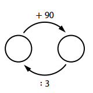
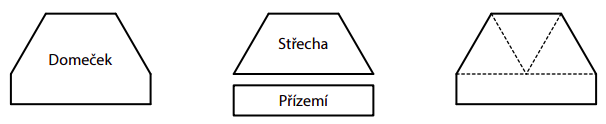
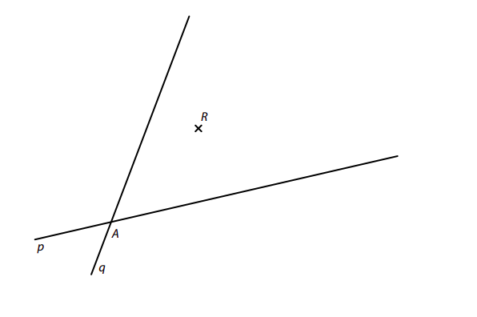
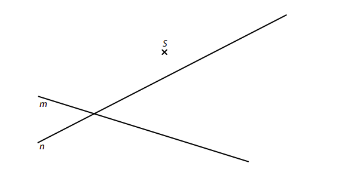
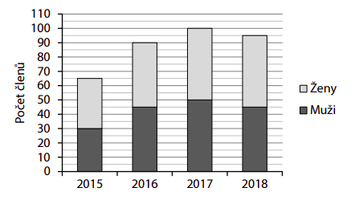
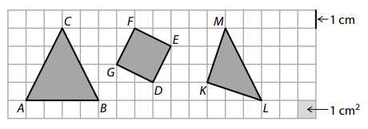
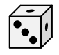
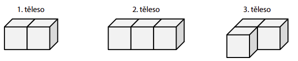

# 1 Doplňte do rámečku takové číslo, aby platila rovnost:
## 1.1
[?]∶11=(5+5⋅20)−101 
## 1.2
(188−152)∶(1+[?])=4+20∶4

# 2
## 2.1 Tabulka má obsahovat všechna celá čísla od 0 do 8. Do prázdných polí tabulky se doplní chybějící čísla tak, aby byl součet v každém sloupci i v každém řádku stejný. 

| | | |
|-|-|-|
|0| | |
| |?|2|
| |1|3|

**Určete číslo, které patří do prostředního pole tabulky.**

## 2.2 V diagramu se do prázdných kroužků doplní taková čísla, aby byly všechny výpočty provedené ve směru šipek správné. 

**Určete obě čísla doplněná do prázdných kroužků.**

VÝCHOZÍ TEXT K ÚLOZE 3 
===

> Mirek má menší jízdní kolo než jeho táta. Mirek na rovné cestě zjišťoval, kolikrát se u obou 
> jízdních kol otočí přední kolo, jestliže obě jízdní kola urazí stejnou vzdálenost.  
> Když se Mirkovo přední kolo otočilo 30krát, tátovo přední kolo se otočilo jen 25krát. 
> 
> (*CZVV*) 

# 3 Mirek a jeho táta urazili na svých jízdních kolech stejnou vzdálenost. 
**Vypočtěte, kolikrát se otočilo Mirkovo přední kolo,**
## 3.1 jestliže se tátovo přední kolo otočilo 30krát, 
## 3.2 jestliže tátovo přední kolo vykonalo o 30 otáček méně než Mirkovo přední kolo.
 
VÝCHOZÍ TEXT K ÚLOZE 4 
===

> Velká kulička váží 30 gramů a malá kulička váží 20 gramů. 
> 
> Anička položila na prázdnou váhu určitý počet velkých kuliček a dvojnásobný počet malých 
> kuliček. Váha ukázala celkovou hmotnost 560 gramů. 
> 
> (*CZVV*) 
# 4 Určete 
## 4.1 počet všech kuliček (malých i velkých dohromady) položených na váze, 
## 4.2 v gramech celkovou hmotnost všech **malých** kuliček položených na váze. 

VÝCHOZÍ TEXT K ÚLOZE 5 
===

> Náš dům má tři patra a bydlí v něm celkem 11 dětí.\
> V prvním a druhém patře bydlí dohromady 8 dětí.\ 
> Ve druhém patře bydlí jen dívky.\
> V prvním a třetím patře bydlí dohromady 5 chlapců a 3 dívky.\
> Ze všech chlapců z našeho domu pouze 3 chlapci nebydlí ve třetím patře. 
> 
> (*CZVV*) 

# 5 Vypočtěte, 
## 5.1 kolik chlapců bydlí ve druhém patře, 
## 5.2 kolik dětí bydlí v prvním patře, 
## 5.3 kolik dívek bydlí v našem domě. 
  
VÝCHOZÍ TEXT A OBRÁZEK K ÚLOZE 6 
===

> Šestiúhelník tvaru domečku má obvod 24 cm.\
> Domeček lze rozdělit na dva čtyřúhelníky – střechu a přízemí.\
> Oba tyto čtyřúhelníky mají stejný obvod.\
> Střecha je složena ze tří rovnostranných trojúhelníků, přízemí má tvar obdélníku.
>  
> (*CZVV*) 

# 6 Vypočtěte v cm 
## 6.1 obvod čtyřúhelníku představujícího střechu, 
## 6.2 délku kratší strany obdélníku představujícího přízemí. 
 

# 7 

VÝCHOZÍ TEXT A OBRÁZEK K ÚLOZE 7

> 
> 
> V rovině leží bod R a přímky p, q, které se protínají v bodě A. 
>  
> (*CZVV*) 

## 7.1 
Bod A je vrchol obdélníku *ABCD*.\
Na jedné z přímek p, q leží vrchol B a na druhé přímce vrchol C tohoto obdélníku.\
Bodem R prochází strana *BC* obdélníku *ABCD*. 

**Sestrojte** vrcholy B, C, D obdélníku *ABCD*, **označte** je písmeny a obdélník **narýsujte**.\
Najděte všechna řešení. 

VÝCHOZÍ TEXT A OBRÁZEK K ÚLOZE 7.2

> V rovině leží bod S a různoběžné přímky m, n. 
> 
> 
> 
> (*CZVV*) 

## 7.2 
Na přímce m leží strana *EF* trojúhelníku *EFG*\
a na přímce n leží strana *EG* tohoto trojúhelníku.\
Bod S má od všech tří vrcholů trojúhelníku *EFG* stejnou vzdálenost.\

**Sestrojte** vrcholy trojúhelníku *EFG*, **označte** je písmeny a trojúhelník **narýsujte**. 

VÝCHOZÍ TEXT A GRAF K ÚLOZE 8 
===

> Graf udává počet všech členů (mužů a žen) turistického oddílu sledovaný v letech 2015–2018.
> 
> 
>  
> (*CZVV*) 

# 8 Rozhodněte o každém z následujících tvrzení (8.1–8.3), zda je pravdivé (A), či nikoli (N). 
 

## 8.1 Počet mužů v turistickém oddílu byl v roce 2015 o jednu třetinu menší než v roce 2016. 
## 8.2 Počet členů turistického oddílu byl v roce 2017 o jednu devítinu větší než v roce 2016. 
## 8.3 Ve sledovaném období se počet žen v turistickém oddílu poprvé snížil oproti předchozímu roku až v roce 2018.
 
 
VÝCHOZÍ TEXT K ÚLOZE 9 
===

> Farmář měl původně 7 krav. Každá z nich nadojila denně 15 litrů mléka.
> 
> Farmář 5 svých krav prodal, ale přikoupil několik dalších krav.\
> Každá z přikoupených krav nadojí denně 20 litrů mléka. 
> 
> Celkové množství mléka, které původních 7 farmářových krav nadojilo za dva dny, všechny nynější farmářovy krávy dohromady nadojí za jeden den. 
> 
> (*CZVV*) 

# 9 Kolik krav farmář přikoupil? 
- [A] 9 krav 
- [B] 10 krav 
- [C] 12 krav 
- [D] 14 krav 
- [E] jiný počet krav 

VÝCHOZÍ TEXT K ÚLOZE 10 
===

> Maminka rozdělila peníze mezi své tři děti. Janě dala pětinu celkové částky,  
> Ivo dostal dvakrát více peněz než Jana a zbylých 240 korun dala maminka Evě. 
> 
> (*CZVV*) 

# 10 Kolik korun celkem rozdělila maminka mezi své tři děti? 
- [A] 480 korun 
- [B] 600 korun 
- [C] 700 korun 
- [D] 720 korun 
- [E] 840 korun

VÝCHOZÍ TEXT A OBRÁZEK K ÚLOHÁM 11-12 
===

> Ve čtvercové síti jsou zakresleny trojúhelníky *ABC*, *KLM* a čtverec *DEFG*.  
> Vrcholy všech těchto obrazců leží v mřížových bodech. 
> 
> 
> 
> Každý čtvereček čtvercové sítě má stranu délky 1 cm a obsah 1 cm^2^.
> 
> (*CZVV*) 

# 11 O kolik cm se liší obvod trojúhelníku *ABC* a obvod čtverce *DEFG*? 
- [A] o méně než 2 cm 
- [B] o 2 cm 
- [C] o 3 cm 
- [D] o 4 cm 
- [E] o jinou délku 

# 12 O kolik cm^2^ se liší obsah trojúhelníku *ABC* a obsah trojúhelníku *KLM*? 
- [A] o 1 cm^2^ 
- [B] o 2 cm^2^ 
- [C] o 3 cm^2^ 
- [D] o 4 cm^2^ 
- [E] o jiný obsah 

VÝCHOZÍ TEXT A OBRÁZKY K ÚLOZE 13 
===

> Kostka tvaru krychle má na třech stěnách po 1 tečce a na zbývajících třech  
> stěnách po 3 tečkách. Součet počtu teček na protějších stěnách je vždy 4.\
> Počet všech teček na povrchu kostky je tedy 12. 
>
> 
> 
> Z takovýchto kostek slepíme tři tělesa.\
> Kostky před slepováním vhodně natočíme, aby byly splněny následující podmínky: 
> **První** těleso má na svém povrchu **co nejvíce** teček a zbývající dvě tělesa co nejméně teček. 
>  
> 
>
> (*CZVV*) 

# 13 Přiřaďte ke každému tělesu (13.1–13.3) počet všech teček na jeho povrchu (A–F). 
## 13.1 První těleso: 
## 13.2 Druhé těleso: 
## 13.3 Třetí těleso: 

- [A] méně než 20 teček 
- [B] 20 teček 
- [C] 22 teček 
- [D] 24 teček 
- [E] 26 teček 
- [F] 28 teček 

VÝCHOZÍ TEXT K ÚLOZE 14 
===

> Poutník měl u sebe 54 dukátů, stejně jako kouzelník.\
> Kouzelník mu prozradil kouzlo:\
> „Když mi dáš právě tolik dukátů, abys měl polovinu toho, co budu mít i s darovanými dukáty já, zbytek tvých dukátů se zdvojnásobí a budeme mít opět stejně. Pokud to však zkusíš, ale nedokážeš, o všechny dukáty přijdeš.“ 
> 
> (*CZVV*) 

# 14 
## 14.1 Poutník dal kouzelníkovi správný počet dukátů a zbytek dukátů se mu zdvojnásobil. 
**Určete, kolik dukátů dal poutník kouzelníkovi.**

## 14.2 Protože kouzlo poprvé fungovalo, poutník jej použil ještě jednou. 
**Vypočtěte, kolik dukátů měl poutník, když se kouzlo vyplnilo podruhé.**

## 14.3 Poutník kouzla několikrát využil. Když si správně spočítal, že už pomocí kouzla nemůže další dukáty získat a že by při dalším pokusu určitě o všechny přišel, dál nepokračoval. Kouzelníkovi poděkoval a rozloučil se s ním. 
**Vypočtěte, kolik dukátů měl poutník, když se s kouzelníkem rozloučil.**