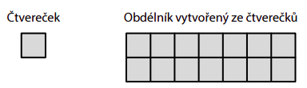
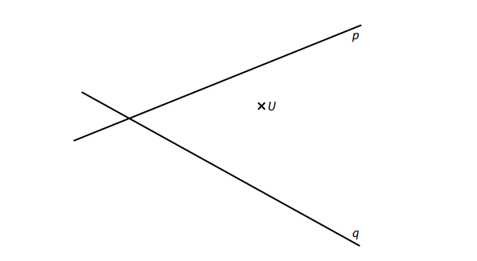
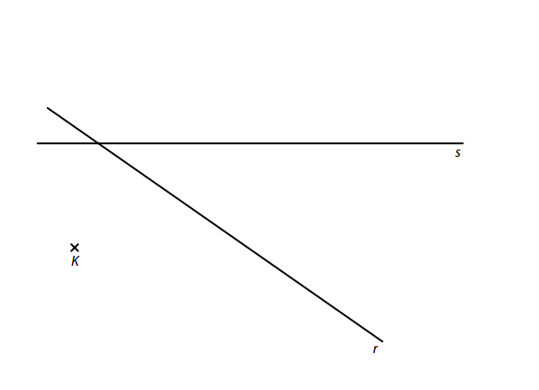
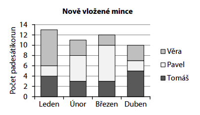
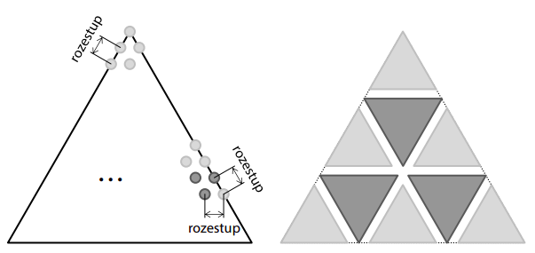
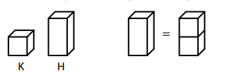
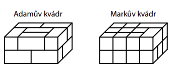
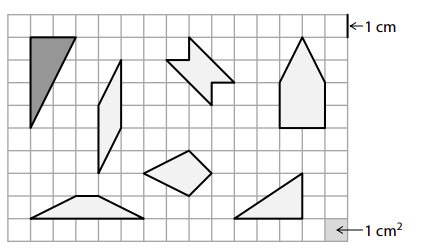
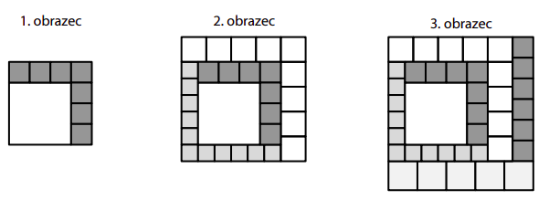

# 1 
## 1.1 Když neznámé číslo vydělím sedmi, pak přičtu číslo 3 a výsledek zdvojnásobím, dostanu číslo 20. 
**Určete neznámé číslo.**
## 1.2 Neznámé číslo zvětšené o jednu jeho polovinu se rovná 198. 
**Určete neznámé číslo.**
## 1.3 Součet dvou neznámých čísel je 109 a jejich rozdíl je 13. 
**Určete obě neznámá čísla.**
# 2 Doplňte do rámečku takové číslo, aby platila rovnost: 
**V záznamovém archu uveďte čísla doplněná do rámečků.**

## 2.1 
$18m − 15dm + [?]cm = 20m$
## 2.2 
$4⋅[?]g−3kg=\frac15kg$
## 2.3 
$\frac14h+[?]s=20min$

VÝCHOZÍ TEXT K ÚLOZE 3 
===

> Na šňůrku jsme navlékali korálky.
> 
> Korálky na šňůrce jsme rozdělili do čtyř skupin. Na počátku šňůrky i za každou skupinou 
> jsme vytvořili uzlík.  
> 
> První skupina má nejmenší počet korálků. Každá další skupina má 4krát více korálků než 
> skupina před ní. Ve třetí skupině je 32 korálků. 
> 
> (*CZVV*) 

# 3 
## 3.1 **Vypočtěte**, kolik korálků je celkem navlečeno na šňůrce. 
## 3.2 **Určete**, kolikrát více korálků má čtvrtá skupina než druhá skupina. 
## 3.3 Na celé šňůrce se od počátku pravidelně střídají 4 černé a 1 bílý korálek. 
**Vypočtěte**, kolik černých korálků je ve čtvrté skupině. 
 
VÝCHOZÍ TEXT K ÚLOZE 4 
===

> V restauraci byla na celý večer zarezervována čtvrtina všech stolů, což byly 4 stoly pro čtyři hosty a 5 stolů pro dva hosty. 
> 
> (*CZVV*) 

# 4 
## 4.1 **Určete** celkový počet stolů v restauraci. 
## 4.2 Ze všech stolů v restauraci je polovina stolů pro dva hosty, třetina stolů je pro tři hosty a ostatní stoly jsou pro čtyři hosty. 
**Vypočtěte**, kolik míst pro hosty je celkem u všech stolů v restauraci. 

VÝCHOZÍ TEXT A OBRÁZEK K ÚLOZE 5 
===

> Na papír lepíme stejné samolepící čtverečky, které mají stranu délky 1 cm a obsah 1 cm2.\
> Vytváříme tak různé obdélníky, z nichž každý má **obvod** 18 cm. Jeden z takových obdélníků je na obrázku. Sousední čtverečky v obdélníku mají vždy jednu stranu společnou. 
>
> 
>
> (*CZVV*) 

# 5 
## 5.1 **Vypočtěte**, kolik cm měří nejdelší možná strana takového obdélníku. 
## 5.2 **Určete**, kolik navzájem různých obsahů mají všechny takové obdélníky. 
## 5.3 **Vypočtěte** v cm^2^, jaký je největší možný obsah takového obdélníku. 
 
VÝCHOZÍ TEXT K ÚLOZE 6 
===

> Karel a Mirka zapsali na tabuli dvě různá dvojciferná čísla.
> 
> Karel ve svém čísle zapsal na místě desítek číslici o 3 větší než Mirka, ale na místě jednotek číslici o 2 menší než Mirka. 
> 
> (*CZVV*) 

# 6 
## 6.1 Vypočtěte, o kolik se liší Karlovo a Mirčino číslo. 
## 6.2 Zapsaná čísla se liší o třetinu Karlova čísla. 
**Určete, jaké číslo zapsala na tabuli Mirka.**
 
 
 

# 7 
VÝCHOZÍ TEXT A OBRÁZEK K ÚLOZE 7.1

> V rovině leží bod U a různoběžné přímky p, q. 
> 
> 
> 
> (*CZVV*) 

## 7.1 
Na přímkách p, q leží dvě strany **pravoúhlého** trojúhelníku *ABC*.\
Třetí strana *BC* tohoto trojúhelníku prochází bodem U. 

**Sestrojte** vrcholy trojúhelníku *ABC*, **označte** je písmeny a trojúhelník **narýsujte**.  
Najděte všechna řešení. 

VÝCHOZÍ TEXT A OBRÁZEK K ÚLOZE 7.2

> V rovině leží bod K a různoběžné přímky r, s. 
> 
>  
> 
> (*CZVV*) 

## 7.2 
Bod K je vrchol obdélníku *KLMN*.\
Strana *KL* tohoto obdélníku je rovnoběžná s přímkou r.\
Na přímce s leží střed S strany *KN* a vrchol M obdélníku *KLMN*. 

**Sestrojte** bod S a vrcholy L, M, N obdélníku *KLMN*, **označte** je písmeny a obdélník **narýsujte**. 

VÝCHOZÍ TEXT A GRAF K ÚLOZE 8 
===

> Věra, Pavel a Tomáš šetřili po dobu čtyř měsíců pouze padesátikorunové mince a všechny našetřené mince vkládali do kasičky. Graf udává počet mincí, které děti vložily do kasičky v jednotlivých měsících. 
> 
> 
>  
> (*CZVV*) 

# 8 Rozhodněte o každém z následujících tvrzení (8.1–8.3), zda je pravdivé (A), či nikoli (N). 
 

## 8.1 Věra vložila do kasičky v lednu tolik korun, kolik našetřila během zbývajících tří měsíců dohromady. 
## 8.2 V únoru vložili do kasičky Pavel s Věrou dohromady třikrát více korun než Tomáš.
## 8.3 Tomáš vložil v dubnu do kasičky více než jednu devítinu všech peněz, které našetřily za uvedené čtyři měsíce všechny tři děti dohromady. 

VÝCHOZÍ TEXT A TABULKA K ÚLOZE 9 
===

Do prázdných bílých polí tabulky patří čísla **27, 50, 62** a ještě jedno neznámé číslo.\
Každé číslo v šedém poli tabulky je součin čísel v příslušném řádku nebo sloupci. 

|||||
|:-:|:-:|:-:|:----:|
|   |29 |   |23 374|
|11 |   |   |14 850|
|682|783|650|      |
(*CZVV*)

# 9 Jaké je neznámé číslo, které patří do tabulky? 
- [A] 13 
- [B] 16 
- [C] 23 
- [D] 26 
- [E] jiné číslo 

VÝCHOZÍ TEXT A OBRÁZEK K ÚLOHÁM 10–11 
===

> Záhon má tvar rovnostranného trojúhelníku. Celý záhon je osázen žlutě a fialově kvetoucími rostlinami, a to ve stejných rozestupech. Po jedné rostlině je i v každém vrcholu trojúhelníku. Ze všech rostlin na záhoně je 39 rostlin rozmístěno po obvodu záhonu. 
>  
> 
> 
> Žlutě kvetoucí rostliny vytvářejí v záhonu 6 stejných žlutých rovnostranných trojúhelníků.Fialově kvetoucí rostliny tvoří 3 fialové rovnostranné trojúhelníky. Každý fialový trojúhelník má o 1 řadu rostlin více než žlutý trojúhelník. Rozmístění trojúhelníků je na obrázku vpravo. 
> 
> (*CZVV*) 

# 10 Kolik žlutě kvetoucích rostlin vytváří jeden žlutý trojúhelník? 
- [A] 6 rostlin 
- [B] 9 rostlin 
- [C] 10 rostlin 
- [D] 12 rostlin 
- [E] 15 rostlin 
# 11 Kolik fialově kvetoucích rostlin je vysazeno na celém záhonu? 
- [A] 36 rostlin 
- [B] 45 rostlin 
- [C] 48 rostlin 
- [D] 51 rostlin 
- [E] více než 51 rostlin 
 
VÝCHOZÍ TEXT A OBRÁZKY K ÚLOZE 12 
===

> Ve stavebnici jsou dva druhy kostek – krychle (K) a hranol (H), který lze složit ze dvou krychlí. 
> 
> 
>  
> Adam a Marek postavili ze stavebnice dva stejně velké kvádry (viz obrázek).  
> Zatímco Adam použil jen hranoly, Markův kvádr obsahuje jak hranoly, tak krychle. 
> 
> 
> 
> (*CZVV*) 

# 12 Jaký je největší možný počet hranolů (H) v kvádru, který postavil Marek? 
- [A] 2 hranoly 
- [B] 6 hranolů 
- [C] 7 hranolů 
- [D] 8 hranolů 
- [E] jiný počet hranolů 

VÝCHOZÍ TEXT A OBRÁZEK K ÚLOZE 13 
===

> Ve čtvercové síti je zakresleno 7 obrazců, které mají vrcholy v mřížových bodech. 
> 
> 
> 
> Každý čtvereček čtvercové sítě má stranu délky 1 cm a obsah 1 cm2. 

(*CZVV*) 

# 13 Přiřaďte ke každé otázce (13.1–13.3) správnou odpověď (A–F). 
## 13.1 Kolik obrazců má obsah 3 cm^2^? 
## 13.2 Kolik obrazců je osově souměrných alespoň podle jedné osy souměrnosti? 
## 13.3 Kolik **světlých** obrazců má stejný obvod jako tmavý trojúhelník? 
- [A] žádný obrazec 
- [B] 1 obrazec 
- [C] 2 obrazce 
- [D] 3 obrazce 
- [E] 4 obrazce 
- [F] 5 obrazců 

VÝCHOZÍ TEXT A OBRÁZEK K ÚLOZE 14 
===

> Připojováním čtverečků k velkému bílému čtverci vytváříme obrazce (viz obrázek).\
> První obrazec má tvar čtverce a vznikl připojením 7 menších tmavých čtverečků.\
> Postupným připojením dalších 20 čtverečků dvou různých velikostí byl z prvního obrazce vytvořen druhý, který má také tvar čtverce.\
> Třetí obrazec vznikl z druhého připojením dalších 11 čtverečků a má tvar obdélníku.\
> **První** obrazec má obvod **80 cm**.
>
> 
>  
> (*CZVV*) 

# 14 
## 14.1 **Vypočtěte** v cm obvod druhého obrazce. 
## 14.2 **Vypočtěte**, o kolik cm se liší délky sousedních stran třetího obrazce. 
## 14.3 Na obrázku vpravo je silně vyznačena uzavřená lomená čára, která kopíruje strany čtverečků ve třetím obrazci. 
**Určete v cm celkovou délku této lomené čáry.**