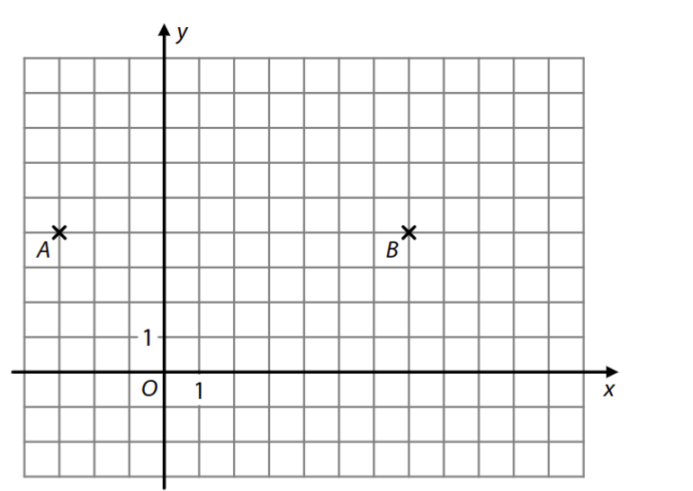
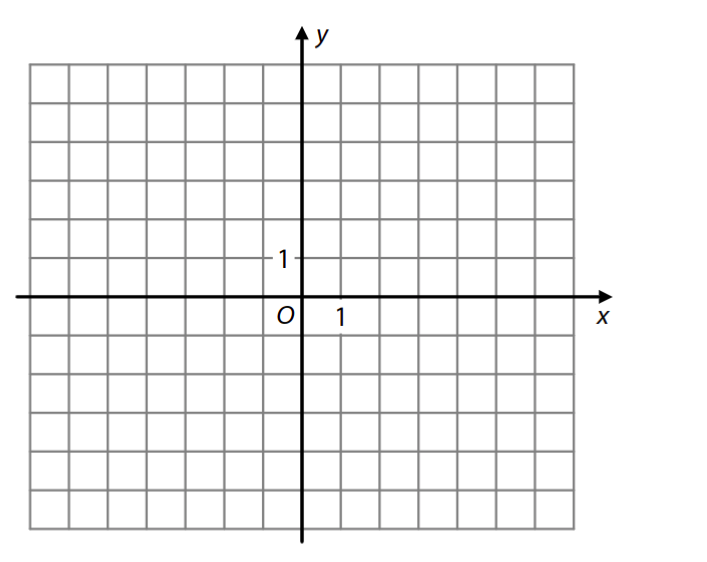
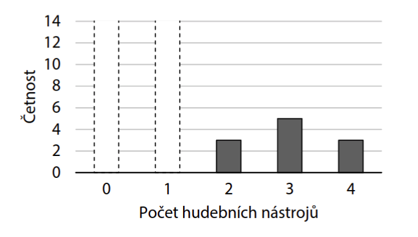
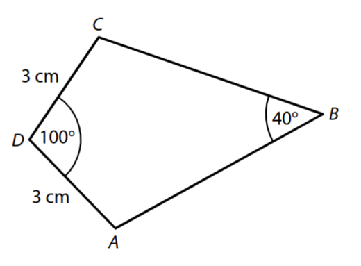
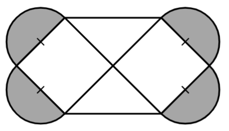
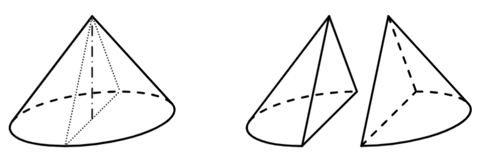
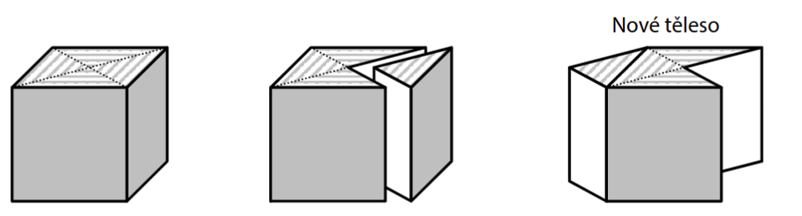
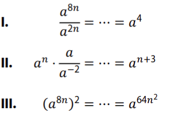
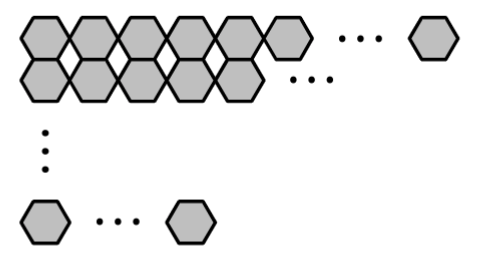

VÝCHOZÍ TEXT K ÚLOZE 1 
===

> Firma utržila v únoru pouze čtyři pětiny toho, co utržila v lednu. 
>
> (*CZVV*) 
# 1 Určete, o kolik procent více utržila firma v lednu než v únoru. 
 
VÝCHOZÍ TEXT K ÚLOZE 2 
===

> Je dán čtverec o straně délky *a*. 
> Obdélník o obsahu 360 cm^2^ má jednu stranu o 8 cm delší než daný čtverec a druhou stranu o 8 cm kratší než daný čtverec. 
>
> (*CZVV*) 

# 2 Vypočtěte v cm^2^ obsah daného čtverce.  
Výsledek ani dílčí výpočty nezaokrouhlujte. 

# 3 Pro $ {x \in R  \{−2;0;2\}} $ zjednodušte: 
$$
\frac{1}{x + 2} - \frac{\frac{x^2}{x^2 - 4}}{\frac{x}{2}} = 
$$

**V záznamovém archu** uveďte celý **postup řešení**.

# 4 V oboru R řešte: 
$$
\frac{x+5}{x+1} + \frac{5x-1}{x^2 - x} = \frac{5}{x}
$$

**V záznamovém archu** uveďte celý **postup řešení**.

# 5 Pro ${x \in R}$, ${y \in R}$ řešte soustavu rovnic: 

$$
\begin{aligned}
x+2y &= 5\\
\frac{x}{2} &= 10 - 4y
\end{aligned}
$$

VÝCHOZÍ TEXT A OBRÁZEK K ÚLOZE 6 
===

> V kartézské soustavě souřadnic *Oxy* jsou vyznačeny dva mřížové body A, B. Jejich vzdálenost je dvojnásobkem vzdálenosti bodu B od bodu K [7;*k*], kde *k*∈R. 
>
>   
> (*CZVV*) 

# 6 Určete souřadnici *k*.  
Uveďte všechna řešení. 
 
# 7 Je dán výraz: 
$$
{ \log_2(8^{-x})}
$$

**Určete všechna $ x \in R $, pro která je hodnota daného výrazu rovna osmi.** 

**V záznamovém archu** uveďte celý **postup řešení**.
 
VÝCHOZÍ TEXT A OBRÁZEK K ÚLOZE 8 
===
> Grafem funkce $ h:y= \frac{3}{x- 2}-4 $ je hyperbola se středem S (bod S je průsečík asymptot).
> Graf lineární funkce *f* prochází bodem R[−5;1] a bodem S. 
> 
> 
>
> (*CZVV*) 

# 8 
## 8.1 Určete obě souřadnice středu S. 
## 8.2 V kartézské soustavě souřadnic *Oxy* sestrojte graf lineární funkce *f*. 
**V záznamovém archu** obtáhněte vše **propisovací tužkou**. 

VÝCHOZÍ TEXT K ÚLOHÁM 9–10 
===
> Pro ${ x \in R}$ je dána funkce: 
> $$
> { g:y = sin (x + \frac{7\pi}{6})}
> $$
> 
> (*CZVV*) 

# 9 Vypočtěte obě souřadnice průsečíku *P* grafu funkce *𝑔* se souřadnicovou osou *y*. 
# 10 Určete __nejmenší kladné__ číslo *x*, pro které platí: 
$$
{ sin(x + \frac{7\pi}{6}) = 1}
$$

VÝCHOZÍ TEXT A GRAF K ÚLOHÁM 11–12 
===

> Do třídy 6. A chodí 25 žáků.  
> Každý z nich uvedl počet hudebních nástrojů, na které hraje.  
> V grafu četností hodnot tohoto znaku právě dvě četnosti chybí (počet žáků, kteří nehrají na žádný hudební nástroj, a počet žáků, kteří hrají pouze na jeden hudební nástroj). 
> Chybějící četnosti se vzájemně liší o 10.  
> Modus počtu hudebních nástrojů je 0. 
>  
> 
> (*CZVV*) 
# 11 Určete medián počtu hudebních nástrojů, na které hraje žák třídy 6. A. 
# 12 Určete aritmetický průměr počtu hudebních nástrojů, na které hraje žák třídy 6. A.
Výsledek nezaokrouhlujte. 

VÝCHOZÍ TEXT A OBRÁZEK K ÚLOZE 13 
===

> Čtyřúhelník *ABCD* se skládá ze dvou shodných trojúhelníků *ABD* a *CBD*. 
> Platí: |*AD*|=|*CD*|=3 cm, |∢*ADC*|=100°, |∢*ABC*|=40°. 
> 
> 
> 
> (*CZVV*) 

# 13 Vypočtěte v cm délku úhlopříčky 
## 13.1 *AC*, 
## 13.2 *BD*. 

Výsledky zaokrouhlete na desetiny cm. 
**V záznamovém archu** uveďte v obou částech úlohy celý **postup řešení.** 
 

VÝCHOZÍ TEXT K ÚLOZE 14 
===

> Pro třídenní propagační akci byly vydány poukazy na jeden volný vstup do aquacentra. 
> První den akce byly využity dvě pětiny všech vydaných poukazů.  
> Každý další den akce bylo využito o 15 poukazů méně než v předchozím dni. 
> Během celé třídenní akce **nebyla** využita pouze jedna dvacetina všech vydaných poukazů. 
> (*CZVV*) 
# 14 Užitím __rovnice nebo soustavy__ rovnic vypočtěte, kolik vydaných poukazů bylo využito druhý den propagační akce. 

**V záznamovém archu** uveďte celý **postup řešení** (popis neznámých, sestavení rovnice, 
resp. soustavy rovnic, řešení a odpověď ). 

VÝCHOZÍ TEXT K ÚLOZE 15 
===

> V kartézské soustavě souřadnic *Oxy* je dána přímka 
> $$
> { p:x=2+2𝑡, y=1−4𝑡, t \in R }
> $$
> (*CZVV*) 

# 15 Rozhodněte o každém z následujících tvrzení (15.1–15.3), zda je pravdivé (A), či nikoli (N). 
 

## 15.1 Přímka *p* prochází bodem M[3;−1]. 
## 15.2 Vektor ${ \vec{u} = (2;1)}$ je směrovým vektorem přímky *p*. 
## 15.3 Přímka *p* je kolmá k přímce ${ q:2𝑥+𝑦=0}$. 
 
VÝCHOZÍ TEXT K ÚLOZE 16 
===

> Rada sportovního klubu má 11 členů, z nichž právě tři obsadí funkce předsedy, místopředsedy a hospodáře. 
> Kandidaturu na funkci předsedy i na funkci místopředsedy přijalo všech 11 členů rady, ale pouze 6 z nich přijalo i kandidaturu na funkci hospodáře.
> 
> (*CZVV*) 

# 16  Kolika způsoby lze všechny tři funkce obsadit? 
- [A] 440 způsoby 
- [B] 540 způsoby 
- [C] 660 způsoby 
- [D] 1 440 způsoby 
- [E] jiným počtem způsobů 

VÝCHOZÍ TEXT A OBRÁZEK K ÚLOZE 17 
===

> Obrazec obsahuje čtyři tmavé půlkruhy a bílý šestiúhelník, který se skládá ze dvou shodných čtverců a dvou shodných rovnoramenných trojúhelníků. 
> Celkový obsah tmavých částí obrazce je 32π cm^2^. 
>  
> (Průměrem každého půlkruhu je strana čtverce.) 
> 
> 
> (*CZVV*) 
# 17  Jaký je obsah bílého šestiúhelníku? 
- [A] 48 cm^2^ 
- [B] 96 cm^2^ 
- [C] 128 cm^2^ 
- [D] 183 cm^2^ 
- [E] 192 cm^2^ 
 
VÝCHOZÍ TEXT K ÚLOZE 18 
===

> Vnitřní prostor konvičky na mléko má tvar rotačního válce s podstavou o průměru 6 cm. 
> Vnitřní prostor kalíšku, který je zcela zaplněn mlékem do kávy, má tvar rotačního válce s podstavou o průměru 2,4 cm a výškou 1,5 cm. 
> Všechno mléko z kalíšku jsme přilili do konvičky s mlékem.  
> 
> (Konvička nebyla nakloněna, mléko nepřeteklo.) 
> 
> (*CZVV*) 
# 18 O kolik stoupla hladina v konvičce po přilití mléka z kalíšku? 
- [A] o méně než 0,24 cm 
- [B] o 0,24 cm 
- [C] o 0,68 cm 
- [D] o 0,72 cm 
- [E] o více než 0,72 cm 

VÝCHOZÍ TEXT A OBRÁZEK K ÚLOZE 19 
===

> Dřevěný rotační kužel s podstavou o poloměru 12 cm a výškou 16 cm jsme osovým řezem rozdělili na dva shodné půlkužele. 
> 
> 
> 
> (*CZVV*) 

# 19 Jaký je povrch jednoho půlkužele?  
Výsledek je zaokrouhlen na celé cm^2^. 
- [A] 603 cm^2^ 
- [B] 720 cm^2^ 
- [C] 795 cm^2^ 
- [D] 1 206 cm^2^ 
- [E] jiný povrch 

VÝCHOZÍ TEXT A OBRÁZEK K ÚLOZE 20 
===

> Z krychle s hranou délky 4 cm byl dvěma úhlopříčnými svislými řezy oddělen trojboký hranol, který tvoří čtvrtinu krychle. Oddělený hranol se přemístil tak, aby jeho čtvercová stěna splynula s protější stěnou krychle. Vzniklo tak nové těleso. 
> 
> 
> 
> (*CZVV*) 

# 20 Jaký je povrch nového tělesa?  
Výsledek je zaokrouhlen na celé cm^2^. 
- [A] 109 cm^2^ 
- [B] 128 cm^2^ 
- [C] 135 cm^2^ 
- [D] 155 cm^2^ 
- [E] jiný povrch 
 
 
 
# 21 Pro kterou z následujících nerovnic je množinou všech řešení v oboru R interval $ (7;+\infty)$ ? 

- [A] $ {7-x > 0} $
- [B] $ {(x-7)^2 > 0} $
- [C] $ { x^2 - 49 > 0} $
- [D] $ {\frac{(x-1)^2}{x -7} > 0} $
- [E] $ {\frac{x-7}{x-1} > 0} $
 
VÝCHOZÍ TEXT K ÚLOZE 22 
===

> Jsou uvedeny úpravy tří výrazů: 
> 
> 
>  
> (*CZVV*) 
# 22 Který výraz byl upraven správně pro každé $ {a \in (0;+\infty)}$ a každé ${ n \in N}$ ? 
- [A] Správně byly upraveny alespoň dva ze tří výrazů. 
- [B] pouze **I.** 
- [C] pouze **II.** 
- [D] pouze **III**. 
- [E] Správně nebyl upraven žádný ze tří výrazů. 
 
VÝCHOZÍ TEXT K ÚLOZE 23 
===

> V osudí je 6 černých míčků a 4 bílé míčky. Náhodně vytáhneme dvojici míčků. 
>
> (*CZVV*) 
# 23 Jaká je pravděpodobnost, že oba dva vytažené míčky budou mít stejnou barvu? 
- [A] $\frac{7}{15}$
- [B] $\frac{1}{5}$
- [C] $\frac{1}{2}$
- [D] $\frac{2}{3}$
- [E] jiná hodnota pravděpodobnosti
 
VÝCHOZÍ TEXT K ÚLOZE 24 
===

> Firma svým britským pracovníkům poskytla příplatek na bydlení 1,2 libry na čtvereční yard. 
> Českým pracovníkům firma poskytla odpovídající příplatek v korunách na čtvereční metr, a to s využitím následujících převodů: 
> 
> 1 £=29,6 Kč 
> 
> 1 yd=91,44 cm 
> 
> (*CZVV*) 
# 24 V jaké výši poskytla firma příplatek na bydlení českým pracovníkům?  
Přesně vypočtená hodnota je zaokrouhlena na desetiny. 
- [A] 29,7 Kč na 1 m^2^ 
- [B] 30,9 Kč na 1 m^2^ 
- [C] 32,4 Kč na 1 m^2^ 
- [D] 38,8 Kč na 1 m^2^ 
- [E] 42,5 Kč na 1 m^2^ 

VÝCHOZÍ TEXT A OBRÁZEK K ÚLOZE 25 
===

> Dvě různé mozaiky jsou sestaveny z několika řad shodných šestiúhelníků. 
>
> 
> 
> 25.1 
> 
> První mozaika obsahuje 10 řad.  
> Nejvíce šestiúhelníků je v horní řadě. V každé další řadě je o polovinu méně 
> šestiúhelníků než v řadě nad ní.  
> Ve třetí řadě zdola je 36 šestiúhelníků. 
> 
> 25.2 
> 
> Druhá mozaika obsahuje lichý počet řad.  
> Nejvíce šestiúhelníků je v horní řadě. V každé další řadě je o 15 šestiúhelníků méně 
> než v řadě nad ní. Nejméně šestiúhelníků je tedy ve spodní řadě.  
> V prostřední řadě je 260 šestiúhelníků a ve spodní řadě 140 šestiúhelníků. 
> 
> (*CZVV*)  

# 25 Ke každé otázce (25.1–25.2) přiřaďte správnou odpověď (A–F). 
## 25.1 Kolik šestiúhelníků je v horní řadě první mozaiky? 
## 25.2 Kolik šestiúhelníků dohromady obsahuje druhá mozaika? 

- [A] méně než 4 000 
- [B] 4 096 
- [C] 4 420 
- [D] 4 608 
- [E] 4 680 
- [F] více než 4 700 