VÝCHOZÍ TEXT K ÚLOZE 1 
===

> Matěj si na začátku srpna připravil částku, ze které po celý srpen platil všechny výdaje. 
> Ve skutečnosti z ní utratil 15 % za jídlo, nájemné ho stálo o 200 % více než jídlo a za dopravu 
> vydal o 60 % méně než za nájemné. Jiné výdaje Matěj v srpnu neměl, a zbytek připravené 
> částky tedy uspořil. 
> 
> (*CZVV*) 

# 1 Vypočtěte, kolik procent částky připravené na srpen Matěj uspořil. 
# 2 Pro $a,b,c \in R$ je dán vztah: 

$$
2a+ab^2+3c=0
$$

**Vyjádřete z tohoto vztahu neznámou $a$.**
# 3 Pro $x \in R | \{0\}$ zjednodušte: 

 $$
\left(\frac{\frac{x^2+10}{x}}{x}-1\right) \div \frac{5}{x}=
 $$

**V záznamovém archu** uveďte celý **postup řešení**.

# 4 V oboru R řešte:
$$
\frac{x-2}{x^2+2x}+\frac{2x}{x+2}=1
$$

**V záznamovém archu** uveďte celý **postup řešení**.
# 5 
## 5.1 Pro $n \in N$ upravte na mocninu o základu 64: 
$$
8 \cdot 64^n=
$$
## 5.2 Pro $n \in N$ vyjádřete výrazem ve tvaru jediné mocniny: 

 20 % z $25^2$

# 6 Předpis funkce $f$ definované pro všechna přípustná $x \in R$ je:
$$
y = log_{10}(8-2x) - log_{10}(2-x)
$$
**Určete všechna $x \in R$, pro která je hodnota funkce $f$ rovna 1.**
**V záznamovém archu** uveďte celý **postup řešení**.
 
VÝCHOZÍ TEXT A OBRÁZEK K ÚLOZE 7 
===

> Funkce $g: y=a^x$ se základem $a \in R^+ | \{1\}$  je definována pro všechna $x \in R$. 
> Její graf prochází bodem A[−2;4]. 
> 
> 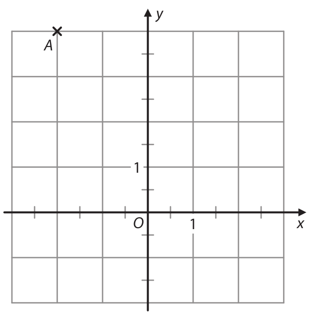
> 
> (*CZVV*) 
# 7 
## 7.1 Zapište souřadnici $b_2$ bodu B[2;$b_2$] grafu funkce $g$. 
## 7.2 V kartézské soustavě souřadnic *Oxy* sestrojte graf funkce $𝑔$. 
**V záznamovém archu** obtáhněte vše **propisovací tužkou.** 

# 8 
Funkce $h:y=-(x+6)^{2}+4$ s definičním oborem R je v jednom ze dvou 
intervalů (−∞;p⟩, ⟨p;+∞) klesající a ve zbývajícím je rostoucí ($p \in R$). 

**Z obou intervalů vyberte ten, v němž je funkce $h$ rostoucí, a zapište jej s konkrétním číslem $p$.**

# 9 V rostoucí aritmetické posloupnosti $(a_n)_{n=1}^\infty$ je pátý člen $a_5=0$. 
**Vypočtěte, kolikrát je dvacátý člen $a_{20}$ větší než desátý $a_{10}$.**

VÝCHOZÍ TEXT K ÚLOZE 10 
===
> Na 100 km jízdy spotřeboval automobil A 7 litrů benzinu a automobil B o $x$ litrů benzinu 
> méně než automobil A. 
> 
> Cena benzinu byla 40 Kč za litr. 
> 
> (*CZVV*) 

# 10 
## 10.1 Vypočtěte v Kč průměrné výdaje za benzin na 1 kilometr jízdy automobilu A.  
Výsledek nezaokrouhlujte. 
## 10.2 V závislosti na $x$ vyjádřete v Kč průměrné výdaje za benzin na 1 kilometr jízdy automobilu B. 

VÝCHOZÍ TEXT A OBRÁZEK K ÚLOHÁM 11–12 
===

> V kartézské soustavě souřadnic *Oxy* jsou umístěny rovnoběžné přímky p, q.  
> Přímka p protíná souřadnicové osy v mřížových bodech A, B.  
> Přímka q prochází bodem Q[−6;4]. 
> 
> 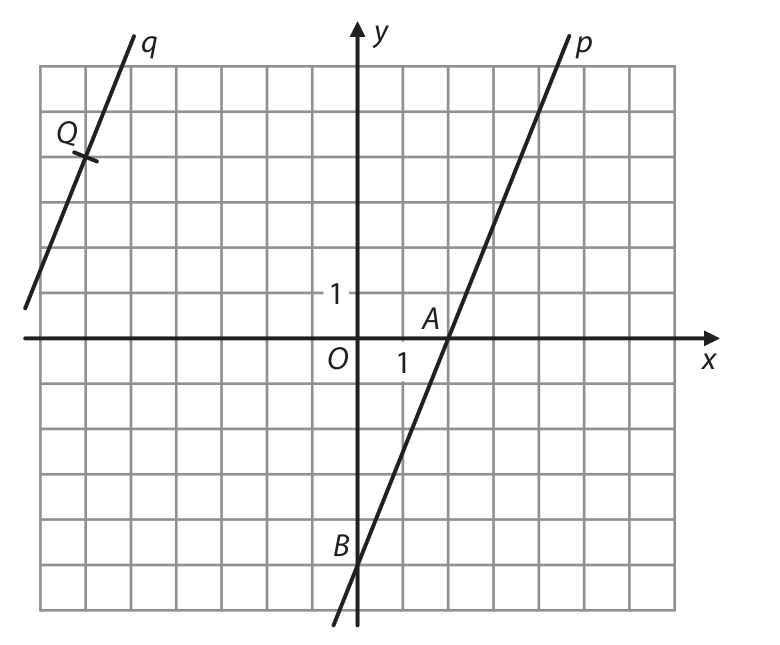
>  
> (*CZVV*) 

# 11 V parametrickém vyjádření přímky p doplňte pravou stranu první rovnice.
$$
\begin{aligned}
p:&x = \qquad\quad,\\
  &y = 0 + 5t, t \in R
\end{aligned}
$$

# 12 Zapište obě souřadnice průsečíku D přímky q se souřadnicovou osou y. 
 
VÝCHOZÍ TEXT A OBRÁZEK K ÚLOZE 13 
===

> Stavba má tvar pětibokého kolmého hranolu **s výškou** 5 metrů. 
> Na obrázku je zakreslena podstava *ABCDE* tohoto hranolu. 
>  
> 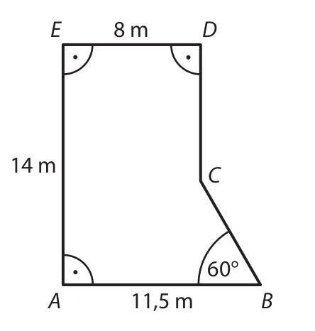
> 
> (*CZVV*) 

# 13 Vypočtěte 
## 13.1 v m^2^ **obsah** boční stěny hranolu, která obsahuje podstavnou hranu *BC*, 
## 13.2 v m^3^ **objem** hranolu.

Výsledky zaokrouhlete na celá čísla, dílčí výpočty nezaokrouhlujte. 
**V záznamovém archu** uveďte v obou částech úlohy celý **postup řešení.** 
 
VÝCHOZÍ TEXT A OBRÁZEK K ÚLOZE 14 
===

Čtvercový pozemek má stejnou výměru (obsah) jako obdélníkový pozemek. 

Obdélníkový pozemek má jednu stranu o 35 % kratší než čtvercový pozemek a druhou 
stranu o 140 metrů delší než čtvercový pozemek. 

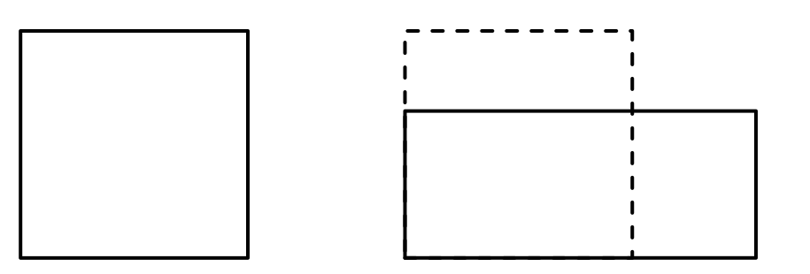

(*CZVV*) 

# 14 Užitím __rovnice nebo soustavy rovnic__ **vypočtěte v metrech obvod čtvercového pozemku.**

**V záznamovém archu** uveďte celý **postup řešení** (popis neznámých, sestavení rovnice, resp. soustavy rovnic, řešení a odpověď ). 

# 15 Rozhodněte o každém z následujících tvrzení (15.1–15.3), zda je pravdivé (A), či nikoli (N). 
 

## 15.1 Nerovnice $(x-3)(3-x)\geq0$ má v oboru **R** více než jedno řešení. 
## 15.2 Řešením nerovnice $(x+4)(x+4)\geq0$ v oboru **R** je každé reálné číslo. 
## 15.3 Množinou všech řešení nerovnice $\frac{x-2}{2-x}>0$ v oboru **R** je prázdná množina. 

# 16 Vektor $\vec{u}=(3;\vec{𝑢}_{2})$ je kolmý k vektoru $\vec{w}=(-3;1)$. 
Jaká je velikost vektoru $\vec{u}$ ? 
- [A] $3\sqrt{10}$
- [B] $\sqrt{10}$
- [C] 10 
- [D] 3 
- [E] jiná velikost 

VÝCHOZÍ TEXT K ÚLOZE 17 
===

> Všechny čtyři vrcholy kosočtverce *ABCD* leží **na souřadnicových osách** kartézské soustavy souřadnic *Oxy*. Pro vrcholy A, B kosočtverce platí, že orientovaná úsečka *AB* je umístěním vektoru $\vec{v}$ =(12;5). 
> 
> (*CZVV*) 

# 17 Jaký je obsah kosočtverce *ABCD*? 
- [A] 52 
- [B] 60 
- [C] 120 
- [D] 169 
- [E] jiný obsah 
 
 
VÝCHOZÍ TEXT A OBRÁZEK K ÚLOZE 18 
===

> Nad pískovištěm je natažena stínicí plachta tvaru čtyřúhelníku,  
> který se skládá ze dvou trojúhelníků – bílého a šedého. 
> Šedý trojúhelník je rovnoramenný a pravoúhlý. 
>  
> 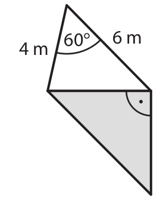
>  
> (*CZVV*) 

# 18 Jaký je obsah šedého trojúhelníku? 
- [A] 10,0 m^2^ 
- [B] 10,4 m^2^ 
- [C] 13,0 m^2^ 
- [D] 13,5 m^2^ 
- [E] 14,0 m^2^ 

VÝCHOZÍ TEXT A OBRÁZEK K ÚLOZE 19 
===

> Papírový klobouk se skládá ze tří částí – střechy, koruny a krempy. 
> 
> Střechu tvoří kruh, který je horní podstavou rotačního válce. 
> 
> Koruna je pláštěm tohoto válce a jejím rozvinutím  
> by vznikl obdélník o rozměrech 60 cm a 30 cm,  
> druhý rozměr je výškou válce. 
> 
> Krempa má tvar mezikruží o šířce 5 cm. 
> 
> Klobouk byl vyroben z papíru, který je  
> z jedné strany modrý a z druhé bílý. 
> 
> Jednotlivé části klobouku k sobě  
> přiléhají svými okraji a jsou sešity nití. 
> 
> 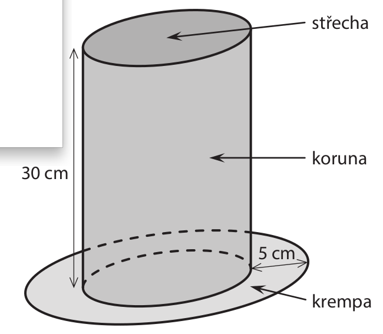
>  
> (*CZVV*) 

# 19 Jaký je obsah všech modrých ploch klobouku?  
Výsledek je zaokrouhlen na celé cm^2^. 
- [A] 2 086 cm^2^
- [B] 2 465 cm^2^
- [C] 4 472 cm^2^
- [D] 4 851 cm^2^
- [E] jiný obsah 

VÝCHOZÍ TEXT K ÚLOZE 20 
===

> Předpis funkce $h$ definované pro všechna $x \in R$ je: 
> 
> $y=2-x$
> 
> (*CZVV*) 
# 20 Který z následujících grafů je pro vhodné kladné číslo 𝑝𝑝 grafem funkce ℎ v kartézské soustavě souřadnic *Oxy*? 
- [A] 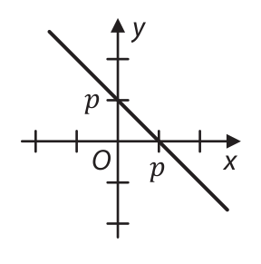
- [B] 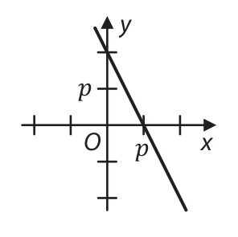
- [C] 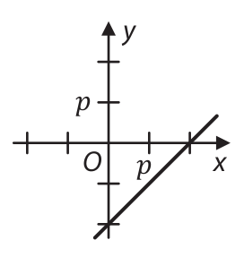
- [D] 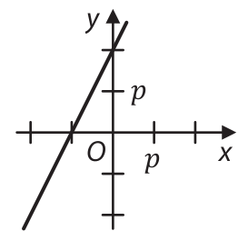
- [E] 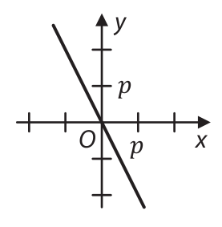
 
VÝCHOZÍ TEXT A OBRÁZEK K ÚLOZE 21 
===

> Mozaika je tvořena řadami stejných ornamentů. 
>
> První řada mozaiky obsahuje 3 ornamenty.  
> Každá další řada obsahuje o 2 ornamenty více než předchozí řada. 
>
> Poslední řada mozaiky obsahuje 99krát více ornamentů než první řada. 
>
> 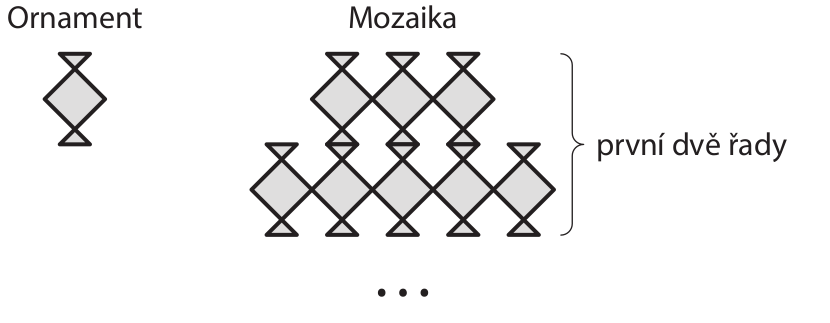
>
> (*CZVV*) 

# 21 Kolik ornamentů obsahuje celá mozaika? 
- [A] 15 000 
- [B] 22 200 
- [C] 29 700 
- [D] 30 000 
- [E] jiný počet 
 
VÝCHOZÍ TEXT K ÚLOZE 22 
===

> První dva členy aritmetické posloupnosti jsou zároveň prvními dvěma členy geometrické posloupnosti. Přitom první člen je o 8 menší než druhý a druhý člen je pětkrát větší než první. 
> 
> (*CZVV*) 

# 22 Kolikátý člen aritmetické posloupnosti je roven třetímu členu geometrické posloupnosti? 
- [A] žádný člen
- [B] pátý člen
- [C] šestý člen
- [D] sedmý člen
- [E] osmý člen
 
 
VÝCHOZÍ TEXT K ÚLOZE 23 
===

> Ve městě se postupně ruší poštovní schránky a nové se nezřizují. 
> 
> Počet poštovních schránek na konci každého kalendářního roku je vždy nižší alespoň o 12 %, 
> ale nejvýše o 14 % počtu poštovních schránek, které byly ve městě na počátku téhož roku. 
> 
> Na konci roku 2021 (tj. na počátku roku 2022) bylo ve městě 38 poštovních schránek. 
> 
> (*CZVV*) 

# 23 Kolik poštovních schránek se ve městě zrušilo během dvouletého období 2021 až 2022? 
- [A] Nelze jednoznačně určit. 
- [B] právě 9 
- [C] právě 10 
- [D] právě 11 
- [E] právě 12 

VÝCHOZÍ TEXT A TABULKA K ÚLOZE 24 
===

> Všech 15 zaměstnanců firmy je rozděleno do tří různě početných skupin.  
> V tabulce jsou uvedeny některé údaje o platech těchto zaměstnanců.
> 
> 
>  
> (*CZVV*) 

# 24 Jaký je průměrný plat zaměstnance skupiny Y? 
- [A] nižší než 27 000 Kč 
- [B] 27 000 Kč 
- [C] 36 000 Kč 
- [D] vyšší než 36 000 Kč 
- [E] Nelze jednoznačně určit. 
 
VÝCHOZÍ TEXT A TABULKA K ÚLOZE 25 
===

> V osudí je deset stejných míčků, každý je označen jedním z písmen A, B, C.  
> Tabulka udává rozdělení četností písmen. 
> 
> |||||
> |--------|-|-|-|
> |Písmeno |A|B|C|
> |Četnost |5|2|3|
> 
> Z osudí postupně po jednom vylosujeme 3 míčky, které do osudí nevracíme.  
> Jejich písmena zapíšeme zleva doprava v pořadí, v jakém byly míčky vylosovány. 
> 
> (*CZVV*) 

# 25 Ke každému jevu (25.1–25.2) přiřaďte pravděpodobnost (A–F), s níž jev nastane. 
## 25.1 Zápis písmen vylosovaných míčků je ABC. 
## 25.2 Zápis písmen vylosovaných míčků je BCC. 
- [A] $\frac{1}{4}$
- [B] $\frac{1}{12}$
- [C] $\frac{1}{20}$
- [D] $\frac{1}{24}$
- [E] $\frac{1}{60}$
- [F] jiná hodnota pravděpodobnosti